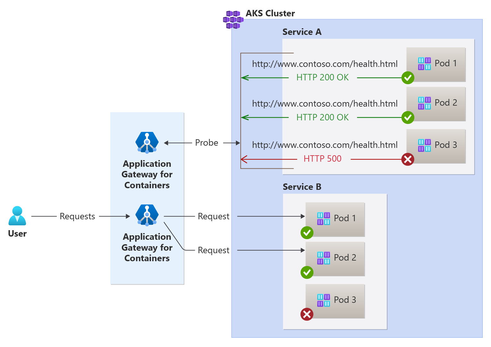

# Custom health probe for Application Gateway for Containers

Application Gateway for Containers monitors the health of all backend targets by default. As backend targets become healthy or unhealthy, Application Gateway for Containers only distributes traffic to healthy endpoints.

In addition to using default health probe monitoring, you can also customize the health probe to suit your application's requirements. This article discusses both default and custom health probes.

The order and logic of health probing is as follows:

1. Use definition of HealthCheckPolicy Custom Resource (CR).
2. If there's no HealthCheckPolicy CR, then use [Readiness probe](https://kubernetes.io/docs/tasks/configure-pod-container/configure-liveness-readiness-startup-probes/#define-readiness-probes)
3. If there's no Readiness probe defined, use the [default health probe](#default-health-probe)

The following properties make up custom health probes:

| Property | Default Value |
| -------- | ------------- |
| interval | How often in seconds health probes should be sent to the backend target.  The minimum interval must be > 0 seconds. |
| timeout | How long in seconds the request should wait until it's marked as a failure  The minimum interval must be > 0 seconds. |
| healthyThreshold | Number of health probes before marking the target endpoint healthy. The minimum interval must be > 0. |
| unhealthyTreshold | Number of health probes to fail before the backend target should be labeled unhealthy. The minimum interval must be > 0. |
| (http) host | The hostname specified in the request to the backend target. |
| (http) path | The specific path of the request. If a single file should be loaded, the path might be /index.html. |
| (http -> match) statusCodes | Contains two properties, `start` and `end`, that define the range of valid HTTP status codes returned from the backend. |

[](./media/custom-health-probe/custom-health-probe.png#lightbox)

## Default health probe

Application Gateway for Containers automatically configures a default health probe when you don't define a custom probe configuration or configure a readiness probe. The monitoring behavior works by making an HTTP GET request to the IP addresses of configured backend targets. For default probes, if the backend target is configured for HTTPS, the probe uses HTTPS to test health of the backend targets.

For more implementation details, see [HealthCheckPolicyConfig](api-specification-kubernetes.md#alb.networking.azure.io/v1.HealthCheckPolicyConfig) in the API specification.

When the default health probe is used, the following values for each health probe property are used:

| Property | Default Value |
| -------- | ------------- |
| interval | 5 seconds |
| timeout | 30 seconds |
| healthyTrehshold | 1 probe |
| unhealthyTreshold | 3 probes |
| port | The port number used is defined by the backend port number in the Ingress resource or HttpRoute backend port in the HttpRoute resource. |
| protocol | HTTP for HTTP and HTTPS when TLS is specified |
| (http) host | localhost |
| (http) path | / |

>[!Note]
>Health probes are initiated with the `User-Agent` value of `Microsoft-Azure-Application-LB/AGC`.

## Custom health probe

In both Gateway API and Ingress API, a custom health probe can be defined by defining a [_HealthCheckPolicyPolicy_ resource](api-specification-kubernetes.md#alb.networking.azure.io/v1.HealthCheckPolicy) and referencing a service the health probes should check against.  As the service is referenced by an HTTPRoute or Ingress resource with a class reference to Application Gateway for Containers, the custom health probe is used for each reference.

In this example, the health probe emitted by Application Gateway for Containers sends the hostname contoso.com to the pods that make up _test-service_.  The request path is `/`, a probe is emitted every 5 seconds and wait 3 seconds before determining the connection has timed out. If a response is received, an HTTP response code between 200 and 299 (inclusive of 200 and 299) is considered healthy, all other responses are considered unhealthy.

```bash
kubectl apply -f - <<EOF
apiVersion: alb.networking.azure.io/v1
kind: HealthCheckPolicy
metadata:
  name: gateway-health-check-policy
  namespace: test-infra
spec:
  targetRef:
    group: ""
    kind: Service
    name: test-service
    namespace: test-infra
  default:
    interval: 5s
    timeout: 3s
    healthyThreshold: 1
    unhealthyThreshold: 1
    protocol: HTTP
    http:
      host: contoso.com
      path: /
      match:
        statusCodes: 
        - start: 200
          end: 299
EOF
```
