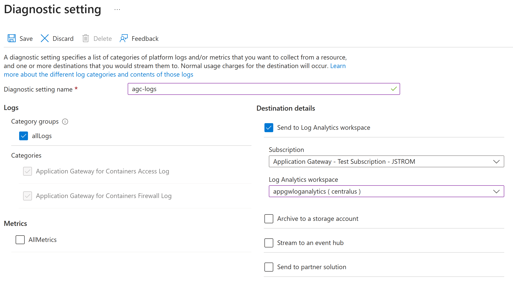

# Diagnostic logs for Application Gateway for Containers (preview)

Learn how to troubleshoot common problems in Application Gateway for Containers.

You can monitor Azure Application Gateway for Containers resources in the following ways:

* Logs: Logs allow for performance, access, and other data to be saved or consumed from a resource for monitoring purposes.

* Metrics: Application Gateway for Containers has several metrics that help you verify your system is performing as expected.

## Diagnostic logs

You can use different types of logs in Azure to manage and troubleshoot Application Gateway for Containers. You can access some of these logs through the portal. All logs can be extracted from Azure Blob storage and viewed in different tools, such as [Azure Monitor logs](../../azure-monitor/logs/data-platform-logs.md), Excel, and Power BI. You can learn more about the different types of logs from the following list:

* **Activity log**: You can use [Azure activity logs](../../azure-monitor/essentials/activity-log.md) (formerly known as operational logs and audit logs) to view all operations that are submitted to your Azure subscription, and their status. Activity log entries are collected by default, and you can view them in the Azure portal.
* **Access log**: You can use this log to view Application Gateway for Containers access patterns and analyze important information. This includes the caller's IP, requested URL, response latency, return code, and bytes in and out. An access log is collected every 60 seconds. The data may be stored in a storage account that is specified at time of enable logging.

### Configure access log

Activity logging is automatically enabled for every Resource Manager resource. You must enable access logging to start collecting the data available through those logs. To enable logging, you may configure diagnostic settings in Azure Monitor.

  # [Azure portal](#tab/configure-log-portal)

  Use the following steps to enable all logging to a storage account for Application Gateway for Containers using the Azure portal. You must have an available storage account in the same region as your Application Gateway for Containers.

  1. Sign in to the [Azure portal](https://portal.azure.com) with your Azure account.
  2. In **Search resources, service, and docs**, type **Application Gateways for Containers** and select your Application Gateway for Containers name.
  3. Under **Monitoring**, select **Diagnostic settings**.
  4. Select **Add diagnostic setting**.
  5. Enter a **Diagnostic setting name** (ex: agfc-logs), choose the logs and metrics to save and choose a destination, such as **Archive to a storage account**. To save all logs, select **allLogs** and **AllMetrics**. 
  6. Select **Save** to save your settings. See the following example:

      

  # [PowerShell](#tab/configure-log-powershell)

  The following PowerShell sample enables all logging to a storage account for Application Gateway for Containers. Replace the resource group name, storage account name, and subscription ID with your own values. The storage account and resource group must be in the same region as your Application Gateway for Containers.

  ```PowerShell
 # Retrieve the Azure Storage Account information
$storageAccount = Get-AzStorageAccount -ResourceGroupName acctest5097 -Name centraluseuaptclogs

# Initialize arrays to store metric and log settings
$metric = @()
$log = @()

# Configure metric settings
$metric += New-AzDiagnosticSettingMetricSettingsObject -Enabled $true -Category AllMetrics -RetentionPolicyDay 30 -RetentionPolicyEnabled $true

# Configure log settings
$log += New-AzDiagnosticSettingLogSettingsObject -Enabled $true -CategoryGroup allLogs -RetentionPolicyDay 30 -RetentionPolicyEnabled $true

# Create a new diagnostic setting for the specified resource
New-AzDiagnosticSetting -Name 'AppGWForContainersLogs' -ResourceId "/subscriptions/XXXXXXXX-XXXX-XXXX-XXXX-XXXXXXXXXXXX/resourceGroups/acctest5097/providers/Microsoft.ServiceNetworking/trafficControllers/myagfc" -StorageAccountId $storageAccount.Id -Log $log -Metric $metric
  ```

---

> [!Note]
> After initially enabling diagnostic logs, it may take up to one hour before logs are available at your selected destination.

For more information and Azure Monitor deployment tutorials, see [Diagnostic settings in Azure Monitor](../../azure-monitor/essentials/diagnostic-settings.md).

### Access log format

Each access log entry in Application Gateway for Containers contains the following information.

| Value | Description |
| ----- | ----------- |
| backendHost | Address of backend target with appended port.  For example \<ip\>:\<port\> |
| backendIp | IP address of backend target Application Gateway for Containers proxies the request to. |
| backendPort | Port number of the backend target. |
| backendResponseLatency | Time in milliseconds to receive first byte from Application Gateway for Containers to the backend target. |
| backendTimeTaken | Time in milliseconds for the response to be transmitted from the backend target to Application Gateway for Containers. |
| clientIp | IP address of the client initiating the request to the frontend of Application Gateway for Containers |
| frontendName | Name of the Application Gateway for Containers frontend that received the request from the client |
| frontendPort | Port number the request was listened on by Application Gateway for Containers |
| hostName | Host header value received from the client by Application Gateway for Containers |
| httpMethod | HTTP Method of the request received from the client by Application Gateway for Containers as per [RFC 7231](https://datatracker.ietf.org/doc/html/rfc7231#section-4.3). |
| httpStatusCode | HTTP Status code returned from Application Gateway for Containers to the client |
| httpVersion | HTTP version of the request received from the client by Application Gateway for Containers  |
| referrer | Referrer header of the request received from the client by Application Gateway for Containers  |
| requestBodyBytes | Size in bytes of the body payload of the request received from the client by Application Gateway for Containers  |
| requestHeaderBytes | Size in bytes of the headers of the request received from the client by Application Gateway for Containers  |
| requestUri | URI of the request received from the client by Application Gateway for Containers (everything after \<protocol\>://\<host\> of the URL)  |
| responseBodyBytes | Size in bytes of the body payload of the response returned to the client by Application Gateway for Containers |
| responseHeaderBytes | Size in bytes of the headers of the response returned to the client by Application Gateway for Containers |
| timeTaken | Time in milliseconds of the client request received by Application Gateway for Containers and the last byte returned to the client from Application Gateway for Containers |
| tlsCipher | TLS cipher suite negotiated between the client and Application Gateway for Containers frontend |
| tlsProtocol | TLS version negotiated between the client and Application Gateway for Containers frontend |
| trackingId | Generated guid by Application Gateway for Containers to help with tracking and debugging.  This value correlates to the x-request-id header returned to the client from Application Gateway for Containers. |
| userAgent | User-Agent header of the request received from the client by Application Gateway for Containers |

Here an example of the access log emitted in JSON format to a storage account.
```JSON
{
    "category": "TrafficControllerAccessLog",
    "operationName": "ReqRespLogs",
    "properties": {
        "backendHost": "10.1.0.15:80",
        "backendIp": "10.1.0.15",
        "backendPort": "80",
        "backendResponseLatency": "2",
        "backendTimeTaken": "-",
        "clientIp": "xxx.xxx.xxx.xxx:52526",
        "frontendName": "frontend-primary",
        "frontendPort": "80",
        "hostName": "xxxxxxxxxxxxxxxxxxxxxxxxxxxxxxxx.fzXX.alb.azure.com",
        "httpMethod": "GET",
        "httpStatusCode": "200",
        "httpVersion": "HTTP\/1.1",
        "referer": "-",
        "requestBodyBytes": "0",
        "requestHeaderBytes": "223",
        "requestUri": "\/index.php",
        "responseBodyBytes": "91",
        "responseHeaderBytes": "190",
        "timeTaken": "2",
        "tlsCipher": "-",
        "tlsProtocol": "-",
        "trackingId": "0ef125db-7fb7-48a0-b3fe-03fe0ffed873",
        "userAgent": "curl\/7.81.0"
    },
    "resourceId": "/SUBSCRIPTIONS/XXXXXXXX-XXXX-XXXX-XXXX-XXXXXXXXXXXX/RESOURCEGROUPS/YYYYYY/PROVIDERS/MICROSOFT.SERVICENETWORKING/TRAFFICCONTROLLERS/ZZZZZZZ",
    "time": "2023-07-22T06:26:58.895Z",
    "location": "northcentralus"
}
```

### Limitations
- Although it's possible to configure logging to log analytics, logs are currently not emitted to a log analytics workspace or event hub. Log analytics and event hub streaming will be supported in a future update.
