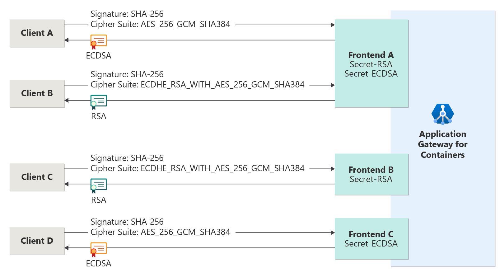

# ECDSA and RSA certificates for Application Gateway for Containers

Cryptography is vital in ensuring privacy, integrity, and security of data as it is transmitted between a client and server on a network. Two widely adopted cryptographic algorithms for asymmetric encryption are Rivest-Shamir-Adleman (RSA) and Elliptic Curve Digital Signature Algorithm (ECDSA).

- RSA asymmetric encryption was introduced in the 1970s and has wide device adoption today. RSA implements a simple mathematical approach to cryptography, which aids in adoption. 
- ECDSA is an asymmetric encryption algorithm and successor to the Digital Signature Algorithm (DSA). ECDSA implements shorter key lengths than RSA, enabling excellent performance and scalability, while still retaining strong security. ECDSA was introduced in the 1990s, so some legacy devices might not be able to negotiate the algorithm.

## Implementation in Application Gateway for Containers

To provide flexibility, Application Gateway for Containers supports both ECDSA and RSA certificates. A listener can reference either ECDSA or RSA forcing a preferred encryption algorithm, or both can be supported in parallel. Running both algorithms in parallel enables both legacy and modern clients to negotiate a secure connection via RSA, while clients that support ECDSA can take advantage of the enhanced performance and security.

Configuration of the certificates used with Application Gateway for Containers is defined within the Gateway or Ingress resources within Kubernetes. The public and private key is defined as a Kubernetes secret and referenced by name from the Gateway or Ingress resources. No designation is required within the secret resource to specify if the certificate is RSA or ECDSA. Application Gateway for Containers is programmed based on the certificate details provided.

Application Gateway for Containers provides three variations for use of RSA and ECDSA secrets:

- Two secrets: one secret containing an RSA certificate, the other containing an ECDSA certificate
- One secret containing an RSA certificate
- One secret containing an ECDSA certificate

[](./media/ecdsa-rsa-certificates/ecdsa-rsa-certificates.png#lightbox)

## Configure both ECDSA and RSA certificates on the same listener

1. Configure Kubernetes secrets

Two secret resources are created, each with its own certificate. One certificate is generated ECDSA and the other RSA.

```yaml
apiVersion: v1
kind: Secret
metadata:
  name: rsa-tls-secret
  namespace: test-infra
data:
  tls.crt: <base64encodedpublickey>
  tls.key: <base64encodedprivatekey>
type: kubernetes.io/tls
---
apiVersion: v1
kind: Secret
metadata:
  name: ecdsa-tls-secret
  namespace: test-infra
data:
  tls.crt: <base64encodedpublickey>
  tls.key: <base64encodedprivatekey>
type: kubernetes.io/tls
```

2. Reference the secrets via a listener

# [Gateway API](#tab/tls-policy-gateway-api)

Both ECDSA and RSA certificates on the same listener in Gateway API is supported by having two certificate references. A maximum of two certificates is supported: one ECDSA and one RSA.

```yaml
apiVersion: gateway.networking.k8s.io/v1
kind: Gateway
metadata:
  annotations:
    alb.networking.azure.io/alb-name: alb-test
    alb.networking.azure.io/alb-namespace: alb-test-infra
  name: gateway-01
  namespace: test-infra
spec:
  gatewayClassName: azure-alb-external
  listeners:
  - allowedRoutes:
      namespaces:
        from: All
    name: http-listener
    port: 80
    protocol: HTTP
  - allowedRoutes:
      namespaces:
        from: All
    name: https-listener
    port: 443
    protocol: HTTPS
    tls:
      mode: Terminate
      certificateRefs:
      - kind : Secret
        group: ""
        name: ecdsa-tls-secret
        namespace: test-infra
      - kind : Secret
        group: ""
        name: rsa-tls-secret
        namespace: test-infra
```

# [Ingress API](#tab/tls-policy-ingress-api)

Both ECDSA and RSA certificates on the same host in Ingress API is supported by defining two host and secretName references. A maximum of two certificates is supported: one ECDSA and one RSA.

>[!Warning]
>Ingress resources that reference the same frontend and define the same host must reference the same certificates. If there’s a discrepancy in the number of certificates between two Ingress resources (for example, one has a single certificate and the other has two), the configuration of the first defined Ingress resource will be implemented. The configuration of the second Ingress resource will be disregarded.

```yaml
apiVersion: networking.k8s.io/v1
kind: Ingress
metadata:
  annotations:
    alb.networking.azure.io/alb-name: alb-test
    alb.networking.azure.io/alb-namespace: alb-test-infra
  name: ingress-01
  namespace: test-infra
spec:
  ingressClassName: azure-alb-external
  tls:
  - hosts:
    - contoso.com
    secretName: ecdsa-tls-secret
  - hosts:
    - contoso.com
    secretName: rsa-tls-secret
  rules:
  - host: contoso.com
    http:
      paths:
      - path: /
        pathType: Prefix
        backend:
          service:
            name: backend-v1
            port:
              number: 8080
```

---
