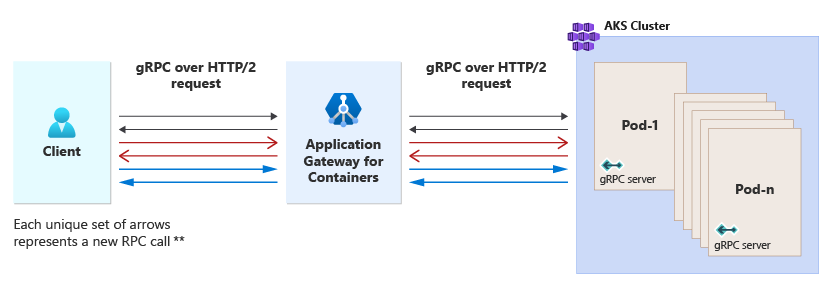
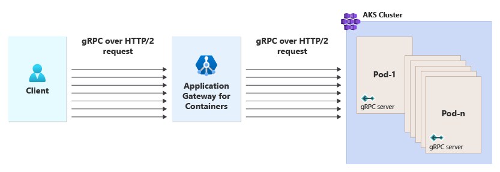
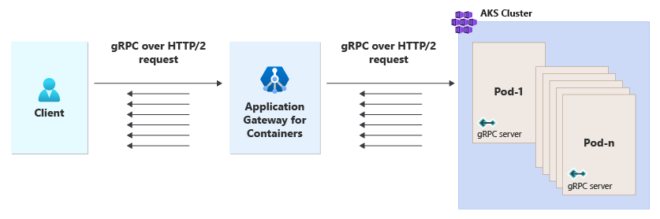
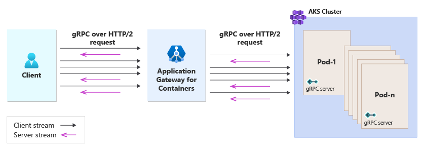

# gRPC on Application Gateway for Containers

## What is gRPC?

[gRPC](https://grpc.io/docs/what-is-grpc/introduction/) is a modern, high-performance framework that evolves the age-old [remote procedure call (RPC)](https://en.wikipedia.org/wiki/Remote_procedure_call) protocol. At the application level, gRPC streamlines messaging between clients and back-end services. Originating from Google, gRPC is open source and part of the [Cloud Native Computing Foundation (CNCF)](https://www.cncf.io/) ecosystem of cloud-native offerings. CNCF considers gRPC an [incubating project](https://github.com/cncf/toc/blob/main/process/graduation_criteria.md). Incubating means end users are using the technology in production applications, and the project has a healthy number of contributors.

A typical gRPC client app exposes a local, in-process function that implements a business operation. Under the covers, that local function invokes another function on a remote machine. What appears to be a local call essentially becomes a transparent out-of-process call to a remote service. The RPC plumbing abstracts the point-to-point networking communication, serialization, and execution between computers.

In cloud-native applications, developers often work across programming languages, frameworks, and technologies. This *interoperability* complicates message contracts and the plumbing required for cross-platform communication.  gRPC provides a "uniform horizontal layer" that abstracts these concerns. Developers code in their native platform focused on business functionality, while gRPC handles communication plumbing.

gRPC offers comprehensive support across most popular development stacks, including Java, JavaScript, C#, Go, Swift, and NodeJS.

## gRPC Benefits

gRPC uses HTTP/2 for its transport protocol. While compatible with HTTP 1.1, HTTP/2 features many advanced capabilities:

- A binary framing protocol for data transport - unlike HTTP 1.1, which is text based.
- Multiplexing support for sending multiple parallel requests over the same connection - HTTP 1.1 limits processing to one request/response message at a time.
- Bidirectional full-duplex communication for sending both client requests and server responses simultaneously.
- Built-in streaming enabling requests and responses to asynchronously stream large data sets.
- Header compression that reduces network usage.

gRPC is lightweight and highly performant. It can be up to 8x faster than JSON serialization with messages 60-80% smaller.

## Protocol Buffers

gRPC embraces an open-source technology called [Protocol Buffers](https://developers.google.com/protocol-buffers/docs/overview). They provide a highly efficient and platform-neutral serialization format for serializing structured messages that services send to each other. Using a cross-platform Interface Definition Language (IDL), developers define a service contract for each microservice. The contract, implemented as a text-based `.proto` file, describes the methods, inputs, and outputs for each service. The same contract file can be used for gRPC clients and services built on different development platforms.

Using the proto file, the Protobuf compiler, `protoc`, generates both client and service code for your target platform. The code includes the following components:

- Strongly typed objects, shared by the client and service, that represent the service operations and data elements for a message.
- A strongly typed base class with the required network plumbing that the remote gRPC service can inherit and extend.
- A client stub that contains the required plumbing to invoke the remote gRPC service.

At run time, each message is serialized as a standard Protobuf representation and exchanged between the client and remote service. Unlike JSON or XML, Protobuf messages are serialized as compiled binary bytes.

## RPC life cycle

gRPC has four [rpc life cycles](https://grpc.io/docs/what-is-grpc/core-concepts/#rpc-life-cycle) for how a client interacts with the gRPC server.

### Unary RPC

In the unary life cycle, a request is made to the gRPC server and a response is returned.



### Client streaming RPC

In the client streaming life cycle, a request is made to the gRPC server, and then the client streams a sequence of additional messages to the server without the need for the server to return additional responses.



### Server streaming RPC

In the server streaming life cycle, a request is made to the gRPC server, and then the server streams a sequence of messages back to the client without the need for the client to return additional responses.



### Bidirectional streaming RPC

In the bidirectional streaming life cycle, a request is made to the gRPC server, and both the client and server send a sequence of messages, operating independently from each other.



## gRPC implementation in Application Gateway for Containers

Application Gateway for Containers is able to proxy requests following each of the four life cycles: unary, client streaming, server streaming, and bidirectional stream.

### gRPC definition

Configuration is implemented through Kubernetes Gateway API by definition of a [GRPCRoute](https://gateway-api.sigs.k8s.io/api-types/grpcroute/) resource (no support is offered for gRPC in Ingress API for Application Gateway for Containers). Each GRPCRoute resource must reference a Gateway resource. More than one GRPCRoute resource may reference the same gateway provided the rules to handle the request are unique.

For example, the following GRPCRoute would be attached to a gateway called `Gateway-01`.

```yaml
apiVersion: gateway.networking.k8s.io/v1
kind: GRPCRoute
metadata:
  name: grpc-route-example
  namespace: grpc-namespace
spec:
  parentRefs:
    - name: gateway-01
      namespace: gateway-namespace
  rules:
    - matches:
        - method:
            service: ChatBotService
            method: TalkBack
      backendRefs:
        - name: gRPC-TalkBack
          port: 8080
```

>[!Note]
>gRPC is only supported using Gateway API for Application Gateway for Containers.

### Health probes

By default, Application Gateway for Containers attempts to initiate a TCP handshake to the backend port running the gRPC service. If the handshake completes, the backend is considered healthy.

If using a HealthCheckPolicy as a custom health probe, the defined policy determines probe behavior.

Here's an example of a HealthCheckPolicy for a gRPC backend.

```yaml
apiVersion: alb.networking.azure.io/v1
kind: HealthCheckPolicy
metadata:
  name: gateway-health-check-policy
  namespace: test-infra
spec:
  targetRef:
    group: ""
    kind: Service
    name: test-service
    namespace: test-infra
  default:
    interval: 5s
    timeout: 3s
    healthyThreshold: 1
    unhealthyThreshold: 1
    port: 8123
    grpc: {} # defined if probing a gRPC endpoint
    UseTLS: true
```

In this example, protocol, port, and UseTLS are optional, however if the service contains multiple pods and the gRPC pod is exposed on a different port, you can reference how the probe should be initiated to that pod explicitly.
