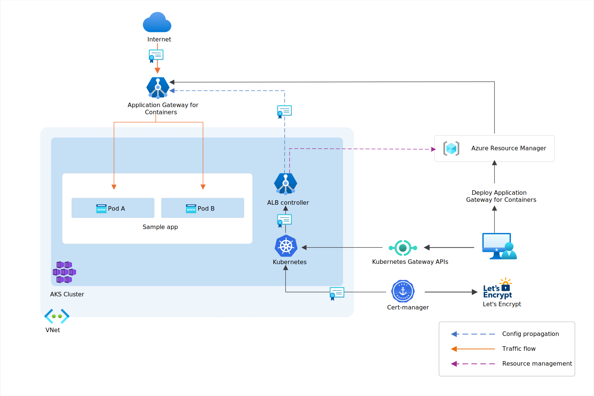

# Cert-manager and Let's Encrypt with Application Gateway for Containers - Gateway API

This guide demonstrates how to use cert-manager to automatically issue and renew SSL/TLS certificates to one or more frontends of your Azure Application Gateway for Containers deployment. We use the Gateway API to configure the necessary resources.

For the purposes of this example, we have cert-manager configure certificates issued from Let's Encrypt to demonstrate an end-to-end deployment, where Application Gateway for Containers is providing TLS offloading.



For certificates to be issued by Let's Encrypt, a challenge is required by the authority to validate domain ownership. This validation happens by allowing cert-manager to create a pod and HTTPRoute resource that exposes an endpoint during certificate issuance, proving your ownership of the domain name.

More details on cert-manager and Let's Encrypt with AKS in general may be found [here](https://cert-manager.io/docs/tutorials/getting-started-aks-letsencrypt/).

## Prerequisites

1. If following the BYO deployment strategy, ensure that you set up your Application Gateway for Containers resources and [ALB Controller](quickstart-deploy-application-gateway-for-containers-alb-controller.md)
2. If following the ALB managed deployment strategy, ensure that you provision your [ALB Controller](quickstart-deploy-application-gateway-for-containers-alb-controller.md) and the Application Gateway for Containers resources via the  [ApplicationLoadBalancer custom resource](quickstart-create-application-gateway-for-containers-managed-by-alb-controller.md).
3. Deploy sample HTTP application
  Apply the following deployment.yaml file on your cluster to create a sample web application to demonstrate the header rewrite.

   ```bash
   kubectl apply -f https://learn.microsoft.com/azure/application-gateway/for-containers/examples/traffic-split-scenario/deployment.yaml
   ```
  
   This command creates the following on your cluster:

   - a namespace called `test-infra`
   - two services called `backend-v1` and `backend-v2` in the `test-infra` namespace
   - two deployments called `backend-v1` and `backend-v2` in the `test-infra` namespace

### Create a Gateway resource

Create a new `Gateway` resource that listens for HTTP requests from Let's Encrypt during the challenge process.

# [ALB managed deployment](#tab/alb-managed)

Create a gateway:

```bash
kubectl apply -f - <<EOF
apiVersion: gateway.networking.k8s.io/v1
kind: Gateway
metadata:
  name: gateway-01
  namespace: test-infra
  annotations:
    alb.networking.azure.io/alb-namespace: alb-test-infra
    alb.networking.azure.io/alb-name: alb-test
    cert-manager.io/issuer: letsencrypt-cert
spec:
  gatewayClassName: azure-alb-external
  listeners:
  - name: http-listener
    protocol: HTTP
    port: 80
    allowedRoutes:
        namespaces:
          from: Same
EOF
```

[!INCLUDE [application-gateway-for-containers-frontend-naming](../../../includes/application-gateway-for-containers-frontend-naming.md)]

# [Bring your own (BYO) deployment](#tab/byo)

1. Set the following environment variables

```bash
RESOURCE_GROUP='<resource group name of the Application Gateway For Containers resource>'
RESOURCE_NAME='alb-test'

RESOURCE_ID=$(az network alb show --resource-group $RESOURCE_GROUP --name $RESOURCE_NAME --query id -o tsv)
FRONTEND_NAME='frontend'
```

2. Create a Gateway

```bash
kubectl apply -f - <<EOF
apiVersion: gateway.networking.k8s.io/v1
kind: Gateway
metadata:
  name: gateway-01
  namespace: test-infra
  annotations:
    alb.networking.azure.io/alb-id: $RESOURCE_ID
    cert-manager.io/issuer: letsencrypt-prod
spec:
  gatewayClassName: azure-alb-external
  listeners:
  - name: http-listener
    protocol: HTTP
    port: 80
    allowedRoutes:
        namespaces:
          from: Same
  addresses:
  - type: alb.networking.azure.io/alb-frontend
    value: $FRONTEND_NAME
EOF
```

---

Once the gateway resource is created, ensure the status is valid, the listener is _Programmed_, and an address is assigned to the gateway.

```bash
kubectl get gateway gateway-01 -n test-infra -o yaml
```

Example output of successful gateway creation.

```yaml
status:
  addresses:
  - type: IPAddress
    value: xxxx.yyyy.alb.azure.com
  conditions:
  - lastTransitionTime: "2023-06-19T21:04:55Z"
    message: Valid Gateway
    observedGeneration: 1
    reason: Accepted
    status: "True"
    type: Accepted
  - lastTransitionTime: "2023-06-19T21:04:55Z"
    message: Application Gateway For Containers resource has been successfully updated.
    observedGeneration: 1
    reason: Programmed
    status: "True"
    type: Programmed
  listeners:
  - attachedRoutes: 0
    conditions:
    - lastTransitionTime: "2023-06-19T21:04:55Z"
      message: ""
      observedGeneration: 1
      reason: ResolvedRefs
      status: "True"
      type: ResolvedRefs
    - lastTransitionTime: "2023-06-19T21:04:55Z"
      message: Listener is accepted
      observedGeneration: 1
      reason: Accepted
      status: "True"
      type: Accepted
    - lastTransitionTime: "2023-06-19T21:04:55Z"
      message: Application Gateway For Containers resource has been successfully updated.
      observedGeneration: 1
      reason: Programmed
      status: "True"
      type: Programmed
    name: https-listener
    supportedKinds:
    - group: gateway.networking.k8s.io
      kind: HTTPRoute
```

### Install Cert-Manager

Install cert-manager using Helm:

```bash
helm repo add jetstack https://charts.jetstack.io --force-update
helm install \
  cert-manager jetstack/cert-manager \
  --namespace cert-manager \
  --create-namespace \
  --version v1.16.0 \
  --set config.enableGatewayAPI=true \
  --set crds.enabled=true
```

The helm installation creates three deployments and some services and pods in a new namespace called `cert-manager`. It also installs cluster-scoped supporting resources, such as RBAC roles and Custom Resource Definitions.

### Create a ClusterIssuer

Create a ClusterIssuer resource to define how cert-manager will communicate with Let's Encrypt. For this example, an HTTP challenge is used. During challenge, cert-manager creates an `HTTPRoute` resource and corresponding pod presenting a validation endpoint to prove ownership of the domain.

>[!Tip]
>Other challenges supported by Let's Encrypt are documented on [letsencrypt.org - Challenge Types](https://letsencrypt.org/docs/challenge-types/)

```bash
kubectl apply -f - <<EOF
apiVersion: cert-manager.io/v1
kind: ClusterIssuer
metadata:
  name: letsencrypt-prod
  namespace: test-infra
spec:
  acme:
    server: https://acme-v02.api.letsencrypt.org/directory # production endpoint
    #server: https://acme-staging-v02.api.letsencrypt.org/directory # staging endpoint
    email: your-email@example.com
    privateKeySecretRef:
      name: letsencrypt-private-key
    solvers:
      - http01:
          gatewayHTTPRoute:
            parentRefs:
              - name: gateway-01
                namespace: test-infra
                kind: Gateway
EOF
```

Verify the resource was created

```bash
kubectl get ClusterIssuer -A -o yaml
```

The status should show `True` and type `Ready`.

```text
  status:
    acme:
      lastPrivateKeyHash: x+xxxxxxxxxxxxxxxxxxxxxxx+MY4PAEeotr9XH3V7I=
      lastRegisteredEmail: your-email@example.com
      uri: https://acme-staging-v02.api.letsencrypt.org/acme/acct/165888253
    conditions:
    - lastTransitionTime: "2024-10-04T21:22:40Z"
      message: The ACME account was registered with the ACME server
      observedGeneration: 1
      reason: ACMEAccountRegistered
      status: "True"
      type: Ready
```

### Create a certificate

```bash
kubectl apply -f - <<EOF
apiVersion: cert-manager.io/v1
kind: Certificate
metadata:
  name: letsencrypt-cert
  namespace: test-infra
spec:
  secretName: letsencrypt-secret # name published to secret store
  issuerRef:
    name: letsencrypt-prod # ClusterIssuer resource name
    kind: ClusterIssuer
  dnsNames:
    - contoso.com # domain name to be used
EOF
```

Execute the following command to validate issuance of the certificate. If the certificate has been issued, the value of the `READY` column should be `True`.

```bash
kubectl get certificate letsencrypt-cert -n test-infra
```

If the certificate wasn't issued, you can execute the following command to validate the status of a challenge.

>[!Note]
> If the certificate has been successfully issued, the challenge will no longer be listed.

```bash
kubectl get challenges -n test-infra -o yaml
```

### Enable HTTPS on the Gateway resource

Modify the gateway to add a second listener to terminate HTTPS requests with the issued Let's Encrypt certificate.

# [ALB managed deployment](#tab/alb-managed)

Create a gateway:

```bash
kubectl apply -f - <<EOF
apiVersion: gateway.networking.k8s.io/v1
kind: Gateway
metadata:
  name: gateway-01
  namespace: test-infra
  annotations:
    alb.networking.azure.io/alb-namespace: alb-test-infra
    alb.networking.azure.io/alb-name: alb-test
    cert-manager.io/issuer: letsencrypt-cert
spec:
  gatewayClassName: azure-alb-external
  listeners:
  - name: http-listener
    protocol: HTTP
    port: 80
    allowedRoutes:
        namespaces:
          from: Same
  - name: https-listener
    port: 443
    protocol: HTTPS
    tls:
      certificateRefs:
      - name: letsencrypt-secret
    allowedRoutes:
      namespaces:
        from: Same
EOF
```

[!INCLUDE [application-gateway-for-containers-frontend-naming](../../../includes/application-gateway-for-containers-frontend-naming.md)]

# [Bring your own (BYO) deployment](#tab/byo)

1. Set the following environment variables

```bash
RESOURCE_GROUP='<resource group name of the Application Gateway For Containers resource>'
RESOURCE_NAME='alb-test'

RESOURCE_ID=$(az network alb show --resource-group $RESOURCE_GROUP --name $RESOURCE_NAME --query id -o tsv)
FRONTEND_NAME='frontend'
```

2. Create a Gateway

```bash
kubectl apply -f - <<EOF
apiVersion: gateway.networking.k8s.io/v1
kind: Gateway
metadata:
  name: gateway-01
  namespace: test-infra
  annotations:
    alb.networking.azure.io/alb-id: $RESOURCE_ID
    cert-manager.io/issuer: letsencrypt-prod
spec:
  gatewayClassName: azure-alb-external
  listeners:
  - name: http-listener
    protocol: HTTP
    port: 80
    allowedRoutes:
        namespaces:
          from: Same
  - name: https-listener
    port: 443
    protocol: HTTPS
    tls:
      certificateRefs:
      - name: letsencrypt-secret
    allowedRoutes:
      namespaces:
        from: Same
  addresses:
  - type: alb.networking.azure.io/alb-frontend
    value: $FRONTEND_NAME
EOF
```

---

### Create a HTTPRoute that listens for your hostname

Create a HTTPRoute to handle requests received by the `https-listener` listener.

>[!IMPORTANT]
>Ensure you replace `contoso.com` with the domain name you are expecting the certificate to be issued to.

```bash
kubectl apply -f - <<EOF
apiVersion: gateway.networking.k8s.io/v1
kind: HTTPRoute
metadata:
  name: https-example
  namespace: test-infra
spec:
  parentRefs:
  - name: gateway-01
  hostnames:
  - "contoso.com"
  rules:
  - backendRefs:
    - name: backend-v1
      port: 8080
EOF
```

Once the HTTPRoute resource is created, ensure the route is _Accepted_ and the Application Gateway for Containers resource is _Programmed_.

```bash
kubectl get httproute cert-manager-route -n test-infra -o yaml
```

Verify the status of the Application Gateway for Containers resource is successfully updated.

```yaml
status:
  parents:
  - conditions:
    - lastTransitionTime: "2023-06-19T22:18:23Z"
      message: ""
      observedGeneration: 1
      reason: ResolvedRefs
      status: "True"
      type: ResolvedRefs
    - lastTransitionTime: "2023-06-19T22:18:23Z"
      message: Route is Accepted
      observedGeneration: 1
      reason: Accepted
      status: "True"
      type: Accepted
    - lastTransitionTime: "2023-06-19T22:18:23Z"
      message: Application Gateway For Containers resource has been successfully updated.
      observedGeneration: 1
      reason: Programmed
      status: "True"
      type: Programmed
    controllerName: alb.networking.azure.io/alb-controller
    parentRef:
      group: gateway.networking.k8s.io
      kind: Gateway
      name: gateway-01
      namespace: test-infra
  ```

## Test access to the application

Now we're ready to send some traffic to our sample application, via the hostname used for your certificate.

>[!IMPORTANT]
>Ensure you replace `contoso.com` with the domain name you are expecting the certificate to be issued to.

```bash
curl https://contoso.com/ -v 2>&1 | grep issuer
```

Upon result, you should see

`*  issuer: C=US; O=Let's Encrypt; CN=R10`

Congratulations, you have installed ALB Controller, deployed a backend application, issued a certificate from Let's Encrypt with cert-manager, and routed traffic to the application via Application Gateway for Containers.
