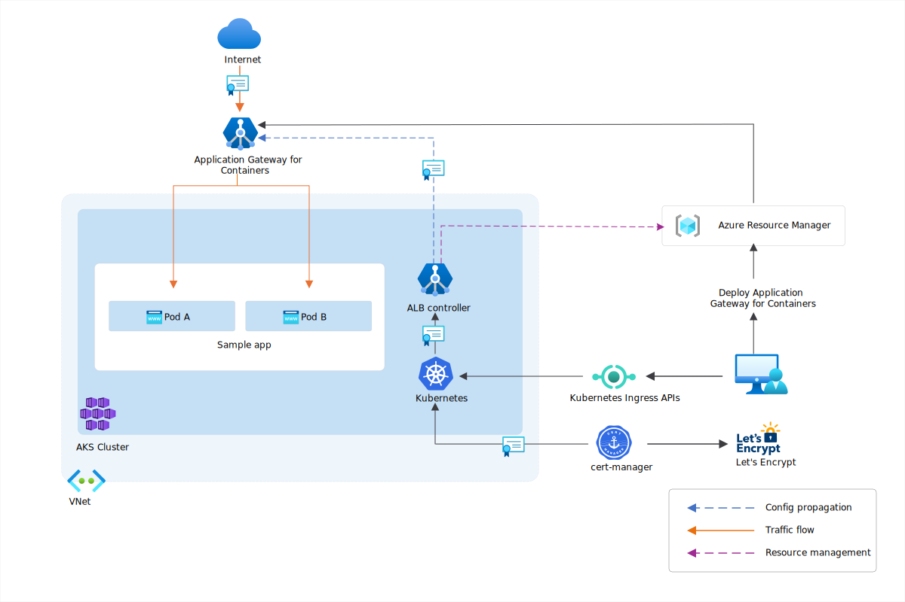

# Cert-manager and Let's Encrypt with Application Gateway for Containers - Ingress API

This guide demonstrates how to use cert-manager to automatically issue and renew SSL/TLS certificates to one or more frontends of your Azure Application Gateway for Containers deployment. We use the Ingress API to configure the necessary resources.

For the purposes of this example, we have cert-manager configure certificates issued from Let's Encrypt to demonstrate an end-to-end deployment, where Application Gateway for Containers is providing TLS offloading.

[ ](./media/how-to-cert-manager-lets-encrypt-ingress-api/how-to-cert-manager-lets-encrypt-ingress-api.svg#lightbox)

For certificates to be issued by Let's Encrypt, a challenge is required by the authority to validate domain ownership. This validation happens by allowing cert-manager to create a pod and Ingress resource that exposes an endpoint during certificate issuance, proving your ownership of the domain name.

More details on cert-manager and Let's Encrypt with AKS in general may be found [here](https://cert-manager.io/docs/tutorials/getting-started-aks-letsencrypt/).

## Prerequisites

1. If following the BYO deployment strategy, ensure that you set up your Application Gateway for Containers resources and [ALB Controller](quickstart-deploy-application-gateway-for-containers-alb-controller.md)
2. If following the ALB managed deployment strategy, ensure that you provision your [ALB Controller](quickstart-deploy-application-gateway-for-containers-alb-controller.md) and the Application Gateway for Containers resources via the  [ApplicationLoadBalancer custom resource](quickstart-create-application-gateway-for-containers-managed-by-alb-controller.md).
3. Deploy sample HTTP application
  Apply the following deployment.yaml file on your cluster to create a sample web application to demonstrate the header rewrite.

   ```bash
   kubectl apply -f https://raw.githubusercontent.com/MicrosoftDocs/azure-docs/refs/heads/main/articles/application-gateway/for-containers/examples/traffic-split-scenario/deployment.yaml
   ```

   This command creates the following on your cluster:

   - a namespace called `test-infra`
   - two services called `backend-v1` and `backend-v2` in the `test-infra` namespace
   - two deployments called `backend-v1` and `backend-v2` in the `test-infra` namespace

### Install Cert-Manager

Install cert-manager using Helm:

```bash
helm repo add jetstack https://charts.jetstack.io --force-update
helm upgrade -i \
  cert-manager jetstack/cert-manager \
  --namespace cert-manager \
  --create-namespace \
  --version v1.17.1 \
  --set installCRDs=true
```

### Create a ClusterIssuer

Create a ClusterIssuer resource to define how cert-manager communicates with Let's Encrypt. For this example, an HTTP challenge is used. During challenge, cert-manager creates an `Ingress` resource and corresponding pod presenting a validation endpoint to prove ownership of the domain. This is done by creating a temporary Ingress resource with the `http01` challenge type. This Ingress resource and corresponding pod created by cert-manager is deleted after the challenge is completed.

>[!Tip]
>Other challenges supported by Let's Encrypt are documented on [letsencrypt.org - Challenge Types](https://letsencrypt.org/docs/challenge-types/)

# [ALB managed deployment](#tab/alb-managed)

Create the ClusterIssuer resource

```bash
kubectl apply -f - <<EOF
apiVersion: cert-manager.io/v1
kind: ClusterIssuer
metadata:
  name: letsencrypt-prod
spec:
  acme:
    server: https://acme-v02.api.letsencrypt.org/directory # production endpoint
    #server: https://acme-staging-v02.api.letsencrypt.org/directory # staging endpoint
    email: your-email@example.com
    privateKeySecretRef:
      name: letsencrypt-private-key
    solvers:
        - http01:
            ingress:
              ingressClassName: azure-alb-external
              # This section is required for the Ingress resource created by cert-manager during the challenge
              ingressTemplate:
                metadata:
                  annotations:
                    alb.networking.azure.io/alb-name: alb-test
                    alb.networking.azure.io/alb-namespace: alb-test-infra
EOF
```

# [Bring your own (BYO) deployment](#tab/byo)

1. Set the following environment variables

```bash
RESOURCE_GROUP='<resource group name of the Application Gateway For Containers resource>'
RESOURCE_NAME='alb-test'

RESOURCE_ID=$(az network alb show --resource-group $RESOURCE_GROUP --name $RESOURCE_NAME --query id -o tsv)
FRONTEND_NAME='frontend'
```

2. Create the ClusterIssuer resource

```bash
kubectl apply -f - <<EOF
apiVersion: cert-manager.io/v1
kind: ClusterIssuer
metadata:
  name: letsencrypt-prod
  namespace: test-infra
spec:
  acme:
    server: https://acme-v02.api.letsencrypt.org/directory # production endpoint
    #server: https://acme-staging-v02.api.letsencrypt.org/directory # staging endpoint
    email: your-email@example.com
    privateKeySecretRef:
      name: letsencrypt-private-key
    solvers:
        - http01:
            ingress:
              ingressClassName: azure-alb-external
              # This section is required for the Ingress resource created by cert-manager during the challenge
              ingressTemplate:
                metadata:
                  annotations:
                    alb.networking.azure.io/alb-id: $RESOURCE_ID
                    alb.networking.azure.io/alb-frontend: $FRONTEND_NAME
EOF
```

---

Verify the resource was created by running the following command:

```bash
kubectl get ClusterIssuer -A -o yaml
```

The status should show `True` and type `Ready` under conditions.

```yaml
  status:
    acme:
      lastPrivateKeyHash: x+xxxxxxxxxxxxxxxxxxxxxxx+MY4PAEeotr9XH3V7I=
      lastRegisteredEmail: your-email@example.com
      uri: https://acme-staging-v02.api.letsencrypt.org/acme/acct/190567584
    conditions:
    - lastTransitionTime: "2025-03-20T16:00:21Z"
      message: The ACME account was registered with the ACME server
      observedGeneration: 1
      reason: ACMEAccountRegistered
      status: "True"
      type: Ready
```
---
## Deploy the required Ingress resource

# [ALB managed deployment](#tab/alb-managed)

Create an Ingress

```bash
kubectl apply -f - <<EOF
apiVersion: networking.k8s.io/v1
kind: Ingress
metadata:
  name: ingress-01
  namespace: test-infra
  annotations:
    alb.networking.azure.io/alb-name: alb-test
    alb.networking.azure.io/alb-namespace: alb-test-infra
    cert-manager.io/cluster-issuer: letsencrypt-prod
spec:
  ingressClassName: azure-alb-external
  tls:
  - hosts:
    - backend-v1.contoso.com
    # - backend-v2.contoso.com # You can uncomment this and the host line to add an additional subject alternate name (SAN) to the certificate
    secretName: tls-backend
  rules:
    - host: backend-v1.contoso.com
      http:
        paths:
          - path: /
            pathType: Prefix
            backend:
              service:
                name: backend-v1
                port:
                  number: 8080
    # - host: backend-v2.contoso.com
    #   http:
    #     paths:
    #       - path: /
    #         pathType: Prefix
    #         backend:
    #           service:
    #             name: backend-v2
    #             port:
    #               number: 8080
EOF
```

# [Bring your own (BYO) deployment](#tab/byo)

1. Set the following environment variables

```bash
RESOURCE_GROUP='<resource group name of the Application Gateway For Containers resource>'
RESOURCE_NAME='alb-test'

RESOURCE_ID=$(az network alb show --resource-group $RESOURCE_GROUP --name $RESOURCE_NAME --query id -o tsv)
FRONTEND_NAME='frontend'
```

2. Create an Ingress resource

```bash
kubectl apply -f - <<EOF
apiVersion: networking.k8s.io/v1
kind: Ingress
metadata:
  name: ingress-01
  namespace: test-infra
  annotations:
    alb.networking.azure.io/alb-id: $RESOURCE_ID
    alb.networking.azure.io/alb-frontend: $FRONTEND_NAME
    cert-manager.io/cluster-issuer: letsencrypt-prod
spec:
  ingressClassName: azure-alb-external
  tls:
  - hosts:
    - backend-v1.contoso.com
    # - backend-v2.contoso.com # You can uncomment this and the host line to add an additional subject alternate name (SAN) to the certificate
    secretName: tls-backend
  rules:
    - host: backend-v1.contoso.com
      http:
        paths:
          - path: /
            pathType: Prefix
            backend:
              service:
                name: backend-v1
                port:
                  number: 8080
    # - host: backend-v2.contoso.com
    #   http:
    #     paths:
    #       - path: /
    #         pathType: Prefix
    #         backend:
    #           service:
    #             name: backend-v2
    #             port:
    #               number: 8080
EOF
```

---

Once the ingress resource is created, ensure the status shows the hostname of your load balancer:

```bash
kubectl get ingress ingress-01 -n test-infra -o yaml
```

Example output of successful Ingress creation.

```yaml
status:
  loadBalancer:
    ingress:
    - hostname: xxxxxxxxxxxxxxxx.fz13.alb.azure.com
      ports:
      - port: 443
        protocol: TCP
```

As mentioned previously, cert-manager creates a temporary Ingress resource and pod to perform the challenge:

```bash
kubectl get pods -n test-infra
NAME                          READY   STATUS    RESTARTS   AGE
backend-v1-56d99ddb49-mwmcc   1/1     Running   0          10m
backend-v2-8b5d4679b-rsfrg    1/1     Running   0          10m
cm-acme-http-solver-5lmmv     1/1     Running   0          2s

kubectl get ingress -n test-infra
NAME                        CLASS                HOSTS                         ADDRESS                               PORTS     AGE
cm-acme-http-solver-zrp47   azure-alb-external   backend-v1.contoso.com        xxxxxxxxxxxxxxxx.fz13.alb.azure.com   80        8s
ingress-01                  azure-alb-external   backend-v1.contoso.com        xxxxxxxxxxxxxxxx.fz13.alb.azure.com   80, 443   10s
```

You can check the status of the challenge by running:

```bash
kubectl get challenges.acme.cert-manager.io -n test-infra
NAME                                   STATE     DOMAIN                        AGE
cert-backend-1-2982214480-3407407859   pending   backend-v1.contoso.com        16s

kubectl get certificaterequests.cert-manager.io -n test-infra
NAME             APPROVED   DENIED   READY   ISSUER              REQUESTER                                         AGE
cert-backend-1   True                False   letsencrypt-prod    system:serviceaccount:cert-manager:cert-manager   34s
```

When the challenge is successful, the status changes to `READY=True` and the certificate is issued:

```bash
kubectl get certificate -n test-infra
NAME           READY   SECRET         AGE
cert-backend   True    cert-backend   1m
```

>[!Tip]
>You can synchronize the hostnames of Ingress resources created in AKS automatically with Azure DNS zones by utilizing [External DNS](https://kubernetes-sigs.github.io/external-dns/latest/docs/tutorials/azure/) and [Workload Identity](https://kubernetes-sigs.github.io/external-dns/latest/docs/tutorials/azure/#managed-identity-using-workload-identity).

## Test access to the application

The environment is now configured to route traffic to the sample application using the hostname associated with your certificate.

>[!IMPORTANT]
>Ensure you replace `contoso.com` with the domain name you are expecting the certificate to be issued to.

```bash
curl https://backend-v1.contoso.com -v 2>&1 | grep issuer
```

You should see the following output:

`*  issuer: C=US; O=Let's Encrypt; CN=R11`

You have successfully installed the ALB Controller, deployed a backend application, obtained a certificate from Let's Encrypt using cert-manager, and configured traffic routing to the application through Application Gateway for Containers.
