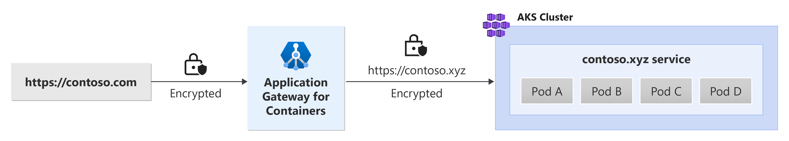

# End-to-end TLS with Application Gateway for Containers - Gateway API

This document helps set up an example application that uses the following resources from Gateway API. Steps are provided to:

- Create a [Gateway](https://gateway-api.sigs.k8s.io/concepts/api-overview/#gateway) resource with one HTTPS listener.
- Create an [HTTPRoute](https://gateway-api.sigs.k8s.io/api-types/httproute) that references a backend service.

## Background

Application Gateway for Containers enables end-to-end TLS for improved privacy and security. In this design, traffic between the client and an Application Gateway for Containers' frontend is encrypted and traffic proxied from Application Gateway for Containers to the backend target is encrypted. See the following example scenario:



## Prerequisites

1. If following the BYO deployment strategy, ensure that you set up your Application Gateway for Containers resources and [ALB Controller](quickstart-deploy-application-gateway-for-containers-alb-controller.md)
2. If following the ALB managed deployment strategy, ensure that you provision your [ALB Controller](quickstart-deploy-application-gateway-for-containers-alb-controller.md) and the Application Gateway for Containers resources via the  [ApplicationLoadBalancer custom resource](quickstart-create-application-gateway-for-containers-managed-by-alb-controller.md).
3. Deploy sample HTTPS application
  Apply the following deployment.yaml file on your cluster to create a sample web application to demonstrate TLS/SSL offloading.

    ```bash
    kubectl apply -f https://raw.githubusercontent.com/MicrosoftDocs/azure-docs/refs/heads/main/articles/application-gateway/for-containers/examples/https-scenario/end-to-end-tls/deployment.yaml
    ```

    This command creates the following on your cluster:
    - a namespace called `test-infra`
    - one service called `https-app` in the `test-infra` namespace
    - one deployment called `https-app` in the `test-infra` namespace
    - one configmap called `https-app-cm` in the `test-infra` namespace
    - one secret called `contoso.com` in the `test-infra` namespace
    - one secret called `contoso.xyz` in the `test-infra` namespace

## Deploy the required Gateway API resources

# [ALB managed deployment](#tab/alb-managed)

1. Create a Gateway

    ```bash
    kubectl apply -f - <<EOF
    apiVersion: gateway.networking.k8s.io/v1
    kind: Gateway
    metadata:
      name: gateway-01
      namespace: test-infra
      annotations:
        alb.networking.azure.io/alb-namespace: alb-test-infra
        alb.networking.azure.io/alb-name: alb-test
    spec:
      gatewayClassName: azure-alb-external
      listeners:
      - name: https-listener
        port: 443
        protocol: HTTPS
        allowedRoutes:
          namespaces:
            from: Same
        tls:
          mode: Terminate
          certificateRefs:
          - kind : Secret
            group: ""
            name: contoso.com
    EOF
    ```

[!INCLUDE [application-gateway-for-containers-frontend-naming](../../../includes/application-gateway-for-containers-frontend-naming.md)]

# [Bring your own (BYO) deployment](#tab/byo)

1. Set the following environment variables

    ```bash
    RESOURCE_GROUP='<resource group name of the Application Gateway For Containers resource>'
    RESOURCE_NAME='alb-test'

    RESOURCE_ID=$(az network alb show --resource-group $RESOURCE_GROUP --name $RESOURCE_NAME --query id -o tsv)
    FRONTEND_NAME='frontend'
    ```

2. Create a Gateway

    ```bash
    kubectl apply -f - <<EOF
    apiVersion: gateway.networking.k8s.io/v1
    kind: Gateway
    metadata:
      name: gateway-01
      namespace: test-infra
      annotations:
        alb.networking.azure.io/alb-id: $RESOURCE_ID
    spec:
      gatewayClassName: azure-alb-external
      listeners:
      - name: https-listener
        port: 443
        protocol: HTTPS
        allowedRoutes:
          namespaces:
            from: Same
        tls:
          mode: Terminate
          certificateRefs:
          - kind : Secret
            group: ""
            name: contoso.com
      addresses:
      - type: alb.networking.azure.io/alb-frontend
        value: $FRONTEND_NAME
    EOF
    ```

---

When the gateway resource is created, ensure the status is valid, the listener is _Programmed_, and an address is assigned to the gateway.

```bash
kubectl get gateway gateway-01 -n test-infra -o yaml
```

Example output of successful gateway creation.

```yaml
status:
  addresses:
  - type: Hostname
    value: xxxx.yyyy.alb.azure.com
  conditions:
  - lastTransitionTime: "2023-06-19T21:04:55Z"
    message: Valid Gateway
    observedGeneration: 1
    reason: Accepted
    status: "True"
    type: Accepted
  - lastTransitionTime: "2023-06-19T21:04:55Z"
    message: Application Gateway For Containers resource has been successfully updated.
    observedGeneration: 1
    reason: Programmed
    status: "True"
    type: Programmed
  listeners:
  - attachedRoutes: 0
    conditions:
    - lastTransitionTime: "2023-06-19T21:04:55Z"
      message: ""
      observedGeneration: 1
      reason: ResolvedRefs
      status: "True"
      type: ResolvedRefs
    - lastTransitionTime: "2023-06-19T21:04:55Z"
      message: Listener is accepted
      observedGeneration: 1
      reason: Accepted
      status: "True"
      type: Accepted
    - lastTransitionTime: "2023-06-19T21:04:55Z"
      message: Application Gateway For Containers resource has been successfully updated.
      observedGeneration: 1
      reason: Programmed
      status: "True"
      type: Programmed
    name: https-listener
    supportedKinds:
    - group: gateway.networking.k8s.io
      kind: HTTPRoute
```

Once the gateway is created, create an HTTPRoute resource.

```bash
kubectl apply -f - <<EOF
apiVersion: gateway.networking.k8s.io/v1
kind: HTTPRoute
metadata:
  name: https-route
  namespace: test-infra
spec:
  parentRefs:
  - name: gateway-01
  rules:
  - backendRefs:
    - name: https-app
      port: 443
EOF
```

Once the HTTPRoute resource is created, ensure the route is _Accepted_ and the Application Gateway for Containers resource is _Programmed_.

```bash
kubectl get httproute https-route -n test-infra -o yaml
```

Verify the Application Gateway for Containers resource is successfully updated.

```yaml
status:
  parents:
  - conditions:
    - lastTransitionTime: "2023-06-19T22:18:23Z"
      message: ""
      observedGeneration: 1
      reason: ResolvedRefs
      status: "True"
      type: ResolvedRefs
    - lastTransitionTime: "2023-06-19T22:18:23Z"
      message: Route is Accepted
      observedGeneration: 1
      reason: Accepted
      status: "True"
      type: Accepted
    - lastTransitionTime: "2023-06-19T22:18:23Z"
      message: Application Gateway For Containers resource has been successfully updated.
      observedGeneration: 1
      reason: Programmed
      status: "True"
      type: Programmed
    controllerName: alb.networking.azure.io/alb-controller
    parentRef:
      group: gateway.networking.k8s.io
      kind: Gateway
      name: gateway-01
      namespace: test-infra
  ```

Create a BackendTLSPolicy

```bash
kubectl apply -f - <<EOF
apiVersion: alb.networking.azure.io/v1
kind: BackendTLSPolicy
metadata:
  name: https-app-tls-policy
  namespace: test-infra
spec:
  targetRef:
    group: ""
    kind: Service
    name: https-app
    namespace: test-infra
  default:
    sni: contoso.xyz
    ports:
    - port: 443
EOF
```

Once the BackendTLSPolicy object is created, check the status on the object to ensure that the policy is valid:

```bash
kubectl get backendtlspolicy -n test-infra https-app-tls-policy -o yaml
```

Example output of valid BackendTLSPolicy object creation:

```yaml
status:
  conditions:
  - lastTransitionTime: "2023-06-29T16:54:42Z"
    message: Valid BackendTLSPolicy
    observedGeneration: 1
    reason: Accepted
    status: "True"
    type: Accepted
```

## Test access to the application

Now we're ready to send some traffic to our sample application, via the FQDN assigned to the frontend. Use the following command to get the FQDN.

```bash
fqdn=$(kubectl get gateway gateway-01 -n test-infra -o jsonpath='{.status.addresses[0].value}')
```

Curling this FQDN should return responses from the backend as configured on the HTTPRoute.

```bash
fqdnIp=$(dig +short $fqdn)
curl -k --resolve contoso.com:443:$fqdnIp https://contoso.com --insecure
```

The following result should be present:

```
Hello world!
```

Congratulations, you have installed ALB Controller, deployed a backend application and routed traffic to the application via the ingress on Application Gateway for Containers.
