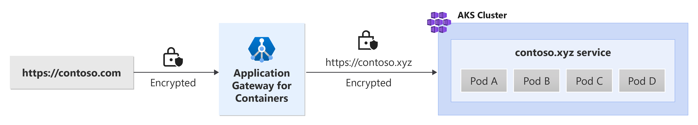

# End-to-end TLS with Application Gateway for Containers - Ingress API

This document helps set up an example application that uses the _Ingress_ resource from [Ingress API](https://kubernetes.io/docs/concepts/services-networking/ingress/):

## Background

Application Gateway for Containers enables end-to-end TLS for improved privacy and security. In this design, traffic between the client and an Application Gateway for Containers' frontend is encrypted and traffic proxied from Application Gateway for Containers to the backend target is encrypted. See the following example scenario:



## Prerequisites

1. If following the BYO deployment strategy, ensure that you set up your Application Gateway for Containers resources and [ALB Controller](quickstart-deploy-application-gateway-for-containers-alb-controller.md)
2. If following the ALB managed deployment strategy, ensure that you provision your [ALB Controller](quickstart-deploy-application-gateway-for-containers-alb-controller.md) and the Application Gateway for Containers resources via the  [ApplicationLoadBalancer custom resource](quickstart-create-application-gateway-for-containers-managed-by-alb-controller.md).
3. Deploy sample HTTPS application
  Apply the following deployment.yaml file on your cluster to create a sample web application to demonstrate TLS/SSL offloading.

    ```bash
    kubectl apply -f https://raw.githubusercontent.com/MicrosoftDocs/azure-docs/refs/heads/main/articles/application-gateway/for-containers/examples/https-scenario/end-to-end-tls/deployment.yaml
    ```

    This command creates the following on your cluster:
    - a namespace called `test-infra`
    - one service called `https-app` in the `test-infra` namespace
    - one deployment called `https-app` in the `test-infra` namespace
    - one configmap called `https-app-cm` in the `test-infra` namespace
    - one secret called `contoso.com` in the `test-infra` namespace
    - one secret called `contoso.xyz` in the `test-infra` namespace

## Deploy the required Ingress API resources

# [ALB managed deployment](#tab/alb-managed)

1. Create an Ingress
```bash
kubectl apply -f - <<EOF
apiVersion: networking.k8s.io/v1
kind: Ingress
metadata:
  name: ingress-01
  namespace: test-infra
  annotations:
    alb.networking.azure.io/alb-name: alb-test
    alb.networking.azure.io/alb-namespace: alb-test-infra
spec:
  ingressClassName: azure-alb-external
  tls:
  - hosts:
    - contoso.com
    secretName: contoso.com
  rules:
  - host: contoso.com
    http:
      paths:
      - path: /
        pathType: Prefix
        backend:
          service:
            name: https-app
            port:
              number: 443
EOF
```

[!INCLUDE [application-gateway-for-containers-frontend-naming](../../../includes/application-gateway-for-containers-frontend-naming.md)]

# [Bring your own (BYO) deployment](#tab/byo)

1. Set the following environment variables

```bash
RESOURCE_GROUP='<resource group name of the Application Gateway For Containers resource>'
RESOURCE_NAME='alb-test'

RESOURCE_ID=$(az network alb show --resource-group $RESOURCE_GROUP --name $RESOURCE_NAME --query id -o tsv)
FRONTEND_NAME='frontend'
```

2. Create an Ingress resource.

```bash
kubectl apply -f - <<EOF
apiVersion: networking.k8s.io/v1
kind: Ingress
metadata:
  name: ingress-01
  namespace: test-infra
  annotations:
    alb.networking.azure.io/alb-id: $RESOURCE_ID
    alb.networking.azure.io/alb-frontend: $FRONTEND_NAME
spec:
  ingressClassName: azure-alb-external
  tls:
  - hosts:
    - contoso.com
    secretName: contoso.com
  rules:
  - host: contoso.com
    http:
      paths:
      - path: /
        pathType: Prefix
        backend:
          service:
            name: https-app
            port:
              number: 443
EOF
```

---

When the ingress resource is created, ensure the status shows the hostname of your load balancer and that both ports are listening for requests.

```bash
kubectl get ingress ingress-01 -n test-infra -o yaml
```

Example output of successful Ingress creation.

```yaml
apiVersion: networking.k8s.io/v1
kind: Ingress
metadata:
  annotations:
    alb.networking.azure.io/alb-frontend: FRONTEND_NAME
    alb.networking.azure.io/alb-id: /subscriptions/aaaa0a0a-bb1b-cc2c-dd3d-eeeeee4e4e4e/resourcegroups/yyyyyyyy/providers/Microsoft.ServiceNetworking/trafficControllers/zzzzzz
    kubectl.kubernetes.io/last-applied-configuration: |
      {"apiVersion":"networking.k8s.io/v1","kind":"Ingress","metadata":{"annotations":{"alb.networking.azure.io/alb-frontend":"FRONTEND_NAME","alb.networking.azure.io/alb-id":"/subscriptions/aaaa0a0a-bb1b-cc2c-dd3d-eeeeee4e4e4e/resourcegroups/yyyyyyyy/providers/Microsoft.ServiceNetworking/trafficControllers/zzzzzz"},"name"
:"ingress-01","namespace":"test-infra"},"spec":{"ingressClassName":"azure-alb-external","rules":[{"host":"contoso.com","http":{"paths":[{"backend":{"service":{"name":"https-app","port":{"number":443}}},"path":"/","pathType":"Prefix"}]}}],"tls":[{"hosts":["contoso.com"],"secretName":"contoso.com"}]}}
  creationTimestamp: "2023-07-22T18:02:13Z"
  generation: 2
  name: ingress-01
  namespace: test-infra
  resourceVersion: "278238"
  uid: 17c34774-1d92-413e-85ec-c5a8da45989d
spec:
  ingressClassName: azure-alb-external
  rules:
  - host: contoso.com
    http:
      paths:
      - backend:
          service:
            name: https-app
            port:
              number: 443
        path: /
        pathType: Prefix
  tls:
  - hosts:
    - contoso.com
    secretName: contoso.com
status:
  loadBalancer:
    ingress:
    - hostname: xxxxxxxxxxxxxxxxxxxxxxxxxxxxxxxx.fzyy.alb.azure.com
      ports:
      - port: 443
        protocol: TCP
```

Create an IngressExtension to configure Application Gateway for Containers to initiate connections to the backend server over TLS.

```bash
kubectl apply -f - <<EOF
apiVersion: alb.networking.azure.io/v1
kind: IngressExtension
metadata:
  name: https-ingress
  namespace: test-infra
spec:
  backendSettings:
    - service: https-app
      ports:
        - port: 443
          protocol: HTTPS
      trustedRootCertificate: contoso.xyz
EOF
```

Once the IngressExtension resource is created, check the status on the object to ensure that the policy is valid:

```bash
kubectl get IngressExtension https-ingress -n test-infra -o yaml
```

Example output of valid IngressExtension object creation:

```yaml
status:
  conditions:
  - lastTransitionTime: "2023-06-29T16:54:42Z"
    message: Valid IngressExtension
    observedGeneration: 1
    reason: Accepted
    status: "True"
    type: Accepted
```

## Test access to the application

Now we're ready to send some traffic to our sample application, via the FQDN assigned to the frontend. Use the following command to get the FQDN.

```bash
fqdn=$(kubectl get ingress ingress-01 -n test-infra -o jsonpath='{.status.loadBalancer.ingress[0].hostname}')
```

Curling this FQDN should return responses from the backend as configured on the HTTPRoute.

```bash
fqdnIp=$(dig +short $fqdn)
curl -k --resolve contoso.com:443:$fqdnIp https://contoso.com --insecure
```

The following result should be present:

```
Hello world!
```

Congratulations, you have installed ALB Controller, deployed a backend application and routed traffic to the application via the ingress on Application Gateway for Containers.
