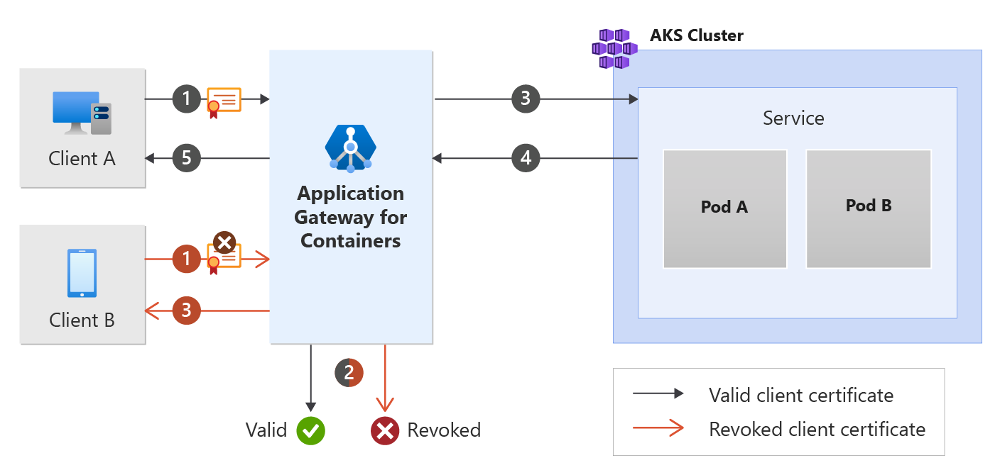

# Frontend MTLS with Application Gateway for Containers - Gateway API

This document helps set up an example application that uses the following resources from Gateway API. Steps are provided to:

- Create a [Gateway](https://gateway-api.sigs.k8s.io/concepts/api-overview/#gateway) resource with one HTTPS listener.
- Create an [HTTPRoute](https://gateway-api.sigs.k8s.io/api-types/httproute/) resource that references a backend service.
- Create a [FrontendTLSPolicy](api-specification-kubernetes.md#alb.networking.azure.io/v1.FrontendTLSPolicy) resource that has a CA certificate.

## Background

Mutual Transport Layer Security (MTLS) is a process that relies on certificates to encrypt communications and identify clients to a service. This enables Application Gateway for Containers to further increase its security posture by only trusting connections from authenticated devices.

See the following figure:

[](./media/how-to-frontend-mtls-gateway-api/frontend-mtls.png#lightbox)

The valid client certificate flow shows a client presenting a certificate to the frontend of Application Gateway for Containers. Application Gateway for Containers determines the certificate is valid and proxies the request to the backend target. The response is ultimately returned to the client.

The revoked client certificate flow shows a client presenting a revoked certificate to the frontend of Application Gateway for Containers. Application Gateway for Containers determines the certificate isn't valid and prevents the request from being proxied to the client. The client will receive an HTTP 400 bad request and corresponding reason.

## Prerequisites

1. If following the BYO deployment strategy, ensure you set up your Application Gateway for Containers resources and [ALB Controller](quickstart-deploy-application-gateway-for-containers-alb-controller.md).
2. If following the ALB managed deployment strategy, ensure you provision your [ALB Controller](quickstart-deploy-application-gateway-for-containers-alb-controller.md) and provision the Application Gateway for Containers resources via the  [ApplicationLoadBalancer custom resource](quickstart-create-application-gateway-for-containers-managed-by-alb-controller.md).
3. Deploy sample HTTP application:

   Apply the following deployment.yaml file on your cluster to create a sample web application and deploy sample secrets to demonstrate frontend mutual authentication (mTLS).

   ```bash
   kubectl apply -f https://raw.githubusercontent.com/MicrosoftDocs/azure-docs/refs/heads/main/articles/application-gateway/for-containers/examples/https-scenario/ssl-termination/deployment.yaml
   ```
  
   This command creates the following on your cluster:
  
   - A namespace called `test-infra`
   - One service called `echo` in the `test-infra` namespace
   - One deployment called `echo` in the `test-infra` namespace
   - One secret called `listener-tls-secret` in the `test-infra` namespace

### Generate certificate(s)

For this example, we'll create a root certificate and issue a client certificate from the root. If you already have a root certificate and client certificate, you may skip these steps.

#### Generate a private key for the root certificate

`openssl genrsa -out root.key 2048`

#### Generate a root certificate

`openssl req -x509 -new -nodes -key root.key -sha256 -days 1024 -out root.crt -subj "/C=US/ST=North Dakota/L=Fargo/O=Contoso/CN=contoso-root"`

#### Generate a private key for the client certificate

`openssl genrsa -out client.key 2048`

#### Create a certificate signing request for the client certificate

`openssl req -new -key client.key -out client.csr -subj "/C=US/ST=North Dakota/L=Fargo/O=Contoso/CN=contoso-client"`

#### Generate a client certificate signed by the root certificate

`openssl x509 -req -in client.csr -CA root.crt -CAkey root.key -CAcreateserial -out client.crt -days 1024 -sha256`

## Deploy the required Gateway API resources

# [ALB managed deployment](#tab/alb-managed)

Create a gateway

```bash
kubectl apply -f - <<EOF
apiVersion: gateway.networking.k8s.io/v1
kind: Gateway
metadata:
  name: gateway-01
  namespace: test-infra
  annotations:
    alb.networking.azure.io/alb-namespace: alb-test-infra
    alb.networking.azure.io/alb-name: alb-test
spec:
  gatewayClassName: azure-alb-external
  listeners:
  - name: mtls-listener
    port: 443
    protocol: HTTPS
    allowedRoutes:
      namespaces:
        from: Same
    tls:
      mode: Terminate
      certificateRefs:
      - kind : Secret
        group: ""
        name: listener-tls-secret
EOF
```

[!INCLUDE [application-gateway-for-containers-frontend-naming](../../../includes/application-gateway-for-containers-frontend-naming.md)]

# [Bring your own (BYO) deployment](#tab/byo)

1. Set the following environment variables

    ```bash
    RESOURCE_GROUP='<resource group name of the Application Gateway For Containers resource>'
    RESOURCE_NAME='alb-test'

    RESOURCE_ID=$(az network alb show --resource-group $RESOURCE_GROUP --name $RESOURCE_NAME --query id -o tsv)
    FRONTEND_NAME='frontend'
    az network alb frontend create -g $RESOURCE_GROUP -n $FRONTEND_NAME --alb-name $AGFC_NAME
    ```

2. Create a Gateway

    ```bash
    kubectl apply -f - <<EOF
    apiVersion: gateway.networking.k8s.io/v1
    kind: Gateway
    metadata:
      name: gateway-01
      namespace: test-infra
      annotations:
        alb.networking.azure.io/alb-id: $RESOURCE_ID
    spec:
      gatewayClassName: azure-alb-external
      listeners:
      - name: mtls-listener
        port: 443
        protocol: HTTPS
        allowedRoutes:
          namespaces:
            from: Same
        tls:
          mode: Terminate
          certificateRefs:
          - kind : Secret
            group: ""
            name: listener-tls-secret
      addresses:
      - type: alb.networking.azure.io/alb-frontend
        value: $FRONTEND_NAME
    EOF
    ```

---

Once the gateway resource is created, ensure the status is valid, the listener is _Programmed_, and an address is assigned to the gateway.

```bash
kubectl get gateway gateway-01 -n test-infra -o yaml
```

Example output of successful gateway creation:

```yaml
status:
  addresses:
  - type: IPAddress
    value: xxxx.yyyy.alb.azure.com
  conditions:
  - lastTransitionTime: "2023-06-19T21:04:55Z"
    message: Valid Gateway
    observedGeneration: 1
    reason: Accepted
    status: "True"
    type: Accepted
  - lastTransitionTime: "2023-06-19T21:04:55Z"
    message: Application Gateway For Containers resource has been successfully updated.
    observedGeneration: 1
    reason: Programmed
    status: "True"
    type: Programmed
  listeners:
  - attachedRoutes: 0
    conditions:
    - lastTransitionTime: "2023-06-19T21:04:55Z"
      message: ""
      observedGeneration: 1
      reason: ResolvedRefs
      status: "True"
      type: ResolvedRefs
    - lastTransitionTime: "2023-06-19T21:04:55Z"
      message: Listener is accepted
      observedGeneration: 1
      reason: Accepted
      status: "True"
      type: Accepted
    - lastTransitionTime: "2023-06-19T21:04:55Z"
      message: Application Gateway For Containers resource has been successfully updated.
      observedGeneration: 1
      reason: Programmed
      status: "True"
      type: Programmed
    name: https-listener
    supportedKinds:
    - group: gateway.networking.k8s.io
      kind: HTTPRoute
```

Once the gateway is created, create an HTTPRoute resource.

```bash
kubectl apply -f - <<EOF
apiVersion: gateway.networking.k8s.io/v1
kind: HTTPRoute
metadata:
  name: https-route
  namespace: test-infra
spec:
  parentRefs:
  - name: gateway-01
  rules:
  - backendRefs:
    - name: echo
      port: 80
EOF
```

Once the HTTPRoute resource is created, ensure the route is _Accepted_ and the Application Gateway for Containers resource is _Programmed_.

```bash
kubectl get httproute https-route -n test-infra -o yaml
```

Verify the status of the Application Gateway for Containers resource is successfully updated.

```yaml
status:
  parents:
  - conditions:
    - lastTransitionTime: "2023-06-19T22:18:23Z"
      message: ""
      observedGeneration: 1
      reason: ResolvedRefs
      status: "True"
      type: ResolvedRefs
    - lastTransitionTime: "2023-06-19T22:18:23Z"
      message: Route is Accepted
      observedGeneration: 1
      reason: Accepted
      status: "True"
      type: Accepted
    - lastTransitionTime: "2023-06-19T22:18:23Z"
      message: Application Gateway For Containers resource has been successfully updated.
      observedGeneration: 1
      reason: Programmed
      status: "True"
      type: Programmed
    controllerName: alb.networking.azure.io/alb-controller
    parentRef:
      group: gateway.networking.k8s.io
      kind: Gateway
      name: gateway-01
      namespace: test-infra
  ```

Create a Kubernetes secret using kubectl that contains the certificate chain to the client certificate.

```bash
kubectl create secret generic ca.bundle -n test-infra --from-file=ca.crt=root.crt
```

Create a FrontendTLSPolicy

```bash
kubectl apply -f - <<EOF
apiVersion: alb.networking.azure.io/v1
kind: FrontendTLSPolicy
metadata:
  name: mtls-policy
  namespace: test-infra
spec:
  targetRef:
    group: gateway.networking.k8s.io
    kind: Gateway
    name: gateway-01
    namespace: test-infra
    sectionNames:
    - mtls-listener
  default:
    verify:
      caCertificateRef:
        name: ca.bundle
        group: ""
        kind: Secret
        namespace: test-infra
EOF
```

Once the FrontendTLSPolicy object is created, check the status on the object to ensure that the policy is valid:

```bash
kubectl get frontendtlspolicy mtls-policy -n test-infra -o yaml
```

Example output of valid FrontendTLSPolicy object creation:

```yaml
status:
  conditions:
  - lastTransitionTime: "2023-06-29T16:54:42Z"
    message: Valid FrontendTLSPolicy
    observedGeneration: 1
    reason: Accepted
    status: "True"
    type: Accepted
```

## Test access to the application

Now we're ready to send some traffic to our sample application, via the FQDN assigned to the frontend. Use the following command to get the FQDN:

```bash
fqdn=$(kubectl get gateway gateway-01 -n test-infra -o jsonpath='{.status.addresses[0].value}')
```

Curling the FQDN of your frontend without the client certificate.

```bash
curl --insecure https://$fqdn/
```

Note the response alerts a certificate is required.

```
curl: (56) OpenSSL SSL_read: OpenSSL/1.1.1k: error:1409445C:SSL routines:ssl3_read_bytes:tlsv13 alert certificate required, errno 0
```

Curl the FQDN presenting the client certificate generated.

```bash
curl --cert client.crt --key client.key --insecure https://$fqdn/
```

Note the response is from the backend service behind Application Gateway for Containers.

Congratulations, you installed ALB Controller, deployed a backend application, authenticated via client certificate, and returned traffic from your backend service via Application Gateway for Containers.
