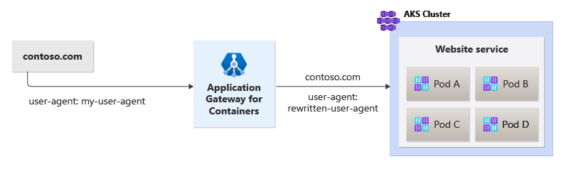

# Header rewrite for Azure Application Gateway for Containers - Ingress API (preview)

Application Gateway for Containers allows you to rewrite HTTP headers of client requests and responses from backend targets.

## Usage details

Header rewrites take advantage of Application Gateway for Container's IngressExtension custom resource.

## Background
Header rewrites enable you to modify the request and response headers to and from your backend targets.

The following figure illustrates an example of a request with a specific user agent being rewritten to a simplified value called `rewritten-user-agent` when the request is initiated to the backend target by Application Gateway for Containers:

[  ](./media/how-to-header-rewrite-ingress-api/header-rewrite.png#lightbox)

## Prerequisites

> [!IMPORTANT]
> Application Gateway for Containers is currently in PREVIEW.<br>
> See the [Supplemental Terms of Use for Microsoft Azure Previews](https://azure.microsoft.com/support/legal/preview-supplemental-terms/) for legal terms that apply to Azure features that are in beta, preview, or otherwise not yet released into general availability.

1. If following the BYO deployment strategy, ensure you have set up your Application Gateway for Containers resources and [ALB Controller](quickstart-deploy-application-gateway-for-containers-alb-controller.md)
2. If following the ALB managed deployment strategy, ensure you have provisioned your [ALB Controller](quickstart-deploy-application-gateway-for-containers-alb-controller.md) and provisioned the Application Gateway for Containers resources via the  [ApplicationLoadBalancer custom resource](quickstart-create-application-gateway-for-containers-managed-by-alb-controller.md).
3. Deploy sample HTTP application
  Apply the following deployment.yaml file on your cluster to create a sample web application to demonstrate the header rewrite.  
  ```bash
  kubectl apply -f https://trafficcontrollerdocs.blob.core.windows.net/examples/traffic-split-scenario/deployment.yaml
  ```
  
  This command creates the following on your cluster:
  - a namespace called `test-infra`
  - two services called `backend-v1` and `backend-v2` in the `test-infra` namespace
  - two deployments called `backend-v1` and `backend-v2` in the `test-infra` namespace

## Deploy the required Gateway API resources

# [ALB managed deployment](#tab/alb-managed)

Create an Ingress resource to listen for requests to `contoso.com`:

```bash
kubectl apply -f - <<EOF
apiVersion: networking.k8s.io/v1
kind: Ingress
metadata:
  name: ingress-01
  namespace: test-infra
  annotations:
    alb.networking.azure.io/alb-name: alb-test
    alb.networking.azure.io/alb-namespace: alb-test-infra
    alb.networking.azure.io/alb-ingress-extension: header-rewrite
spec:
  ingressClassName: azure-alb-external
  rules:
    - host: contoso.com
      http:
        paths:
          - path: /
            pathType: Prefix
            backend:
              service:
                name: backend-v1
                port:
                  number: 8080
EOF
```

[!INCLUDE [application-gateway-for-containers-frontend-naming](../../../includes/application-gateway-for-containers-frontend-naming.md)]

# [Bring your own (BYO) deployment](#tab/byo)
1. Set the following environment variables

```bash
RESOURCE_GROUP='<resource group name of the Application Gateway For Containers resource>'
RESOURCE_NAME='alb-test'

RESOURCE_ID=$(az network alb show --resource-group $RESOURCE_GROUP --name $RESOURCE_NAME --query id -o tsv)
FRONTEND_NAME='frontend'
```

2. Create an Ingress resource to listen for requests to `contoso.com`
```bash
kubectl apply -f - <<EOF
apiVersion: networking.k8s.io/v1
kind: Ingress
metadata:
  name: ingress-01
  namespace: test-infra
  annotations:
    alb.networking.azure.io/alb-id: $RESOURCE_ID
    alb.networking.azure.io/alb-frontend: $FRONTEND_NAME
    alb.networking.azure.io/alb-ingress-extension: header-rewrite
spec:
  ingressClassName: azure-alb-external
  rules:
    - host: contoso.com
      http:
        paths:
          - path: /
            pathType: Prefix
            backend:
              service:
                name: backend-v1
                port:
                  number: 8080
EOF
```

---

Once the ingress resource is created, ensure the status shows the hostname of your load balancer and that both ports are listening for requests.

```bash
kubectl get ingress ingress-01 -n test-infra -o yaml
```

Example output of successful Ingress creation.

```yaml
apiVersion: networking.k8s.io/v1
kind: Ingress
metadata:
  annotations:
    alb.networking.azure.io/alb-frontend: FRONTEND_NAME
    alb.networking.azure.io/alb-id: /subscriptions/xxxxxxxx-xxxx-xxxx-xxxx-xxxxxxxxxxxx/resourcegroups/yyyyyyyy/providers/Microsoft.ServiceNetworking/trafficControllers/zzzzzz
    kubectl.kubernetes.io/last-applied-configuration: |
      {"apiVersion":"networking.k8s.io/v1","kind":"Ingress","metadata":{"annotations":{"alb.networking.azure.io/alb-frontend":"FRONTEND_NAME","alb.networking.azure.io/alb-id":"/subscriptions/xxxxxxxx-xxxx-xxxx-xxxx-xxxxxxxxxxxx/resourcegroups/yyyyyyyy/providers/Microsoft.ServiceNetworking/trafficControllers/zzzzzz", "alb.networking.azure.io/alb-ingress-extension":"header-rewrite"},"name"
:"ingress-01","namespace":"test-infra"},"spec":{"ingressClassName":"azure-alb-external","rules":[{"host":"contoso.com","http":{"paths":[{"backend":{"service":{"name":"backend-v1","port":{"number":8080}}},"path":"/","pathType":"Prefix"}]}}]}}
  creationTimestamp: "2023-07-22T18:02:13Z"
  generation: 2
  name: ingress-01
  namespace: test-infra
  resourceVersion: "278238"
  uid: 17c34774-1d92-413e-85ec-c5a8da45989d
spec:
  ingressClassName: azure-alb-external
  rules:
    - host: contoso.com
      http:
        paths:
          - path: /
            pathType: Prefix
            backend:
              service:
                name: backend-v1
                port:
                  number: 8080
status:
  loadBalancer:
    ingress:
    - hostname: xxxxxxxxxxxxxxxxxxxxxxxxxxxxxxxx.fzyy.alb.azure.com
      ports:
      - port: 80
        protocol: TCP
```


Once the Ingress is created, next we need to define an IngressExtension with the header rewrite rules.

In this example, we set a static user-agent with a value of `rewritten-user-agent`. 

This example also demonstrates addition of a new header called `AGC-Header-Add` with a value of `agc-value` and removes a request header called `client-custom-header`.

> [!TIP]
> For this example, while we can use the HTTPHeaderMatch of "Exact" for a string match, a demonstration is used in regular expression for illistration of further capabilities.

```bash
kubectl apply -f - <<EOF
apiVersion: alb.networking.azure.io/v1
kind: IngressExtension
metadata:
  name: header-rewrite
  namespace: test-infra
spec:
  rules:
    - host: contoso.com
      rewrites:
        - type: RequestHeaderModifier
          requestHeaderModifier:
            set:
              - name: "user-agent"
                value: "rewritten-user-agent"
            add:
              - name: "AGC-Header-Add"
                value: "agc-value"
            remove:
              - "client-custom-header"
EOF
```

Once the HTTPRoute resource is created, ensure the route has been _Accepted_ and the Application Gateway for Containers resource has been _Programmed_.
```bash
kubectl get IngressExtension header-rewrite -n test-infra -o yaml
```

Verify the status of the Application Gateway for Containers resource has been successfully updated.

## Test access to the application

Now we're ready to send some traffic to our sample application, via the FQDN assigned to the frontend. Use the following command to get the FQDN.

```bash
fqdn=$(kubectl get ingress ingress-01 -n test-infra -o jsonpath='{.status.loadBalancer.ingress[0].hostname}')
```

If you specify the server name indicator using the curl command, `contoso.com` for the frontend FQDN, a response from the backend-v1 service is returned.

```bash
fqdnIp=$(dig +short $fqdn)
curl -k --resolve contoso.com:80:$fqdnIp http://contoso.com
```

Via the response we should see:
```json
{
 "path": "/",
 "host": "contoso.com",
 "method": "GET",
 "proto": "HTTP/1.1",
 "headers": {
  "Accept": [
   "*/*"
  ],
  "User-Agent": [
   "curl/7.81.0"
  ],
  "X-Forwarded-For": [
   "xxx.xxx.xxx.xxx"
  ],
  "X-Forwarded-Proto": [
   "http"
  ],
  "X-Request-Id": [
   "dcd4bcad-ea43-4fb6-948e-a906380dcd6d"
  ]
 },
 "namespace": "test-infra",
 "ingress": "",
 "service": "",
 "pod": "backend-v1-5b8fd96959-f59mm"
}
```

Specifying a user-agent header with the value `my-user-agent` should return a response from the backend service of `rewritten-user-agent`:

```bash
fqdnIp=$(dig +short $fqdn)
curl -k --resolve contoso.com:80:$fqdnIp http://contoso.com -H "user-agent: my-user-agent"
```

Via the response we should see:
```json
{
 "path": "/",
 "host": "fabrikam.com",
 "method": "GET",
 "proto": "HTTP/1.1",
 "headers": {
  "Accept": [
   "*/*"
  ],
  "User-Agent": [
   "curl/7.81.0"
  ],
  "X-Forwarded-For": [
   "xxx.xxx.xxx.xxx"
  ],
  "X-Forwarded-Proto": [
   "http"
  ],
  "X-Request-Id": [
   "adae8cc1-8030-4d95-9e05-237dd4e3941b"
  ]
 },
 "namespace": "test-infra",
 "ingress": "",
 "service": "",
 "pod": "backend-v1-5b8fd96959-f59mm"
}
```

Specifying a `client-custom-header` header with the value `moo` should be stripped from the request when AGC initiates the connection to the backend service:

```bash
fqdnIp=$(dig +short $fqdn)
curl -k --resolve contoso.com:80:$fqdnIp http://contoso.com -H "client-custom-header: moo"
```

Via the response we should see:
```json
{
 "path": "/",
 "host": "fabrikam.com",
 "method": "GET",
 "proto": "HTTP/1.1",
 "headers": {
  "Accept": [
   "*/*"
  ],
  "User-Agent": [
   "curl/7.81.0"
  ],
  "X-Forwarded-For": [
   "xxx.xxx.xxx.xxx"
  ],
  "X-Forwarded-Proto": [
   "http"
  ],
  "X-Request-Id": [
   "kd83nc84-4325-5d22-3d23-237dd4e3941b"
  ]
 },
 "namespace": "test-infra",
 "ingress": "",
 "service": "",
 "pod": "backend-v1-5b8fd96959-f59mm"
}
```

Congratulations, you have installed ALB Controller, deployed a backend application and modified header values via Gateway API on Application Gateway for Containers.
