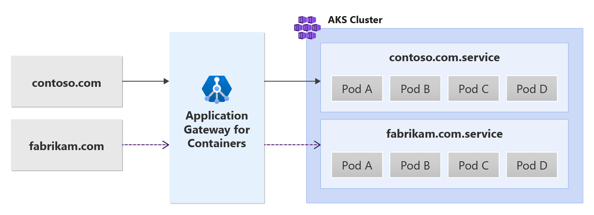

# Multiple site hosting with Application Gateway for Containers - Gateway API (preview)

This document helps you set up an example application that uses the resources from Gateway API to demonstrate hosting multiple sites on the same Kubernetes Gateway resource / Application Gateway for Containers frontend. Steps are provided to:
- Create a [Gateway](https://gateway-api.sigs.k8s.io/concepts/api-overview/#gateway) resource with one HTTP listener.
- Create two [HTTPRoute](https://gateway-api.sigs.k8s.io/v1alpha2/api-types/httproute/) resources that each reference a unique backend service.

## Background

Application Gateway for Containers enables multi-site hosting by allowing you to configure more than one web application on the same port. Two or more unique sites can be hosted using unique backend services. See the following example scenario:



## Prerequisites

> [!IMPORTANT]
> Application Gateway for Containers is currently in PREVIEW.<br>
> See the [Supplemental Terms of Use for Microsoft Azure Previews](https://azure.microsoft.com/support/legal/preview-supplemental-terms/) for legal terms that apply to Azure features that are in beta, preview, or otherwise not yet released into general availability.

1. If you follow the BYO deployment strategy, ensure you set up your Application Gateway for Containers resources and [ALB Controller](quickstart-deploy-application-gateway-for-containers-alb-controller.md)
2. If you follow the ALB managed deployment strategy, ensure provisioning of your [ALB Controller](quickstart-deploy-application-gateway-for-containers-alb-controller.md) and the Application Gateway for Containers resources via the [ApplicationLoadBalancer custom resource](quickstart-create-application-gateway-for-containers-managed-by-alb-controller.md).
3. Deploy sample HTTP application
  Apply the following deployment.yaml file on your cluster to create a sample web application to demonstrate path, query, and header based routing.  
  ```bash
  kubectl apply -f https://trafficcontrollerdocs.blob.core.windows.net/examples/traffic-split-scenario/deployment.yaml
  ```
  
  This command creates the following on your cluster:
  - a namespace called `test-infra`
  - two services called `backend-v1` and `backend-v2` in the `test-infra` namespace
  - two deployments called `backend-v1` and `backend-v2` in the `test-infra` namespace

## Deploy the required Gateway API resources

# [ALB managed deployment](#tab/alb-managed)

1. Create a Gateway
```bash
kubectl apply -f - <<EOF
apiVersion: gateway.networking.k8s.io/v1beta1
kind: Gateway
metadata:
  name: gateway-01
  namespace: test-infra
  annotations:
    alb.networking.azure.io/alb-namespace: alb-test-infra
    alb.networking.azure.io/alb-name: alb-test
spec:
  gatewayClassName: azure-alb-external
  listeners:
  - name: http-listener
    port: 80
    protocol: HTTP
    allowedRoutes:
      namespaces:
        from: Same
EOF
```

[!INCLUDE [application-gateway-for-containers-frontend-naming](../../../includes/application-gateway-for-containers-frontend-naming.md)]

# [Bring your own (BYO) deployment](#tab/byo)

1. Set the following environment variables

```bash
RESOURCE_GROUP='<resource group name of the Application Gateway For Containers resource>'
RESOURCE_NAME='alb-test'

RESOURCE_ID=$(az network alb show --resource-group $RESOURCE_GROUP --name $RESOURCE_NAME --query id -o tsv)
FRONTEND_NAME='frontend'
```

2. Create a Gateway
```bash
kubectl apply -f - <<EOF
apiVersion: gateway.networking.k8s.io/v1beta1
kind: Gateway
metadata:
  name: gateway-01
  namespace: test-infra
  annotations:
    alb.networking.azure.io/alb-id: $RESOURCE_ID
spec:
  gatewayClassName: azure-alb-external
  listeners:
  - name: http-listener
    port: 80
    protocol: HTTP
    allowedRoutes:
      namespaces:
        from: Same
  addresses:
  - type: alb.networking.azure.io/alb-frontend
    value: $FRONTEND_NAME
EOF
```

---

Once the gateway resource is created, ensure the status is valid, the listener is _Programmed_, and an address is assigned to the gateway.
```bash
kubectl get gateway gateway-01 -n test-infra -o yaml
```

Example output of successful gateway creation.
```yaml
status:
  addresses:
  - type: IPAddress
    value: xxxx.yyyy.alb.azure.com
  conditions:
  - lastTransitionTime: "2023-06-19T21:04:55Z"
    message: Valid Gateway
    observedGeneration: 1
    reason: Accepted
    status: "True"
    type: Accepted
  - lastTransitionTime: "2023-06-19T21:04:55Z"
    message: Application Gateway For Containers resource has been successfully updated.
    observedGeneration: 1
    reason: Programmed
    status: "True"
    type: Programmed
  listeners:
  - attachedRoutes: 0
    conditions:
    - lastTransitionTime: "2023-06-19T21:04:55Z"
      message: ""
      observedGeneration: 1
      reason: ResolvedRefs
      status: "True"
      type: ResolvedRefs
    - lastTransitionTime: "2023-06-19T21:04:55Z"
      message: Listener is accepted
      observedGeneration: 1
      reason: Accepted
      status: "True"
      type: Accepted
    - lastTransitionTime: "2023-06-19T21:04:55Z"
      message: Application Gateway For Containers resource has been successfully updated.
      observedGeneration: 1
      reason: Programmed
      status: "True"
      type: Programmed
    name: https-listener
    supportedKinds:
    - group: gateway.networking.k8s.io
      kind: HTTPRoute
```

Once the gateway is created, create two HTTPRoute resources for `contoso.com` and `fabrikam.com` domain names.  Each domain forwards traffic to a different backend service.
```bash
kubectl apply -f - <<EOF
apiVersion: gateway.networking.k8s.io/v1beta1
kind: HTTPRoute
metadata:
  name: contoso-route
  namespace: test-infra
spec:
  parentRefs:
  - name: gateway-01
  hostnames:
  - "contoso.com"
  rules:
  - backendRefs:
    - name: backend-v1
      port: 8080
---
apiVersion: gateway.networking.k8s.io/v1beta1
kind: HTTPRoute
metadata:
  name: fabrikam-route
  namespace: test-infra
spec:
  parentRefs:
  - name: gateway-01
  hostnames:
  - "fabrikam.com"
  rules:
  - backendRefs:
    - name: backend-v2
      port: 8080
EOF
```

Once the HTTPRoute resource is created, ensure both HTTPRoute resources show _Accepted_ and the Application Gateway for Containers resource is _Programmed_.
```bash
kubectl get httproute contoso-route -n test-infra -o yaml
kubectl get httproute fabrikam-route -n test-infra -o yaml
```

Verify the status of the Application Gateway for Containers resource is successfully updated for each HTTPRoute.

```yaml
status:
  parents:
  - conditions:
    - lastTransitionTime: "2023-06-19T22:18:23Z"
      message: ""
      observedGeneration: 1
      reason: ResolvedRefs
      status: "True"
      type: ResolvedRefs
    - lastTransitionTime: "2023-06-19T22:18:23Z"
      message: Route is Accepted
      observedGeneration: 1
      reason: Accepted
      status: "True"
      type: Accepted
    - lastTransitionTime: "2023-06-19T22:18:23Z"
      message: Application Gateway For Containers resource has been successfully updated.
      observedGeneration: 1
      reason: Programmed
      status: "True"
      type: Programmed
    controllerName: alb.networking.azure.io/alb-controller
    parentRef:
      group: gateway.networking.k8s.io
      kind: Gateway
      name: gateway-01
      namespace: test-infra
  ```

## Test access to the application

Now we're ready to send some traffic to our sample application, via the FQDN assigned to the frontend. Use the following command to get the FQDN.

```bash
fqdn=$(kubectl get gateway gateway-01 -n test-infra -o jsonpath='{.status.addresses[0].value}')
```

If you specify the server name indicator using the curl command, `contoso.com` for the frontend FQDN, it returns a response from the backend-v1 service.

```bash
fqdnIp=$(dig +short $fqdn)
curl -k --resolve contoso.com:80:$fqdnIp http://contoso.com
```

Via the response we should see:
```json
{
 "path": "/",
 "host": "contoso.com",
 "method": "GET",
 "proto": "HTTP/1.1",
 "headers": {
  "Accept": [
   "*/*"
  ],
  "User-Agent": [
   "curl/7.81.0"
  ],
  "X-Forwarded-For": [
   "xxx.xxx.xxx.xxx"
  ],
  "X-Forwarded-Proto": [
   "http"
  ],
  "X-Request-Id": [
   "dcd4bcad-ea43-4fb6-948e-a906380dcd6d"
  ]
 },
 "namespace": "test-infra",
 "ingress": "",
 "service": "",
 "pod": "backend-v1-5b8fd96959-f59mm"
}
```

If you specify the server name indicator using the curl command, `fabrikam.com` for the frontend FQDN, it returns a response from the backend-v1 service.

```bash
fqdnIp=$(dig +short $fqdn)
curl -k --resolve fabrikam.com:80:$fqdnIp http://fabrikam.com
```

Via the response we should see:
```json
{
 "path": "/",
 "host": "fabrikam.com",
 "method": "GET",
 "proto": "HTTP/1.1",
 "headers": {
  "Accept": [
   "*/*"
  ],
  "User-Agent": [
   "curl/7.81.0"
  ],
  "X-Forwarded-For": [
   "xxx.xxx.xxx.xxx"
  ],
  "X-Forwarded-Proto": [
   "http"
  ],
  "X-Request-Id": [
   "adae8cc1-8030-4d95-9e05-237dd4e3941b"
  ]
 },
 "namespace": "test-infra",
 "ingress": "",
 "service": "",
 "pod": "backend-v2-594bd59865-ppv9w"
}
```

Congratulations, you have installed ALB Controller, deployed a backend application and routed traffic to two different backend services via different hostnames via Gateway API on Application Gateway for Containers.
