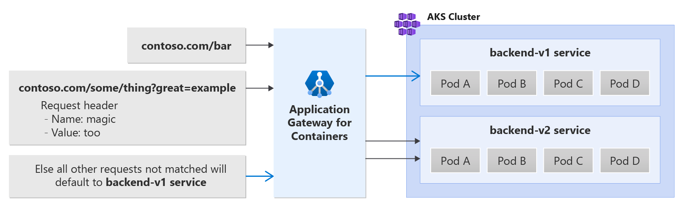

# Path, header, and query string routing with Application Gateway for Containers - Gateway API (preview)

This document helps you set up an example application that uses the resources from Gateway API to demonstrate traffic routing based on URL path, query string, and header. Steps are provided to:
- Create a [Gateway](https://gateway-api.sigs.k8s.io/concepts/api-overview/#gateway) resource with one HTTPS listener.
- Create an [HTTPRoute](https://gateway-api.sigs.k8s.io/v1alpha2/api-types/httproute/) resource that references a backend service.
- Use [HTTPRouteMatch](https://gateway-api.sigs.k8s.io/references/spec/#gateway.networking.k8s.io/v1beta1.HTTPRouteMatch) to perform `matches` that route based on path, header, and query string.

## Background

Application Gateway for Containers enables traffic routing based on URL path, query string, and header. See the following example scenario:



## Prerequisites

> [!IMPORTANT]
> Application Gateway for Containers is currently in PREVIEW.<br>
> See the [Supplemental Terms of Use for Microsoft Azure Previews](https://azure.microsoft.com/support/legal/preview-supplemental-terms/) for legal terms that apply to Azure features that are in beta, preview, or otherwise not yet released into general availability.

1. If following the BYO deployment strategy, ensure you have set up your Application Gateway for Containers resources and [ALB Controller](quickstart-deploy-application-gateway-for-containers-alb-controller.md)
2. If following the ALB managed deployment strategy, ensure you have provisioned your [ALB Controller](quickstart-deploy-application-gateway-for-containers-alb-controller.md) and provisioned the Application Gateway for Containers resources via the  [ApplicationLoadBalancer custom resource](quickstart-create-application-gateway-for-containers-managed-by-alb-controller.md).
3. Deploy sample HTTP application
  Apply the following deployment.yaml file on your cluster to create a sample web application to demonstrate path, query, and header based routing.  
  ```bash
  kubectl apply -f https://trafficcontrollerdocs.blob.core.windows.net/examples/traffic-split-scenario/deployment.yaml
  ```
  
  This command creates the following on your cluster:
  - a namespace called `test-infra`
  - 2 services called `backend-v1` and `backend-v2` in the `test-infra` namespace
  - 2 deployments called `backend-v1` and `backend-v2` in the `test-infra` namespace

## Deploy the required Gateway API resources

# [ALB managed deployment](#tab/alb-managed)

Create a gateway:

```bash
kubectl apply -f - <<EOF
apiVersion: gateway.networking.k8s.io/v1beta1
kind: Gateway
metadata:
  name: gateway-01
  namespace: test-infra
  annotations:
    alb.networking.azure.io/alb-namespace: alb-test-infra
    alb.networking.azure.io/alb-name: alb-test
spec:
  gatewayClassName: azure-alb-external
  listeners:
  - name: http-listener
    port: 80
    protocol: HTTP
    allowedRoutes:
      namespaces:
        from: Same
EOF
```

[!INCLUDE [application-gateway-for-containers-frontend-naming](../../../includes/application-gateway-for-containers-frontend-naming.md)]

# [Bring your own (BYO) deployment](#tab/byo)
1. Set the following environment variables

```bash
RESOURCE_GROUP='<resource group name of the Application Gateway For Containers resource>'
RESOURCE_NAME='alb-test'

RESOURCE_ID=$(az network alb show --resource-group $RESOURCE_GROUP --name $RESOURCE_NAME --query id -o tsv)
FRONTEND_NAME='frontend'
```

2. Create a Gateway
```bash
kubectl apply -f - <<EOF
apiVersion: gateway.networking.k8s.io/v1beta1
kind: Gateway
metadata:
  name: gateway-01
  namespace: test-infra
  annotations:
    alb.networking.azure.io/alb-id: $RESOURCE_ID
spec:
  gatewayClassName: azure-alb-external
  listeners:
  - name: http-listener
    port: 80
    protocol: HTTP
    allowedRoutes:
      namespaces:
        from: Same
  addresses:
  - type: alb.networking.azure.io/alb-frontend
    value: $FRONTEND_NAME
EOF
```

---

Once the gateway resource has been created, ensure the status is valid, the listener is _Programmed_, and an address is assigned to the gateway.
```bash
kubectl get gateway gateway-01 -n test-infra -o yaml
```

Example output of successful gateway creation.
```yaml
status:
  addresses:
  - type: IPAddress
    value: xxxx.yyyy.alb.azure.com
  conditions:
  - lastTransitionTime: "2023-06-19T21:04:55Z"
    message: Valid Gateway
    observedGeneration: 1
    reason: Accepted
    status: "True"
    type: Accepted
  - lastTransitionTime: "2023-06-19T21:04:55Z"
    message: Application Gateway For Containers resource has been successfully updated.
    observedGeneration: 1
    reason: Programmed
    status: "True"
    type: Programmed
  listeners:
  - attachedRoutes: 0
    conditions:
    - lastTransitionTime: "2023-06-19T21:04:55Z"
      message: ""
      observedGeneration: 1
      reason: ResolvedRefs
      status: "True"
      type: ResolvedRefs
    - lastTransitionTime: "2023-06-19T21:04:55Z"
      message: Listener is accepted
      observedGeneration: 1
      reason: Accepted
      status: "True"
      type: Accepted
    - lastTransitionTime: "2023-06-19T21:04:55Z"
      message: Application Gateway For Containers resource has been successfully updated.
      observedGeneration: 1
      reason: Programmed
      status: "True"
      type: Programmed
    name: https-listener
    supportedKinds:
    - group: gateway.networking.k8s.io
      kind: HTTPRoute
```

Once the gateway has been created, create an HTTPRoute to define two different matches and a default service to route traffic to.

The way the following rules read are as follows:
1) If the path is **/bar**, traffic is routed to backend-v2 service on port 8080 OR
2) If the request contains an HTTP header with the name **magic** and the value **foo**, the URL contains a query string defining the name great with a value of example, AND the path is **/some/thing**, the request is sent to backend-v2 on port 8080.
3) Otherwise, all other requests are routed to backend-v1 service on port 8080.

```bash
kubectl apply -f - <<EOF
apiVersion: gateway.networking.k8s.io/v1beta1
kind: HTTPRoute
metadata:
  name: http-route
  namespace: test-infra
spec:
  parentRefs:
  - name: gateway-01
    namespace: test-infra
  rules:
  - matches:
    - path:
        type: PathPrefix
        value: /bar
    backendRefs:
    - name: backend-v2
      port: 8080
  - matches:
    - headers:
      - type: Exact
        name: magic
        value: foo
      queryParams:
      - type: Exact
        name: great
        value: example
      path:
        type: PathPrefix
        value: /some/thing
      method: GET
    backendRefs:
    - name: backend-v2
      port: 8080
  - backendRefs:
    - name: backend-v1
      port: 8080
EOF
```

Once the HTTPRoute resource has been created, ensure the route has been _Accepted_ and the Application Gateway for Containers resource has been _Programmed_.
```bash
kubectl get httproute http-route -n test-infra -o yaml
```

Verify the status of the Application Gateway for Containers resource has been successfully updated.

```yaml
status:
  parents:
  - conditions:
    - lastTransitionTime: "2023-06-19T22:18:23Z"
      message: ""
      observedGeneration: 1
      reason: ResolvedRefs
      status: "True"
      type: ResolvedRefs
    - lastTransitionTime: "2023-06-19T22:18:23Z"
      message: Route is Accepted
      observedGeneration: 1
      reason: Accepted
      status: "True"
      type: Accepted
    - lastTransitionTime: "2023-06-19T22:18:23Z"
      message: Application Gateway For Containers resource has been successfully updated.
      observedGeneration: 1
      reason: Programmed
      status: "True"
      type: Programmed
    controllerName: alb.networking.azure.io/alb-controller
    parentRef:
      group: gateway.networking.k8s.io
      kind: Gateway
      name: gateway-01
      namespace: test-infra
  ```

## Test access to the application

Now we're ready to send some traffic to our sample application, via the FQDN assigned to the frontend. Use the following command to get the FQDN.

```bash
fqdn=$(kubectl get gateway gateway-01 -n test-infra -o jsonpath='{.status.addresses[0].value}')
```

By using the curl command, we can validate three different scenarios:

### Path based routing
In this scenario, the client request sent to http://frontend-fqdn/bar is routed to backend-v2 service.

Run the following command:
```bash
curl http://$fqdn/bar
```

Notice the container serving the request is backend-v2.

### Query string + header + path routing
In this scenario, the client request sent to http://frontend-fqdn/some/thing?great=example with a header key/value part of "magic: foo" is routed to backend-v2 service.

Run the following command:
```bash
curl http://$fqdn/some/thing?great=example -H "magic: foo"
```

Notice the container serving the request is backend-v2.

### Default route
If neither of the first two scenarios are satisfied, Application Gateway for Containers routes all other requests to the backend-v1 service.

Run the following command:
```bash
curl http://$fqdn/
```

Notice the container serving the request is backend-v1.

Congratulations, you have installed ALB Controller, deployed a backend application and routed traffic to the application via Gateway API on Application Gateway for Containers.