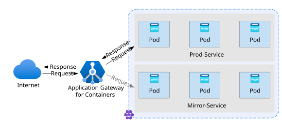

# Request mirroring with Application Gateway for Containers – Gateway API

This article shows how to set up request mirroring by using Gateway API with Application Gateway for Containers. Request mirroring allows you to forward a copy of production traffic to a secondary service for testing, debugging, or validation without impacting the primary response path. With request mirroring, mirrored traffic is shadow traffic; the client will always receive the primary response.



In this guide, you:

- Deploy a sample application  
- Create a `Gateway` resource with an HTTP listener  
- Create an `HTTPRoute` with a **primary backend** and a secondary backend to receive mirrored traffic  
- Validate mirrored traffic is received by a secondary backend service

## Prerequisites

1. If you're following the BYO deployment strategy, ensure you set up your Application Gateway for Containers resources and [ALB Controller](quickstart-deploy-application-gateway-for-containers-alb-controller.md).
2. If you're following the ALB managed deployment strategy, ensure you provisioned your [ALB Controller](quickstart-deploy-application-gateway-for-containers-alb-controller.md) and provisioned the Application Gateway for Containers resources by using the  [ApplicationLoadBalancer custom resource](quickstart-create-application-gateway-for-containers-managed-by-alb-controller.md).
3. Deploy a sample HTTP application:<br>
  Apply the following deployment.yaml file on your cluster to create a sample web application that contains two backend services.

    ```bash
    kubectl apply -f https://raw.githubusercontent.com/MicrosoftDocs/azure-docs/refs/heads/main/articles/application-gateway/for-containers/examples/traffic-split-scenario/deployment.yaml
    ```
  
 This command creates the following resources on your cluster:

   - A namespace called `test-infra`
   - Two services called `backend-v1` and `backend-v2` in the `test-infra` namespace
   - Two deployments called `backend-v1` and `backend-v2` in the `test-infra` namespace

## Deploy the required Gateway API resources

# [ALB managed deployment](#tab/alb-managed)

Create a `Gateway` resource.

```bash
kubectl apply -f - <<EOF
apiVersion: gateway.networking.k8s.io/v1
kind: Gateway
metadata:
  name: gateway-01
  namespace: test-infra
  annotations:
    alb.networking.azure.io/alb-namespace: alb-test-infra
    alb.networking.azure.io/alb-name: alb-test
spec:
  gatewayClassName: azure-alb-external
  listeners:
  - name: http-listener
    port: 80
    protocol: HTTP
    allowedRoutes:
      namespaces:
        from: Same
EOF
```

[!INCLUDE [application-gateway-for-containers-frontend-naming](../../../includes/application-gateway-for-containers-frontend-naming.md)]

# [Bring your own (BYO) deployment](#tab/byo)

1. Set the environment variables.

```bash
RESOURCE_GROUP='<resource group name of the Application Gateway For Containers resource>'
RESOURCE_NAME='alb-test'

RESOURCE_ID=$(az network alb show --resource-group $RESOURCE_GROUP --name $RESOURCE_NAME --query id -o tsv)
FRONTEND_NAME='frontend'
```

2. Create a `Gateway` resource.

```bash
kubectl apply -f - <<EOF
apiVersion: gateway.networking.k8s.io/v1
kind: Gateway
metadata:
  name: gateway-01
  namespace: test-infra
  annotations:
    alb.networking.azure.io/alb-id: $RESOURCE_ID
spec:
  gatewayClassName: azure-alb-external
  listeners:
  - name: http-listener
    port: 80
    protocol: HTTP
    allowedRoutes:
      namespaces:
        from: Same
  addresses:
  - type: alb.networking.azure.io/alb-frontend
    value: $FRONTEND_NAME
EOF
```

---

After you create the gateway resource, check that the status is valid, the listener is _Programmed_, and the gateway has an assigned address.

```bash
kubectl get gateway gateway-01 -n test-infra -o yaml
```

Example output of successful gateway creation.

```yaml
status:
  addresses:
  - type: IPAddress
    value: xxxx.yyyy.alb.azure.com
  conditions:
  - lastTransitionTime: "2023-06-19T21:04:55Z"
    message: Valid Gateway
    observedGeneration: 1
    reason: Accepted
    status: "True"
    type: Accepted
  - lastTransitionTime: "2023-06-19T21:04:55Z"
    message: Application Gateway For Containers resource has been successfully updated.
    observedGeneration: 1
    reason: Programmed
    status: "True"
    type: Programmed
  listeners:
  - attachedRoutes: 0
    conditions:
    - lastTransitionTime: "2023-06-19T21:04:55Z"
      message: ""
      observedGeneration: 1
      reason: ResolvedRefs
      status: "True"
      type: ResolvedRefs
    - lastTransitionTime: "2023-06-19T21:04:55Z"
      message: Listener is accepted
      observedGeneration: 1
      reason: Accepted
      status: "True"
      type: Accepted
    - lastTransitionTime: "2023-06-19T21:04:55Z"
      message: Application Gateway For Containers resource has been successfully updated.
      observedGeneration: 1
      reason: Programmed
      status: "True"
      type: Programmed
    name: https-listener
    supportedKinds:
    - group: gateway.networking.k8s.io
      kind: HTTPRoute
```

## Configure an HTTPRoute with request mirroring

Gateway API defines request mirroring through the `filters` section of an `HTTPRouteRule`, using the [RequestMirror](https://gateway-api.sigs.k8s.io/guides/user-guides/http-request-mirroring/) filter type.

The following examples send all traffic to the `backend-v1` service and forward a mirrored copy to the `backend-v2` service. By default, 100% of traffic is mirrored to the defined service. To mirror a subset of traffic, define either a fraction or percentage of traffic.

# [All requests](#tab/all-requests)

```bash
kubectl apply -f - <<EOF
apiVersion: gateway.networking.k8s.io/v1
kind: HTTPRoute
metadata:
  name: request-mirroring-route
  namespace: test-infra
spec:
  parentRefs:
  - name: gateway-01
  rules:
  - backendRefs:
    - name: backend-v1
      port: 8080
      weight: 1
    filters:
    - type: RequestMirror
      requestMirror:
        backendRef:
          name: backend-v2
          port: 8080
EOF
```

# [Percent of requests](#tab/percent-requests)

```bash
kubectl apply -f - <<EOF
apiVersion: gateway.networking.k8s.io/v1
kind: HTTPRoute
metadata:
  name: request-mirroring-route
  namespace: test-infra
spec:
  parentRefs:
  - name: gateway-01
  rules:
  - backendRefs:
    - name: backend-v1
      port: 8080
      weight: 1
    filters:
    - type: RequestMirror
      requestMirror:
        backendRef:
          name: backend-v2
          port: 8080
        percent: 10
EOF
```

# [Fraction of requests](#tab/fraction-requests)

```bash
kubectl apply -f - <<EOF
apiVersion: gateway.networking.k8s.io/v1
kind: HTTPRoute
metadata:
  name: request-mirroring-route
  namespace: test-infra
spec:
  parentRefs:
  - name: gateway-01
  rules:
  - backendRefs:
    - name: backend-v1
      port: 8080
      weight: 1
    filters:
    - type: RequestMirror
      requestMirror:
        backendRef:
          name: backend-v2
          port: 8080
        fraction:
          numerator: 5
          denominator: 1000
EOF
```

---

>[!NOTE]
>Gateway API prohibits both percent and fraction being specified on the same rule. Only one option can be specified for a given rule.

After you create the HTTPRoute resource, check that the route is _Accepted_ and the Application Gateway for Containers resource is _Programmed_.

```bash
kubectl get httproute request-mirroring-route -n test-infra -o yaml
```

Verify that the status of the Application Gateway for Containers resource is updated.

```yaml
status:
  parents:
  - conditions:
    - lastTransitionTime: "2023-06-19T22:18:23Z"
      message: ""
      observedGeneration: 1
      reason: ResolvedRefs
      status: "True"
      type: ResolvedRefs
    - lastTransitionTime: "2023-06-19T22:18:23Z"
      message: Route is Accepted
      observedGeneration: 1
      reason: Accepted
      status: "True"
      type: Accepted
    - lastTransitionTime: "2023-06-19T22:18:23Z"
      message: Application Gateway For Containers resource has been successfully updated.
      observedGeneration: 1
      reason: Programmed
      status: "True"
      type: Programmed
    controllerName: alb.networking.azure.io/alb-controller
    parentRef:
      group: gateway.networking.k8s.io
      kind: Gateway
      name: gateway-01
      namespace: test-infra
  ```

## Validate request mirroring

### Retrieve the public IP of the AGC frontend

Now you can send traffic to your sample application through the FQDN assigned to the frontend. Use the following command to get the FQDN:

```bash
fqdn=$(kubectl get gateway gateway-01 -n test-infra -o jsonpath='{.status.addresses[0].value}')
```

Curling this FQDN returns responses from the backend pods of the service configured on the HTTPRoute.

```bash
watch -n 1 curl http://$fqdn
```

In the response you should see:

```json
{
 "path": "/",
 "host": "fabrikam.com",
 "method": "GET",
 "proto": "HTTP/1.1",
 "headers": {
  "Accept": [
   "*/*"
  ],
  "User-Agent": [
   "curl/7.81.0"
  ],
  "X-Forwarded-For": [
   "xxx.xxx.xxx.xxx"
  ],
  "X-Forwarded-Proto": [
   "http"
  ],
  "X-Request-Id": [
   "kd83nc84-4325-5d22-3d23-237dd4e3941b"
  ]
 },
 "namespace": "test-infra",
 "ingress": "",
 "service": "",
 "pod": "backend-v1-5b8fd96959-f59mm"
}
```

### Inspect traffic on the mirrored backend

You can verify mirrored requests by checking logs on pods behind the `backend-v2` service:

```bash
kubectl logs -l app=backend-v2 -n test-infra --tail=20
```

Congratulations, you installed ALB Controller, deployed a backend application, and mirrored traffic to a secondary backend application by using Gateway API on Application Gateway for Containers.
