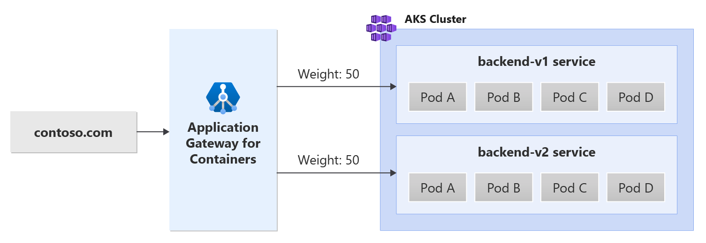

# Traffic splitting with Application Gateway for Containers - Gateway API

This document helps set up an example application that uses the following resources from Gateway API:
- [Gateway](https://gateway-api.sigs.k8s.io/concepts/api-overview/#gateway) - creating a gateway with one http listener
- [HTTPRoute](https://gateway-api.sigs.k8s.io/api-types/httproute/) - creating an HTTP route that references two backend services having different weights

## Background

Application Gateway for Containers enables you to set weights and shift traffic between different backend targets. See the following example scenario:



## Prerequisites

1. If following the BYO deployment strategy, ensure you set up your Application Gateway for Containers resources and [ALB Controller](quickstart-deploy-application-gateway-for-containers-alb-controller.md).
2. If following the ALB managed deployment strategy, ensure you have provisioned your [ALB Controller](quickstart-deploy-application-gateway-for-containers-alb-controller.md) and provisioned the Application Gateway for Containers resources via the  [ApplicationLoadBalancer custom resource](quickstart-create-application-gateway-for-containers-managed-by-alb-controller.md).
3. Deploy sample HTTP application:<br>
  Apply the following deployment.yaml file on your cluster to create a sample web application to demonstrate traffic splitting / weighted round robin support.

    ```bash
    kubectl apply -f https://trafficcontrollerdocs.blob.core.windows.net/examples/traffic-split-scenario/deployment.yaml
    ```
  
   This command creates the following on your cluster:

   - A namespace called `test-infra`
   - Two services called `backend-v1` and `backend-v2` in the `test-infra` namespace
   - Two deployments called `backend-v1` and `backend-v2` in the `test-infra` namespace

## Deploy the required Gateway API resources

# [ALB managed deployment](#tab/alb-managed)

Create a gateway:

```bash
kubectl apply -f - <<EOF
apiVersion: gateway.networking.k8s.io/v1
kind: Gateway
metadata:
  name: gateway-01
  namespace: test-infra
  annotations:
    alb.networking.azure.io/alb-namespace: alb-test-infra
    alb.networking.azure.io/alb-name: alb-test
spec:
  gatewayClassName: azure-alb-external
  listeners:
  - name: http
    port: 80
    protocol: HTTP
    allowedRoutes:
      namespaces:
        from: Same
EOF
```

[!INCLUDE [application-gateway-for-containers-frontend-naming](../../../includes/application-gateway-for-containers-frontend-naming.md)]

# [Bring your own (BYO) deployment](#tab/byo)

1. Set the following environment variables

    ```bash
    RESOURCE_GROUP='<resource group name of the Application Gateway For Containers resource>'
    RESOURCE_NAME='alb-test'

    RESOURCE_ID=$(az network alb show --resource-group $RESOURCE_GROUP --name $RESOURCE_NAME --query id -o tsv)
    FRONTEND_NAME='frontend'
    ```

2. Create a Gateway

    ```bash
    kubectl apply -f - <<EOF
    apiVersion: gateway.networking.k8s.io/v1
    kind: Gateway
    metadata:
      name: gateway-01
      namespace: test-infra
      annotations:
        alb.networking.azure.io/alb-id: $RESOURCE_ID
    spec:
      gatewayClassName: azure-alb-external
      listeners:
      - name: http
        port: 80
        protocol: HTTP
        allowedRoutes:
          namespaces:
            from: Same
      addresses:
      - type: alb.networking.azure.io/alb-frontend
        value: $FRONTEND_NAME
    EOF
    ```

---

Once the gateway resource is created, ensure the status is valid, the listener is _Programmed_, and an address is assigned to the gateway.

```bash
kubectl get gateway gateway-01 -n test-infra -o yaml
```

Example output of successful gateway creation.

```yaml
status:
  addresses:
  - type: Hostname
    value: xxxx.yyyy.alb.azure.com
  conditions:
  - lastTransitionTime: "2023-06-19T21:04:55Z"
    message: Valid Gateway
    observedGeneration: 1
    reason: Accepted
    status: "True"
    type: Accepted
  - lastTransitionTime: "2023-06-19T21:04:55Z"
    message: Application Gateway For Containers resource has been successfully updated.
    observedGeneration: 1
    reason: Programmed
    status: "True"
    type: Programmed
  listeners:
  - attachedRoutes: 0
    conditions:
    - lastTransitionTime: "2023-06-19T21:04:55Z"
      message: ""
      observedGeneration: 1
      reason: ResolvedRefs
      status: "True"
      type: ResolvedRefs
    - lastTransitionTime: "2023-06-19T21:04:55Z"
      message: Listener is accepted
      observedGeneration: 1
      reason: Accepted
      status: "True"
      type: Accepted
    - lastTransitionTime: "2023-06-19T21:04:55Z"
      message: Application Gateway For Containers resource has been successfully updated.
      observedGeneration: 1
      reason: Programmed
      status: "True"
      type: Programmed
    name: gateway-01-http
    supportedKinds:
    - group: gateway.networking.k8s.io
      kind: HTTPRoute
```

Once the gateway is created, create an HTTPRoute

```bash
kubectl apply -f - <<EOF
apiVersion: gateway.networking.k8s.io/v1
kind: HTTPRoute
metadata:
  name: traffic-split-route
  namespace: test-infra
spec:
  parentRefs:
  - name: gateway-01
  rules:
  - backendRefs:
    - name: backend-v1
      port: 8080
      weight: 50
    - name: backend-v2
      port: 8080
      weight: 50
EOF
```

Once the HTTPRoute resource is created, ensure the route is _Accepted_ and the Application Gateway for Containers resource is _Programmed_.

```bash
kubectl get httproute traffic-split-route -n test-infra -o yaml
```

Verify the status of the Application Gateway for Containers resource has been successfully updated.

```yaml
status:
  parents:
  - conditions:
    - lastTransitionTime: "2023-06-19T22:18:23Z"
      message: ""
      observedGeneration: 1
      reason: ResolvedRefs
      status: "True"
      type: ResolvedRefs
    - lastTransitionTime: "2023-06-19T22:18:23Z"
      message: Route is Accepted
      observedGeneration: 1
      reason: Accepted
      status: "True"
      type: Accepted
    - lastTransitionTime: "2023-06-19T22:18:23Z"
      message: Application Gateway For Containers resource has been successfully updated.
      observedGeneration: 1
      reason: Programmed
      status: "True"
      type: Programmed
    controllerName: alb.networking.azure.io/alb-controller
    parentRef:
      group: gateway.networking.k8s.io
      kind: Gateway
      name: gateway-01
      namespace: test-infra
  ```

## Test Access to the Application

Now we're ready to send some traffic to our sample application, via the FQDN assigned to the frontend. Use the following command to get the FQDN:

```bash
fqdn=$(kubectl get gateway gateway-01 -n test-infra -o jsonpath='{.status.addresses[0].value}')
```

Curling this FQDN should return responses from the backends/pods as configured on the HTTPRoute.

```bash
# this curl command will return 50% of the responses from backend-v1
# and the remaining 50% of the responses from backend-v2
watch -n 1 curl http://$fqdn
```

Congratulations, you have installed ALB Controller, deployed a backend application and routed traffic to the application via the ingress on Application Gateway for Containers.
