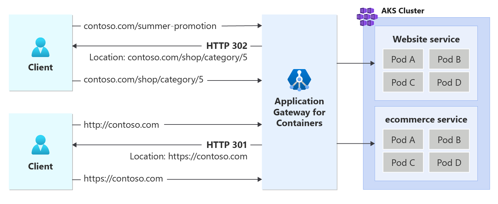

# URL Redirect for Azure Application Gateway for Containers - Ingress API

Application Gateway for Containers allows you to return a redirect response to the client based three aspects of a URL: protocol, hostname, and path. For each redirect, a defined HTTP status code may be returned to the client to define the nature of the redirect.

## Usage details

URL redirects take advantage of the [RequestRedirect rule filter](https://gateway-api.sigs.k8s.io/reference/spec/#gateway.networking.k8s.io/v1beta1.HTTPRequestRedirectFilter) as defined by Kubernetes Gateway API.

## Redirection

A redirect sets the response status code returned to clients to understand the purpose of the redirect. The following types of redirection are supported:

- 301 (Moved permanently): Indicates that the target resource is assigned a new permanent URI. Any future references to this resource use one of the enclosed URIs. Use 301 status code for HTTP to HTTPS redirection.
- 302 (Found): Indicates that the target resource is temporarily under a different URI. Since the redirection can change on occasion, the client should continue to use the effective request URI for future requests.

## Redirection capabilities

- Protocol redirection is commonly used to tell the client to move from an unencrypted traffic scheme to traffic, such as HTTP to HTTPS redirection.

- Hostname redirection matches the fully qualified domain name (fqdn) of the request. This is commonly observed in redirecting an old domain name to a new domain name; such as `contoso.com` to `fabrikam.com`.

- Path redirection has two different variants: `prefix` and `full`.
  - `Prefix` redirection type will redirect all requests starting with a defined value. For example, a prefix of /shop would match /shop and any text after. For example, /shop, /shop/checkout, and /shop/item-a would all redirect to /shop as well.
  - `Full` redirection type matches an exact value. For example, /shop could redirect to /store, but /shop/checkout wouldn't redirect to /store.

The following figure illustrates an example of a request destined for _contoso.com/summer-promotion_ being redirected to _contoso.com/shop/category/5_. In addition, a second request initiated to contoso.com via http protocol is returned a redirect to initiate a new connection to its https variant.

[  ](./media/how-to-url-redirect-ingress-api/url-redirect.png#lightbox)

## Prerequisites

1. If following the BYO deployment strategy, ensure you set up your Application Gateway for Containers resources and [ALB Controller](quickstart-deploy-application-gateway-for-containers-alb-controller.md).
2. If following the ALB managed deployment strategy, ensure you provision your [ALB Controller](quickstart-deploy-application-gateway-for-containers-alb-controller.md) and provision the Application Gateway for Containers resources via the  [ApplicationLoadBalancer custom resource](quickstart-create-application-gateway-for-containers-managed-by-alb-controller.md).
3. Deploy sample HTTP application:

    Apply the following deployment.yaml file on your cluster to deploy a sample TLS certificate to demonstrate redirect capabilities.
  
    ```bash
    kubectl apply -f kubectl apply -f https://trafficcontrollerdocs.blob.core.windows.net/examples/https-scenario/ssl-termination/deployment.yaml
    ```

    This command creates the following on your cluster:

    - a namespace called `test-infra`
    - one service called `echo` in the `test-infra` namespace
    - one deployment called `echo` in the `test-infra` namespace
    - one secret called `listener-tls-secret` in the `test-infra` namespace

## Deploy the required IngressExtension resources

1. Create an IngressExtension resource to handle HTTP to HTTPS redirect for `contoso.com`

    ```bash
    kubectl apply -f - <<EOF
    apiVersion: alb.networking.azure.io/v1
    kind: IngressExtension
    metadata:
      name: http-to-https
      namespace: test-infra
    spec:
      rules:
        - host: contoso.com
          requestRedirect:
            statusCode: 301
            scheme: https
    EOF
    ```

2. Create an IngressExtension resource to handle a path based redirect from `contoso.com/summer-promotion` to `contoso.com/shop/category/5`.

    ```bash
    kubectl apply -f - <<EOF
    apiVersion: alb.networking.azure.io/v1
    kind: IngressExtension
    metadata:
      name: summer-promotion-redirect
      namespace: test-infra
    spec:
      rules:
        - host: contoso.com
          requestRedirect:
            statusCode: 302
            path:
              type: ReplaceFullPath
              replaceFullPath: /shop/category/5
    EOF
    ```

## Deploy the required Ingress resources

# [ALB managed deployment](#tab/alb-managed)

1. Create the first Ingress resource to listen for HTTPS requests.

    ```bash
    kubectl apply -f - <<EOF
    apiVersion: networking.k8s.io/v1
    kind: Ingress
    metadata:
      name: ingress-https
      namespace: test-infra
      annotations:
        alb.networking.azure.io/alb-namespace: alb-test-infra
        alb.networking.azure.io/alb-name: alb-test
        alb.networking.azure.io/alb-frontend: ingress-fe
    spec:
      ingressClassName: azure-alb-external
      tls:
        - hosts:
            - contoso.com
          secretName: listener-tls-secret
      rules:
        - host: contoso.com
          http:
            paths:
              - path: /
                pathType: Prefix
                backend:
                  service:
                    name: echo
                    port:
                      number: 80
    EOF
    ```

2. Create the second Ingress resource to listen on port 80 and redirect to HTTPS.

    ```bash
    kubectl apply -f - <<EOF
    apiVersion: networking.k8s.io/v1
    kind: Ingress
    metadata:
      name: ingress-http
      namespace: test-infra
      annotations:
        alb.networking.azure.io/alb-namespace: alb-test-infra
        alb.networking.azure.io/alb-name: alb-test
        alb.networking.azure.io/alb-frontend: ingress-fe
        alb.networking.azure.io/alb-ingress-extension: http-to-https
    spec:
      ingressClassName: azure-alb-external
      rules:
        - host: contoso.com
          http:
            paths:
              - path: /
                pathType: Prefix
                backend:
                  service:
                    name: echo
                    port:
                      number: 80
    EOF
    ```

3. Create a third Ingress resource to listen on port 80 and 443 for `contoso.com/summer-promotion` and redirect to `contoso.com/shop/category/5`.

    ```bash
    kubectl apply -f - <<EOF
    apiVersion: networking.k8s.io/v1
    kind: Ingress
    metadata:
      name: ingress-summer-promotion-redirect
      namespace: test-infra
      annotations:
        alb.networking.azure.io/alb-namespace: alb-test-infra
        alb.networking.azure.io/alb-name: alb-test
        alb.networking.azure.io/alb-frontend: ingress-fe
        alb.networking.azure.io/alb-ingress-extension: summer-promotion-redirect
    spec:
      ingressClassName: azure-alb-external
      tls:
        - hosts:
            - contoso.com
          secretName: listener-tls-secret
      rules:
        - host: contoso.com
          http:
            paths:
              - path: /summer-promotion
                pathType: Prefix
                backend:
                  service:
                    name: ignored-for-redirect
                    port:
                      number: 80
    EOF
    ```

[!INCLUDE [application-gateway-for-containers-frontend-naming](../../../includes/application-gateway-for-containers-frontend-naming.md)]

# [Bring your own (BYO) deployment](#tab/byo)

1. Set the following environment variables

    ```bash
    RESOURCE_GROUP='<resource group name of the Application Gateway For Containers resource>'
    RESOURCE_NAME='alb-test'

    RESOURCE_ID=$(az network alb show --resource-group $RESOURCE_GROUP --name $RESOURCE_NAME --query id -o tsv)
    FRONTEND_NAME='frontend'
    ```

2. Create the first Ingress resource to listen for HTTPS requests.

    ```bash
    kubectl apply -f - <<EOF
    apiVersion: networking.k8s.io/v1
    kind: Ingress
    metadata:
      name: ingress-https
      namespace: test-infra
      annotations:
        alb.networking.azure.io/alb-id: $RESOURCE_ID
        alb.networking.azure.io/alb-frontend: $FRONTEND_NAME
    spec:
      ingressClassName: azure-alb-external
      tls:
        - hosts:
            - contoso.com
          secretName: listener-tls-secret
      rules:
        - host: contoso.com
          http:
            paths:
              - path: /
                pathType: Prefix
                backend:
                  service:
                    name: echo
                    port:
                      number: 80
    EOF
    ```

3. Create the second Ingress resource to listen on port 80 and redirect to HTTPS.

    ```bash
    kubectl apply -f - <<EOF
    apiVersion: networking.k8s.io/v1
    kind: Ingress
    metadata:
      name: ingress-http
      namespace: test-infra
      annotations:
        alb.networking.azure.io/alb-id: $RESOURCE_ID
        alb.networking.azure.io/alb-frontend: $FRONTEND_NAME
        alb.networking.azure.io/alb-ingress-extension: http-to-https
    spec:
      ingressClassName: azure-alb-external
      rules:
        - host: contoso.com
          http:
            paths:
              - path: /
                pathType: Prefix
                backend:
                  service:
                    name: echo
                    port:
                      number: 80
    EOF
    ```

4. Create a third Ingress resource to listen on port 80 and 443 for `contoso.com/summer-promotion` and redirect to `contoso.com/shop/category/5`.

    ```bash
    kubectl apply -f - <<EOF
    apiVersion: networking.k8s.io/v1
    kind: Ingress
    metadata:
      name: ingress-summer-promotion-redirect
      namespace: test-infra
      annotations:
        alb.networking.azure.io/alb-id: $RESOURCE_ID
        alb.networking.azure.io/alb-frontend: $FRONTEND_NAME
        alb.networking.azure.io/alb-ingress-extension: summer-promotion-redirect
    spec:
      ingressClassName: azure-alb-external
      tls:
        - hosts:
            - contoso.com
          secretName: listener-tls-secret
      rules:
        - host: contoso.com
          http:
            paths:
              - path: /summer-promotion
                pathType: Prefix
                backend:
                  service:
                    name: ignored-for-redirect
                    port:
                      number: 80
    EOF
    ```

---

For each Ingress resource, ensure the status is valid, the listener is _Programmed_, and an address is assigned to the ingress resource. For all three Ingress resources, you should see the same hostname in this example.

```bash
kubectl get ingress ingress-https -n test-infra -o yaml
```

Example output of successful Ingress creation.

```yaml
status:
  loadBalancer:
    ingress:
    - hostname: xxxxxxxxxxxxxxxxxxxxxxxxxxxxxxxx.fzyy.alb.azure.com
      ports:
      - port: 443
        protocol: TCP
```

## Test access to the application

Now we're ready to send some traffic to our sample application, via the FQDN assigned to the frontend. Use the following command to get the FQDN.

```bash
fqdn=$(kubectl get ingress ingress-http -n test-infra -o jsonpath='{.status.loadBalancer.ingress[0].hostname}')
```

When you specify the server name indicator using the curl command, `http://contoso.com` should return a response from the Application Gateway for Containers with a `location` header defining a 301 redirect to `https://contoso.com`.

```bash
fqdnIp=$(dig +short $fqdn)
curl -k --resolve contoso.com:80:$fqdnIp http://contoso.com/ -v
```

Via the response we should see:

```text
* Added contoso.com:80:xxx.xxx.xxx.xxx to DNS cache
* Hostname contoso.com was found in DNS cache
*   Trying xxx.xxx.xxx.xxx:80...
* Connected to contoso.com (xxx.xxx.xxx.xxx) port 80 (#0)
> GET / HTTP/1.1
> Host: contoso.com
> User-Agent: curl/7.81.0
> Accept: */*
>
* Mark bundle as not supporting multiuse
< HTTP/1.1 301 Moved Permanently
< location: https://contoso.com/
< date: Mon, 26 Feb 2024 22:56:23 GMT
< server: Microsoft-Azure-Application-LB/AGC
< content-length: 0
<
* Connection #0 to host contoso.com left intact
```

When you specify the server name indicator using the curl command, `https://contoso.com/summer-promotion` Application Gateway for Containers should return a 302 redirect to `https://contoso.com/shop/category/5`.

```bash
fqdnIp=$(dig +short $fqdn)
curl -k --resolve contoso.com:443:$fqdnIp https://contoso.com/summer-promotion -v
```

Via the response we should see:

```text
> GET /summer-promotion HTTP/2
> Host: contoso.com
> user-agent: curl/7.81.0
> accept: */*
>
* TLSv1.2 (IN), TLS header, Supplemental data (23):
* TLSv1.3 (IN), TLS handshake, Newsession Ticket (4):
* TLSv1.3 (IN), TLS handshake, Newsession Ticket (4):
* old SSL session ID is stale, removing
* TLSv1.2 (IN), TLS header, Supplemental data (23):
* TLSv1.2 (OUT), TLS header, Supplemental data (23):
* TLSv1.2 (IN), TLS header, Supplemental data (23):
< HTTP/2 302
< location: https://contoso.com/shop/category/5
< date: Mon, 26 Feb 2024 22:58:43 GMT
< server: Microsoft-Azure-Application-LB/AGC
<
* Connection #0 to host contoso.com left intact
```

Congratulations, you have installed ALB Controller, deployed a backend application, and used Ingress API to configure both an HTTP to HTTPs redirect and path based redirection to specific client requests.
