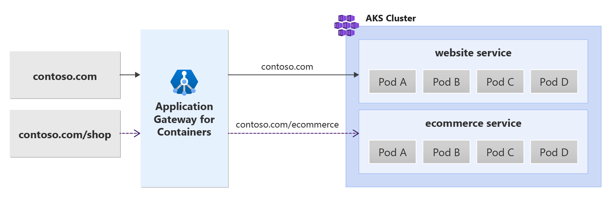

# URL Rewrite for Azure Application Gateway for Containers - Ingress API (preview)

Application Gateway for Containers allows you to rewrite the URL of a client request, including the requests' hostname and/or path.  When Application Gateway for Containers initiates the request to the backend target, the request contains the newly rewritten URL to initiate the request.


## Usage details

URL Rewrites take advantage of Application Gateway for Containers' IngressExtension custom resource.

## Background
URL rewrite enables you to translate an incoming request to a different URL when initiated to a backend target.

The following figure illustrates a request destined for _contoso.com/shop_ being rewritten to _contoso.com/ecommerce_ when the request is initiated to the backend target by Application Gateway for Containers:

[  ](./media/how-to-url-rewrite-gateway-api/url-rewrite.png#lightbox)


## Prerequisites

> [!IMPORTANT]
> Application Gateway for Containers is currently in PREVIEW.<br>
> See the [Supplemental Terms of Use for Microsoft Azure Previews](https://azure.microsoft.com/support/legal/preview-supplemental-terms/) for legal terms that apply to Azure features that are in beta, preview, or otherwise not yet released into general availability.

1. If following the BYO deployment strategy, ensure you have set up your Application Gateway for Containers resources and [ALB Controller](quickstart-deploy-application-gateway-for-containers-alb-controller.md)
2. If following the ALB managed deployment strategy, ensure you have provisioned your [ALB Controller](quickstart-deploy-application-gateway-for-containers-alb-controller.md) and provisioned the Application Gateway for Containers resources via the  [ApplicationLoadBalancer custom resource](quickstart-create-application-gateway-for-containers-managed-by-alb-controller.md).
3. Deploy sample HTTP application
  Apply the following deployment.yaml file on your cluster to create a sample web application to demonstrate path, query, and header based routing.  
  ```bash
  kubectl apply -f https://trafficcontrollerdocs.blob.core.windows.net/examples/traffic-split-scenario/deployment.yaml
  ```
  
  This command creates the following on your cluster:
  - a namespace called `test-infra`
  - two services called `backend-v1` and `backend-v2` in the `test-infra` namespace
  - two deployments called `backend-v1` and `backend-v2` in the `test-infra` namespace

## Deploy the required Ingress API resources

# [ALB managed deployment](#tab/alb-managed)

1. Create an Ingress that catches all traffic and routes to backend-v2
```bash
kubectl apply -f - <<EOF
apiVersion: networking.k8s.io/v1
kind: Ingress
metadata:
  name: ingress-01
  namespace: test-infra
  annotations:
    alb.networking.azure.io/alb-name: alb-test
    alb.networking.azure.io/alb-namespace: alb-test-infra
spec:
  ingressClassName: azure-alb-external
  rules:
    - host: contoso.com
      http:
        paths:
          - path: /
            pathType: Prefix
            backend:
              service:
                name: backend-v2
                port:
                  number: 8080
EOF
```

2. Create an Ingress that matches the /shop prefix that routes to backend-v1
```bash
kubectl apply -f - <<EOF
apiVersion: networking.k8s.io/v1
kind: Ingress
metadata:
  name: ingress-02
  namespace: test-infra
  annotations:
    alb.networking.azure.io/alb-name: alb-test
    alb.networking.azure.io/alb-namespace: alb-test-infra
    alb.networking.azure.io/alb-ingress-extension: url-rewrite
spec:
  ingressClassName: azure-alb-external
  rules:
    - host: contoso.com
      http:
        paths:
          - path: /shop
            pathType: Prefix
            backend:
              service:
                name: backend-v1
                port:
                  number: 8080
EOF
```

[!INCLUDE [application-gateway-for-containers-frontend-naming](../../../includes/application-gateway-for-containers-frontend-naming.md)]

# [Bring your own (BYO) deployment](#tab/byo)

1. Set the following environment variables

```bash
RESOURCE_GROUP='<resource group name of the Application Gateway For Containers resource>'
RESOURCE_NAME='alb-test'

RESOURCE_ID=$(az network alb show --resource-group $RESOURCE_GROUP --name $RESOURCE_NAME --query id -o tsv)
FRONTEND_NAME='frontend'
```

2. Create an Ingress that catches all traffic and routes to backend-v2
```bash
kubectl apply -f - <<EOF
apiVersion: networking.k8s.io/v1
kind: Ingress
metadata:
  name: ingress-01
  namespace: test-infra
  annotations:
    alb.networking.azure.io/alb-id: $RESOURCE_ID
    alb.networking.azure.io/alb-frontend: $FRONTEND_NAME
spec:
  ingressClassName: azure-alb-external
  rules:
    - host: contoso.com
      http:
        paths:
          - path: /
            pathType: Prefix
            backend:
              service:
                name: backend-v2
                port:
                  number: 8080
EOF
```

3. Create an Ingress that matches the /shop prefix and routes to backend-v1
```bash
kubectl apply -f - <<EOF
apiVersion: networking.k8s.io/v1
kind: Ingress
metadata:
  name: ingress-02
  namespace: test-infra
  annotations:
    alb.networking.azure.io/alb-id: $RESOURCE_ID
    alb.networking.azure.io/alb-frontend: $FRONTEND_NAME
    alb.networking.azure.io/alb-ingress-extension: url-rewrite
spec:
  ingressClassName: azure-alb-external
  rules:
    - host: contoso.com
      http:
        paths:
          - path: /shop
            pathType: Prefix
            backend:
              service:
                name: backend-v1
                port:
                  number: 8080
EOF
```

---

When each Ingress resource is created, ensure the status is valid, the listener is _Programmed_, and an address is assigned to the gateway.
```bash
kubectl get ingress ingress-01 -n test-infra -o yaml
kubectl get ingress ingress-02 -n test-infra -o yaml
```

Example output of one of the Ingress resources.
```yaml
apiVersion: networking.k8s.io/v1
kind: Ingress
metadata:
  annotations:
    alb.networking.azure.io/alb-frontend: FRONTEND_NAME
    alb.networking.azure.io/alb-id: /subscriptions/xxxxxxxx-xxxx-xxxx-xxxx-xxxxxxxxxxxx/resourcegroups/yyyyyyyy/providers/Microsoft.ServiceNetworking/trafficControllers/zzzzzz
    kubectl.kubernetes.io/last-applied-configuration: |
      {"apiVersion":"networking.k8s.io/v1","kind":"Ingress","metadata":{"annotations":{"alb.networking.azure.io/alb-frontend":"FRONTEND_NAME","alb.networking.azure.io/alb-id":"/subscriptions/xxxxxxxx-xxxx-xxxx-xxxx-xxxxxxxxxxxx/resourcegroups/yyyyyyyy/providers/Microsoft.ServiceNetworking/trafficControllers/zzzzzz"},"name"
:"ingress-01","namespace":"test-infra"},"spec":{"ingressClassName":"azure-alb-external","rules":[{"host":"contoso.com","http":{"paths":[{"backend":{"service":{"name":"backend-v2","port":{"number":8080}}},"path":"/","pathType":"Prefix"}]}}]}}
  creationTimestamp: "2023-07-22T18:02:13Z"
  generation: 2
  name: ingress-01
  namespace: test-infra
  resourceVersion: "278238"
  uid: 17c34774-1d92-413e-85ec-c5a8da45989d
spec:
  ingressClassName: azure-alb-external
  rules:
  - host: contoso.com
    http:
      paths:
      - backend:
          service:
            name: backend-v2
            port:
              number: 8080
        path: /
        pathType: Prefix
status:
  loadBalancer:
    ingress:
    - hostname: xxxxxxxxxxxxxxxxxxxxxxxxxxxxxxxx.fzyy.alb.azure.com
      ports:
      - port: 80
        protocol: TCP
```

When the Ingress is created, create an IngressExtension resource for `contoso.com`.  This example ensures traffic sent to `contoso.com/shop` is initiated as `contoso.com/ecommerce` to the backend target.

```bash
kubectl apply -f - <<EOF
apiVersion: alb.networking.azure.io/v1
kind: IngressExtension
metadata:
  name: url-rewrite
  namespace: test-infra
spec:
  rules:
    - host: contoso.com
      rewrites:
      - type: URLRewrite
        urlRewrite:
          path:
            type: ReplacePrefixMatch
            replacePrefixMatch: /ecommerce
EOF
```

When the IngressExtension resource is created, ensure the IngressExtension resource shows _Accepted_ and the Application Gateway for Containers resource is _Programmed_.
```bash
kubectl get IngressExtension url-rewrite -n test-infra -o yaml
```

Verify the Application Gateway for Containers resource is successfully updated for the IngressExtension.

## Test access to the application

Now we're ready to send some traffic to our sample application, via the FQDN assigned to the frontend. Use the following command to get the FQDN.

```bash
fqdn=$(kubectl get ingress ingress-01 -n test-infra -o jsonpath='{.status.loadBalancer.ingress[0].hostname}')
```

If you specify the server name indicator `contoso.com/shop` using the curl command, a response from the backend-v1 service is returned with the requested path to the backend target showing `contoso.com/ecommerce`.

```bash
fqdnIp=$(dig +short $fqdn)
curl -k --resolve contoso.com:80:$fqdnIp http://contoso.com/shop
```

Via the response we should see:
```json
{
 "path": "/ecommerce",
 "host": "contoso.com",
 "method": "GET",
 "proto": "HTTP/1.1",
 "headers": {
  "Accept": [
   "*/*"
  ],
  "User-Agent": [
   "curl/7.81.0"
  ],
  "X-Forwarded-For": [
   "xxx.xxx.xxx.xxx"
  ],
  "X-Forwarded-Proto": [
   "http"
  ],
  "X-Request-Id": [
   "dcd4bcad-ea43-4fb6-948e-a906380dcd6d"
  ]
 },
 "namespace": "test-infra",
 "ingress": "",
 "service": "",
 "pod": "backend-v1-5b8fd96959-f59mm"
}
```

If you specify the server name indicator `contoso.com` using the curl command, a response is returned from the backend-v2 service as shown.

```bash
fqdnIp=$(dig +short $fqdn)
curl -k --resolve contoso.com:80:$fqdnIp http://contoso.com
```

The following response should be displayed:
```json
{
 "path": "/",
 "host": "contoso.com",
 "method": "GET",
 "proto": "HTTP/1.1",
 "headers": {
  "Accept": [
   "*/*"
  ],
  "User-Agent": [
   "curl/7.81.0"
  ],
  "X-Forwarded-For": [
   "xxx.xxx.xxx.xxx"
  ],
  "X-Forwarded-Proto": [
   "http"
  ],
  "X-Request-Id": [
   "adae8cc1-8030-4d95-9e05-237dd4e3941b"
  ]
 },
 "namespace": "test-infra",
 "ingress": "",
 "service": "",
 "pod": "backend-v2-594bd59865-ppv9w"
}
```

Congratulations, you have installed ALB Controller, deployed a backend application and used the IngressExtension to rewrite the client requested URL, prior to traffic being set to the target on Application Gateway for Containers.
