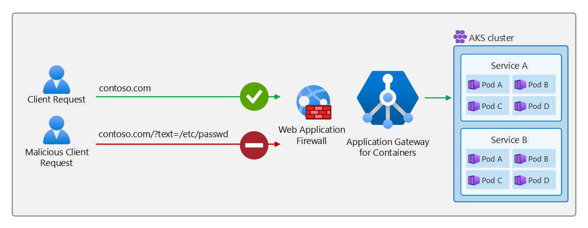

# Web Application Firewall on Application Gateway for Containers with Gateway API

This document helps set up an example application that uses the following resources from Gateway API. Steps are provided to:

- Create a [Gateway](https://gateway-api.sigs.k8s.io/concepts/api-overview/#gateway) resource with one HTTPS listener.
- Create an [HTTPRoute](https://gateway-api.sigs.k8s.io/api-types/httproute) that references a backend service.
- Create a `WebApplicationFirewallPolicy` resource that references an HTTPRoute.

## Background

Application Gateway for Containers leverages web application firewall to block a malicious request from being proxied to the backend target. See the following example scenario:



## Prerequisites

1. If following the BYO deployment strategy, ensure you have set up your Application Gateway for Containers resources and [ALB Controller](quickstart-deploy-application-gateway-for-containers-alb-controller.md)
2. If following the ALB managed deployment strategy, ensure you have provisioned your [ALB Controller](quickstart-deploy-application-gateway-for-containers-alb-controller.md) and provisioned the Application Gateway for Containers resources via the  [ApplicationLoadBalancer custom resource](quickstart-create-application-gateway-for-containers-managed-by-alb-controller.md).
3. Deploy sample HTTP application
   Apply the following deployment.yaml file on your cluster to create a sample web application to demonstrate the header rewrite.

   ```bash
   kubectl apply -f https://raw.githubusercontent.com/MicrosoftDocs/azure-docs/refs/heads/main/articles/application-gateway/for-containers/examples/traffic-split-scenario/deployment.yaml
   ```
  
   This command creates the following on your cluster:

   - a namespace called `test-infra`
   - two services called `backend-v1` and `backend-v2` in the `test-infra` namespace
   - two deployments called `backend-v1` and `backend-v2` in the `test-infra` namespace

## Deploy the required Gateway API resources

# [ALB managed deployment](#tab/alb-managed)

Create a gateway:

```bash
kubectl apply -f - <<EOF
apiVersion: gateway.networking.k8s.io/v1
kind: Gateway
metadata:
  name: gateway-01
  namespace: test-infra
  annotations:
    alb.networking.azure.io/alb-namespace: alb-test-infra
    alb.networking.azure.io/alb-name: alb-test
spec:
  gatewayClassName: azure-alb-external
  listeners:
  - name: http-listener
    port: 80
    protocol: HTTP
    allowedRoutes:
      namespaces:
        from: Same
EOF
```

[!INCLUDE [application-gateway-for-containers-frontend-naming](../../../includes/application-gateway-for-containers-frontend-naming.md)]

# [Bring your own (BYO) deployment](#tab/byo)

1. Set the following environment variables

```bash
RESOURCE_GROUP='<resource group name of the Application Gateway For Containers resource>'
RESOURCE_NAME='alb-test'

RESOURCE_ID=$(az network alb show --resource-group $RESOURCE_GROUP --name $RESOURCE_NAME --query id -o tsv)
FRONTEND_NAME='frontend'
```

2. Create a Gateway

```bash
kubectl apply -f - <<EOF
apiVersion: gateway.networking.k8s.io/v1
kind: Gateway
metadata:
  name: gateway-01
  namespace: test-infra
  annotations:
    alb.networking.azure.io/alb-id: $RESOURCE_ID
spec:
  gatewayClassName: azure-alb-external
  listeners:
  - name: http-listener
    port: 80
    protocol: HTTP
    allowedRoutes:
      namespaces:
        from: Same
  addresses:
  - type: alb.networking.azure.io/alb-frontend
    value: $FRONTEND_NAME
EOF
```

---

Once the gateway resource is created, ensure the status is valid, the listener is _Programmed_, and an address is assigned to the gateway.

```bash
kubectl get gateway gateway-01 -n test-infra -o yaml
```

Example output of successful gateway creation.

```yaml
status:
  addresses:
  - type: IPAddress
    value: xxxx.yyyy.alb.azure.com
  conditions:
  - lastTransitionTime: "2023-06-19T21:04:55Z"
    message: Valid Gateway
    observedGeneration: 1
    reason: Accepted
    status: "True"
    type: Accepted
  - lastTransitionTime: "2023-06-19T21:04:55Z"
    message: Application Gateway For Containers resource has been successfully updated.
    observedGeneration: 1
    reason: Programmed
    status: "True"
    type: Programmed
  listeners:
  - attachedRoutes: 0
    conditions:
    - lastTransitionTime: "2023-06-19T21:04:55Z"
      message: ""
      observedGeneration: 1
      reason: ResolvedRefs
      status: "True"
      type: ResolvedRefs
    - lastTransitionTime: "2023-06-19T21:04:55Z"
      message: Listener is accepted
      observedGeneration: 1
      reason: Accepted
      status: "True"
      type: Accepted
    - lastTransitionTime: "2023-06-19T21:04:55Z"
      message: Application Gateway For Containers resource has been successfully updated.
      observedGeneration: 1
      reason: Programmed
      status: "True"
      type: Programmed
    name: https-listener
    supportedKinds:
    - group: gateway.networking.k8s.io
      kind: HTTPRoute
```

Once the gateway is created, create an HTTPRoute that listens for hostname contoso.com.

```bash
kubectl apply -f - <<EOF
apiVersion: gateway.networking.k8s.io/v1
kind: HTTPRoute
metadata:
  name: contoso-waf-route
  namespace: test-infra
spec:
  parentRefs:
    - name: gateway-01
      namespace: test-infra
  hostnames:
  - "contoso.com"
  rules:
  - backendRefs:
    - name: backend-v1
      port: 8080
EOF
```

Once the HTTPRoute resource is created, ensure the route is _Accepted_ and the Application Gateway for Containers resource is _Programmed_.

```bash
kubectl get httproute header-rewrite-route -n test-infra -o yaml
```

Verify the status of the Application Gateway for Containers resource has been successfully updated.

```yaml
status:
  parents:
  - conditions:
    - lastTransitionTime: "2023-06-19T22:18:23Z"
      message: ""
      observedGeneration: 1
      reason: ResolvedRefs
      status: "True"
      type: ResolvedRefs
    - lastTransitionTime: "2023-06-19T22:18:23Z"
      message: Route is Accepted
      observedGeneration: 1
      reason: Accepted
      status: "True"
      type: Accepted
    - lastTransitionTime: "2023-06-19T22:18:23Z"
      message: Application Gateway For Containers resource has been successfully updated.
      observedGeneration: 1
      reason: Programmed
      status: "True"
      type: Programmed
    controllerName: alb.networking.azure.io/alb-controller
    parentRef:
      group: gateway.networking.k8s.io
      kind: Gateway
      name: gateway-01
      namespace: test-infra
  ```

### Configure WebApplicationFirewallPolicy

Application Gateway for Containers uses a custom resource called `WebApplicationFirewallPolicy` to define WAF protection. In this example, WAF will protect a specific HTTPRoute.

```bash
kubectl apply -f - <<EOF
apiVersion: alb.networking.azure.io/v1
kind: WebApplicationFirewallPolicy
metadata:
  name: sample-waf-policy
  namespace: test-infra
spec:
  targetRef:
    group: gateway.networking.k8s.io
    kind: HTTPRoute
    name: contoso-waf-route
    namespace: test-infra
    #sectionNames: ["listenerA"] # defined if targeting a specific listener on a gateway resource or path
  webApplicationFirewall:
    id: /subscriptions/.../Microsoft.Network/applicationGatewayWebApplicationFirewallPolicies/waf-policy-0
EOF
```

kubectl apply -f - <<EOF
apiVersion: alb.networking.azure.io/v1
kind: WebApplicationFirewallPolicy
metadata:
  name: sample-waf-policy
  namespace: test-infra
spec:
  targetRef:
    group: gateway.networking.k8s.io
    kind: HTTPRoute
    name: contoso-waf-route
    namespace: test-infra
    #sectionNames: ["listenerA"] # defined if targeting a specific listener on a gateway resource or path
  webApplicationFirewall:
    id: /subscriptions/711d99a7-fd79-4ce7-9831-ea1afa18442e/resourceGroups/AGC-RG/providers/Microsoft.Network/applicationGatewayWebApplicationFirewallPolicies/agc-waf
EOF

## Test access to the application

Now we're ready to send some traffic to our sample application, via the FQDN assigned to the frontend. Use the following command to get the FQDN:

```bash
fqdn=$(kubectl get gateway gateway-01 -n test-infra -o jsonpath='{.status.addresses[0].value}')
```

If you specify the server name indicator using the curl command, `contoso.com` for the frontend FQDN, the output should return a response from the backend-v1 service.

```bash
fqdnIp=$(dig +short $fqdn)
curl -k --resolve contoso.com:80:$fqdnIp http://contoso.com
```

Via the response we should see:

```json
{
 "path": "/",
 "host": "contoso.com",
 "method": "GET",
 "proto": "HTTP/1.1",
 "headers": {
  "Accept": [
   "*/*"
  ],
  "User-Agent": [
   "curl/7.81.0"
  ],
  "X-Forwarded-For": [
   "xxx.xxx.xxx.xxx"
  ],
  "X-Forwarded-Proto": [
   "http"
  ],
  "X-Request-Id": [
   "dcd4bcad-ea43-4fb6-948e-a906380dcd6d"
  ]
 },
 "namespace": "test-infra",
 "ingress": "",
 "service": "",
 "pod": "backend-v1-5b8fd96959-f59mm"
}
```

Now, send a request with a malicious query string to trigger a `403 forbidden` response from your Application Gateway for Containers.

**Example 1:**

```bash
curl -k --resolve contoso.com:80:$fqdnIp http://contoso.com/?text=/etc/passwd
```

**Example 2:**

```bash
curl -k --resolve contoso.com:80:$fqdnIp http://contoso.com/?1=1=1
```

Congratulations, you have installed ALB Controller, deployed a backend application and used Web Application Firewall functionality to block a malicious request.
