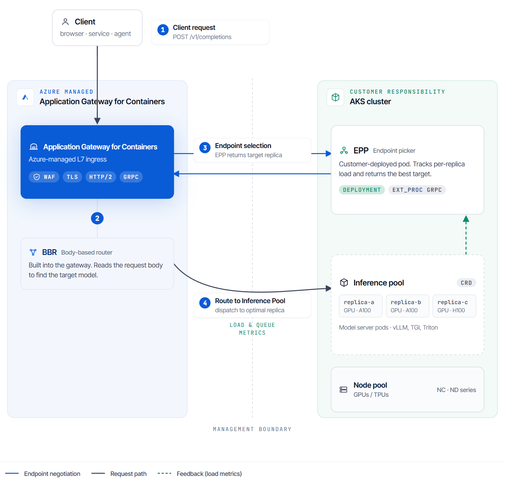

# Application Gateway for Containers - Inference gateway

AI inference workloads don't behave like traditional stateless HTTP applications. Requests are often model-specific, long-running, expensive to serve, and sensitive to runtime signals such as accelerator availability, queue depth, request priority, token budget, and model server capacity.

Application Gateway for Containers inference gateway supports these workloads by integrating with the Kubernetes [Gateway API Inference Extension](https://gateway-api-inference-extension.sigs.k8s.io/), which adds inference-aware resources to the Gateway API model. By using the inference gateway, you can expose self-hosted model servers through Application Gateway for Containers with model-aware and load-aware routing behavior.

The inference gateway is purpose-built for serving large language models (LLMs) and other inference workloads. It routes requests based on model server signals rather than generic load balancing, which lowers time to first token (TTFT), reduces timeouts under load, and improves GPU efficiency. Built on the ingress capabilities of Application Gateway for Containers, the inference gateway also lets you pair AI workloads with capabilities like the web application firewall (WAF) to secure traffic before it reaches your model servers.

Many self-hosted inference runtimes, including vLLM, expose [OpenAI-compatible HTTP APIs](https://platform.openai.com/docs/api-reference) such as `/v1/chat/completions`, `/v1/completions`, and `/v1/models`. OpenAI-compatible refers to the API format, not a restriction to OpenAI-hosted models. If another model family is served through a runtime or proxy that uses this format, Application Gateway for Containers can use the `model` field in the JSON request body for body-based routing.

> [!IMPORTANT]
> The Application Gateway for Containers inference gateway is currently in preview. 
> See the [Supplemental Terms of Use for Microsoft Azure Previews](https://azure.microsoft.com/support/legal/preview-supplemental-terms/) for legal terms that apply to Azure features that are in beta, preview, or otherwise not yet released into general availability.

## What the Gateway API Inference Extension provides

The Gateway API Inference Extension turns a Gateway API implementation into an inference gateway by adding inference-specific backend and scheduling concepts.

The extension introduces these primary resources and components:

- **InferencePool**: A backend resource that represents a group of model server pods and the endpoint picker used to select a pod for each inference request.
- **InferenceObjective**: A resource that represents request-serving objectives, such as priority, for requests that share an InferencePool.
- **Endpoint Picker (EPP)**: A customer-provided extension that runs in your cluster and implements inference scheduling. The EPP receives request metadata, scores candidate model server pods by using configurable plugins (for example, queue depth, KV cache utilization, and prefix-cache affinity), and returns the selected endpoint. Because endpoint selection runs in the EPP, the available routing behaviors depend on the scorer plugins that your EPP enables.
- **Body-based routing (BBR)**: A request processor that can inspect an OpenAI-compatible request body, extract the model name, and make it available to the gateway as the `X-Gateway-Model-Name` header for model-aware routing.

Application Gateway for Containers runs the BBR processor as a managed part of the gateway, so there's no separate body-based routing tier to deploy, scale, or patch. It integrates with a customer-provided EPP to support request-time routing decisions. The inference gateway supports the Gateway API Inference Extension API, so you configure these capabilities through standard Gateway API resources and platform teams can use a Kubernetes-native API model for inference traffic instead of introducing a separate ingress configuration model.

## How Application Gateway for Containers uses inference resources

Application Gateway for Containers continues to use standard Gateway API resources for ingress configuration. Inference behavior is activated when an `HTTPRoute` backend reference targets an `InferencePool` instead of a Kubernetes `Service`.

For non-inference routes, Application Gateway for Containers keeps the existing Gateway API behavior. Routes that target Kubernetes `Service` backends don't invoke inference processors and don't receive inference-specific routing behavior.

For inference routes, the control plane reconciles the Gateway API and inference resources and programs the data plane so that:

- The `HTTPRoute` selects the `InferencePool` backend.
- The `InferencePool` selects the model server pods that belong to the pool.
- The EPP associated with the pool is invoked for endpoint selection.
- The selected model server endpoint receives the request.
- Optional model-aware routing uses the request model name extracted by BBR.

## Request flow

A typical inference request follows this path. The numbered steps map to the labels in the following diagram:

1. **Client request**: A client sends an OpenAI-compatible request to the Application Gateway for Containers frontend, and the Gateway listener accepts it.
1. **Body-based routing (BBR)**: For model-aware routes, the managed BBR processor inspects the request body, extracts the model name, and injects the `X-Gateway-Model-Name` header. The `HTTPRoute` can then match on that value to select the appropriate `InferencePool`.
1. **Endpoint selection**: When the matched route targets an `InferencePool`, Application Gateway for Containers invokes the EPP, which evaluates the request and model server telemetry and returns the selected endpoint.
1. **Route to the InferencePool**: Application Gateway for Containers forwards the request to the selected model server pod, and the model server's response returns to the client through the gateway.

## Routing capabilities

The inference gateway supports these routing patterns for self-hosted AI workloads. Endpoint selection runs in the EPP, so the load-aware and cache-aware behaviors depend on the scorer plugins that your EPP enables.

- **Model-aware routing**: Route requests based on the model name in OpenAI-compatible request bodies, which the managed BBR processor extracts.
- **Traffic splitting and rollouts**: Use standard `HTTPRoute` weighted `backendRefs` to split traffic across `InferencePool` backends for canary or blue-green model rollouts.
- **Load-aware and cache-aware endpoint selection**: The EPP scores endpoints by using model server telemetry, such as queue depth and KV cache utilization. When the EPP enables prefix-cache-aware scoring, requests that share a prompt prefix go to the same replica to raise cache hits and lower TTFT.
- **Request priority and overload protection**: Use `InferenceObjective` resources and the `x-gateway-inference-objective` request header to assign serving priority. When model servers are saturated, the EPP sheds lower-priority requests first to protect latency-critical traffic.
- **Resilient endpoint selection**: Configure EPP failure behavior with `FailOpen` or `FailClose`, depending on whether availability or strict endpoint selection is more important for a pool.
- **Gateway API compatibility**: Continue using Gateway, HTTPRoute, ReferenceGrant, and standard Gateway API status conditions for ingress configuration.

## Secure inference

Keep model servers private behind the managed gateway and apply the platform's security capabilities to inference traffic.

- **Web application firewall (WAF)**: The inference gateway pairs natively with the existing [WAF capability in Application Gateway for Containers](how-to-waf-gateway-api.md), applying OWASP-aligned protections to AI traffic before requests reach your model servers.
- **Protection for expensive backends**: Because policy is enforced at the managed edge, malformed or abusive requests can be inspected and blocked before they consume scarce GPU capacity.

## Example scenarios

The following scenarios show common ways to use the inference gateway:

- **Serve and roll out model versions**: Route OpenAI-compatible requests to an `InferencePool` by model name, then use weighted `HTTPRoute` backendRefs to shift a percentage of traffic to a new model version for canary testing before you complete the rollout.
- **Prioritize latency-critical traffic**: Define `InferenceObjective` resources for high-priority and low-priority workloads on a shared pool. Interactive chat requests carry the high-priority objective, while batch jobs use a lower priority that's shed first when the pool is saturated.

## InferencePool compared with Service

A Kubernetes `Service` remains the right backend abstraction for standard application traffic. Use an `InferencePool` when the backend is a group of model server pods that need inference-specific endpoint selection.

| Backend type | Use for | Routing behavior |
| --- | --- | --- |
| `Service` | Standard HTTP, gRPC, and application backends | Gateway routes to service endpoints using standard load-balancing behavior. |
| `InferencePool` | Self-hosted model server pods | Gateway invokes the configured EPP, then routes to the selected model server endpoint. |

An `InferencePool` includes a pod selector, target port information, and an endpoint picker reference. The EPP is responsible for selecting the endpoint for a request. A single EPP is associated with a single pool.

## Failure behavior

Inference routing is request-time behavior, so the failure mode of the endpoint picker matters.

`InferencePool` endpoint picker references support these failure modes:

- **FailOpen**: If the EPP is unavailable or doesn't respond, the gateway can continue with standard endpoint selection for the pool. This choice preserves availability but might reduce routing quality.
- **FailClose**: If the EPP is unavailable or doesn't respond, the gateway rejects the request. This choice prevents traffic from being sent without the required endpoint selection decision.

For model-aware routing that depends on request body parsing, Application Gateway for Containers favors correctness. If the model name can't be extracted for a route that requires BBR, the request is rejected instead of being silently routed to the wrong model backend.

## Operational considerations

Plan for the following considerations when running inference workloads behind Application Gateway for Containers:

- **EPP capacity**: The EPP is on the request path for `InferencePool` backends. Size and monitor it like a critical application component.
- **Model server telemetry**: The EPP needs fresh model server metrics to make high-quality routing decisions. Confirm that your model server supports the metrics expected by your EPP configuration.
- **GPU capacity and scheduling**: Model server pods often require GPU node pools, device plugins, and model download credentials.
- **Autoscaling**: Scale model server pods on inference signals such as queue depth and KV cache utilization by using the Horizontal Pod Autoscaler or KEDA. Autoscaling adds capacity as demand grows, while the EPP routes around replicas that are already saturated.
- **Streaming responses**: Many chat completion workloads use server-sent events. Validate streaming behavior when testing end-to-end latency and timeout settings.
- **Observability**: Monitor Gateway and HTTPRoute status, InferencePool status, EPP health, model server readiness, and model server metrics such as active requests and queue depth.

## Limitations

The inference gateway focuses on self-hosted inference workloads running on Kubernetes. Routing directly to public or managed model provider endpoints is outside the scope of this integration.

The Gateway API Inference Extension evolves independently from Application Gateway for Containers. Use API versions and manifests that match the inference extension CRDs installed on your cluster.

## Next steps

- [Configure Application Gateway for Containers inference gateway](how-to-inference-gateway.md)
- [Application Gateway for Containers components](application-gateway-for-containers-components.md)
- [Gateway API Inference Extension documentation](https://gateway-api-inference-extension.sigs.k8s.io/)
