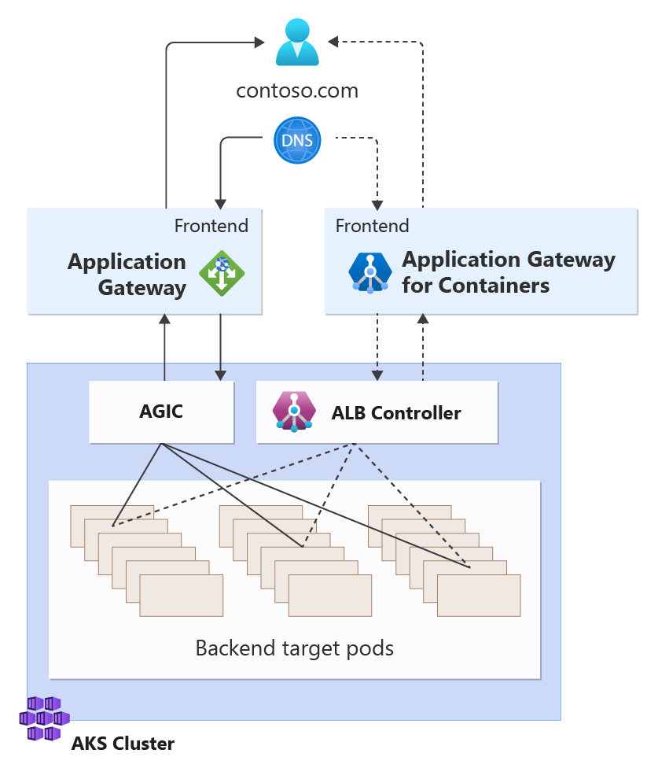

# Migrate from Application Gateway Ingress Controller (AGIC) to Application Gateway for Containers

Application Gateway Ingress Controller (AGIC) and Application Gateway for Containers are two solutions that enable application load balancing for Azure Kubernetes Service (AKS) services. In 2018, Application Gateway started Application Gateway Ingress Controller, which translated Kubernetes Ingress configuration to Application Gateway configuration. Over time, Kubernetes has pushed the requirements of scale, performance, and introduced a successor API to Ingress called Gateway API; which has lead to the introduction of Application Gateway for Containers.

Application Gateway for Containers is the next evolution to Application Gateway Ingress Controller, providing benefits such as:

- Increased performance, offering near real-time updates to add or move pods, routes, and probes
- Traffic Splitting / Weighted Round Robin
- Kubernetes Gateway and Ingress API
- Configuration via Azure or Kubernetes

With the improvements provided, we recommended you begin the transition from Application Gateway Ingress Controller to Application Gateway for Containers.

## Migration objectives

Migration to Application Gateway for Containers is designed to meet three objectives:

- Enable an incremental migration approach
- Allow for end-to-end validation prior to migration
- Ensure no downtime

This article provides an overview of migration strategy. See the following diagram:



In the example depicted, Application Gateway for Containers and Application Gateway Ingress Controller both service backend targets using unique frontends. After validation that Application Gateway for Containers is functioning as expected, traffic can be solely directed to the Application Gateway for Containers frontend and the configuration to Application Gateway Ingress Controller may be retired.

## Feature dependencies and mappings

Prior to migration, it is important to identify any dependencies on Application Gateway Ingress Controller that may not yet be available in Application Gateway for Containers. Workloads with dependency on these features should be prioritized later in your migration strategy until such capabilities are unblocked in Application Gateway for Containers.

Such dependencies include:

- Web Application Firewall (WAF)
- Frontend Mutual Authentication
- Private IP
- Ports other than 80 and 443
- Configurable request timeout values

Here's a summarized list of AGIC annotations and whether Application Gateway for Containers has translated such capabilities to either Gateway or Ingress API.

| Scenario | AGIC Annotation | Gateway API Implementation | Ingress API Implementation |
| ------- | ----------------------------------------------- | ------------ | ------------ |
| [Path override to backend target](migrate-from-agic-to-agc.md#path-override-to-backend-target) | appgw.ingress.kubernetes.io/backend-path-prefix | [URL Rewrite for Gateway API](migrate-from-agic-to-agc.md#url-rewrite-for-gateway-api) | [URL Rewrite for Ingress API](migrate-from-agic-to-agc.md#url-redirect-for-ingress-api) |
| [Path override to backend target](migrate-from-agic-to-agc.md#path-override-to-backend-target) | appgw.ingress.kubernetes.io/backend-hostname | [URL Rewrite for Gateway API](migrate-from-agic-to-agc.md#url-rewrite-for-gateway-api) | [URL Rewrite for Ingress API](migrate-from-agic-to-agc.md#url-redirect-for-ingress-api) |
| [Path override to backend target](migrate-from-agic-to-agc.md#path-override-to-backend-target) | appgw.ingress.kubernetes.io/backend-protocol | [URL Rewrite for Gateway API](migrate-from-agic-to-agc.md#url-rewrite-for-gateway-api) | [URL Rewrite for Ingress API](migrate-from-agic-to-agc.md#url-redirect-for-ingress-api) |
| [HTTP-to-HTTPS Redirect](migrate-from-agic-to-agc.md#redirect) | appgw.ingress.kubernetes.io/ssl-redirect | [URL Redirect for Gateway API](migrate-from-agic-to-agc.md#url-redirect-for-gateway-api) | [URL Redirect for Ingress API](migrate-from-agic-to-agc.md#url-redirect-for-ingress-api) |
| [Frontend TLS certificate](migrate-from-agic-to-agc.md#frontend-tls-certificate) | appgw.ingress.kubernetes.io/appgw-ssl-certificate | [Supported](migrate-from-agic-to-agc.md#frontend-tls-certificate) | [Supported](migrate-from-agic-to-agc.md#frontend-tls-certificate) |
| [Frontend TLS Policy / SSL Profile](migrate-from-agic-to-agc.md#frontend-tls-policy--ssl-profile) | appgw.ingress.kubernetes.io/appgw-ssl-profile | [Frontend TLS Policy in Gateway API](migrate-from-agic-to-agc.md#frontend-tls-policy-in-gateway-api) | Not supported |
| [Establishing backend certificate chain trust](migrate-from-agic-to-agc.md#establishing-backend-certificate-chain-trust) | appgw.ingress.kubernetes.io/appgw-trusted-root-certificate | [Supported](migrate-from-agic-to-agc.md#establishing-backend-certificate-chain-trust) | [Supported](migrate-from-agic-to-agc.md#establishing-backend-certificate-chain-trust) |
| [Connection draining](migrate-from-agic-to-agc.md#connection-draining) | appgw.ingress.kubernetes.io/connection-draining | Non-configurable | Non-configurable |
| [Connection draining](migrate-from-agic-to-agc.md#connection-draining) | appgw.ingress.kubernetes.io/connection-draining-timeout | Non-configurable | Non-configurable |
| [Session Affinity / Sticky Sessions](migrate-from-agic-to-agc.md#session-affinity) | appgw.ingress.kubernetes.io/cookie-based-affinity | [Session affinity in Gateway API](migrate-from-agic-to-agc.md#session-affinity-in-gateway-api) | [Session affinity in Ingress API](migrate-from-agic-to-agc.md#session-affinity-in-ingress-api) |
| [Request timeout](migrate-from-agic-to-agc.md#request-timeout) | appgw.ingress.kubernetes.io/request-timeout | Non-configurable | Non-configurable |
| [Frontend port other than 80 and 443](migrate-from-agic-to-agc.md#frontend-port-override) | appgw.ingress.kubernetes.io/override-frontend-port | Not supported | Not supported |
| [Private frontend](migrate-from-agic-to-agc.md#private-frontend) | appgw.ingress.kubernetes.io/use-private-ip | Not supported | Not supported |
| [WAF](migrate-from-agic-to-agc.md#waf) | appgw.ingress.kubernetes.io/waf-policy-for-path | Not supported | Not supported |
| [Custom health probe](migrate-from-agic-to-agc.md#custom-health-probes) | appgw.ingress.kubernetes.io/health-probe-hostname | [HealthCheckPolicy](migrate-from-agic-to-agc.md#healthcheckpolicy) | [HealthCheckPolicy](migrate-from-agic-to-agc.md#healthcheckpolicy) |
| [Custom health probe](migrate-from-agic-to-agc.md#custom-health-probes) | appgw.ingress.kubernetes.io/health-probe-port | Not supported | Not supported |
| [Custom health probe](migrate-from-agic-to-agc.md#custom-health-probes) | appgw.ingress.kubernetes.io/health-probe-path | [HealthCheckPolicy](migrate-from-agic-to-agc.md#healthcheckpolicy) | [HealthCheckPolicy](migrate-from-agic-to-agc.md#healthcheckpolicy) |
| [Custom health probe](migrate-from-agic-to-agc.md#custom-health-probes) | appgw.ingress.kubernetes.io/health-probe-status-codes | [HealthCheckPolicy](migrate-from-agic-to-agc.md#healthcheckpolicy) | [HealthCheckPolicy](migrate-from-agic-to-agc.md#healthcheckpolicy) |
| [Custom health probe](migrate-from-agic-to-agc.md#custom-health-probes) | appgw.ingress.kubernetes.io/health-probe-interval | [HealthCheckPolicy](migrate-from-agic-to-agc.md#healthcheckpolicy) | [HealthCheckPolicy](migrate-from-agic-to-agc.md#healthcheckpolicy) |
| [Custom health probe](migrate-from-agic-to-agc.md#custom-health-probes) | appgw.ingress.kubernetes.io/health-probe-timeout | [HealthCheckPolicy](migrate-from-agic-to-agc.md#healthcheckpolicy) | [HealthCheckPolicy](migrate-from-agic-to-agc.md#healthcheckpolicy) |
| [Custom health probe](migrate-from-agic-to-agc.md#custom-health-probes) | appgw.ingress.kubernetes.io/health-probe-unhealthy-threshold | [HealthCheckPolicy](migrate-from-agic-to-agc.md#healthcheckpolicy) | [HealthCheckPolicy](migrate-from-agic-to-agc.md#healthcheckpolicy) |
| [Header rewrite](migrate-from-agic-to-agc.md#header-rewrite) | appgw.ingress.kubernetes.io/rewrite-rule-set | [Header rewrite in Gateway API](migrate-from-agic-to-agc.md#header-rewrite-in-gateway-api) | [Header rewrite in Ingress API](migrate-from-agic-to-agc.md#header-rewrite-in-ingress-api) |
| [Header rewrite](migrate-from-agic-to-agc.md#header-rewrite) | appgw.ingress.kubernetes.io/rewrite-rule-set-custom-resource | [Header rewrite in Gateway API](migrate-from-agic-to-agc.md#header-rewrite-in-gateway-api) | [Header rewrite in Ingress API](migrate-from-agic-to-agc.md#header-rewrite-in-ingress-api) |
| [Header rewrite](migrate-from-agic-to-agc.md#header-rewrite) | appgw.ingress.kubernetes.io/hostname-extension | [Header rewrite in Gateway API](migrate-from-agic-to-agc.md#header-rewrite-in-gateway-api) | [Header rewrite in Ingress API](migrate-from-agic-to-agc.md#header-rewrite-in-ingress-api) |

## Migration experience and what to expect

Migration from Application Gateway Ingress Controller to Application Gateway for Containers is designed to be a four step process:

[Step 1](#step-1-install-alb-controller): Install Application Gateway for Containers' ALB Controller<br/>
[Step 2](#step-2-translate-ingress): Translate AGIC Ingress to Application Gateway for Containers Ingress<br/>
[Step 3](#step-3-perform-end-to-end-validation): Perform end-to-end testing against Application Gateway for Containers<br/>
[Step 4](#step-4-direct-traffic-to-application-gateway-for-containers): Direct traffic from AGIC to Application Gateway for Containers

Steps 2 through 4 will be repeated for each service you plan to migrate.

### Step 1: Install ALB Controller

The first step of migration is to ensure the ALB Controller for Application Gateway for Containers is installed and running. Validate that both Application Gateway Ingress Controller and the Application Gateway for Containers ALB controller can run in parallel on the same cluster.

For instructions on how to deploy the ALB Controller, see [Install Application Gateway for Containers ALB Controller](quickstart-deploy-application-gateway-for-containers-alb-controller.md).

### Step 2: Translate Ingress

Application Gateway for Containers has aligned its implementation to use Ingress or Gateway API natively where possible. For cases where additional functionality is required but not provided by the API, custom resources are applied instead of annotations.

A list of AGIC annotations and their equivalent implementation in Ingress or Gateway API can be found in the [Annotations](#annotations) section of this article.

### Step 3: Perform end-to-end validation

Client traffic will arrive on an Application Gateway for Containers frontend resource. Each frontend has cardinality to a Gateway or Ingress resource.  Once configuration has been defined in your Gateway or Ingress resources, identify the proper frontend.

Check the Ingress and Gateway setup by using a host file or DNS record to test traffic flow to the Application Gateway for Containers. Make sure traffic can move from the client to the backend via Application Gateway for Containers and that all requests and responses have the expected headers, redirects, and routing conditions.

### Step 4: Direct traffic to Application Gateway for Containers

Once you've completed end-to-end testing, direct traffic to Application Gateway for Containers. Update public DNS records to point to the Application Gateway for Containers' frontend A record. In most cases, this would be in the form of a CNAME record or, if specifying an apex domain name, an alias record. Allow time for traffic to naturally flow to the Application Gateway for Containers frontend.

> [!TIP]
>
> - Prior to migration, identify the time to live (TTL) value of the DNS record currently serving traffic to the frontend of Application Gateway. Ensure the same amount of time and time configured in Application Gateway for connection draining to pass to ensure all clients have resolved the new DNS record to Application Gateway for Containers prior to retiring the Ingress / Gateway configuration to AGIC.
> - Consider migration during a time of low-peak traffic to validate
> - In the event migration does not behavior the way you anticipated, revert the DNS record to point back to the Application Gateway frontend and repeat the process.

### Step 5: Deprecate Application Gateway Ingress Controller

Once all services have been migrated, you may deprecate Application Gateway Ingress Controller.

#### Remove Ingress resources

Remove each Ingress resource that is referencing the Application Gateway Ingress Controller with the `kubernetes.io/ingress.class: azure/application-gateway` annotation or defines an `ingressClassName` of `azure-application-gateway`.

```bash
kubectl delete ingress your-ingress-name -n your-ingress-namespace
```

#### AGIC Add-on

If using the AGIC add-on, you may delete the add-on by running the following:

```cli
az aks disable-addons -n <AKS-cluster-name> -g <AKS-resource-group-name> -a ingress-appgw
```

#### Helm deployment

If AGIC was deployed via helm, you may uninstall the controller by running the following:

```cli
helm uninstall ingress-azure
```

### Clean-up Azure resources

After the ingress controller is removed, you will need to delete the Application Gateway resource.

>[!Note]
>If the aks add-on was provisioned in the context of referencing a previously deployed Application Gateway in Azure, you will need to delete the Application Gateway resource manually.

## Annotations

The following Application Gateway Ingress Controller annotations and the equivalent implementation in Application Gateway for Containers are as followed.

### Path override to backend target

AGIC annotations

- appgw.ingress.kubernetes.io/backend-path-prefix
- appgw.ingress.kubernetes.io/backend-hostname
- appgw.ingress.kubernetes.io/backend-protocol

Application Gateway for Containers implementation

For requests that rewrite the backend target path, use Application Gateway for Containers' URL rewrite capabilities.

#### [URL Rewrite for Gateway API](how-to-url-rewrite-gateway-api.md)

In Gateway API, you need to define an `HTTPRoute` resource that has a filter to `URLRewrite` the path.

#### [URL Rewrite for Ingress API](how-to-url-rewrite-ingress-api.md)

In Ingress API, you need to define an `IngressExtension` resource, defining a rewrite with a `ReplacePrefixMatch`.

### Redirect

AGIC annotations

- appgw.ingress.kubernetes.io/ssl-redirect

Application Gateway for Containers implementation

For requests that should redirect from port 80 to 443 for HTTPS, use URL redirect support in Application Gateway for Containers.

#### [URL Redirect for Gateway API](how-to-url-redirect-gateway-api.md)

In Gateway API, you need to define one Gateway resource that listens on both port 80 and 443. In addition, two HTTPRoute resources are created, one to listen and serve traffic on 443 and another to trigger the redirect for traffic received on port 80.

#### [URL Redirect for Ingress API](how-to-url-redirect-ingress-api.md)

In Ingress API, you need to define an `IngressExtension` resource, containing a rule that defines a `requestRedirect` with a `scheme` value of `https`. In total, two Ingress resources need to be defined, one for listening on port 80 for the HTTP request to trigger a redirect, and one for listening on port 443 for handling HTTPS requests.

#### SSL certificates in Gateway API

In Gateway API, reference the certificate on your Gateway resource.

  ```yaml
  tls:
    mode: Terminate
    certificateRefs:
    - kind : Secret
      group: ""
      name: listener-tls-secret
  ```

#### SSL certificates in Ingress API

In Ingress API, use the tls property, such as

  ```yaml
  tls:
  - hosts:
      - example.com
      secretName: listener-tls-secret
  ```

### Frontend TLS certificate

AGIC annotation

- appgw.ingress.kubernetes.io/appgw-ssl-certificate

Application Gateway for Containers implementation

Direct certificate upload and reference to a certificate in Azure Key Vault is not available.

Secrets should be stored in [AKS Secret Store](/azure/aks/concepts-security#kubernetes-secrets) and referenced by name.

### Establishing backend certificate chain trust

AGIC annotation

- appgw.ingress.kubernetes.io/appgw-trusted-root-certificate

Application Gateway for Containers implementation

In both Gateway and Ingress API, you can leverage the BackendTLSPolicy custom resource to define your own certificate authority to establish chain trust to the certificate used by the backend service.

### Frontend TLS Policy / SSL Profile

AGIC annotation

- appgw.ingress.kubernetes.io/appgw-ssl-profile

Application Gateway for Containers implementation

Application Gateway for Containers allows customers to reference prebuild TLS policies to control the scope of what ciphers are negotiated by client to frontend of Application Gateway for Containers.

#### Frontend TLS Policy in Gateway API

To leverage this feature, you must leverage Gateway API. More details on TLS Policy are found [here](tls-policy.md).

>[!Note]
>The Predefined policy names and cipher suites are different from Application Gateway Ingress Controller. Please refer to the [predefined TLS policy table](tls-policy.md#predefined-tls-policy).

#### Frontend TLS Policy in Ingress API

Custom TLS policy isn't supported by Application Gateway for Containers today.

### Session affinity

AGIC annotation

- appgw.ingress.kubernetes.io/cookie-based-affinity

Application Gateway for Containers implementation

Application Gateway for Containers supports session affinity via cookie for both Gateway and Ingress API.

#### [Session affinity in Gateway API](session-affinity.md?tabs=session-affinity-gateway-api)

In Gateway API, define a RoutePolicy resource with properties related to sessionAffinity.

#### [Session affinity in Ingress API](session-affinity.md?tabs=session-affinity-ingress-api)

In Ingress API, define an IngressExtension resource with properties related to sessionAffinity.

More details on configuring Application Gateway for Containers with session affinity can be found here: [Session Affinity](session-affinity.md).

### Private Frontend

AGIC annotation

- appgw.ingress.kubernetes.io/use-private-ip

Application Gateway for Containers implementation

Private IP frontend isn't currently supported by Application Gateway for Containers.

### WAF

AGIC annotation

- appgw.ingress.kubernetes.io/waf-policy-for-path

Application Gateway for Containers implementation

WAF isn't supported by Application Gateway for Containers.

### Custom Health probes

AGIC annotations

- appgw.ingress.kubernetes.io/health-probe-hostname
- appgw.ingress.kubernetes.io/health-probe-port
- appgw.ingress.kubernetes.io/health-probe-path
- appgw.ingress.kubernetes.io/health-probe-status-codes
- appgw.ingress.kubernetes.io/health-probe-interval
- appgw.ingress.kubernetes.io/health-probe-timeout
- appgw.ingress.kubernetes.io/health-probe-unhealthy-threshold

Application Gateway for Containers implementation

#### HealthCheckPolicy

For both Gateway and Ingress API, the equivalent is a new HealthCheckPolicy resource. More details can be found in the [Custom Health Probes](custom-health-probe.md) document.

### Header rewrite

AGIC annotations

- appgw.ingress.kubernetes.io/rewrite-rule-set
- appgw.ingress.kubernetes.io/rewrite-rule-set-custom-resource
- appgw.ingress.kubernetes.io/hostname-extension

Application Gateway for Containers implementation

#### [Header rewrite in Gateway API](how-to-header-rewrite-ingress-api.md)

In Gateway API, you define a RequestHeaderModifer match and filter to rewrite the request.

#### [Header rewrite in Ingress API](how-to-header-rewrite-ingress-api.md)

In Ingress API, define an IngressExtension resource with a rewrite rule.

### Connection draining

AGIC annotations

- appgw.ingress.kubernetes.io/connection-draining
- appgw.ingress.kubernetes.io/connection-draining-timeout

Application Gateway for Containers implementation

Connection draining is enabled by default for all Application Gateway for Containers deployments and nonconfigurable.

Scenarios:

- Scale-in: When autoscaling scales in, connections are drained for 5 minutes. After 5 minutes, connections are closed and clients must initiate a new connection.
- Unhealthy health probe: When an unhealthy health probe is detected, connections persist until the client disconnects.
- Pod is removed from backend: When a pod is removed in AKS, Application Gateway for Containers continues to persist open connections until the client disconnects.

### Request timeout

AGIC annotation

- appgw.ingress.kubernetes.io/request-timeout

Application Gateway for Containers implementation

Request timeouts are nonconfigurable in Application Gateway for Containers. A list of default timeout values are documented [here](application-gateway-for-containers-components.md#request-timeouts).

### Frontend port override

AGIC annotation

- appgw.ingress.kubernetes.io/override-frontend-port

Application Gateway for Containers implementation

Application Gateway for Containers only supports ports on 80 and 443. Ports 80 and/or 443 are defined in each Gateway or Ingress resource.
