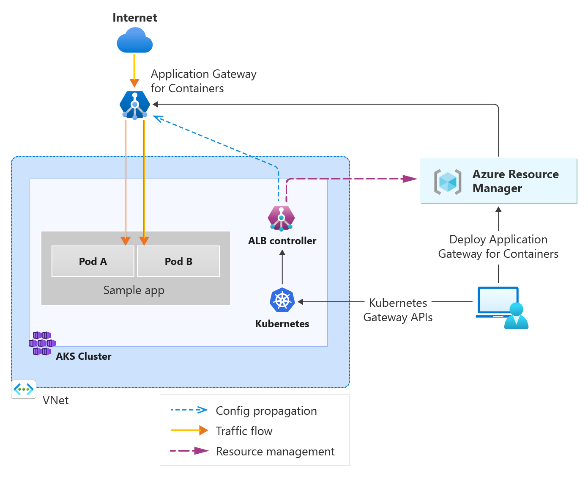

# What is Application Gateway for Containers?

Application Gateway for Containers is a managed application layer (layer 7) [load balancing](/azure/architecture/guide/technology-choices/load-balancing-overview) and ingress service for Kubernetes workloads. It routes HTTP, HTTPS, gRPC, and AI inference traffic to applications in Azure Kubernetes Service (AKS) while Azure operates the underlying data plane outside the cluster.

You configure Application Gateway for Containers from Kubernetes by using supported Ingress and Gateway API resources. This configuration model lets platform teams provide a shared Azure-managed ingress layer while application teams use Kubernetes-native resources to describe how their services receive traffic.

For AI workloads, Application Gateway for Containers inference gateway supports self-hosted model servers that need model-aware routing and request-time endpoint selection. For more information, see [Application Gateway for Containers - Inference gateway](inference-gateway.md).

Application Gateway for Containers is a separate Application Gateway offering built for Kubernetes from the ground up, with a dedicated control plane and data plane shaped by learnings from [Application Gateway Ingress Controller (AGIC)](../ingress-controller-overview.md). ALB Controller runs in the cluster and translates Kubernetes configuration into Application Gateway for Containers configuration in Azure.

## Product summary

At a high level, Application Gateway for Containers provides:

- **Kubernetes-native configuration**: Use Ingress and Gateway API resources to define how requests reach services in your cluster.
- **Azure-managed ingress data plane**: Keep ingress traffic outside the AKS cluster while Azure operates the data plane that processes client requests.
- **Shared ingress platform**: Separate platform-owned ingress infrastructure from application-owned routing configuration.
- **Incremental adoption**: Use Ingress or Gateway API resources so workloads can move to Application Gateway for Containers over time.
- **AI inference support**: Route inference traffic to self-hosted model servers with model-aware routing and request-time endpoint selection, configured through the Gateway API Inference Extension.
- **Application delivery controls**: Use layer 7 routing, traffic splitting, health probes, retries, TLS, mutual authentication, and Web Application Firewall (WAF) policies.

## How does it work?

Application Gateway for Containers separates Kubernetes configuration from Azure traffic processing. ALB Controller watches Kubernetes resources such as Ingress, Gateway, HTTPRoute, and ApplicationLoadBalancer, and applies the desired configuration to Application Gateway for Containers in Azure.

An Application Gateway for Containers deployment is made up of four components:

- Application Gateway for Containers resource
- Frontends
- Associations
- Security Policies

Deployments also reference the following dependencies:

- Subnet Delegation
- User-assigned Managed Identity

The architecture of Application Gateway for Containers is summarized in the following figure:

For details about how Application Gateway for Containers accepts incoming requests and routes them to a backend target, see [Application Gateway for Containers components](application-gateway-for-containers-components.md).

## Supported traffic management features

Application Gateway for Containers supports the following features for traffic management:

- AI gateway capabilities
  - Gateway API Inference Extension support
  - Model-aware routing with a managed body-based router (BBR)
  - Load-aware routing to the least-loaded model replicas for lower latency, using an Endpoint Picker (EPP)
  - Secure inference with Web Application Firewall (WAF)
- AKS managed add-on
- Automatic retries
- Autoscaling
- Availability zone resiliency
- Custom and default health probes
- ECDSA and RSA certificate support
- Flexible load balancing strategies
  - Least Request
  - Load-aware routing
  - Ring Hash
  - Round Robin
  - Weighted Round Robin
- gRPC
- Header rewrite
- HTTP/2
- HTTPS traffic management:
  - SSL termination
  - End to End SSL
- Ingress and Gateway API support
- Layer 7 HTTP/HTTPS request forwarding based on prefix/exact match on:
  - Hostname
  - Path
  - Header
  - Query string
  - Methods
  - Ports (80/443)
- Mutual authentication (mTLS) to frontend, backend, or end-to-end
- Server-sent event (SSE) support
- TLS policies
- URL redirect
- URL rewrite
- Web Application Firewall (WAF)
- WebSocket support

### Deployment strategies

There are two deployment strategies for management of Application Gateway for Containers:

- **Bring your own (BYO) deployment:** You manage the deployment and lifecycle of the Application Gateway for Containers resource, Association resource, and Frontend resource by using the Azure portal, Azure CLI, Azure PowerShell, or Terraform. You reference these resources in configuration within Kubernetes.
  - **In Gateway API:** Every time you create a new Gateway resource in Kubernetes, you first provision a Frontend resource in Azure and reference it from the Gateway resource. The Azure administrator manages deletion of the Frontend resource. The Frontend resource isn't deleted when the Gateway resource in Kubernetes is deleted.
- **Managed by ALB Controller:** ALB Controller deployed in Kubernetes is responsible for the lifecycle of the Application Gateway for Containers resource and its subresources. ALB Controller creates the Application Gateway for Containers resource when an ApplicationLoadBalancer custom resource is defined on the cluster. Its lifecycle is based on the lifecycle of the custom resource.
  - **In Gateway API:** Every time you create a Gateway resource referencing the ApplicationLoadBalancer resource, ALB Controller provisions a new Frontend resource and manages its lifecycle based on the lifecycle of the Gateway resource.

### Supported regions

Application Gateway for Containers is currently available in the following regions:

- Australia East
- Brazil South
- Canada Central
- Central India
- Central US
- East Asia
- East US
- East US 2
- France Central
- Germany West Central
- Korea Central
- North Central US
- North Europe
- Norway East
- South Central US
- Southeast Asia
- Sweden Central
- Switzerland North
- UAE North
- UK South
- West US
- West US 2
- West US 3
- West Europe

### Gateway API support

ALB Controller implements version [v1.5](https://gateway-api.sigs.k8s.io/docs/implementations/versions/v1.5/) of the [Gateway API](https://gateway-api.sigs.k8s.io/).

| Gateway API Resource      | Support | Comments     |
| ------------------------- | ------- | ------------ |
| [GatewayClass](https://gateway-api.sigs.k8s.io/reference/api-types/gatewayclass/)          | Yes   |  |
| [Gateway](https://gateway-api.sigs.k8s.io/reference/api-types/gateway/)                    | Yes   | Support for HTTP and HTTPS protocol on the listener. The only ports allowed on the listener are 80 and 443. |
| [HTTPRoute](https://gateway-api.sigs.k8s.io/reference/api-types/httproute/)                | Yes   | |
| [GRPCRoute](https://gateway-api.sigs.k8s.io/reference/api-types/grpcroute/)                | Yes   | |
| [ReferenceGrant](https://gateway-api.sigs.k8s.io/reference/api-types/referencegrant/)     | Yes   | Currently supports version v1alpha1 of this API |
| [InferencePool](https://gateway-api-inference-extension.sigs.k8s.io/reference/spec/#inferencepool) | Yes | |
| [InferenceObjective](https://gateway-api-inference-extension.sigs.k8s.io/guides/?h=inferenceobjective#deploy-inferenceobjective-optional) | Yes | Currently implements version v1alpha1 of this API |

### Ingress API support

ALB Controller implements support for [Ingress](https://kubernetes.io/docs/concepts/services-networking/ingress/).

| Ingress API Resource      | Support | Comments     |
| ------------------------- | ------- | ------------ |
| [Ingress](https://kubernetes.io/docs/reference/generated/kubernetes-api/v1.28/#ingress-v1-networking-k8s-io)          | Yes   | Support for HTTP and HTTPS protocol on the listener. |

## Report issues and provide feedback

For feedback, post a new idea in [feedback.azure.com](https://feedback.azure.com/d365community/forum/8ae9bf04-8326-ec11-b6e6-000d3a4f0789?&c=69637543-1829-ee11-bdf4-000d3a1ab360).
For issues, raise a support request via the Azure portal on your Application Gateway for Containers resource.

## Pricing and SLA

For pricing information about Application Gateway for Containers, see [Application Gateway pricing](https://azure.microsoft.com/pricing/details/application-gateway/).

For SLA information about Application Gateway for Containers, see [Service Level Agreements (SLA) for Online Services](https://www.microsoft.com/licensing/docs/view/Service-Level-Agreements-SLA-for-Online-Services).

## What's new

To learn what's new with Application Gateway for Containers, see [Azure updates](https://azure.microsoft.com/updates?filters=%5B%22Application+Gateway%22%5D&searchterms=Application+Gateway+for+Containers).

## Next steps

- [Concepts: Application Gateway for Containers components](application-gateway-for-containers-components.md)
- [Quickstart: Deploy Application Gateway for Containers ALB Controller - Add-on](quickstart-deploy-application-gateway-for-containers-alb-controller-addon.md)
- [Quickstart: Deploy Application Gateway for Containers ALB Controller - Helm](quickstart-deploy-application-gateway-for-containers-alb-controller-helm.md)
