# Configure Application Gateway for Containers for Prometheus and Grafana

Establishing monitoring for Application Gateway for Containers is crucial part of successful operations. Firstly, it allows you to visualize how traffic is controlled, providing actionable insights that help optimize performance and troubleshoot issues promptly. Secondly, monitoring enhances security measures by providing valuable insights during investigations, ensuring that your gateway remains secure and resilient against threats. Implementing monitoring for your Application Gateway for Containers not only supports ongoing performance optimization but also strengthens your overall security posture by enabling proactive detection and response capabilities.

You can monitor Azure Application Gateway for Containers resources in the following ways. Refer to the diagram.
- [Backend Health Metrics](../../application-gateway/for-containers/application-gateway-for-containers-metrics.md): ALB Controller's metric and backend health endpoints exposes several metrics and summary of backend health. The metrics endpoint enables exposure to Prometheus.
  
- [Metrics](../../application-gateway/for-containers/application-gateway-for-containers-metrics.md): Metrics and Activity Logs are exposed through Azure Monitor to monitor the performance of your Application Gateway for Containers deployments. The metrics contain numerical values in an ordered set of time-series data.
  
- [Diagnostic Logs](../../application-gateway/for-containers/diagnostics.md): Access Logs audit all requests made to Application Gateway for Containers. Logs can provide several characteristics, such as the client's IP, requested URL, request latencies, return code, and bytes in and out. An access log is collected every 60 seconds.

[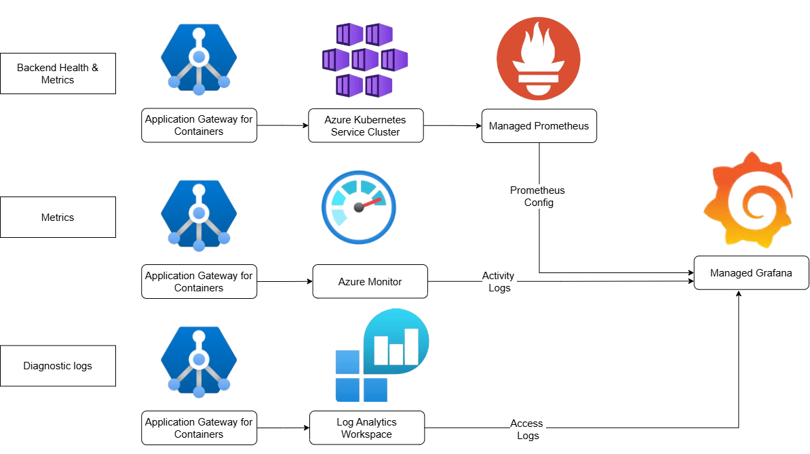](./media/prometheus-grafana/design-arch.png#lightbox)

## Learn About the Services
- [What is Azure Managed Prometheus?](../../azure-monitor/essentials/prometheus-metrics-overview.md)
   - Why use Prometheus:  Azure Prometheus offers native integration and management capabilities, simplifying the setup and management of monitoring infrastructure.
- [What is Azure Managed Grafana?](../../managed-grafana/overview.md)
   - Why use Grafana: Azure Managed Grafana lets you bring together all your telemetry data into one place and Built-in support for Azure Monitor and Azure Data Explorer using Microsoft Entra identities.
- [What is Azure Log Analytics Workspace?](../../azure-monitor/logs/log-analytics-workspace-overview.md)
   - Why use Log Analytics Workspace: Log Analytics workspace scales with your business needs, handling large volumes of log data efficiently and detects and diagnose issues quickly.
     
## Prerequisites

- An Azure account for work or school and an active subscription. You can create an account for free.
- Active Kubernetes cluster.
- Active Application Gateway for Container deployment.
- Active Resource Group with contributor permission.
  > [!TIP]
  > Alternative to Contributor role, you may also want to leverage the following:
  >  - Custom Role with 'microsoft.monitor/accounts/write'.
  >  - Read access.
  >  - Grafana Admin.
  >  - Log Analytics Contributor.
  >  - Monitoring Contributor permissions.
  > [Learn more about custom roles here](https://aka.ms/custom-roles).

  
  
## Create new Applications for Configuration

Complete the steps to configure prometheus and grafana. 
1. Sign in to the [Azure portal](https://portal.azure.com) with your Azure account.
2. In **Search resources, service, and docs**, type **Application Gateways for Containers** and select your Kubernetes Cluster name.
   
   [ 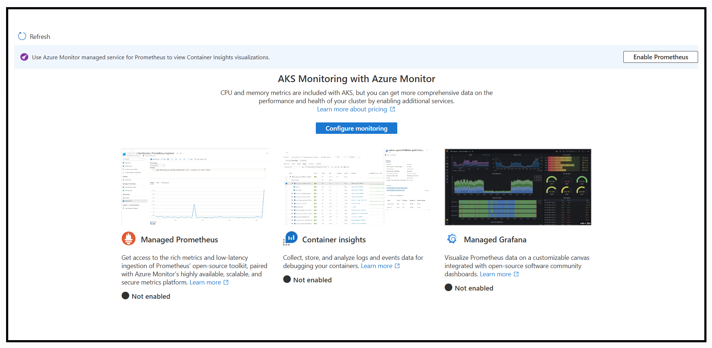 ](./media/prometheus-grafana/configure.png#lightbox)
   
3. Under insights and select **Configure Monitoring**.
   
    [ 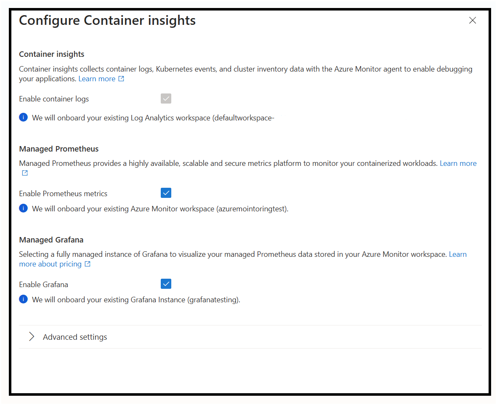 ](./media/prometheus-grafana/grafana-container.png#lightbox)

    Create new instances of Log analytics, Azure Monitor (Prometheus), and Managed Grafana to store current Kubernetes cluster metrics.
4. In **Search resources, service, and docs**, type **Managed Prometheus** and select.
   
   [ 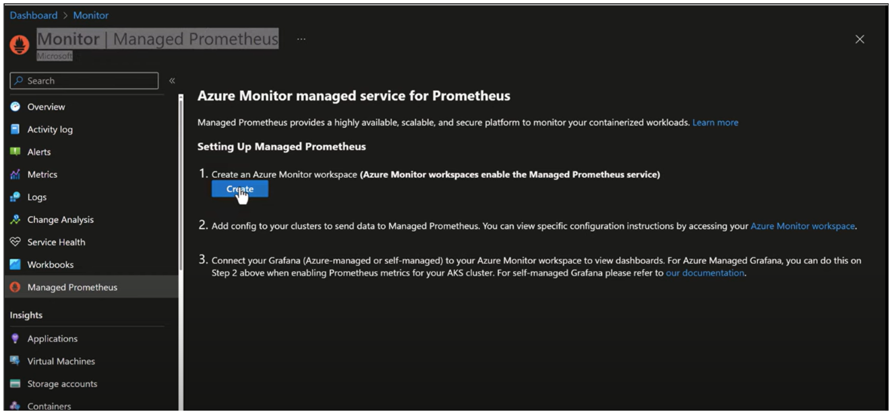 ](./media/prometheus-grafana/managed-prometheus.png#lightbox)
   
5.  Follow the steps to enable Azure Monitor to enable Managed Prometheus service by selecting **Create**.
6.  Create Azure Monitor Workspace Instance:
     1. In the **Create** an Azure Monitor Workspace page, select a subscription and resource group.
     2. Provide a name and a region for the workspace.
     3. Select **Review + create** to create the workspace.
7. Add Prometheus Config Map to your cluster:
   1. Copy this file to notepad or Visual Studio Code:  https://github.com/Azure/prometheus-collector/blob/main/otelcollector/configmaps/ama-metrics-settings-configmap.yaml.
   2. Modify line 35 to set podannotationnamespaceregex  from “” to "azure-alb-system".
      ```Bash
      # Example Kusto Query
      podannotationnamespaceregex = "azure-alb-system"
      ```
    3. Save the file as configprometheus.yaml.
    4. Add file into CLI (command-line interfaces) under manage files.
    5. Run the following command:
      ```Bash
      # Run the Following Command in Bash
      kubectl apply -f configprometheus.yaml
      ```
8. [Create a managed Grafana](../../managed-grafana/quickstart-managed-grafana-portal.md).
    Link a Grafana Workspace:
    - In **Search resources, service, and docs**, type **Azure Monitor**.
    - Select your monitor workspace. 
    - Select **Linked Grafana Workspaces**.
     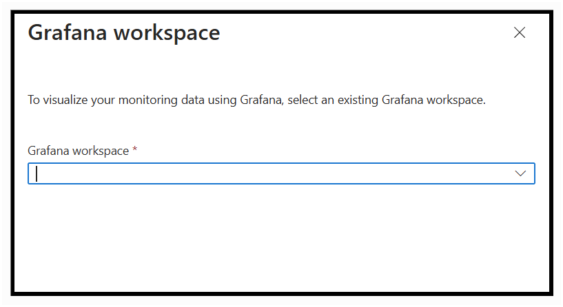
9. Select a Grafana workspace.
10. Select **Link**.


## Configure Kubernetes cluster for logging
We created the resources and now we combine all resources and configure prometheus.

1. Cluster configuration 
   1. In **Search resources, service, and docs**, search for your kubernetes cluster.
   2. Search for insights and Select on **Configure Monitoring**.
2. Specify each instance: 
    - Log analytics workspace: Use the default new log analytics workspace created for you.
    - Managed Prometheus: Select on **“Enable Prometheus metrics”** checkbox.
        -   Select on advanced setting: specify the Azure monitor workspace recently created.
    - Grafana Workspace: Select on **Enable Grafana** checkbox.
        -   Select on advanced setting: specify the Grafana instance recently created. 
   - Select **“Configure”**.
   > [!NOTE]
   > Check for ama-metrics under workloads in your kubernetes cluster.
   > [ 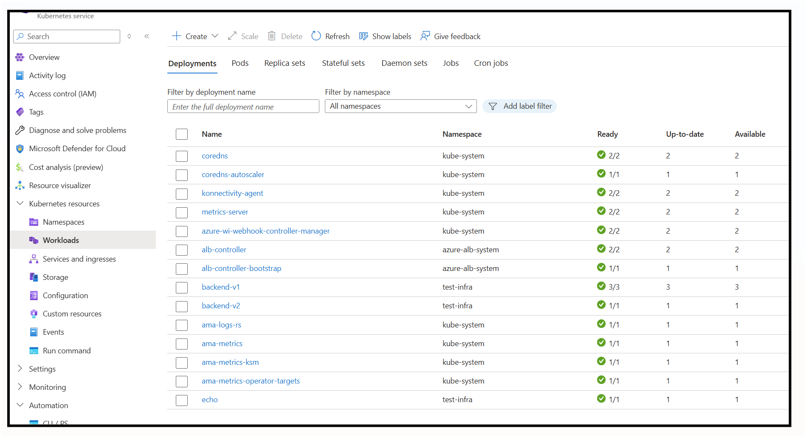 ](./media/prometheus-grafana/notes-image.png#lightbox)
   
## Enable diagnostic logs for Application Gateway for Containers
Activity logging is automatically enabled for every Resource Manager resource. For Access Logs, you must enable access logging to start collecting the data available through those logs. To enable logging, you may configure diagnostic settings in Azure Monitor.

1. [Create a log analytics workspace](../../azure-monitor/logs/quick-create-workspace.md).
2. Send logs from Application Gateway for Containers to log analytics workspace: 
   1. Enter **Application Gateway for Containers** in the search box. Select your active Application Gateway for Container resource.
   2. Search and select Diagnostic Setting under Monitoring. Add diagnostic setting.
   3. Select a name, check box **allLogs** which includes the Application Gateway for Container Access Logs, and select **Send to Log analytics Workspace** with your desired subscription and recently made log analytics workspace.
  [ 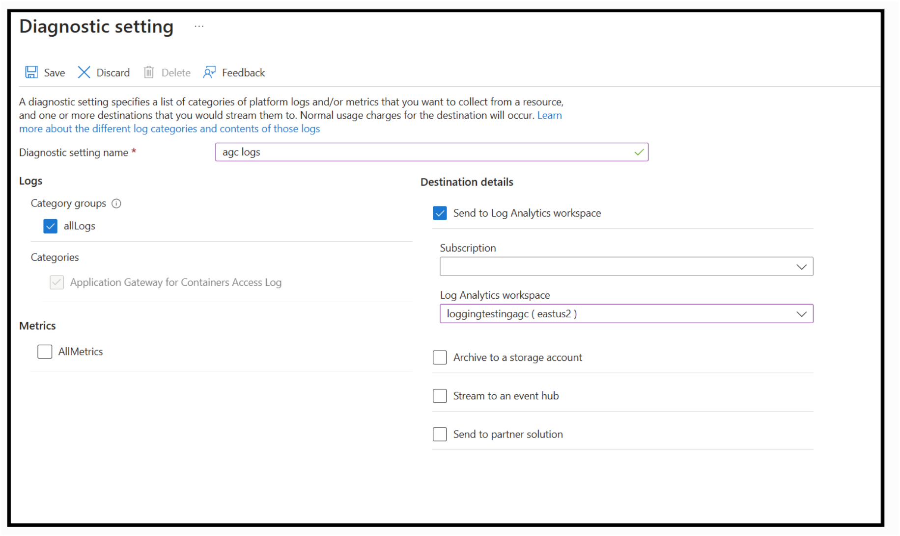 ](./media/prometheus-grafana/logs-all.png#lightbox)

3. Select **Save**.

## Access Grafana dashboard
In this section, we enter Grafana default dashboards.

1. In **Search resources, service, and docs**, select your **Managed Grafana**.
2. Select the grafana resource used for configuring monitoring in the cluster.
3. Select on Endpoint URL in the overview.
   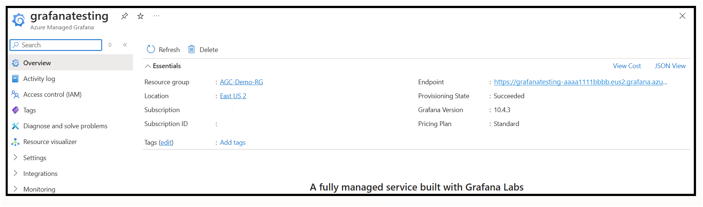

4. After entering your user credentials, refer to the Grafana introduction.
5. Select on the left side bar to access default dashboards under dashboards.
   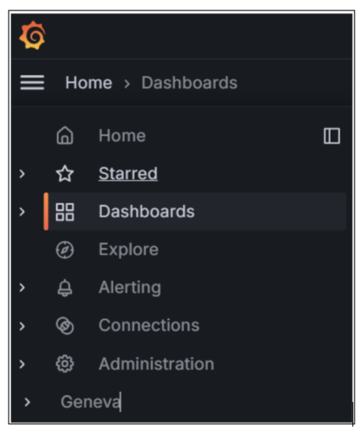

## Graph Prometheus metrics on Grafana 

In this section, we visualize a sample metric from Prometheus metrics. Refer to all Prometheus metrics availabilities here: [Prometheus Metrics](../../application-gateway/for-containers/application-gateway-for-containers-metrics.md).

1. In the right top corner, Select **Add Dashboard**.
2. Select **Add Visualization**.
3. Search for prometheus under data source.
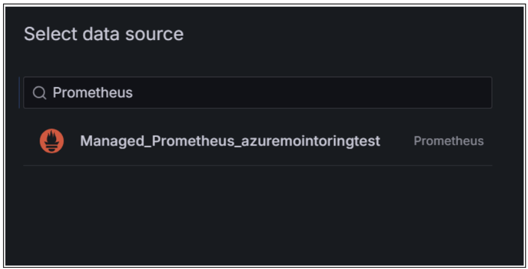
4. Select desired metric. For Example: alb_controller_total_unhealthy_endpoints that gives any unhealthy endpoints of your backend service.
5. Choose app as alb-controller.
6. Select name of the panel, type of visualization, and time range.
   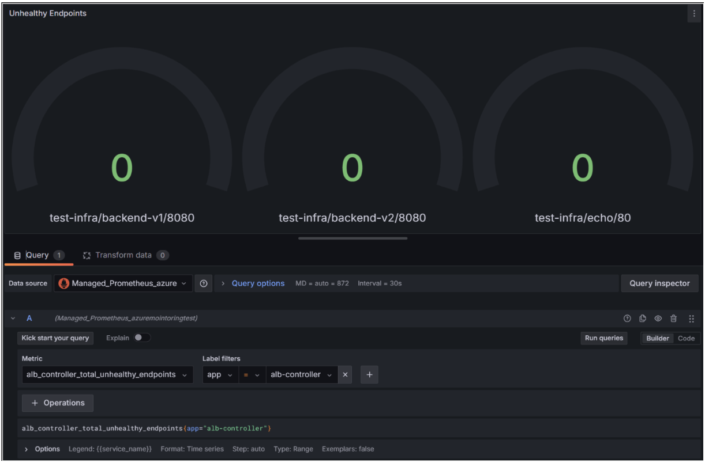
7. **Save + Apply** of your panel to add into your dashboard.
   > [!NOTE]
   > Add a custom legend by {{variable_name}}.

## Graph access logs and metrics on Grafana

In this section, we visualize a sample logs from Log Analytics Workspace. Refer to all diagnostic Logs availabilities here: [Diagnostic Logs](../../application-gateway/for-containers/diagnostics.md).

### Workspace for logs

1. In the right top corner, Select **Add + Add Dashboard**.
2. Select **Add Visualization**.
3. Search for Azure Monitor under data source + **Add**.
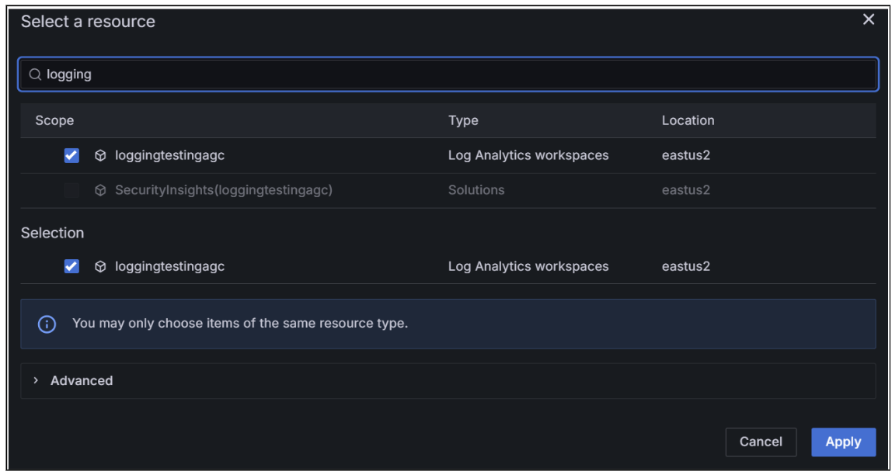
4. Change service as **Logs**.
5. Type: 
  ```kusto
  // Example Kusto Query
  AGCAccessLogs
  | project BackendResponseLatency, TimeGenerated
  ```
6. Select a **Time Series** as a visualization.
7. Select name, description, and time range of the panel.
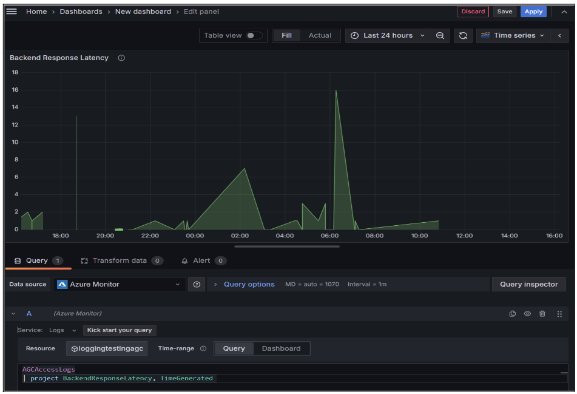
8. **Save + Apply** to your dashboard.

### Workspace for metrics

1. In the right top corner, select **Add + Add Dashboard**.
2. Select **Add Visualization**.
3. Search for Azure Monitor under data source+ **Add**.
4. Change service as Metrics.
5. Select your application gateway for containers instance.
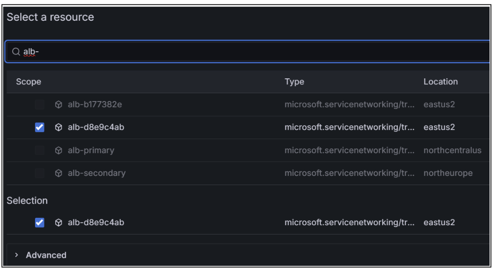](./media/prometheus-grafana/metrics-logs-datasource.png#lightbox)
6. Select metric namespace as microsoft.servicenetworking/trafficcontrollers.
7. Choose a metric such as **total requests** and type of data visualization.
[ 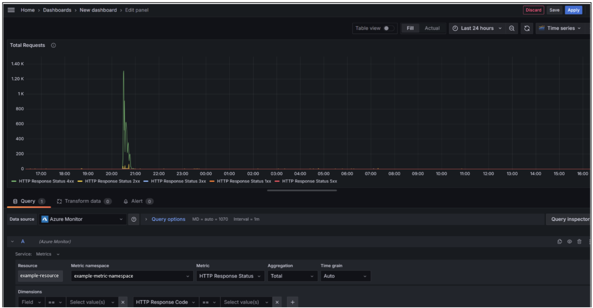 ](./media/prometheus-grafana/metrics-logs.png#lightbox)
8. Select a name, description, and time range of the panel.
9. **Save + Apply** to your dashboard.

Congratulations! You set up a monitoring service to enhance your health tracking! 
