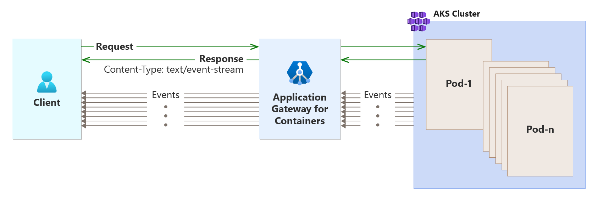

# Server-sent events

Server-sent events (SSEs) provide a useful mechanism to enable servers to push real-time updates to web clients over a single HTTP connection. Unlike WebSockets, which allow bidirectional communication, SSEs are unidirectional: the server sends data to the client without expecting any responses.

  

Applications using server-sent events can be found across several industries, such as medical (waiting area status boards), finance (displaying a stock ticker), aviation (flight status), and meteorology (current weather condition).

## Server-sent event connection and data flow

Server-sent events push data over the HTTP protocol. These events are supported by numerous browsers, defined by the EventSource interface, and standardized by W3C. The following process occurs for a server-sent event:

1. The client initiates a connection to the server.
2. The server sends a response containing the content-type of text/event-stream.
3. Both the client and server leave the connection open, enabling the server to send future events.

## Server-sent events and Application Gateway for Containers

## Server-sent events and scaling

When Application Gateway for Containers scales in, ongoing connections that aren't drained after 5 minutes are dropped. Server-sent events use automatic retry logic, which allows the application to establish a new connection and begin to receive new events.

### Server-sent events and HTTP/2

Server-sent events are supported both with HTTP/1.1 and HTTP/2. If the browser can support HTTP/2, server-sent events take advantage of multiplexing to improve performance by enabling multiple requests over the same connection.

### Configuration

Server-sent events are processed by Application Gateway for Containers. However, it's required to adjust the request timeout value for Application Gateway for Containers to prevent server-sent connections from timing out.

# [Gateway API](#tab/server-sent-events-gateway-api)

In Gateway API, a `RoutePolicy` resource should be defined with a `routeTimeout` value of `0s`.

```yaml
apiVersion: alb.networking.azure.io/v1 
kind: RoutePolicy 
metadata: 
  name: route-policy-with-timeout 
  namespace: test-sse 
spec: 
  targetRef: 
    kind: HTTPRoute 
    name: query-param-matching 
    group: gateway.networking.k8s.io 
  default: 
    timeouts:  
      routeTimeout: 0s 
```

# [Ingress API](#tab/session-affinity-ingress-api)

Server-sent events aren't supported using Ingress API.

---
