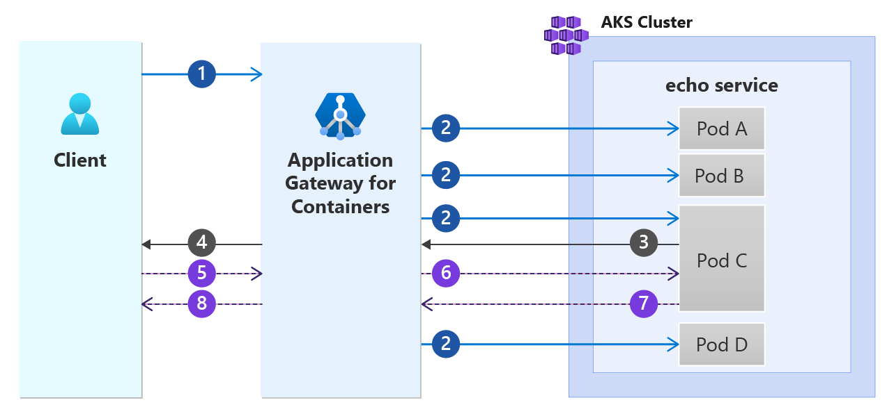

# Application Gateway for Containers session affinity overview

Session affinity, also known as *session persistence* or *sticky sessions*, is a technique used in load balancing to ensure a client's requests are always sent to the same server. This is important for applications that store user data in session variables or in a local cache on a particular server (commonly referred to as a stateful application).

With session affinity, Application Gateway for Containers presents a cookie in the **Set-Cookie** header of the first response. If the client presents the cookie in future requests, Application Gateway for Containers recognizes the cookie and forwards traffic to the same backend target. See the following example scenario:

  

The following steps are depicted in the previous diagram:
1. A client initiates a request to an Application Gateway for Containers' (AGC) frontend
2. AGC selects one of the many available pods to load balance the request to. In this example, we assume Pod C is selected out of the four available pods.
3. Pod C returns a response to AGC.
4. In addition to the backend response from Pod C, AGC adds a Set-Cookie header containing a uniquely generated hash used for routing.
5. The client sends another request to AGC along with the session affinity cookie set in the previous step.
6. AGC detects the cookie and selects Pod C to serve the request.
7. Pod C responds to AGC.
8. AGC returns the response to the client

## Usage details

[Session affinity](api-specification-kubernetes.md#alb.networking.azure.io/v1.SessionAffinity) is defined by the following properties and characteristics:

| Name | Description |
| ---- | ----------- |
| affinityType | Valid values are application-cookie or managed-cookie. |
| cookieName | Required if affinityType is application-cookie.  This is the name of the cookie. |
| cookieDuration | Required if affinityType is application-cookie.  This is the duration (lifetime) of the cookie in seconds. |

In managed cookie affinity type, Application Gateway uses predefined values when the cookie is offered to the client.
- The name of the cookie is: `AGCAffinity`.
- The duration (lifetime) of the cookie is 86,400 seconds (one day).
- The `cookieName` and `cookieDuration` properties and values are discarded.

In application affinity type, the cookie name and duration (lifetime) must be explicitly defined.

## How to configure session affinity

# [Gateway API](#tab/session-affinity-gateway-api)

Session affinity can be defined in a [RoutePolicy](api-specification-kubernetes.md#alb.networking.azure.io/v1.RoutePolicy) resource, which targets a defined HTTPRoute.  You must specify `sessionAffinity` with an `affinityType` of either `application-cookie` or `managed-cookie`.  In this example, we use `application-cookie` as the affinityType and explicitly define a cookie name and lifetime.

Example command to create a new RoutePolicy with a defined cookie called `nomnom` with a lifetime of 3,600 seconds (1 hour).

```bash
kubectl apply -f - <<EOF
apiVersion: alb.networking.azure.io/v1
kind: RoutePolicy
metadata:
  name: session-affinity-route-policy
spec:
  targetRef:
    kind: HTTPRoute
    name: http-route
    namespace: test-infra
    group: ""
  default:
    sessionAffinity: 
      affinityType: "application-cookie"
      cookieName: "nomnom"
      cookieDuration: 3600
EOF
```

# [Ingress API](#tab/session-affinity-ingress-api)

Session affinity can be defined in an [IngressExtension](api-specification-kubernetes.md#alb.networking.azure.io/v1.IngressExtensionSpec) resource.  You must specify `sessionAffinity` with an `affinityType` of either `application-cookie` or `managed-cookie`.  In this example, we use `application-cookie` as the affinityType and explicitly define a cookie name and lifetime.

Example command to create a new IngressExtension with a defined cookie called `nomnom` with a lifetime of 3,600 seconds (1 hour).

```bash
kubectl apply -f - <<EOF
apiVersion: alb.networking.azure.io/v1
kind: IngressExtension
metadata:
  name: session-affinity-ingress-extension
  namespace: test-infra
spec:
  backendSettings:
    - service: echo
      sessionAffinity:
        affinityType: "application-cookie"
        cookieName: "nomnom"
        cookieDuration: 3600
EOF
```

---
