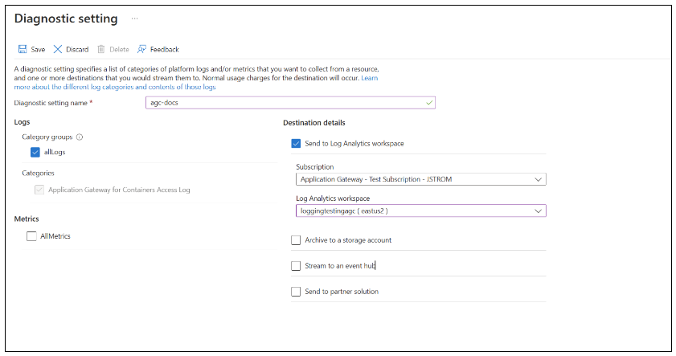

# Configure Application Gateway for Containers for SIEM integration with Azure Sentinel

In this QuickStart guide, you set up Microsoft Sentinel alongside Application Gateway for Container Access Log to monitor and examine any potential threats and alerts generated from logs. Additionally, you integrate a solution from the content hub. Following that, you configure a data connector to begin importing AGCAccessLog into Microsoft Sentinel. Finally, you establish an analytical rule, conduct a test alert, and visualize an alert for comprehensive oversight.

Sentinel reviews the logs from log analytics service and is an add-on service to your subscription. Both have a unified billing system for a comprehensive threat intelligence automation system.

## Prerequisites

- To ingest into Micorosft Sentinel, you need an active Log Analytics Workspace.
- To enable Microsoft Sentinel, you need contributor permissions to the subscription in which the Microsoft Sentinel workspace resides.
- To use Microsoft Sentinel, you need either Microsoft Sentinel Contributor or Microsoft Sentinel Reader permissions on the resource group that the workspace belongs to.
- To install or manage solutions in the content hub, you need the Microsoft Sentinel Contributor role on the resource group that the workspace belongs to	
## Enable Sentinel

1. Enable Azure Sentinel to your workspace: [Onboard to Azure Sentinel Workspace](../../sentinel/quickstart-onboard).
2. Send Logs to Log Analytics Workspace:
    - a. In **Search resources, service, and docs**, type **Application Gateways for Containers**.
    - b. Go to your selected Application Gateway for Container Resource.
    - c. Go to **Diagnostic Setting** under Monitoring.
        - a. Select a name, **check box allLogs** which includes the Application Gateway for Container Access Logs.
        - b. Select **“Send to Log analytics Workspace”** with your desired subscription and your log analytics workspace.
        
    > [!Note]
    > It will take a some minutes for AccessLogs to populate into your log analytics workspace.
3. View data ingested to Microsoft Sentinel:
    - a In **Search resources, service, and docs**, type **Azure Sentinel**.
    - b. Go to your selected Sentinel Resource.
    - c. Select **Logs**.
    - d. On the left-side bar, go to **Tables** where a section called **LogManagement** appear with digested AGCAccessLogs.
    - e. Preview all logs by hovering over AGCAccessLogs and click **Run**.
    

4. Create test analytical rule:
    - a In **Search resources, service, and docs**, type **Azure Sentinel**.
    - b. Go to your selected Sentinel Resource.
    - c. Select **Analytics** under **Configuration**.
    - d. Click **Create** and Select **Schedulde Query Rule**.
    - e. Enter name, description, and leave rest as default and go to next page.
    - f. Create rule query based on your AGCAccessLogs:
        - a. Example Scenario: A user sends encrypted data through a specific URL.
        - b. Goal: Detect threats from a HostName with RequestURI **"/secret/path"**.
        - c. Create query:
        
        - d. Detect associated IPs by Entity Mapping:
        
        - e. Set Query Scheduling:
            - Run for every 5 hours.
            - Look up data for every 5 hours.
        - f. **Review + Create**
5. Test Incident
    - a. An incident occurs after the rule is active. Now we're ready to send some traffic with **"/secret/path"** to our sample application, via the FQDN (fully qualified domain name) assigned to the frontend. Use the following command to get the FQDN.

    ```bash
    fqdn=$(kubectl get gateway gateway-01 -n test-infra -o jsonpath='{.status.addresses[0].value}')
    ```

    - b. Curling this FQDN should return responses from the backend as configured on the HTTPRoute.

    ```bash
    curl --insecure https://$fqdn/secret/path
    ```

6. Visualize Test Incident
    - a. After the Incident occurred, view the details of the details under **"Incidents"** under **"Threat Management**".
    - b. Select an Incident and open the pane on the right hand side of the page.
    - c. Click **"View Full Details"**.
    - d. Select **"Investigate"**.
    
    > [!Note]
    > **"Investigate"** option only appear if there are entities associated with that incident.
    - e. In Investigate, you can visualize the entities associated and similar alerts.
    
    - f. Click on the entity to view **Insights** to dig deeper into investigation.
    
7. Create an alert for extra security measures and communication: [Automate Playbook and Alerts](../../sentinel/automation/automate-responses-with-playbooks).

Congratulations! You can now create secuirty barriers on your logs and look into any incidents that may happened!
