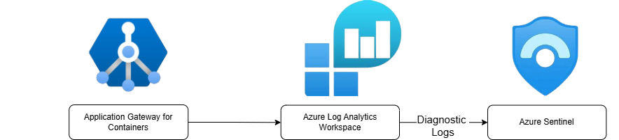
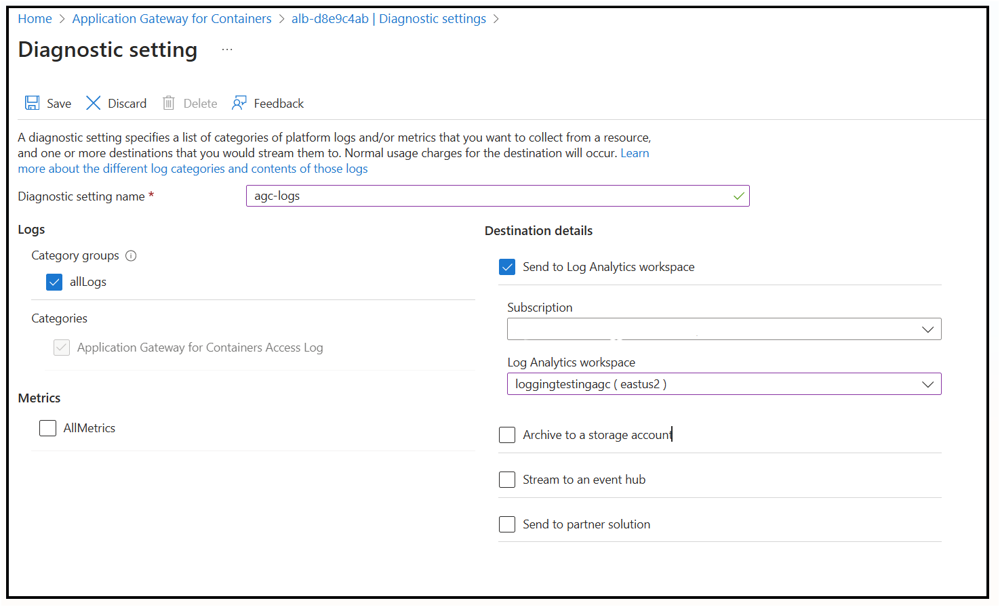
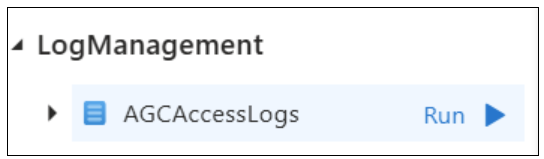
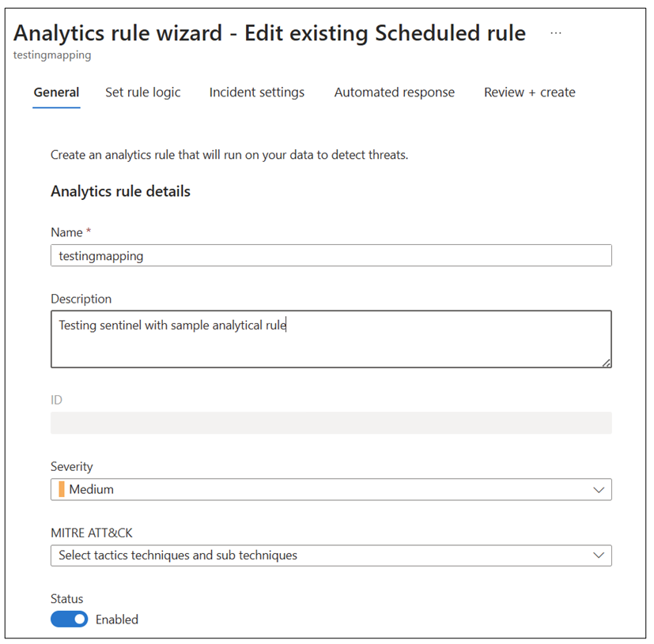
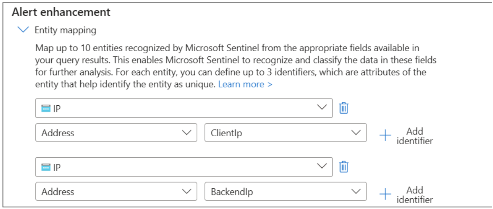
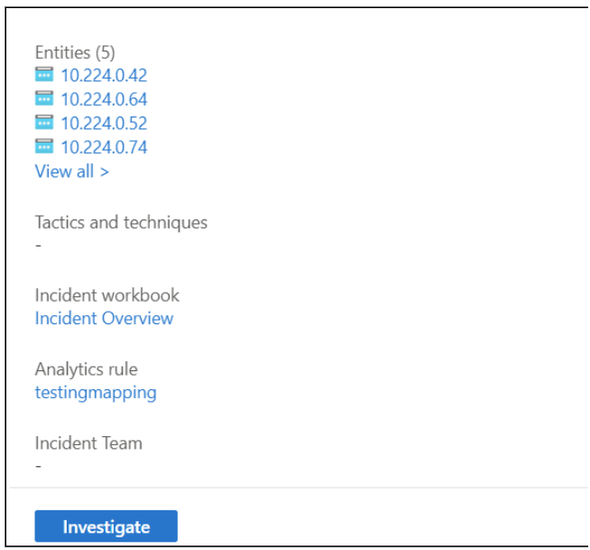
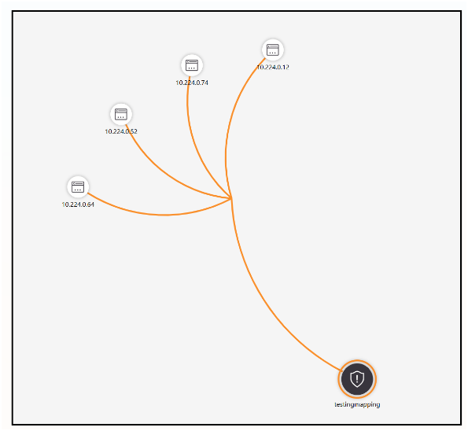
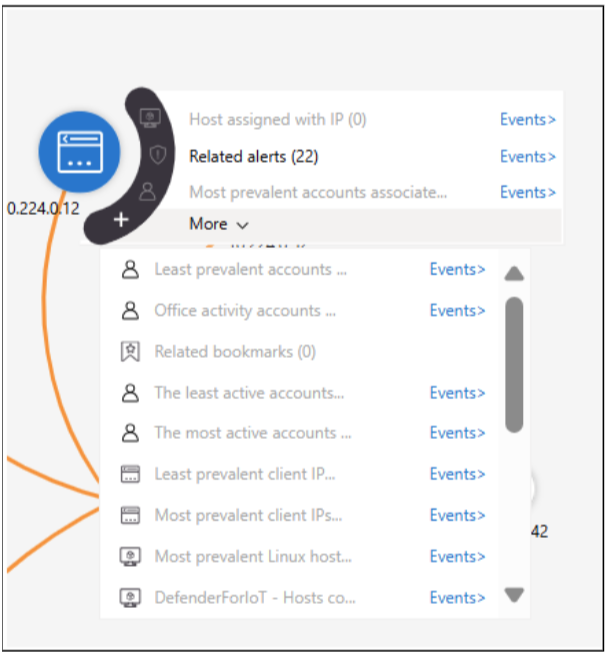

# Configure Application Gateway for Containers for SIEM integration with Azure Sentinel

By creating a SIEM integration with Application Gateway for Containers and Azure Sentinel, you streamline the security data collection across your digital environment. By following our QuickStart guide, you effortlessly set up Microsoft Sentinel to work in tandem with the Application Gateway for Container Access Logs. This setup allows you to monitor, detect, and examine potential threats and alerts generated from logs with precision. Additionally, by incorporating a solution from the content hub and configuring a data connector, you start importing access logs into Microsoft Sentinel without a hitch. To cap it off, you establish analytical rules, conduct test alerts, and utilize visualization tools for alerts, ensuring comprehensive oversight of your security landscape. 

In this QuickStart guide, you set up: 
- Integrate a log analytics workspace.
- Configure a data connector into Microsoft Sentinel.
- Establish an analytical rule, conduct a test alert, and visualize an alert for comprehensive oversight.
  [  ](./media/siem-integration-with-sentinel/sentinel-arch.png#lightbox)

## Learn About The Services
- [What is Azure Sentinel?](../../sentinel/overview.md)
  - Why use Sentinel:  Sentinel offers security content that is pre-packaged in SIEM solutions, allowing you to monitor, analyze, investigate, notify, and integrate with many platforms and products, including Log Analytics Workspace.
- [What is Azure Log Analytics Workspace?](../../azure-monitor/logs/log-analytics-workspace-overview.md)
  - Why use Log Analytics Workspace: Log Analytics workspace scales with your business needs, handling large volumes of log data efficiently and detects and diagnose issues quickly.
   
## Prerequisites

- You must have an active Log Analytics Workspace in order to ingest into Microsoft Sentinel.
- Permissions for contributors to control Microsoft Sentinel at the subscription and resource group levels.
- Permissions for contributors to install or manage Microsoft Sentinel solutions within the content hub.

## Enable Sentinel for Log Analytics Workspace

1. [Enable Azure Sentinel Workspace](../../sentinel/overview.md).
2. Send Logs to Log Analytics Workspace:
   1. In **Search resources, service, and docs**, type **Application Gateways for Containers**.
   2. Go to your selected Application Gateway for Container Resource.
   3. Go to Diagnostic Setting under Monitoring:
      1. Select a name, check box **allLogs** which include the Application Gateway for Container Access Logs.
      2. Select **Send to Log analytics Workspace** with your desired subscription and your log analytics workspace.
      [  ](./media/siem-integration-with-sentinel/logging.png#lightbox)

        > [!NOTE]
        > It takes a few minutes for AccessLogs to populate into your log analytics workspace.
    
3. View data ingested to Microsoft Sentinel:
   1. In **Search resources, service, and docs**, type **Azure Sentinel**.
   2. Go to your selected Sentinel Resource.
   3. Select **Logs**.
   4. On the left-side bar, go to **Tables** where a section called **LogManagement** appear with digested access logs.
   5. Preview all logs by hovering over access logs and click **Run**.
      
      
## Create Analytics Rule

1. In **Search resources, service, and docs**, type **Azure Sentinel**.
2. Go to your selected Sentinel Resource.
3. Select **Analytics** under configuration.
4. Click **Create** and Select **Schedule Query Rule**.
5. Enter name, description, and leave the rest as default and go to the next page.
  

6. Create rule query based on your access logs:
   - Example Scenario: A user sends encrypted data through a specific URL.
   - Goal: Detect threats from a HostName with RequestURI **"/secret/path"**.
   - Create query:
        
      ```bash
      # Example Query
      AGCAccessLogs
        | where HostName == "4.150.168.211" or RequestUri contains "/secret/path"
      ```

      This query filters `AGCAccessLogs` based on conditions related to hostname and request URI.

8. Detect associated IPs by Entity Mapping:
      &nbsp;&nbsp;&nbsp;&nbsp;&nbsp;&nbsp;&nbsp;&nbsp;&nbsp;&nbsp;

9. Set Query Scheduling:
    - Run for every 5 hours.
    - Look up data for every 5 hours.
11. **Review + Create**.


## Test Incident

1. Send traffic into the URL to create an incident: 
   - Now we're ready to send some traffic with **/secret/path** to our sample application, via the FQDN (fully qualified domain name) assigned to the frontend. Use the following command to get the FQDN:

    ```bash
    fqdn=$(kubectl get gateway gateway-01 -n test-infra -o jsonpath='{.status.addresses[0].value}')
    ```

2. Curling this FQDN should return responses from the backend as configured on the HTTPRoute:

    ```bash
    curl --insecure https://$fqdn/secret/path
    ```

    
## Visualize Test Incidents

 1. After the incident occurred, view the details in **Threat Management** under incidents.
 2. Select an incident and open the pane on the right-hand side of the page.
 3. Click **View Full Details**.
 4. Select **Investigate**.

    [  ](./media/siem-integration-with-sentinel/investigate.png#lightbox)

     > [!Note]
     > The **Investigate** option will only show up if the incident has any linked entities.

5. In Investigate, you can visualize the associated entities and similar alerts.
  
   [ ](./media/siem-integration-with-sentinel/mapping.png#lightbox)

6. Click on the entity to view **Insights** and delve deeper into the investigation.

   [  ](./media/siem-integration-with-sentinel/insights.png#lightbox)


[Automate Playbook and Alerts](../../azure-monitor/../sentinel/automation/automation.md) to create an alert for extra security measures and communication.

Congratulations, you can now create security barriers on your logs and investigate any incidents!
