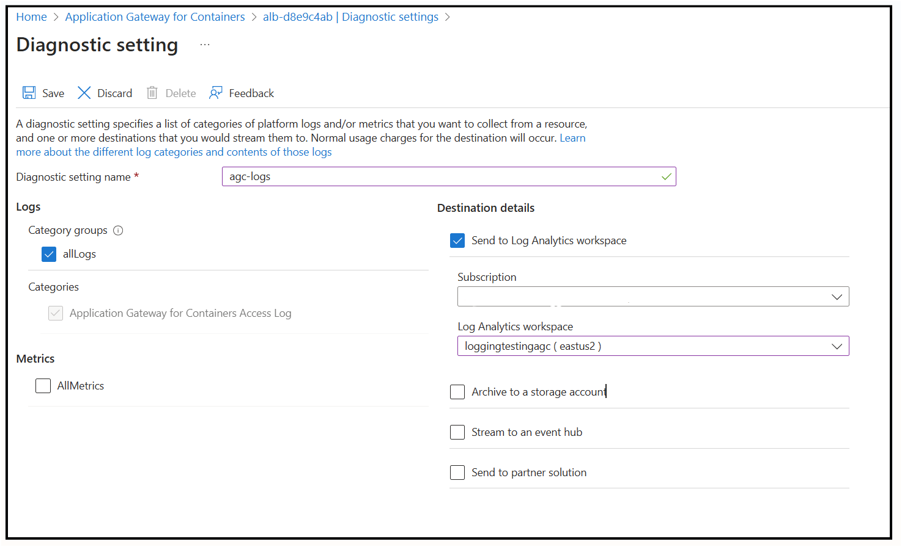

# Configure Application Gateway for Containers for SIEM integration with Microsoft Sentinel and Microsoft Defender

By integrating Application Gateway for Containers (AGC) with Microsoft Sentinel, you centralize and streamline security data collection across your environment. Using this quickstart guide, you can quickly configure Microsoft Sentinel to ingest AGC access logs, enabling precise monitoring, threat detection, and investigation based on real traffic signals. By adding the solution from the Content Hub and configuring the appropriate data connector, AGC access logs begin flowing into Microsoft Sentinel seamlessly. You can then define analytic rules, validate detections with test alerts, and use built-in visualization tools to gain clear, actionable security insights across your deployment.

When surfaced through the Microsoft Defender XDR unified portal, these signals are correlated across identities, endpoints, email, and cloud resources—providing end-to-end attack visibility, faster investigation, and coordinated response from a single SecOps experience.

In this quickstart guide, you set up: 
- Integrate a log analytics workspace.
- Configure a data connector into Microsoft Sentinel.
- Establish an analytical rule, conduct a test alert, and visualize an alert for comprehensive oversight.
- Migrate from Microsoft Sentinel to Microsoft Defender XDR

:::image type="content" source="media/siem-integration-with-sentinel/sentinel-agc-flowchart.png" lightbox="media/siem-integration-with-sentinel/sentinel-agc-flowchart.png" alt-text="Screenshot of Application Gateway for Containers SIEM integration flowchart.":::

> [!NOTE]
> Starting in July 2026, Microsoft Sentinel will be supported in the Defender portal only, and any remaining customers using the Azure portal will be automatically redirected.

## Learn about the services
- [What is Microsoft Sentinel?](/azure/sentinel/)
  - Microsoft Sentinel offers security content that is pre-packaged in SIEM solutions, allowing you to monitor, analyze, investigate, notify, and integrate with many platforms and products, including Log Analytics workspace.
- [What is Azure Log Analytics workspace?](/azure/azure-monitor/logs/log-analytics-workspace-overview)
  - Log Analytics workspace scales with your business needs, handling large volumes of log data efficiently and detects and diagnoses issues quickly.
- [What is Microsoft Defender portal?](https://security.microsoft.com/)
    - Microsoft Defender portal is the single place where security teams monitor, investigate, and respond to threats across identities, endpoints, email, applications, and cloud resources. See all capabilities of [Defender portal](/azure/sentinel/microsoft-sentinel-defender-portal).

## Prerequisites

- You must have an active Log Analytics workspace in order to ingest into Microsoft Sentinel.
- You must have Microsoft Sentinel Contributor permissions at the subscription level.
- You must have Owner or User Access Administrator permissions at the subscription level.

## Enable Microsoft Sentinel for Log Analytics workspace

1. [Enable Microsoft Sentinel workspace](../../sentinel/overview.md).
2. Send logs to **Log Analytics workspace**:
   1. In **Search resources, services, and docs**, type **Application Gateways for Containers**.
   2. Go to your selected **Application Gateway for Containers** resource.
   3. Go to **Diagnostic settings** under **Monitoring**:
      1. Select a name, check the **allLogs** checkbox which includes the Application Gateway for Containers access logs.
      2. Select **Send to Log Analytics workspace** with your desired subscription and your Log Analytics workspace.
            

3. View data ingested to Microsoft Sentinel:
   1. In **Search resources, services, and docs**, type Microsoft Sentinel.
   2. Go to your selected Microsoft Sentinel resource.
   3. Select **Logs**.
   4. On the left sidebar, go to **Tables** where a section called **LogManagement** appears with ingested access logs.
   5. Preview all logs by hovering over access logs and click **Run**.
      :::image type="content" source="media/siem-integration-with-sentinel/log-management.png" lightbox="media/siem-integration-with-sentinel/log-management.png" alt-text="Screenshot of Log Management section in Microsoft Sentinel.":::

## Enable Microsoft Sentinel to Microsoft Defender portal
1. Navigate to your Microsoft Sentinel resource.
2. Select **Content Hub** under **Content Management**.
3. Search for **Microsoft Defender XDR** and select **Install**. 
4. Head to **Data Connectors** under **Configuration**.
5. Check that **Microsoft Defender XDR** is connected and verify that your prerequisites are all green-checked and available.
:::image type="content" source="media/siem-integration-with-sentinel/sentinel-prereq.png" lightbox="media/siem-integration-with-sentinel/sentinel-prereq.png" alt-text="Screenshot of Microsoft Sentinel prerequisites check.":::
6. Go to the **Overview** page of your selected Microsoft Sentinel.
7. Select **Learn More** on the banner to onboard to Microsoft Defender portal. Another way to access is the link: https://security.microsoft.com/. 
8. Click **Connect a Workspace** and select your Microsoft Sentinel workspace. 
:::image type="content" source="media/siem-integration-with-sentinel/sentinel-workspace.png" lightbox="media/siem-integration-with-sentinel/sentinel-workspace.png" alt-text="Screenshot of connecting Microsoft Sentinel workspace to Defender portal.":::
9. Complete the remaining permission pages.
> [!NOTE]
> Microsoft Defender portal has the same navigation as Microsoft Sentinel with **Threat Management**, **Investigation**, **Content Management**, and **Configuration** on the left panel.

## Create analytics rule
1. Head to **Analytics** under **Configuration**.
2. Click **Create** and select **Scheduled Query Rule**.
:::image type="content" source="media/siem-integration-with-sentinel/sentinel-analytics.png" lightbox="media/siem-integration-with-sentinel/sentinel-analytics.png" alt-text="Screenshot of creating analytics rule in Microsoft Sentinel.":::

3. Enter name, description, and leave the rest as default and go to the next page.
:::image type="content" source="media/siem-integration-with-sentinel/create-rule.png" lightbox="media/siem-integration-with-sentinel/create-rule.png" alt-text="Screenshot of creating rule configuration in Microsoft Sentinel.":::

4. Create rule query based on your access logs:
   - **Example Scenario**: A user sends encrypted data through a specific URL.
   - **Goal**: Detect threats from a HostName with RequestURI **"/secret/path"**.
   - **Create query**:
      ```kusto
      // Example Query
      AGCAccessLogs
        | where HostName == "4.150.168.211" or RequestUri contains "/secret/path"
      ```
      This query filters **AGCAccessLogs** based on conditions related to hostname and request URI.

5. Detect associated IPs by **Entity Mapping**:
:::image type="content" source="media/siem-integration-with-sentinel/entity-mapping.png" lightbox="media/siem-integration-with-sentinel/entity-mapping.png" alt-text="Screenshot of entity mapping configuration.":::

6. Set **Query Scheduling**:
    - Run every **5 hours**.
    - Look up data for the last **5 hours**.
7. Select **Review + Create**.


## Test incident

1. Send traffic into the URL to create an incident: 
   - Now you're ready to send some traffic with **/secret/path** to your sample application, via the **FQDN** (fully qualified domain name) assigned to the frontend. Use the following command to get the FQDN:

```bash
    fqdn=$(kubectl get gateway gateway-01 -n test-infra -o jsonpath='{.status.addresses[0].value}')
```
2. Curling this FQDN should return responses from the backend as configured on the HTTPRoute:

    ```bash
    curl --insecure https://$fqdn/secret/path
    ```
## Visualize test incidents

 1. After the incident occurred, view the details in **Threat Management** under **Incidents & alerts** in **Investigation**.
 2. Select an incident and open the pane on the right-hand side of the page.
 3. Click **View Full Details**.
 4. Select **Investigate**.

    :::image type="content" source="media/siem-integration-with-sentinel/investigate.png" lightbox="media/siem-integration-with-sentinel/investigate.png" alt-text="Screenshot of investigation details in Microsoft Sentinel.":::

5. In **Investigate**, you can visualize the associated entities and similar alerts.
  
   :::image type="content" source="media/siem-integration-with-sentinel/mapping.png" lightbox="media/siem-integration-with-sentinel/mapping.png" alt-text="Screenshot of entity mapping and alert visualization.":::

6. Click on the entity to view **Insights** and delve deeper into the investigation.

   :::image type="content" source="media/siem-integration-with-sentinel/insights.png" lightbox="media/siem-integration-with-sentinel/insights.png" alt-text="Screenshot of entity insights for deeper investigation.":::


## Next steps

Congratulations! You can now create security barriers on your logs and investigate any incidents.

Try automating playbooks: 
- [Respond to incidents rapidly with automated playbooks and alerts](/azure/sentinel/overview?tabs=defender-portal#respond-to-incidents-rapidly) to create alerts for extra security measures and communication.

- [Migrate from Microsoft Sentinel to Microsoft Defender portal](https://learn.microsoft.com/en-us/azure/sentinel/microsoft-sentinel-defender-portal) for migration support - Microsoft Sentinel in the Azure portal will end in July 2026.
