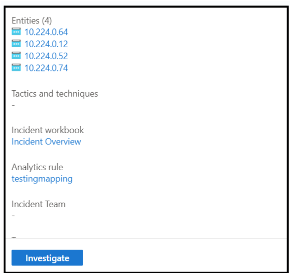
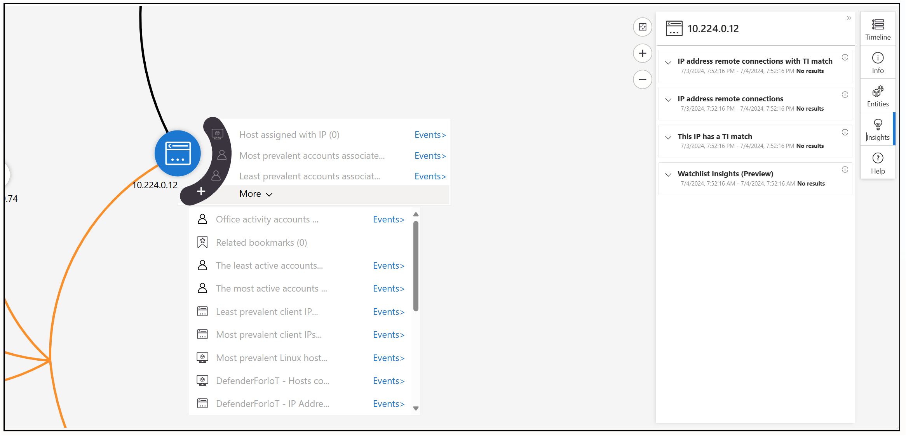

# Configure Application Gateway for Containers for SIEM integration with Azure Sentinel

By creating a SIEM integration with Application Gateway for Containers and Azure Sentinel, you streamline the security data collection across your digital environment. By following our QuickStart guide, you effortlessly set up Microsoft Sentinel to work in tandem with the Application Gateway for Container Access Logs. This setup allows you to monitor, detect, and examine potential threats and alerts generated from logs with precision. Additionally, by incorporating a solution from the content hub and configuring a data connector, you start importing access logs into Microsoft Sentinel without a hitch. To cap it off, you establish analytical rules, conduct test alerts, and utilize visualization tools for alerts, ensuring comprehensive oversight of your security landscape. 

In this QuickStart guide, you set up: 
- Integrate a log analytics workspace 
- Configure a data connector into Microsoft Sentinel.
- Establish an analytical rule, conduct a test alert, and visualize an alert for comprehensive oversight.


## Prerequisites

- To ingest into Microsoft Sentinel, you need an active Log Analytics Workspace.
- To enable Microsoft Sentinel, you need contributor permissions to the subscription in which the Microsoft Sentinel workspace resides.
- To use Microsoft Sentinel, you need either Microsoft Sentinel Contributor or Microsoft Sentinel Reader permissions on the resource group that the workspace belongs to.
- To install or manage solutions in the content hub, you need the Microsoft Sentinel Contributor role on the resource group that the workspace belongs to

## Enable Sentinel

1. [Enable Azure Sentinel Workspace](../../sentinel/overview.md).
2. Send Logs to Log Analytics Workspace:
    - a. In **Search resources, service, and docs**, type **Application Gateways for Containers**.
    - b. Go to your selected Application Gateway for Container Resource.
    - c. Go to **Diagnostic Setting** under Monitoring.
        - a. Select a name, **check box allLogs** which include the Application Gateway for Container Access Logs.
        - b. Select **“Send to Log analytics Workspace”** with your desired subscription and your log analytics workspace.
      
        

     > [!NOTE]
     > It takes a few minutes for AccessLogs to populate into your log analytics workspace.
    
3. View data ingested to Microsoft Sentinel:
    - a In **Search resources, service, and docs**, type **Azure Sentinel**.
    - b. Go to your selected Sentinel Resource.
    - c. Select **Logs**.
    - d. On the left-side bar, go to **Tables** where a section called **LogManagement** appear with digested access logs. 
    - e. Preview all logs by hovering over access logs and click **Run**.
      
4. Create test analytical rule:
    - a In **Search resources, service, and docs**, type **Azure Sentinel**.
    - b. Go to your selected Sentinel Resource.
    - c. Select **Analytics** under **Configuration**.
    - d. Click **Create** and Select **Schedule Query Rule**.
    - e. Enter name, description, and leave rest as default and go to next page.
    - f. Create rule query based on your access logs:
        - a. Example Scenario: A user sends encrypted data through a specific URL.
        - b. Goal: Detect threats from a HostName with RequestURI **"/secret/path"**.
        - c. Create query:
        

        - d. Detect associated IPs by Entity Mapping:
          &nbsp;&nbsp;&nbsp;&nbsp;&nbsp;&nbsp;&nbsp;&nbsp;&nbsp;&nbsp;
        - e. Set Query Scheduling:
            - Run for every 5 hours.
            - Look up data for every 5 hours.
        - f. **Review + Create**.
5. Test Incident
    - a. An incident occurs after the rule is active. Now we're ready to send some traffic with **"/secret/path"** to our sample application, via the FQDN (fully qualified domain name) assigned to the frontend. Use the following command to get the FQDN.

    ```bash
    fqdn=$(kubectl get gateway gateway-01 -n test-infra -o jsonpath='{.status.addresses[0].value}')
    ```

    - b. Curling this FQDN should return responses from the backend as configured on the HTTPRoute.

    ```bash
    curl --insecure https://$fqdn/secret/path
    ```

6. Visualize Test Incident
    - a. After the Incident occurred, view the details of the details under **"Incidents"** under **"Threat Management**".
    - b. Select an Incident and open the pane on the right hand side of the page.
    - c. Click **"View Full Details"**.
    - d. Select **"Investigate"**.
      
      &nbsp;&nbsp;&nbsp;&nbsp;&nbsp;&nbsp;&nbsp;&nbsp;&nbsp;&nbsp;
    
    > [!Note]
    > **"Investigate"** option only appear if there are entities associated with that incident.
   
    - e. In Investigate, you can visualize the entities associated and similar alerts.
    [ ](./media/siem-integration-with-sentinel/mapping.png#lightbox)

    - f. Click on the entity to view **Insights** to dig deeper into investigation.
      
      &nbsp;&nbsp;&nbsp;&nbsp;&nbsp;&nbsp;&nbsp;&nbsp;&nbsp;&nbsp;
7. [Automate Playbook and Alerts](../../azure-monitor/../sentinel/automation/automation.md) to create an alert for extra security measures and communication.

Congratulations, You can now create security barriers on your logs and investigate any incidents!
