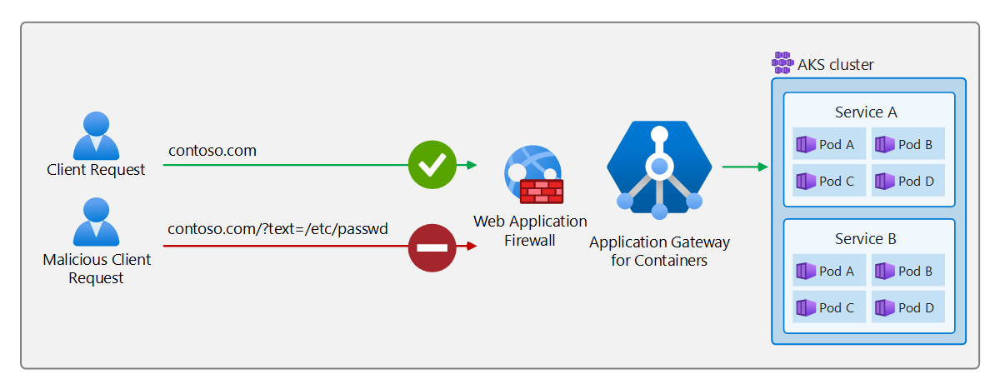

# Azure Web Application Firewall on Application Gateway for Containers

Azure Web Application Firewall provides centralized protection of your web applications from common exploits and vulnerabilities. All Azure Web Application Firewall functionality exists inside a policy, which can be referenced at listener or path-based routing rules within the Gateway API YAML configuration.



## Application Gateway for Containers implementation

### Security policy

Application Gateway for Containers introduces a new child resource called `SecurityPolicy` in Azure Resource Manager. The `SecurityPolicy` resource brings scope to which Azure Web Application Firewall policies the ALB Controller can reference.

### Kubernetes custom resource

Application Gateway for Containers introduces a new custom resource called `WebApplicationFirewallPolicy`. The custom resource is responsible for defining which Azure Web Application Firewall policy should be used at which scope.

The WebApplicationFirewallPolicy resource can target the following Kubernetes resources:

* `Gateway`
* `HTTPRoute`

The WebApplicationFirewallPolicy resource can also reference the following sections by name for further granularity:

* `Gateway`: `Listener`

### WAF Policy Configuration

The WAF policy must exist before you can assign it. Additionally, the service principal of the Application Load Balancer (ALB) Controller needs the permission `microsoft.network/applicationgatewaywebapplicationfirewallpolicies/join/action` on the WAF policy you want to assign. This service principal is named `azure-alb-identity` in the documentation. The permission is part of the `Network Contributor` role or you can assign a custom role. 

### Example implementations

#### Scope a policy to a Gateway resource

Here's an example YAML configuration that shows targeting a Gateway resource, which would apply to all listeners on a given Application Gateway for Containers' frontend resource.

```yaml
apiVersion: alb.networking.azure.io/v1
kind: WebApplicationFirewallPolicy
metadata:
  name: sample-waf-policy
  namespace: test-infra
spec:
  targetRef:
    group: gateway.networking.k8s.io
    kind: Gateway
    name: contoso-waf-route
    namespace: test-infra
  webApplicationFirewall:
    id: /subscriptions/.../Microsoft.Network/applicationGatewayWebApplicationFirewallPolicies/waf-policy-0
```

#### Scope policy to a specific listener of a Gateway resource

Within a `Gateway` resource, you may have different hostnames defined by different listeners (e.g. contoso.com and fabrikam.com). If contoso.com is a hostname of listenerA and fabrikam.com is a hostname of listenerB, you can define the `sectionNames` property to select the proper listener (for example, listenerA for contoso.com).

```yaml
apiVersion: alb.networking.azure.io/v1
kind: WebApplicationFirewallPolicy
metadata:
  name: sample-waf-policy
  namespace: test-infra
spec:
  targetRef:
    group: gateway.networking.k8s.io
    kind: Gateway
    name: contoso-waf-route
    namespace: test-infra
    sectionNames: ["contoso-listener"]
  webApplicationFirewall:
    id: /subscriptions/.../Microsoft.Network/applicationGatewayWebApplicationFirewallPolicies/waf-policy-0
```

#### Scope policy across all routes and paths

This example shows how to target a defined HTTPRoute resource to apply the policy to any routing rules and paths within a given HTTPRoute resource.

```yaml
apiVersion: alb.networking.azure.io/v1
kind: WebApplicationFirewallPolicy
metadata:
  name: sample-waf-policy
  namespace: test-infra
spec:
  targetRef:
    group: gateway.networking.k8s.io
    kind: HTTPRoute
    name: contoso-pathA
    namespace: test-infra
  webApplicationFirewall:
    id: /subscriptions/.../Microsoft.Network/applicationGatewayWebApplicationFirewallPolicies/waf-policy-0
  ```

#### Scope policy to a particular path

To use different WAF policies to different paths of the same `Gateway` or Gateway -> Listener sectionName, you can define two HTTPRoute resources, each with a unique path, that each references its applicable WAF policy.

```yaml
apiVersion: alb.networking.azure.io/v1
kind: WebApplicationFirewallPolicy
metadata:
  name: sample-waf-policy-A
  namespace: test-infra
spec:
  targetRef:
    group: gateway.networking.k8s.io
    kind: HTTPRoute
    name: contoso-pathA
    namespace: test-infra
  webApplicationFirewall:
    id: /subscriptions/.../Microsoft.Network/applicationGatewayWebApplicationFirewallPolicies/waf-policy-0
---
apiVersion: alb.networking.azure.io/v1
kind: WebApplicationFirewallPolicy
metadata:
  name: sample-waf-policy-B
  namespace: test-infra
spec:
  targetRef:
    group: gateway.networking.k8s.io
    kind: HTTPRoute
    name: contoso-pathB
    namespace: test-infra
  webApplicationFirewall:
    id: /subscriptions/.../Microsoft.Network/applicationGatewayWebApplicationFirewallPolicies/waf-policy-1
```

## Common Issues

The most common issues are that either the WAF policy you want to assign does not exist or that the service principal of the ALB does not have enough permissions to attach the WAF policy. 

Use the following command to check the status of the deployment of the WAF policy:

```azurecli-interactive
kubectl get WebApplicationFirewallPolicy -n test-infra
```
You should see the following output:
   
| NAME            | Deployment  |  AGE  |
| --------------- | ----------- | ----- |
| waf-policy-0    | True        | 5m16s |

If the Deployment is `False` then use the following command to examine the policy assignment:

```azurecli-interactive
kubectl describe WebApplicationFirewallPolicy waf-policy-0 -n test-infra
```

## Limitations

The following functionality is not supported on an Azure Web Application Firewall policy that's associated with Application Gateway for Containers:

- **Cross-region, cross-subscription policy**: Your WAF policy must be in the same subscription and region as your Application Gateway for Containers resource.
- **Core Rule Set (CRS) managed rules**: An Application Gateway for Containers WAF supports only Default Rule Set (DRS) 2.1 managed rule set.
- **Legacy Bot Manager Rule Set**: Bot Manager Ruleset 0.1 isn't supported, but Bot Manager Ruleset versions 1.0 and 1.1 are supported.
- **JavaScript challenge actions on Bot Manager rules**: You can't set the action on a Bot Manager rule to JavaScript challenge.
- **Captcha challenge actions on Bot Manager rules**: You can't set the action on a Bot Manager rule to Captcha.
- **Microsoft Security Copilot**: The Security Copilot is not supported on Application Gateway for Containers WAF.
- **Custom Block Response**: Setting a custom block response in your WAF policy is not supported on Application Gateway for Containers WAF.
- **X-Forwarded-For Header (XFF)**: Application Gateway for Containers WAF doesn't support the XFF variable in custom rules.
- **HTTP DDoS Ruleset**: This managed ruleset isn't currenlty supported on Application Gateway for Containers.

## Pricing

For pricing details, see [Understanding pricing for Application Gateway for Containers](understanding-pricing.md).
