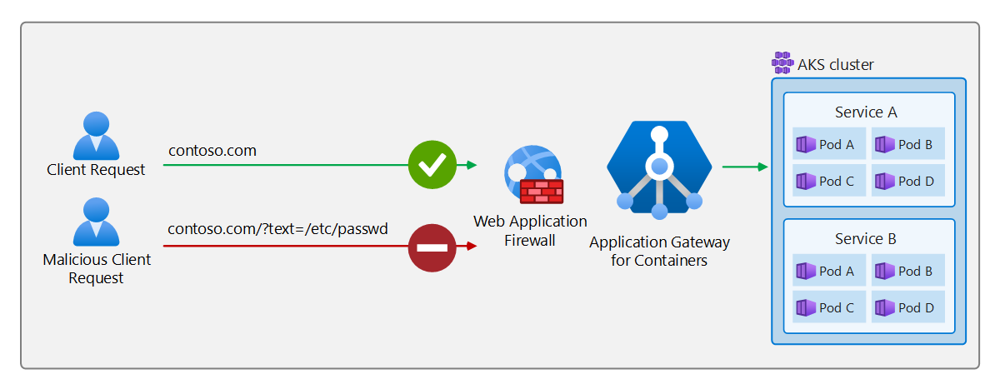

# Azure Web Application Firewall on Application Gateway for Containers

Azure Web Application Firewall provides centralized protection of your web applications from common exploits and vulnerabilities. All Azure Web Application Firewall functionality exists inside a policy, which can be referenced at listener or path-based routing rules within the Gateway API YAML configuration.



## Application Gateway for Containers implementation

### Security policy

Application Gateway for Containers introduces a new child resource called `SecurityPolicy` in Azure Resource Manager. The `SecurityPolicy` resource brings scope to which Azure Web Application Firewall policies the ALB Controller can reference.

### Kubernetes custom resource

Application Gateway for Containers introduces a new custom resource called `WebApplicationFirewallPolicy`. The custom resource is responsible for defining which Azure Web Application Firewall policy should be used at which scope.

The WebApplicationFirewallPolicy resource can target the following Kubernetes resources:

* `Gateway`
* `HTTPRoute`

The WebApplicationFirewallPolicy resource can also reference the following sections by name for further granularity:

* `Gateway`: `Listener`

### Example implementations

#### Scope a policy to a Gateway resource

Here's an example YAML configuration that shows targeting a Gateway resource, which would apply to all listeners on a given Application Gateway for Containers' frontend resource.

```yaml
apiVersion: alb.networking.azure.io/v1
kind: WebApplicationFirewallPolicy
metadata:
  name: sample-waf-policy
  namespace: test-infra
spec:
  targetRef:
    group: gateway.networking.k8s.io
    kind: Gateway
    name: contoso-waf-route
    namespace: test-infra
  webApplicationFirewall:
    id: /subscriptions/.../Microsoft.Network/applicationGatewayWebApplicationFirewallPolicies/waf-policy-0
```

#### Scope policy to a specific listener of a Gateway resource

Within a `Gateway` resource, you may have different hostnames defined by different listeners (e.g. contoso.com and fabrikam.com). If contoso.com is a hostname of listenerA and fabrikam.com is a hostname of listenerB, you can define the `sectionNames` property to select the proper listener (for example, listenerA for contoso.com).

```yaml
apiVersion: alb.networking.azure.io/v1
kind: WebApplicationFirewallPolicy
metadata:
  name: sample-waf-policy
  namespace: test-infra
spec:
  targetRef:
    group: gateway.networking.k8s.io
    kind: Gateway
    name: contoso-waf-route
    namespace: test-infra
    sectionNames: ["contoso-listener"]
  webApplicationFirewall:
    id: /subscriptions/.../Microsoft.Network/applicationGatewayWebApplicationFirewallPolicies/waf-policy-0
```

#### Scope policy across all routes and paths

This example shows how to target a defined HTTPRoute resource to apply the policy to any routing rules and paths within a given HTTPRoute resource.

```yaml
apiVersion: alb.networking.azure.io/v1
kind: WebApplicationFirewallPolicy
metadata:
  name: sample-waf-policy
  namespace: test-infra
spec:
  targetRef:
    group: gateway.networking.k8s.io
    kind: HTTPRoute
    name: contoso-pathA
    namespace: test-infra
  webApplicationFirewall:
    id: /subscriptions/.../Microsoft.Network/applicationGatewayWebApplicationFirewallPolicies/waf-policy-0
  ```

#### Scope policy to a particular path

To use different WAF policies to different paths of the same `Gateway` or Gateway -> Listener sectionName, you can define two HTTPRoute resources, each with a unique path, that each references its applicable WAF policy.

```yaml
apiVersion: alb.networking.azure.io/v1
kind: WebApplicationFirewallPolicy
metadata:
  name: sample-waf-policy-A
  namespace: test-infra
spec:
  targetRef:
    group: gateway.networking.k8s.io
    kind: HTTPRoute
    name: contoso-pathA
    namespace: test-infra
  webApplicationFirewall:
    id: /subscriptions/.../Microsoft.Network/applicationGatewayWebApplicationFirewallPolicies/waf-policy-0
---
apiVersion: alb.networking.azure.io/v1
kind: WebApplicationFirewallPolicy
metadata:
  name: sample-waf-policy-B
  namespace: test-infra
spec:
  targetRef:
    group: gateway.networking.k8s.io
    kind: HTTPRoute
    name: contoso-pathB
    namespace: test-infra
  webApplicationFirewall:
    id: /subscriptions/.../Microsoft.Network/applicationGatewayWebApplicationFirewallPolicies/waf-policy-1
```

## Limitations

The following functionality is not supported on an Azure Web Application Firewall policy that's associated with Application Gateway for Containers:

* Azure Web Application Firewall integration in Microsoft Security Copilot
* JavaScript challenge actions
* Core Rule Set (CRS) 3.2 and earlier rule sets

> [!NOTE]
> The association of Application Gateway for Containers with Azure Web Application Firewall is in preview. For legal terms that apply to Azure features that are in beta, in preview, or otherwise not yet released into general availability, see [Supplemental Terms of Use for Microsoft Azure Previews](https://azure.microsoft.com/support/legal/preview-supplemental-terms/).
