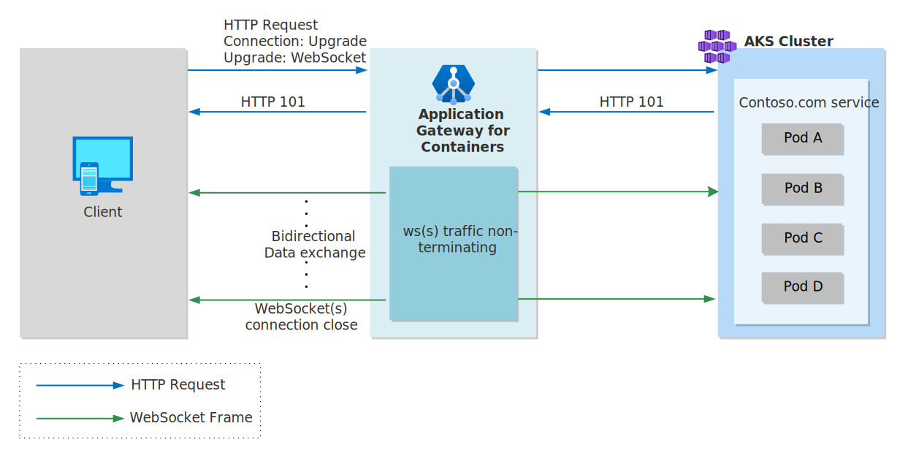

# WebSocket protocol and Application Gateway for Containers

WebSockets, established in [RFC6455](https://datatracker.ietf.org/doc/html/rfc6455), enable two-way communication between a client and server. Unlike a traditional HTTP or HTTPS request that, WebSockets allow for the browser to establish a connection and receive continuous data from a server, without having to constantly pull the remote server or need to establish multiple connections in both directions (client to server and server to client).

## WebSocket benefits

The WebSocket protocol has several benefits over traditional HTTP requests, including:

- Browser compatibility: Nearly all modern web browsers support WebSockets.
- Real-time data: WebSockets enable real-time data transfer between client and server.
- Efficiency: WebSockets eliminate the need to continuously poll servers to check for updates.
- Security: WebSockets can be encrypted using TLS and use standard HTTP ports, such as 80 and 443.
- Flexibility: WebSockets can be used for a variety of applications, including chat, gaming, and financial trading platforms.

## How the WebSocket protocol works

To establish a WebSocket connection, a specific HTTP-based handshake is exchanged between the client and the server. If successful, the application-layer protocol is "upgraded" from HTTP to WebSockets, using the previously established TCP connection. Once this occurs, the protocol is changed to WebSockets and traffic no longer flows over HTTP.  Data is sent or received using the WebSocket protocol by both endpoints until the WebSocket connection is closed.



> [!NOTE]
> After a connection is upgraded to WebSocket, as an intermediary/terminating proxy, Application Gateway for Containers will send the data received from the frontend to the backend and vice-versa, without any inspection or manipulation capability.
> Therefore, any manipulations like Header Rewrites, URL Rewrites, or Overriding Hostname will not apply after establishing a WebSocket connection.

WebSocket connections may be either in plain-text or encrypted over TLS. When a connection is established over plain-text, the connection is established in the format of ws://\<fqdn\>/path.  When a connection is established over TLS, the connection is established in the format of wss://\<fqdn\>/path.

### Health probes

No configuration is required to leverage a WebSocket request in Application Gateway for Containers, however you must ensure you properly configure health probes to ensure the backend is reflected as healthy.

By default, Application Gateway for Containers attempts to initiate an HTTP handshake to the backend port running the WebSocket service. In many cases, this erroneously labels the backend as unhealthy, so a HealthCheckPolicy should be defined to ensure the health probe considers use of a TCP probe.

Here's an example of a HealthCheckPolicy for a WebSocket backend.

```bash
kubectl apply -f - <<EOF
apiVersion: alb.networking.azure.io/v1
kind: HealthCheckPolicy
metadata:
  name: websockets-health-check-policy
  namespace: test-infra
spec:
  targetRef:
    group: ""
    kind: Service
    name: websockets-backend
    namespace: test-infra
  default:
    interval: 5s
    timeout: 3s
    healthyThreshold: 1
    unhealthyThreshold: 1
    http:
      path: /health 
EOF
```

>[!Note]
>WebSockets are only supported when using Gateway API for Application Gateway for Containers.

### Metrics & Monitoring

Diagnostic Logs:

WebSocket connections operate using a distinct protocol. Upon initiating the connection, the browser receives an HTTP 101 status code, indicating the switch from HTTP to WebSocket and will be reflected in the access log.

The details of the WebSocket connection are recorded only when the connection closes. This allows the duration of each connection to be accurately measured.

## Next steps

[Learn more](how-to-websockets-gateway-api.md) about WebSockets and Gateway API
