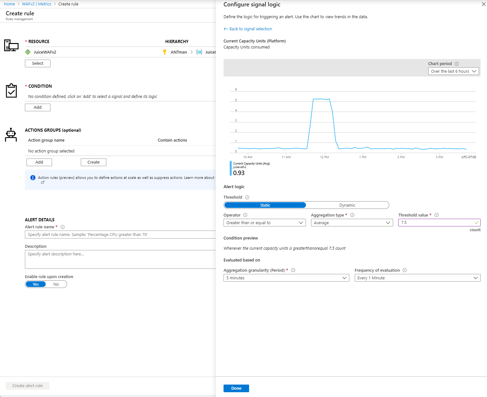

# Application Gateway high traffic support

>[!NOTE]
> This article describes a few suggested guidelines to help you set up your Application Gateway to handle extra traffic due to high traffic volume that may occur due to the COVID-19 crisis.

You can use Application Gateway with Web Application Firewall (WAF) for a scalable and secure way to manage traffic to your web applications.

The following suggestions help you set up Application Gateway with WAF to handle extra traffic.

## Use the v2 SKU over v1 for its autoscaling capabilities and performance benefits
The v2 SKU offers autoscaling to ensure that your Application Gateway can scale up as traffic increases. It also offers other significant performance benefits, such as 5x better TLS offload performance, quicker deployment and update times, zone redundancy, and more when compared to v1. For more information, see our [v2 documentation](https://docs.microsoft.com/azure/application-gateway/application-gateway-autoscaling-zone-redundant). 

## Set maximum instance count to the maximum possible (125)
 
Assuming you have an Application Gateway v2 SKU, setting the maximum instance count to the maximum possible value of 125 allows the Application Gateway to scale out as needed. This allows it to handle the possible increase in traffic to your applications. You will only be charged for the Capacity Units (CUs) you use.  

## Set your minimum instance count based on your average CU usage

Assuming you have an Application Gateway v2 SKU, autoscaling takes six to seven minutes to scale out. With a higher minimum instance count, the Application Gateway can better handle your traffic when the load is increased, because a spike in traffic doesn't require an autoscaling operation.  

## Alert if a certain metric surpasses 75% of average CU utilization 
See the [Application Gateway Metrics documentation](https://docs.microsoft.com/azure/application-gateway/application-gateway-metrics#metrics-visualization) for a detailed explanation of our metrics and other walkthroughs. 

### Example: Setting up an alert on 75% of average CU usage

This example shows you how to use the Azure portal to set up an alert when 75% of average CU usage is reached. 
1. Navigate to your **Application Gateway**.
2. On the left panel, select **Metrics** under the **Monitoring** tab. 
3. Add a metric for **Average Current Compute Units**. 

4. If you've set your minimum instance count to be your average CU usage, go ahead and set an alert when 75% of your minimum instances are in use. For example, if your average usage is 10 CUs, set an alert on 7.5 CUs. This alerts you if usage is increasing and gives you time to respond. You can raise the minimum if you think this traffic will be sustained to alert you that traffic may be increasing. 

> [!NOTE]
> You can set the alert to occur at a lower or higher CU utilization percentage depending on how sensitive you want to be to potential traffic spikes.

## Set up WAF with geofiltering and bot protection to stop attacks
If you want an extra layer of security in front of your application, use the Application Gateway WAF_v2 SKU for WAF capabilities. You can configure the v2 SKU to only allow access to your applications from a given country/region or countries/regions. You set up a WAF custom rule to explicitly allow or block traffic based on the geolocation. For more information, see [geofiltering custom rules](https://docs.microsoft.com/azure/web-application-firewall/ag/geomatch-custom-rules) and [how to configure custom rules on Application Gateway WAF_v2 SKU through PowerShell](https://docs.microsoft.com/azure/web-application-firewall/ag/configure-waf-custom-rules).

Enable bot protection to block known bad bots. This should reduce the amount of traffic getting to your application. For more information, see [bot protection with set up instructions](https://docs.microsoft.com/azure/web-application-firewall/ag/configure-waf-custom-rules).

## Turn on diagnostics on Application Gateway and WAF

Diagnostic logs allow you to view firewall logs, performance logs, and access logs. You can use these logs in Azure to manage and troubleshoot Application Gateways. For more information, see our [diagnostics documentation](https://docs.microsoft.com/azure/application-gateway/application-gateway-diagnostics#diagnostic-logging). 

## Set up an TLS policy for extra security
Ensure you're using the latest TLS policy version ([AppGwSslPolicy20170401S](https://docs.microsoft.com/azure/application-gateway/application-gateway-ssl-policy-overview#appgwsslpolicy20170401s)). This enforces TLS 1.2 and stronger ciphers. For more information, see [configuring TLS policy versions and cipher suites via PowerShell](https://docs.microsoft.com/azure/application-gateway/application-gateway-configure-ssl-policy-powershell).
