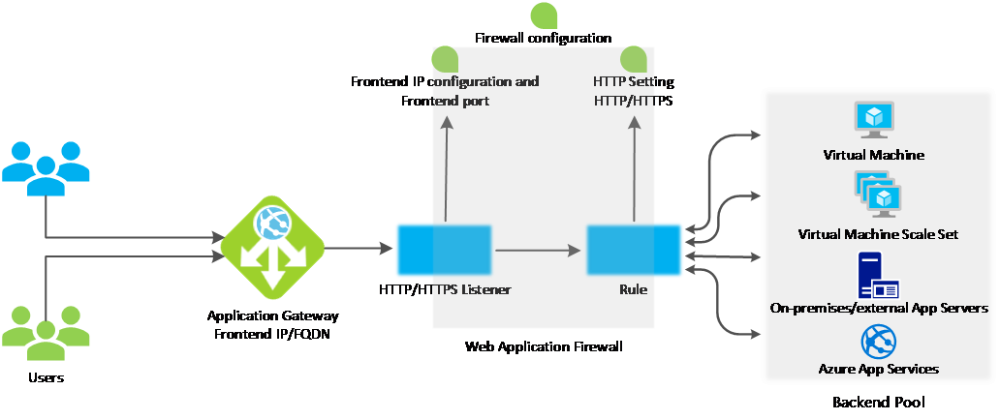

# How an application gateway works

This article explains how an application gateway accepts incoming requests and routes them to the backend.

## How an application gateway accepts a request

1. Before a client sends a request to an application gateway, it resolves the domain name of the application gateway by using a Domain Name System (DNS) server. Azure controls the DNS entry because all application gateways are in the azure.com domain.

2. The Azure DNS returns the IP address to the client, which is the frontend IP address of the application gateway.

3. The application gateway accepts incoming traffic on one or more listeners. A listener is a logical entity that checks for connection requests. It's configured with a frontend IP address, protocol, and port number for connections from clients to the application gateway.

4. If a web application firewall (WAF) is in use, the application gateway checks the request headers and the body, if present, against WAF rules. This action determines if the request is valid request or a security threat. If the request is valid, it's routed to the backend. If the request isn't valid, it's blocked as a security threat.

Azure Application Gateway can be used as an internal application load balancer or as an internet-facing application load balancer. An internet-facing application gateway uses public IP addresses. The DNS name of an internet-facing application gateway is publicly resolvable to its public IP address. As a result, internet-facing application gateways can route client requests to the internet.

Internal application gateways use only private IP addresses. The DNS name of an internal application gateway is publicly resolvable to its private IP address. Therefore, internal load-balancers can only route requests from clients with access to a virtual network for the application gateway.

Both internet-facing and internal-application gateways route requests to backend servers using private IP addresses. Backend servers don't need public IP addresses to receive requests from an internal or an internet-facing application gateway.

## How an application gateway routes a request

If a request is valid or a WAF isn't in use, the application gateway evaluates the request routing rule that's associated with the listener. This action determines which backend pool to route the request to.

Rules are processed in the order they're listed in the portal. Based on the request routing rule, the application gateway determines whether to route all requests on the listener to a specific backend pool, route requests to different backend pools based on the URL path, or redirect requests to another port or external site.

When the application gateway selects the backend pool, it sends the request to one of the healthy backend servers in the pool (y.y.y.y). The health of the server is determined by a health probe. If the backend pool contains multiple servers, the application gateway uses a round-robin algorithm to route the requests between healthy servers. This load balances the requests on the servers.

After the application gateway determines the backend server, it opens a new TCP session with the backend server based on HTTP settings. HTTP settings specify the protocol, port, and other routing-related settings that are required to establish a new session with the backend server.

The port and protocol used in HTTP settings determine whether the traffic between the application gateway and backend servers is encrypted (thus accomplishing end-to-end SSL) or is unencrypted.

When an application gateway sends the original request to the backend server, it honors any custom configuration made in the HTTP settings related to overriding the hostname, path, and protocol. This action maintains cookie-based session affinity, connection draining, host-name selection from the backend, and so on.

An internal application gateway uses only private IP addresses. The DNS name of an internal application gateway is resolvable to its private IP address. As a result, internal load-balancers can only route requests from clients with access to the virtual network for the application gateway.

 >[!NOTE]
 >Both internet-facing and internal application gateways route requests to backend servers by using private IP addresses. This action happens when your backend pool resource contains a private IP address, VM NIC configuration, or an internally resolvable address. If the backend pool:
> - **Is a public endpoint**, the application gateway uses its frontend public IP to reach the server. If there isn't a frontend public IP address, one is assigned for the outbound external connectivity.
> - **Contains an internally resolvable FQDN or a private IP address**, the application gateway routes the request to the backend server by using its instance private IP addresses.
> - **Contains an external endpoint or an externally resolvable FQDN**, the application gateway routes the request to the backend server by using its frontend public IP address. The DNS resolution is based on a private DNS zone or custom DNS server, if configured, or it uses the default Azure-provided DNS. If there isn't a frontend public IP address, one is assigned for the outbound external connectivity.

### Modifications to the request

An application gateway inserts four additional headers to all requests before it forwards the requests to the backend. These headers are x-forwarded-for, x-forwarded-proto, x-forwarded-port, and x-original-host. The format for x-forwarded-for header is a comma-separated list of IP:port.

The valid values for x-forwarded-proto are HTTP or HTTPS. X-forwarded-port specifies the port where the request reached the application gateway. X-original-host header contains the original host header with which the request arrived. This header is useful in Azure website integration, where the incoming host header is modified before traffic is routed to the backend. If session affinity is enabled as an option, then it adds a gateway-managed affinity cookie.

You can configure application gateway to modify headers by using [Rewrite HTTP headers](https://docs.microsoft.com/azure/application-gateway/rewrite-http-headers) or to modify the URI path by using a path-override setting. However, unless configured to do so, all incoming requests are proxied to the backend.

## Next steps

[Learn about application gateway components](application-gateway-components.md)
