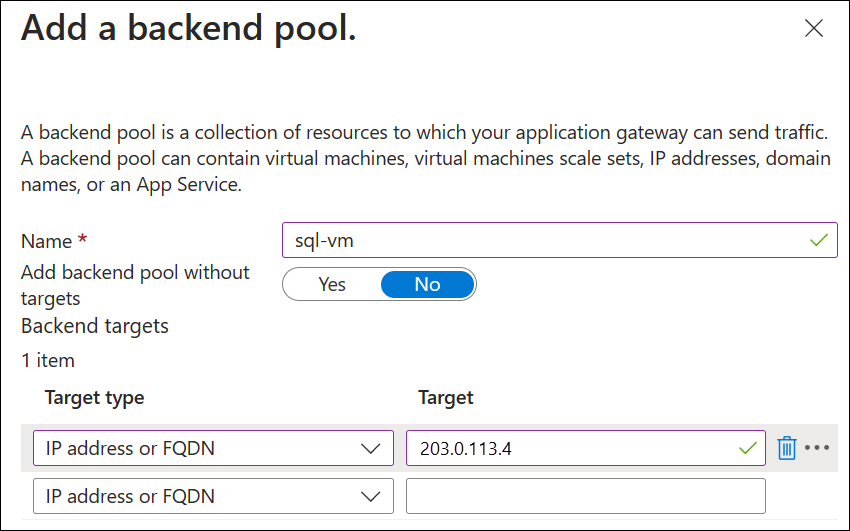
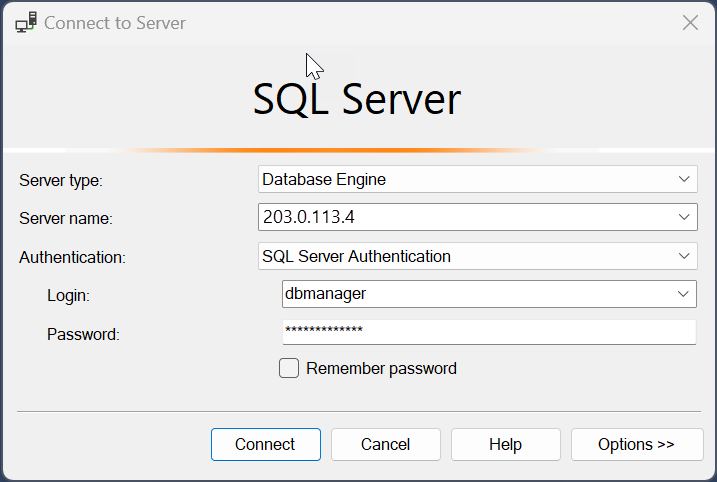

# Configure Azure Application Gateway TCP/TLS proxy (Preview)

To try out the layer 4 features of Azure Application Gateway, this article shows how to use the Azure portal to create an Azure Application Gateway with a SQL Server virtual machine as the backend server. Connectivity through a SQL client is also tested to verify the configuration works correctly. The article guides you through the following procedures:

- Create a SQL server Azure virtual machine
- Create a new application gateway
    - Configure basic settings and a frontend public IP address
    - Add a backend pool and set the SQL server as a backend target
    - Create a routing rule
        - Create a listener with the required port (SQL 1433)
        - Create a backend setting using layer 4 protocol

    - Add a SQL server to the backend pool
- Connect to the application gateway using a SQL client

> [!IMPORTANT]
> Application Gateway TCP/TLS proxy is currently in PREVIEW. 
> See the [Supplemental Terms of Use for Microsoft Azure Previews](https://azure.microsoft.com/support/legal/preview-supplemental-terms/) for legal terms that apply to Azure features that are in beta, preview, or otherwise not yet released into general availability.

## Register to the preview

> [!NOTE]
> When you join the preview, all new Application Gateways provision with the ability to use layer 4 proxy features. If you wish to opt out from the new functionality and return to the current generally available functionality of Application Gateway, you can [unregister from the preview](#unregister-from-the-preview).

For more information about preview features, see [Set up preview features in Azure subscription](../azure-resource-manager/management/preview-features.md)

Use the following steps to enroll into the public preview for Application Gateway TCP/TLS proxy using the Azure portal:

1. Sign in to the [Azure portal](https://portal.azure.com/).
2. In the search box, enter _subscriptions_ and select **Subscriptions**.

    :::image type="content" source="../azure-resource-manager/management/media/preview-features/search.png" alt-text="Azure portal search.":::

3. Select the link for your subscription's name.

    :::image type="content" source="../azure-resource-manager/management/media/preview-features/subscriptions.png" alt-text="Select Azure subscription.":::

4. From the left menu, under **Settings** select **Preview features**.

    :::image type="content" source="../azure-resource-manager/management/media/preview-features/preview-features-menu.png" alt-text="Azure preview features menu.":::

5. You see a list of available preview features and your current registration status.

    :::image type="content" source="../azure-resource-manager/management/media/preview-features/preview-features-list.png" alt-text="Azure portal list of preview features.":::

6. From **Preview features** type into the filter box **appgwl4proxymanage**, check the feature, and click **Register**.

    :::image type="content" source="../azure-resource-manager/management/media/preview-features/filter.png" alt-text="Azure portal filter preview features.":::

## Create a SQL server

First, create a SQL Server virtual machine (VM) using the Azure portal.

1. From the Azure portal Home page, search for **SQL Virtual Machines** and then select **SQL virtual machines** under **Services**.

    

2. Select **Create** and then on the Select SQL deployment option page, choose a **Free SQL Server License** option from the drop-down menu. For example: **SQL Server 2022 Developer on Windows Server 2022**. You can also select a different Free license version to test.

3. After choosing a free SQL license version, select **Create**.  The **Basics** tab opens.

4. Enter the following information on the **Basics** tab:
    - **Subscription**: Select your Azure subscription name. 
    - **Resource group**: Create a new resource group so that you can easily remove it after testing, for example: **myresourcegroup**.
    - **Virtual machine name**: mySQLVM
    - **Region**: Select the same region as your resource group.
    - **Availability options**: Accept the default settings.
    - **Security type**: Accept the default settings.
    - **Image**: Accept the default settings.
    - **VM architecture**: Accept the default settings.
    - **Size**: Select a size compatible with the region.
    - **Administrator details**: Enter a username and password.
    - **Inbound port rules**: Accept the default settings.

    

5. Select **Review + create**, and then select **Create**. Deployment of the virtual machine takes a few minutes.
6. When deployment is complete, select the SQL server resource's overview page and write down the public IP address of the virtual machine.

    

## Create an Application Gateway

1. On the Azure portal menu or from the **Home** page, select **Create a resource**.
2. Under **Categories**, select **Networking** and then select **Application Gateway** in the **Popular Azure services** list.
3. On the **Basics** tab, enter the following details:
    -  **Subscription**: Select your Azure subscription name. 
    - **Resource group**: Select the same resource group that you entered for the previous procedure to create a SQL server virtual machine.
    - **Application gateway name**: myL4AppGW
    - **Region**: Select the same region as your resource group.
    - **Tier**: Standard V2
    - **Enable autoscaling**: Accept the default setting.
    - **Minimum instance count**: 2
    - All other **Instance details**: Accept the default settings.
    - **Virtual network**: Select **Create new** and enter a name. For example: **myL4AppGWVNet**. Accept the default address space settings and replace the subnet name of default with a descriptive name such as **appgw-subnet**.

    > [!NOTE]
    > Default address space and subnet settings are adjusted to avoid conflicting with other VNets that you have deployed.

    

    The following table provides more information about the settings used in this procedure.

    | Field | Details |
    |-------|---------|
    | Subscription | Select the same subscription where you deployed the SQL server. |
    | Resource group | Select the same resource group where you deployed the SQL server. |
    | Application gateway name | You can provide any name for easy identification. |
    | Region | The region is automatically selected based on the resource group that you choose. |
    | Tier | For TCP/TLS proxy, you can select either Standard v2 or WAF v2. The WAF functions only apply to HTTP(S) when using a gateway in hybrid mode (HTTP, HTTPS along with TCP or TLS). |
    | Enable autoscaling | This setting allows your gateway to scale out and scale in based on loads. This is applicable for both Layer 7 and Layer 4 proxy. The default setting is **Yes**. |
    | Min/Max instance counts | For more information, see [Scaling Application Gateway v2 and WAF v2](application-gateway-autoscaling-zone-redundant.md). |
    | Availability zone | For more information, see [What are Azure regions and availability zones?](/azure/reliability/availability-zones-overview). |
    | HTTP2 | The default setting of disabled can be used for this test. |
    | Virtual network and subnet | You can choose an existing VNet under the region or create a new VNet. Application Gateway requires its own dedicated subnet with no other services deployed in it. |

4. Select **Next: Frontends**.
5. Select a **Frontend IP address type** of **Public** and either use an existing IP address or create a new one.

     

6. Select **Next: Backends**.
7. On the **Backends** tab, select **Add a backend pool**.
8. Enter details under Add a backend pool:
    - **Name**: Enter a name for the backend pool, for example **sql-vm**.
    - **Target type**: Select **IP address or FQDN** and enter the public IP address of the SQL server virtual machine that you wrote down previously.

    <!-- Below is a comparison of two methods of displaying the same image in an article on the learn platform. The first is markdown, the second is HTML -->

    

    
 
9. Select **Add** and then select **Next: Configuration**.

10. Next, you create listeners, backend settings and a routing rule that links frontend and backend properties. Start by **selecting Add a routing rule** and entering the following settings on the **Listener** tab:
    - **Rule name**: SQL-rule
    - **Priority**: 100
    -  **Listener name**: sql-client-listener
    - **Frontend IP**: Public IPv4
    - **Protocol**: TCP
    - **Port**: 1433

         

11. Select the **Backend targets** tab and enter the following settings:

    - **Target type**: Backend pool
    - **Backend target**: Select the pool name you created, for example **sql-vm**.
    - **Backend settings**: Select Add new and create backend settings with the following values:
        - **Backend settings name**: backend-settings-sql
        - **Backend protocol**: TCP
        - **Backend port**: 1433
        - **Time-out (seconds)**: 20

             

12. Select **Add** to add the backend settings, and then select **Add** to add the routing rule. 

     

13. Select **Next: Tags** and add tags if desired. No tags are required for this demonstration.
14. Select Next: **Review + Create** and then select **Create**. The deployment process takes a few minutes. 

## Connect to the SQL server

1. Before connecting to the SQL server, verify that you have:
    - The public IP address of the Application Gateway frontend
    - Configured the SQL server to accept SQL authentication
    - Created an admin account on the SQL server

2. On a client device with [SQL Server Management Studio](/sql/ssms/download-sql-server-management-studio-ssms) installed, connect to the public IP address of the Azure virtual machine.

     

## Clean up resources

When no longer needed, remove the application gateway and all related resources by deleting the resource group you created, **myresourcegroup**.

## Unregister from the preview

Using the same process that you used to register for the preview, unregister from the preview by selecting the preview feature and then selecting **Unregister**.

## Next steps

To monitor the health of your backend pool, see [Backend health and diagnostic logs for Application Gateway](application-gateway-diagnostics.md).
