# Troubleshoot Azure Application Gateway session affinity issues

Learn how to diagnose and resolve session affinity issues with Azure Application Gateway.


[!INCLUDE [updated-for-az](../../includes/updated-for-az.md)]

## Overview

The cookie-based session affinity feature is useful when you want to keep a user session on the same server. By using gateway-managed cookies, the Application Gateway can direct subsequent traffic from a user session to the same server for processing. This is important in cases where session state is saved locally on the server for a user session.

## Possible problem causes

The problem in maintaining cookie-based session affinity may happen due to the following main reasons:

- “Cookie-based Affinity” setting is not enabled
- Your application cannot handle cookie-based affinity
- Application is using cookie-based affinity but requests still bouncing between back-end servers

### Check whether the "Cookie-based Affinity” setting is enabled

Sometimes the session affinity issues might occur when you forget to enable “Cookie based affinity” setting. To determine whether you have enabled the “Cookie based affinity” setting on the HTTP Settings tab in the Azure portal, follow the instructions:

1. Log on to the [Azure portal](https://portal.azure.com/).

2. In the **left navigation** pane, click **All resources**. Click the application gateway name in the All resources blade. If the subscription that you selected already has several resources in it, you can enter the application gateway name in the **Filter by name…** box to easily access the application gateway.

3. Select **HTTP settings** tab under **SETTINGS**.

   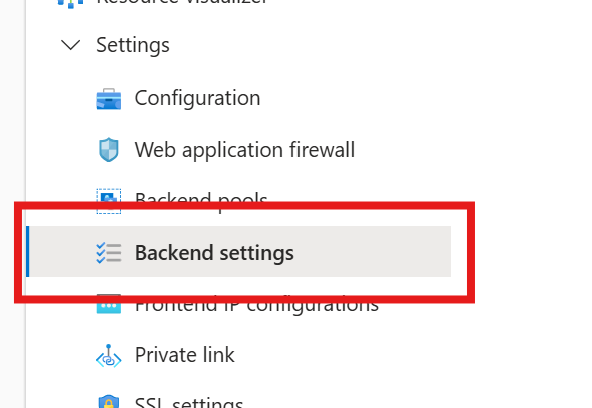

4. Click **appGatewayBackendHttpSettings** on the right side to check whether you have selected **Enabled** for Cookie based affinity.

   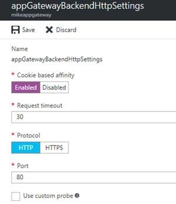


You can also check the value of the “**CookieBasedAffinity**” is set to *Enabled*under "**backendHttpSettingsCollection**" by using one of the following methods:

- Run [Get-AzApplicationGatewayBackendHttpSetting](https://docs.microsoft.com/powershell/module/az.network/get-azapplicationgatewaybackendhttpsetting) in PowerShell
- Look through the JSON file by using the Azure Resource Manager template

```
"cookieBasedAffinity": "Enabled", 
```

### The application cannot handle cookie-based affinity

#### Cause

The application gateway can only perform session-based affinity by using a cookie.

#### Workaround

If the application cannot handle cookie-based affinity, you must use an external or internal azure load balancer or another third-party solution.

### Application is using cookie-based affinity but requests still bouncing between back-end servers

#### Symptom

You have enabled the Cookie-based Affinity setting, when you access the Application Gateway by using a short name URL in Internet Explorer, for example: `http://website` , the request is still bouncing between back-end servers.

To identify this issue, follow the instructions:

1. Take a web debugger trace on the “Client” which is connecting to the application behind the Application Gateway(We are using Fiddler in this example).
    **Tip** If you don't know how to use the Fiddler, check the option "**I want to collect network traffic and analyze it using web debugger**" at the bottom.

2. Check and analyze the session logs, to determine whether the cookies provided by the client have the ARRAffinity details. If you don't find the ARRAffinity details, such as "**ARRAffinity=** *ARRAffinityValue*" within the cookie set, that means the client is not replying with the ARRA cookie, which is provided by the Application Gateway.
    For example:

    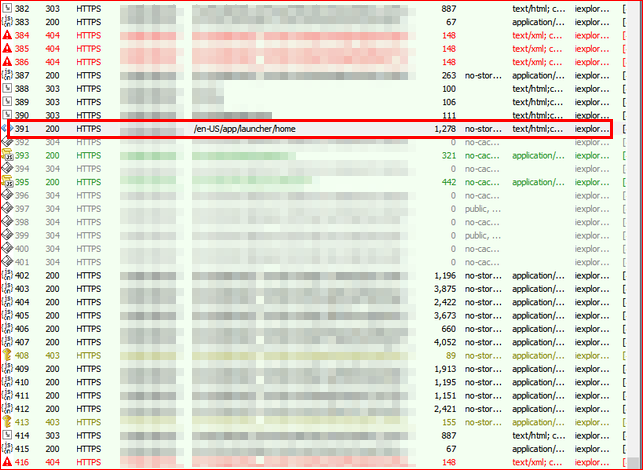

    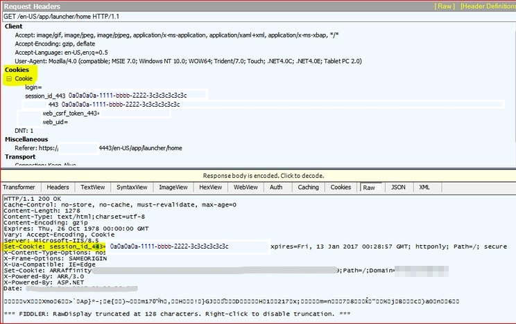

The application continues to try to set the cookie on each request until it gets reply.

#### Cause

This issue occurs because Internet Explorer and other browsers may not store or use the cookie with a short name URL.

#### Resolution

To fix this issue, you should access the Application Gateway by using a FQDN. For example, use [http://website.com](https://website.com/) or [http://appgw.website.com](http://website.com/) .

## Additional logs to troubleshoot

You can collect additional logs and analyze them to troubleshoot the issues related cookie-based session affinity

### Analyze Application Gateway logs

To collect the Application Gateway logs, follow the instructions:

Enable logging through the Azure portal

1. In the [Azure portal](https://portal.azure.com/), find your resource and then click **Diagnostic logs**.

   For Application Gateway, three logs are available: Access log, Performance log, Firewall log

2. To start to collect data, click **Turn on diagnostics**.

   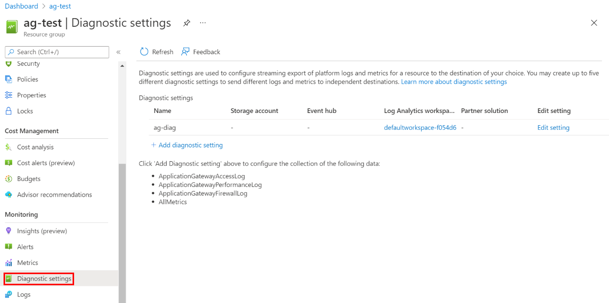

3. The **Diagnostics settings** blade provides the settings for the diagnostic logs. In this example, Log Analytics stores the logs. Click **Configure** under **Log Analytics** to set your workspace. You can also use event hubs and a storage account to save the diagnostic logs.

   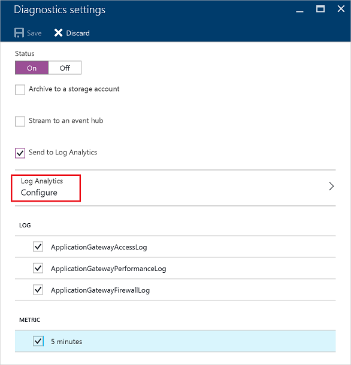

4. Confirm the settings and then click **Save**.

   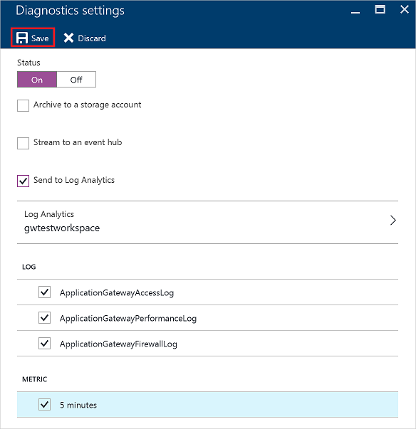

#### View and analyze the Application Gateway access logs

1. In the Azure portal under the Application Gateway resource view, select **Diagnostics logs** in the **MONITORING** section .

   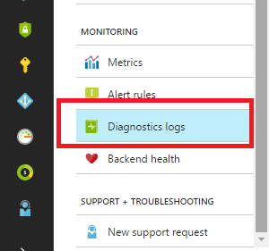

2. On the right side, select “**ApplicationGatewayAccessLog**“ in the drop-down list under **Log categories.**  

   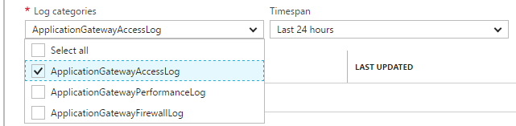

3. In the Application Gateway Access Log list, click the log you want to analyze and export, and then export the JSON file.

4. Convert the JSON file that you exported in step 3 to CSV file and view them in Excel, Power BI, or any other data-visualization tool.

5. Check the following data:

- **ClientIP**– This is the client IP address from the connecting client.
- **ClientPort** - This is the source port from the connecting client for the request.
- **RequestQuery** – This indicates the destination server that the request is received.
- **Server-Routed**: Back-end pool instance that the request is received.
- **X-AzureApplicationGateway-LOG-ID**: Correlation ID used for the request. It can be used to troubleshoot traffic issues on the back-end servers. For example: X-AzureApplicationGateway-CACHE-HIT=0&SERVER-ROUTED=10.0.2.4.

  - **SERVER-STATUS**: HTTP response code that Application Gateway received from the back end.

  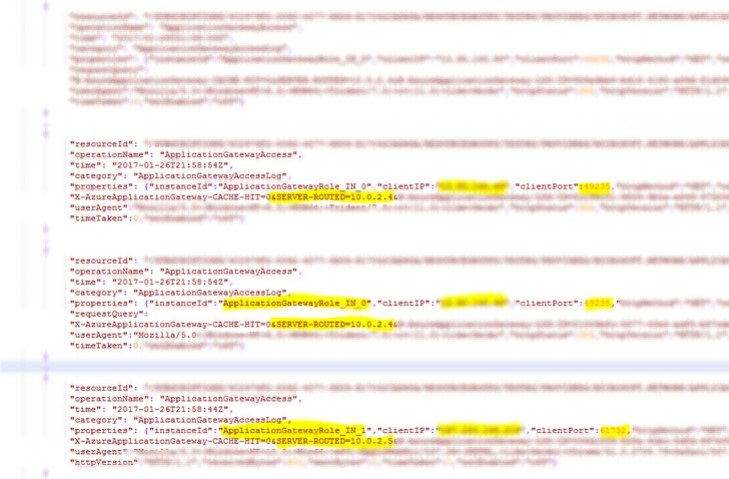

If you see two items are coming from the same ClientIP and Client Port, and they are sent to the same back-end server, that means the Application Gateway configured correctly.

If you see two items are coming from the same ClientIP and Client Port, and they are sent to the different back-end servers, that means the request is bouncing between backend servers, select “**Application is using cookie-based affinity but requests still bouncing between back-end servers**” at the bottom to troubleshoot it.

### Use web debugger to capture and analyze the HTTP or HTTPS traffics

Web debugging tools like Fiddler, can help you debug web applications by capturing network traffic between the Internet and test computers. These tools enable you to inspect incoming and outgoing data as the browser receives/sends them. Fiddler, in this example, has the HTTP replay option that can help you troubleshoot client-side issues with web applications, especially for authentication kind of issue.

Use the web debugger of your choice. In this sample we will use Fiddler to capture and analyze http or https traffics, follow the instructions:

1. Download the Fiddler tool at <https://www.telerik.com/download/fiddler>.

    > [!NOTE]
    > Choose Fiddler4 if the capturing computer has .NET 4 installed. Otherwise, choose Fiddler2.

2. Right click the setup executable, and run as administrator to install.

    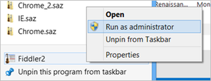

3. When you open Fiddler, it should automatically start capturing traffic (notice the Capturing at lower-left-hand corner). Press F12 to start or stop traffic capture.

    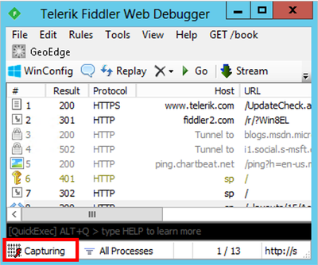

4. Most likely, you will be interested in decrypted HTTPS traffic, and you can enable HTTPS decryption by selecting **Tools** > **Fiddler Options**, and check the box " **Decrypt HTTPS traffic**".

    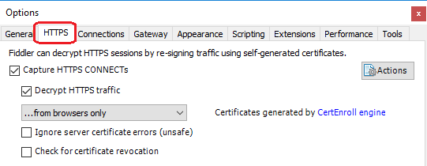

5. You can remove previous unrelated sessions before reproducing the issue by clicking  **X** (icon) > **Remove All** as follow screenshot: 

    

6. Once you have reproduced the issue, save the file for review by selecting **File** > **Save** > **All Sessions..**. 

    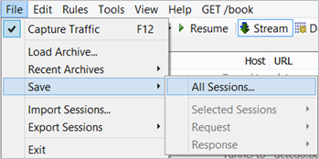

7. Check and analyze the session logs to determine what the issue is.

    For examples:

- **Example A:** You find a session log that the request is sent from the client, and it goes to the public IP address of the Application Gateway, click this log to view the details.  On the right side, data in the bottom box is what the Application Gateway is returning to the client. Select the “RAW” tab and determine whether the client is receiving a "**Set-Cookie: ARRAffinity=** *ARRAffinityValue*." If there's no cookie, session affinity isn't set, or the Application Gateway isn't applying cookie back to the client.

   > [!NOTE]
   > This ARRAffinity value is the cookie-id, that the Application Gateway sets for the client to be sent to a particular back-end server.

   

- **Example B:** The next session log followed by the previous one is the client responding back to the Application Gateway, which has set the ARRAAFFINITY. If the ARRAffinity cookie-id matches, the packet should be sent to the same back-end server that was used previously. Check the next several lines of http communication to see whether the client's ARRAffinity cookie is changing.

   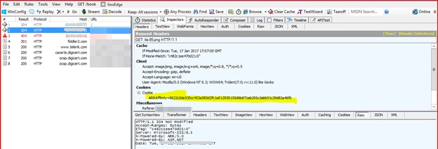

> [!NOTE]
> For the same communication session, the cookie should not to change. Check the top box on the right side, select "Cookies" tab to see whether the client is using the cookie and sending it back to the Application Gateway. If not, the client browser isn't keeping and using the cookie for conversations. Sometimes, the client might lie.

 

## Next steps

If the preceding steps do not resolve the issue, open a [support ticket](https://azure.microsoft.com/support/options/).
