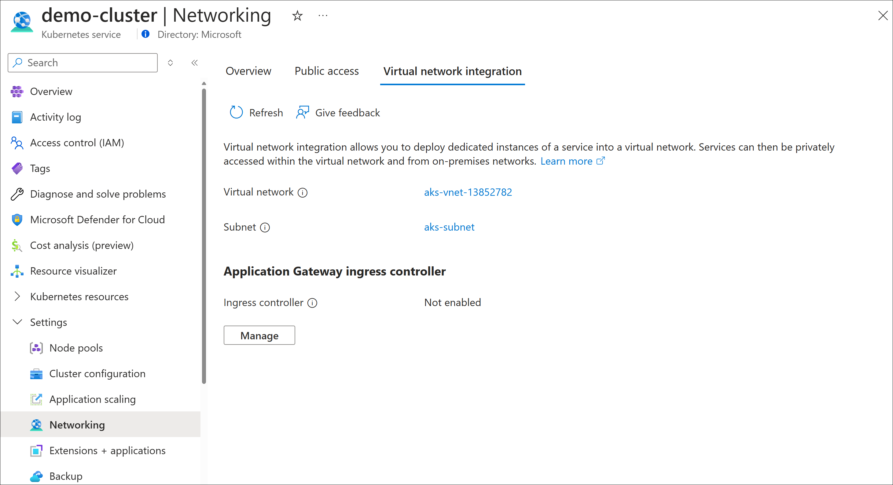

# Migrate from AGIC Helm to AGIC add-on 

If you already have AGIC deployed through Helm but want to migrate to AGIC deployed as an AKS add-on, the following steps will help guide you through the migration process. 

## Prerequisites 
Before you start the migration process, there are a few things to check. 
  - Are you using any features with AGIC Helm that are [currently not supported with AGIC add-on](ingress-controller-overview.md#difference-between-helm-deployment-and-aks-add-on)?
  - Are you using more than one AGIC Helm deployment per AKS cluster? 
  - Are you using multiple AGIC Helm deployments to target one Application Gateway? 

If you answered yes to any of the questions above, AGIC add-on won't support your use case yet so it will be best to continue using AGIC Helm in the meantime. Otherwise, continue with the migration process below during off-business hours. 

## Find the Application Gateway resource ID that AGIC Helm is currently targeting 
Navigate to the Application Gateway that your AGIC Helm deployment is targeting. Copy and save the resource ID of that Application Gateway. You will need the resource ID in a later step. The resource ID can be found in Portal, under the Properties tab of your Application Gateway or through Azure CLI. The following example saves the Application Gateway resource ID to *appgwId* for a gateway named *myApplicationGateway* in the resource group *myResourceGroup*.

```azurecli-interactive
appgwId=$(az network application-gateway show -n myApplicationGateway -g myResourceGroup -o tsv --query "id") 
```

## Delete AGIC Helm from your AKS cluster
Through Azure CLI, delete your AGIC Helm deployment from your cluster. You'll need to delete the AGIC Helm deployment first before you can enable the AGIC AKS add-on. Please note that any changes that occur within your AKS cluster between the time of deleting your AGIC Helm deployment and the time you enable the AGIC add-on won't be reflected on your Application Gateway, and therefore this migration process should be done outside of business hours to minimize impact. Application Gateway will continue to have the last configuration applied by AGIC so existing routing rules will not be affected. 

## Enable AGIC add-on using your existing Application Gateway 
You can now enable the AGIC add-on in your AKS cluster to target your existing Application Gateway through Azure CLI or Portal. Run the following Azure CLI command to enable the AGIC add-on in your AKS cluster. The example enables the add-on in a cluster called *myCluster*, in a resource group called *myResourceGroup*, using the Application Gateway resource ID *appgwId* we saved above in the earlier step. 


```azurecli-interactive
az aks enable-addons -n myCluster -g myResourceGroup -a ingress-appgw --appgw-id $appgwId
```

Alternatively, you can navigate to your AKS cluster in Portal using this [link](https://portal.azure.com/?feature.aksagic=true) and enable the AGIC add-on in the Networking tab of your cluster. Select your existing Application Gateway from the dropdown menu when you choose which Application Gateway the add-on should target. 



## Next Steps
- [**Application Gateway Ingress Controller Troubleshooting**](ingress-controller-troubleshoot.md): Troubleshooting guide for AGIC 
- [**Application Gateway Ingress Controller Annotations**](ingress-controller-annotations.md): List of annotations on AGIC 