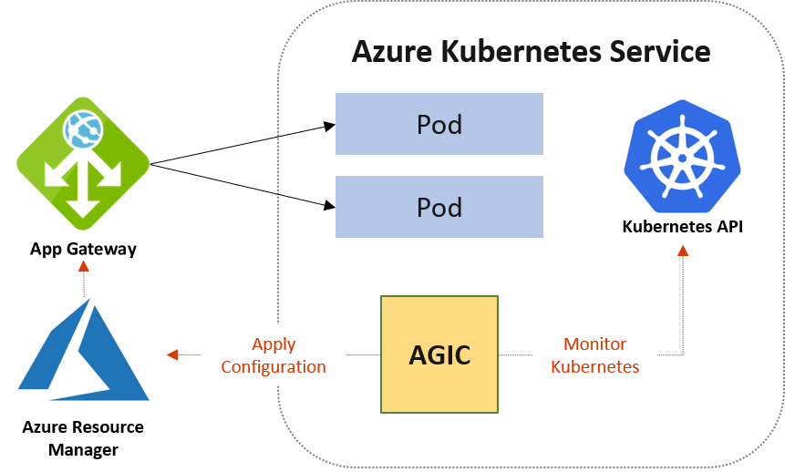

# What is Application Gateway Ingress Controller?

The Application Gateway Ingress Controller (AGIC) is a Kubernetes application that enables [Azure Kubernetes Service (AKS)](https://azure.microsoft.com/services/kubernetes-service/) clusters to use the native Azure [Application Gateway](https://azure.microsoft.com/services/application-gateway/) L7 load balancer to expose workloads to the internet. AGIC monitors the Kubernetes cluster it's hosted on and continuously updates an Application Gateway so that selected services are exposed to the internet.

The Ingress Controller runs in its own pod on your AKS cluster. AGIC monitors a subset of Kubernetes resources for changes. The state of the AKS cluster is translated to Application Gateway-specific configuration and applied to [Azure Resource Manager (ARM)](../azure-resource-manager/management/overview.md).

In this article, you learn about the benefits of AGIC, deployment options (Helm and AKS add-on), and supported container networking configurations.

> [!TIP]
> Consider [Application Gateway for Containers](for-containers/overview.md) for your Kubernetes ingress solution. For more information, see [Quickstart: Deploy Application Gateway for Containers ALB Controller](for-containers/quickstart-deploy-application-gateway-for-containers-alb-controller.md).

## Benefits of Application Gateway Ingress Controller
AGIC helps eliminate the need for another load balancer or public IP address in front of the AKS cluster. It avoids multiple hops in your datapath before requests reach the AKS cluster. Application Gateway communicates with pods by using their private IP address directly and doesn't require NodePort or KubeProxy services. This capability also brings better performance to your deployments.

Ingress Controller is supported exclusively by `Standard_v2` and `WAF_v2` SKUs, which also enable autoscaling benefits. Application Gateway can react in response to an increase or decrease in traffic load and scale accordingly, without consuming any resources from your AKS cluster.

Using Application Gateway in addition to AGIC also helps protect your AKS cluster by providing TLS policy and Web Application Firewall (WAF) functionality.

AGIC is configured through the Kubernetes [Ingress resource](https://kubernetes.io/docs/concepts/services-networking/ingress/), along with Service and Deployments/Pods. By using the native Azure Application Gateway L7 load balancer, AGIC provides the following features:

- URL routing
- Cookie-based affinity
- TLS termination
- End-to-end TLS
- Support for public, private, and hybrid websites
- Integrated web application firewall

> [!WARNING]
> By default, AGIC assumes full ownership of the Application Gateway it's linked to. AGIC overwrites all existing Application Gateway configuration that isn't defined in Kubernetes Ingress resources. Any listeners, backend pools, rules, or other settings previously configured on the Application Gateway are removed or replaced when AGIC is enabled. Before enabling AGIC on an existing Application Gateway, back up your Application Gateway configuration by exporting the template from the Azure portal. For more information, see [Back up the Application Gateway deployment](ingress-controller-install-existing.md#back-up-the-application-gateway-deployment).
>
> If you need AGIC to coexist with existing Application Gateway configurations, see [Set up a shared Application Gateway deployment](ingress-controller-install-existing.md#set-up-a-shared-application-gateway-deployment) (Helm only).

## Difference between Helm deployment and AKS add-on
You can deploy AGIC for your AKS cluster by using either Helm or AKS as an add-on. The primary benefit of deploying AGIC as an AKS add-on is that it's simpler than deploying through Helm. For a new setup, you can deploy a new Application Gateway and a new AKS cluster with AGIC enabled as an add-on in one line in Azure CLI. The add-on is also a fully managed service, which provides added benefits such as automatic updates and increased support. Both ways of deploying AGIC (Helm and AKS add-on) are fully supported by Microsoft. Additionally, the add-on allows for better integration with AKS as a first-class add-on.

Although you deploy the AGIC add-on as a pod in your AKS cluster, some differences exist between the Helm deployment version and the add-on version of AGIC. The following list highlights the differences: 
  - You can't modify Helm deployment values on the AKS add-on:
    - `verbosityLevel` is set to 5 by default
    - `usePrivateIp` is set to false by default; overwrite this setting by using the [use-private-ip annotation](ingress-controller-annotations.md#use-private-ip)
    - `shared` isn't supported on add-on 
    - `reconcilePeriodSeconds` isn't supported on add-on
    - `armAuth.type` isn't supported on add-on
  - AGIC deployed through Helm supports ProhibitedTargets, which means AGIC can configure the Application Gateway specifically for AKS clusters without affecting other existing backends. AGIC add-on doesn't currently support this capability. 
  - Because AGIC add-on is a managed service, you automatically receive updates to the latest version of AGIC add-on. By contrast, when you deploy AGIC through Helm, you must manually update AGIC.

> [!NOTE]
> You can deploy only one AGIC add-on per AKS cluster, and each AGIC add-on can currently target only one Application Gateway. For deployments that require more than one AGIC per cluster or multiple AGICs targeting one Application Gateway, use AGIC deployed through Helm.
>
> Both Helm and AGIC add-on don't support ExternalName service.

## Container networking and AGIC

Application Gateway Ingress Controller supports the following AKS network offerings:

- Kubenet
- CNI
- CNI Overlay

Azure CNI and Azure CNI Overlay are the two recommended options for Application Gateway Ingress Controller. When you choose a networking model, consider the use cases for each CNI plugin and the type of network model it uses:

| CNI plugin | Networking model | Use case highlights |
|-------------|----------------------|-----------------------|
| **Azure CNI Overlay** | Overlay | - Best for virtual network IP conservation - Max node count supported by API Server + 250 pods per node - Simpler configuration  -No direct external pod IP access |
| **Azure CNI Pod Subnet** | Flat | - Direct external pod access - Modes for efficient virtual network IP usage _or_ large cluster scale support |
| **Azure CNI Node Subnet** | Flat | - Direct external pod access - Simpler configuration  - Limited scale  - Inefficient use of virtual network IPs |

When you provision Application Gateway for Containers into a cluster that has CNI Overlay or CNI enabled, Application Gateway for Containers automatically detects the intended network configuration. You don't need to change Gateway or Ingress API configuration to specify CNI Overlay or CNI.

When you use Azure CNI Overlay, consider the following limitations:

* AGIC Controller: You must be running version v1.9.1 or greater to take advantage of CNI Overlay.
* Subnet Size: The Application Gateway subnet must be a maximum /24 prefix; only one deployment is supported per subnet.
* Subnet Delegation: The Application Gateway subnet must have subnet delegation for Microsoft.Network/applicationGateways.
* Regional virtual network Peering: You can't deploy Application Gateway in a virtual network in one region and the AKS cluster nodes in a virtual network in the same region.
* Global virtual network Peering: You can't deploy Application Gateway in a virtual network in one region and the AKS cluster nodes in a virtual network in a different region.
* Azure CNI Overlay with Application Gateway Ingress Controller isn't supported in Azure Government cloud or Microsoft Azure operated by 21Vianet (Azure in China).

>[!NOTE]
> Application Gateway Ingress Controller automatically detects upgrade of the AKS cluster from Kubenet or CNI to CNI Overlay. Schedule the upgrade during a maintenance window as traffic disruption can occur. The controller might take a few minutes after cluster upgrade to detect and configure support for CNI Overlay.

>[!WARNING]
> Ensure the Application Gateway subnet is a /24 or smaller subnet before upgrading. Upgrading from CNI to CNI Overlay with a larger subnet (for example, /23) leads to an outage and requires you to recreate the Application Gateway subnet with a supported subnet size.

## Next steps
- [**AKS Add-On Greenfield Deployment**](tutorial-ingress-controller-add-on-new.md): Instructions on installing AGIC add-on, AKS, and Application Gateway on blank-slate infrastructure.
- [**AKS Add-On Brownfield Deployment**](tutorial-ingress-controller-add-on-existing.md): Install AGIC add-on on an AKS cluster with an existing Application Gateway.
- [**Helm Greenfield Deployment**](ingress-controller-install-new.md): Install AGIC through Helm, new AKS cluster, and new Application Gateway on blank-slate infrastructure.
- [**Helm Brownfield Deployment**](ingress-controller-install-existing.md): Deploy AGIC through Helm on an existing AKS cluster and Application Gateway.
