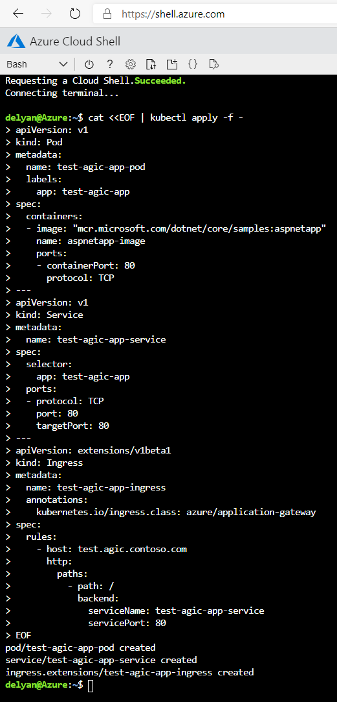
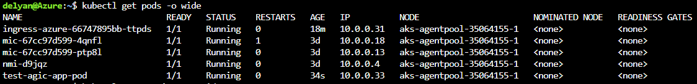
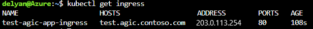
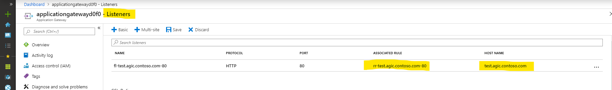
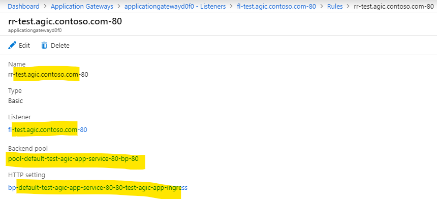
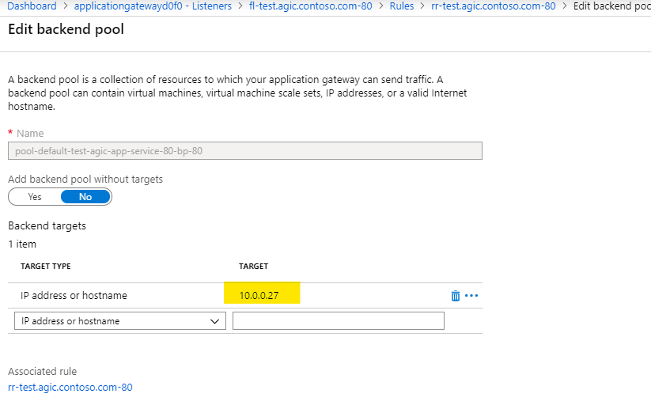
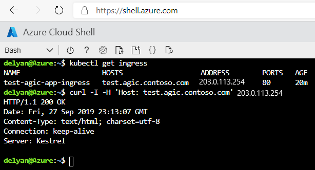

# Troubleshoot common questions or issues with Ingress Controller

[Azure Cloud Shell](https://shell.azure.com/) is the most convenient way to troubleshoot any problems with your AKS
and AGIC installation. Launch your shell from [shell.azure.com](https://shell.azure.com/) or by clicking the link:

[](https://shell.azure.com)


## Test with a simple Kubernetes app

The steps below assume:
  - You have an AKS cluster, with Advanced Networking enabled
  - AGIC has been installed on the AKS cluster
  - You already hav an Application Gateway on a VNET shared with your AKS cluster

To verify that the Application Gateway + AKS + AGIC installation is setup correctly, deploy
the simplest possible app:

```bash
cat <<EOF | kubectl apply -f -
apiVersion: v1
kind: Pod
metadata:
  name: test-agic-app-pod
  labels:
    app: test-agic-app
spec:
  containers:
  - image: "mcr.microsoft.com/dotnet/core/samples:aspnetapp"
    name: aspnetapp-image
    ports:
    - containerPort: 80
      protocol: TCP
---
apiVersion: v1
kind: Service
metadata:
  name: test-agic-app-service
spec:
  selector:
    app: test-agic-app
  ports:
  - protocol: TCP
    port: 80
    targetPort: 80
---
apiVersion: extensions/v1beta1
kind: Ingress
metadata:
  name: test-agic-app-ingress
  annotations:
    kubernetes.io/ingress.class: azure/application-gateway
spec:
  rules:
    - host: test.agic.contoso.com
      http:
        paths:
          - path: /
            backend:
              serviceName: test-agic-app-service
              servicePort: 80
EOF
```

Copy and paste all lines at once from the
script above into a [Azure Cloud Shell](https://shell.azure.com/). Please ensure the entire
command is copied - starting with `cat` and including the last `EOF`.



After a successful deployment of the app above your AKS cluster will have a new Pod, Service and an Ingress.

Get the list of pods with [Cloud Shell](https://shell.azure.com/): `kubectl get pods -o wide`.
We expect for a pod named 'test-agic-app-pod' to have been created. It will have an IP address. This address
must be within the VNET of the Application Gateway, which is used with AKS.



Get the list of services: `kubectl get services -o wide`. We expect to see a service named
'test-agic-app-service'.


Get the list of the ingresses: `kubectl get ingress`. We expect an Ingress resource named
'test-agic-app-ingress' to have been created. The resource will have a host name 'test.agic.contoso.com'.



One of the pods will be AGIC. `kubectl get pods` will show a list of pods, one of which will begin
with 'ingress-azure'. Get all logs of that pod with `kubectl logs <name-of-ingress-controller-pod>`
to verify that we have had a successful deployment. A successful deployment would have added the following
lines to the log:
```
I0927 22:34:51.281437       1 process.go:156] Applied Application Gateway config in 20.461335266s
I0927 22:34:51.281585       1 process.go:165] cache: Updated with latest applied config.
I0927 22:34:51.282342       1 process.go:171] END AppGateway deployment
```

Alternatively, from [Cloud Shell](https://shell.azure.com/) we can retrieve only the lines
indicating successful Application Gateway configuration with
`kubectl logs <ingress-azure-....> | grep 'Applied App Gateway config in'`, where
`<ingress-azure....>` should be the exact name of the AGIC pod.

Application Gateway will have the following configuration applied:

- Listener:


- Routing Rule:


- Backend Pool:
  - There will be one IP address in the backend address pool and it will match the IP address of the Pod we observed earlier with `kubectl get pods -o wide`



Finally we can use the `cURL` command from within [Cloud Shell](https://shell.azure.com/) to
establish an HTTP connection to the newly deployed app:

1. Use `kubectl get ingress` to get the Public IP address of Application Gateway
2. Use `curl -I -H 'test.agic.contoso.com' <publitc-ip-address-from-previous-command>`



A result of `HTTP/1.1 200 OK` indicates that the Application Gateway + AKS + AGIC system is working as expected.


## Inspect Kubernetes Installation

### Pods, Services, Ingress
Application Gateway Ingress Controller (AGIC) continuously monitors the following Kubernetes resources: [Deployment](https://kubernetes.io/docs/concepts/workloads/controllers/deployment/#creating-a-deployment) or [Pod](https://kubernetes.io/docs/concepts/workloads/pods/pod/#what-is-a-pod), [Service](https://kubernetes.io/docs/concepts/services-networking/service/), [Ingress](https://kubernetes.io/docs/concepts/services-networking/ingress/)


The following must be in place for AGIC to function as expected:
  1. AKS must have one or more healthy **pods**.
     Verify this from [Cloud Shell](https://shell.azure.com/) with `kubectl get pods -o wide --show-labels`
     If you have a Pod with an `apsnetapp`, your output may look like this:
     ```bash
     delyan@Azure:~$ kubectl get pods -o wide --show-labels

     NAME                   READY   STATUS    RESTARTS   AGE   IP          NODE                       NOMINATED NODE   READINESS GATES   LABELS
     aspnetapp              1/1     Running   0          17h   10.0.0.6    aks-agentpool-35064155-1   <none>           <none>            app=aspnetapp
     ```

  2. One or more **services**, referencing the pods above via matching `selector` labels.
     Verify this from [Cloud Shell](https://shell.azure.com/) with `kubectl get services -o wide`
     ```bash
     delyan@Azure:~$ kubectl get services -o wide --show-labels

     NAME                TYPE        CLUSTER-IP     EXTERNAL-IP   PORT(S)   AGE   SELECTOR        LABELS
     aspnetapp           ClusterIP   10.2.63.254    <none>        80/TCP    17h   app=aspnetapp   <none>     
     ```

  3. **Ingress**, annotated with `kubernetes.io/ingress.class: azure/application-gateway`, referencing the service above
     Verify this from [Cloud Shell](https://shell.azure.com/) with `kubectl get ingress -o wide --show-labels`
     ```bash
     delyan@Azure:~$ kubectl get ingress -o wide --show-labels

     NAME        HOSTS   ADDRESS   PORTS   AGE   LABELS
     aspnetapp   *                 80      17h   <none>
     ```

  4. View annotations of the ingress above: `kubectl get ingress aspnetapp -o yaml` (substitute `aspnetapp` with the name of your ingress)
     ```bash
     delyan@Azure:~$ kubectl get ingress aspnetapp -o yaml

     apiVersion: extensions/v1beta1
     kind: Ingress
     metadata:
       annotations:
         kubernetes.io/ingress.class: azure/application-gateway
       name: aspnetapp
     spec:
       backend:
         serviceName: aspnetapp
         servicePort: 80
     ```

     The ingress resource must be annotated with `kubernetes.io/ingress.class: azure/application-gateway`.
 

### Verify Observed Namespace

* Get the existing namespaces in Kubernetes cluster. What namespace is your app
running in? Is AGIC watching that namespace? Refer to the
[Multiple Namespace Support](./ingress-controller-multiple-namespace-support.md#enable-multiple-namespace-support)
documentation on how to properly configure observed namespaces.

    ```bash
    # What namespaces exist on your cluster
    kubectl get namespaces
    
    # What pods are currently running
    kubectl get pods --all-namespaces -o wide
    ```


* The AGIC pod should be in the `default` namespace (see column `NAMESPACE`). A healthy pod would have `Running` in the `STATUS` column. There should be at least one AGIC pod.

    ```bash
    # Get a list of the Application Gateway Ingress Controller pods
    kubectl get pods --all-namespaces --selector app=ingress-azure
    ```


* If the AGIC pod is not healthy (`STATUS` column from the command above is not `Running`):
  - get logs to understand why: `kubectl logs <pod-name>`
  - for the previous instance of the pod: `kubectl logs <pod-name> --previous`
  - describe the pod to get more context: `kubectl describe pod <pod-name>`


* Do you have a Kubernetes
[Service](https://kubernetes.io/docs/concepts/services-networking/service/) and
[Ingress](https://kubernetes.io/docs/concepts/services-networking/ingress/) resources?
    
    ```bash
    # Get all services across all namespaces
    kubectl get service --all-namespaces -o wide
    
    # Get all ingress resources across all namespaces
    kubectl get ingress --all-namespaces -o wide
    ```


* Is your [Ingress](https://kubernetes.io/docs/concepts/services-networking/ingress/) annotated with: `kubernetes.io/ingress.class: azure/application-gateway`? AGIC will only watch for Kubernetes Ingress resources that have this annotation.
    
    ```bash
    # Get the YAML definition of a particular ingress resource
    kubectl get ingress --namespace  <which-namespace?>  <which-ingress?>  -o yaml
    ```


* AGIC emits Kubernetes events for certain critical errors. You can view these:
  - in your terminal via `kubectl get events --sort-by=.metadata.creationTimestamp`
  - in your browser using the [Kubernetes Web UI (Dashboard)](https://kubernetes.io/docs/tasks/access-application-cluster/web-ui-dashboard/)


## Logging Levels

AGIC has 3 logging levels. Level 1 is the default one and it shows minimal number of log lines.
Level 5, on the other hand, would display all logs, including sanitized contents of config applied
to ARM.

The Kubernetes community has established 9 levels of logging for
the [kubectl](https://kubernetes.io/docs/reference/kubectl/cheatsheet/#kubectl-output-verbosity-and-debugging) tool. In this
repository we are utilizing 3 of these, with similar semantics:


| Verbosity | Description |
|-----------|-------------|
|  1        | Default log level; shows startup details, warnings and errors |
|  3        | Extended information about events and changes; lists of created objects |
|  5        | Logs marshaled objects; shows sanitized JSON config applied to ARM |


The verbosity levels are adjustable via the `verbosityLevel` variable in the
[helm-config.yaml](#sample-helm-config-file) file. Increase verbosity level to `5` to get
the JSON config dispatched to
[ARM](https://docs.microsoft.com/azure/azure-resource-manager/resource-group-overview):
  - add `verbosityLevel: 5` on a line by itself in [helm-config.yaml](#sample-helm-config-file) and re-install
  - get logs with `kubectl logs <pod-name>`

### Sample Helm config file
```yaml
    # This file contains the essential configs for the ingress controller helm chart

    # Verbosity level of the App Gateway Ingress Controller
    verbosityLevel: 3
    
    ################################################################################
    # Specify which application gateway the ingress controller will manage
    #
    appgw:
        subscriptionId: <subscriptionId>
        resourceGroup: <resourceGroupName>
        name: <applicationGatewayName>
    
        # Setting appgw.shared to "true" will create an AzureIngressProhibitedTarget CRD.
        # This prohibits AGIC from applying config for any host/path.
        # Use "kubectl get AzureIngressProhibitedTargets" to view and change this.
        shared: false
    
    ################################################################################
    # Specify which kubernetes namespace the ingress controller will watch
    # Default value is "default"
    # Leaving this variable out or setting it to blank or empty string would
    # result in Ingress Controller observing all acessible namespaces.
    #
    # kubernetes:
    #   watchNamespace: <namespace>
    
    ################################################################################
    # Specify the authentication with Azure Resource Manager
    #
    # Two authentication methods are available:
    # - Option 1: AAD-Pod-Identity (https://github.com/Azure/aad-pod-identity)
    armAuth:
        type: aadPodIdentity
        identityResourceID: <identityResourceId>
        identityClientID:  <identityClientId>
    
    ## Alternatively you can use Service Principal credentials
    # armAuth:
    #    type: servicePrincipal
    #    secretJSON: <<Generate this value with: "az ad sp create-for-rbac --subscription <subscription-uuid> --sdk-auth | base64 -w0" >>
    
    ################################################################################
    # Specify if the cluster is RBAC enabled or not
    rbac:
        enabled: false # true/false
    
    # Specify aks cluster related information. THIS IS BEING DEPRECATED.
    aksClusterConfiguration:
        apiServerAddress: <aks-api-server-address>
    ```

