# Configure Application Gateway with a frontend public IPv6 address using the Azure portal (Preview)

[Azure Application Gateway](overview.md) supports dual stack (IPv4 and IPv6) frontend connections from clients. To use IPv6 frontend connectivity, you need to create a new Application Gateway. Currently you can’t upgrade existing IPv4 only Application Gateways to dual stack (IPv4 and IPv6) Application Gateways. Also, currently backend IPv6 addresses aren't supported.

To support IPv6 connectivity, you must create a dual stack VNet. This dual stack VNet has subnets for both IPv4 and IPv6. Azure VNets already [provide dual-stack capability](../virtual-network/ip-services/ipv6-overview.md). 

For more information about the components of an application gateway, see [Application gateway components](application-gateway-components.md).

> [!IMPORTANT]
> Application Gateway IPv6 frontend is currently in PREVIEW.<br>
> See the [Supplemental Terms of Use for Microsoft Azure Previews](https://azure.microsoft.com/support/legal/preview-supplemental-terms/) for legal terms that apply to Azure features that are in beta, preview, or otherwise not yet released into general availability.

## Overview

The Azure portal is used to create an IPv6 Azure Application Gateway. Testing is performed to verify it works correctly.

You learn how to:
* [Register](#register-to-the-preview) and [unregister](#unregister-from-the-preview) from the preview
* Set up a [dual-stack network](#dual-stack)
* Create an application gateway with [IPv6 frontend](#frontends-tab)
* Create a virtual machine and install IIS for [testing](#test-the-application-gateway)

You can also complete this quickstart using [Azure PowerShell](ipv6-application-gateway-powershell.md).

## Regions and availability

The IPv6 Application Gateway preview is available to all public cloud regions where Application Gateway v2 SKU is supported. It's also available in [Microsoft Azure operated by 21Vianet](https://www.azure.cn/) and [Azure Government](https://azure.microsoft.com/overview/clouds/government/)

## Limitations

* Only v2 SKU supports a frontend with both IPv4 and IPv6 addresses
* IPv6 backends are currently not supported
* IPv6 private Link is currently not supported
* IPv6-only Application Gateway is currently not supported. Application Gateway must be dual stack (IPv6 and IPv4)
* Deletion of frontend IP addresses aren't supported
* Existing IPv4 Application Gateways cannot be upgraded to dual stack Application Gateways

> [!NOTE]
> If you use WAF v2 SKU for a frontend with both IPv4 and IPv6 addresses, WAF rules only apply to IPv4 traffic. IPv6 traffic bypasses WAF and may get blocked by some custom rule.

## Prerequisites

An Azure account with an active subscription is required.  If you don't already have an account, you can [create an account for free](https://azure.microsoft.com/free/?WT.mc_id=A261C142F).

Sign in to the [Azure portal](https://portal.azure.com) with your Azure account.

## Register to the preview

> [!NOTE]
> When you join the preview, all new Application Gateways provision with the ability to define a dual stack frontend connection.  If you wish to opt out from the new functionality and return to the current generally available functionality of Application Gateway, you can [unregister from the preview](#unregister-from-the-preview).

For more information about preview features, see [Set up preview features in Azure subscription](../azure-resource-manager/management/preview-features.md)

In this article, you use the Azure portal to create an IPv6 Azure Application Gateway and test it to ensure it works correctly. You assign listeners to ports, create rules, and add resources to a backend pool. For the sake of simplicity, a simple setup is used with two public frontend IP addresses (IPv4 and IPv6), a basic listener to host a single site on the application gateway, a basic request routing rule, and two virtual machines (VMs) in the backend pool.

> [!IMPORTANT]
> If you're registered for [Private Application Gateway](application-gateway-private-deployment.md) preview, you must delete any Private Application Gateways that are provisioned before you can register to the IPv6 Application Gateway preview. Also [unregister](application-gateway-private-deployment.md#unregister-from-the-preview) from the **EnableApplicationGatewayNetworkIsolation** preview feature. 

Use the following steps to enroll into the public preview for IPv6 Application Gateway using the Azure portal:

1. Sign in to the [Azure portal](https://portal.azure.com/).
2. In the search box, enter _subscriptions_ and select **Subscriptions**.

    :::image type="content" source="../azure-resource-manager/management/media/preview-features/search.png" alt-text="A screenshot of Azure portal search.":::

3. Select the link for your subscription's name.

    :::image type="content" source="../azure-resource-manager/management/media/preview-features/subscriptions.png" alt-text="A screenshot of selecting the Azure subscription.":::

4. From the left menu, under **Settings** select **Preview features**.

    :::image type="content" source="../azure-resource-manager/management/media/preview-features/preview-features-menu.png" alt-text="A screenshot of the Azure preview features menu.":::

5. You see a list of available preview features and your current registration status.

    :::image type="content" source="../azure-resource-manager/management/media/preview-features/preview-features-list.png" alt-text="A screenshot of the Azure portal list of preview features.":::

6. From **Preview features** type into the filter box **AllowApplicationGatewayIPv6**, check the feature, and click **Register**.

    :::image type="content" source="../azure-resource-manager/management/media/preview-features/filter.png" alt-text="A screenshot of the Azure portal filter preview features.":::

## Create an application gateway

Create the application gateway using the tabs on the **Create application gateway** page.

1. On the Azure portal menu or from the **Home** page, select **Create a resource**.
2. Under **Categories**, select **Networking** and then select **Application Gateway** in the **Popular Azure services** list.

### Basics tab

1. On the **Basics** tab, enter the following values for the application gateway settings:

   - **Subscription**: Select your subscription. For example, **_mysubscription**.
   - **Resource group**: Select a resource group. If one doesn't exist, select **Create new** to create it. For example, **myresourcegroupAG**.
   - **Application gateway name**: Enter a name for the application gateway.  For example, **myappgw**.
   - **IP address type**: Select **Dual stack (IPv4 & IPv6)**.

     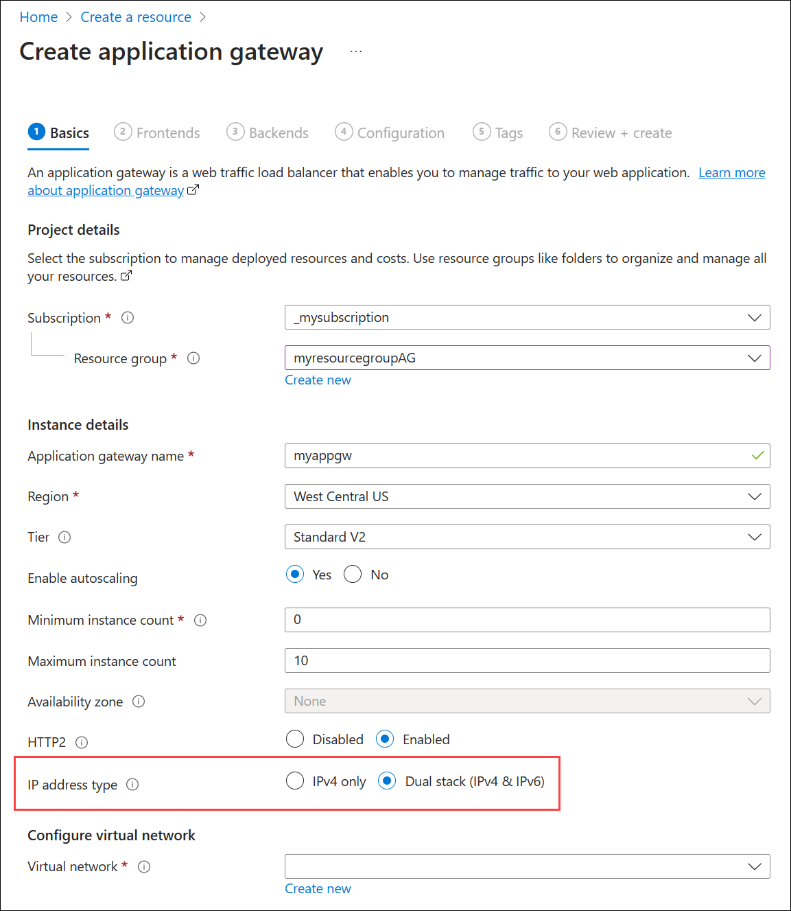 
     
2. **Configure virtual network**: For Azure to communicate between the resources that you create, a dual stack virtual network is needed. You can either create a new dual stack virtual network or choose an existing dual stack network. In this example, you create a new dual stack virtual network at the same time that you create the application gateway. 

    Application Gateway instances are created in separate subnets. One dual-stack subnet and one IPv4-only are created in this example: The IPv4 and IPv6 subnets (provisioned as one dual-stack subnet) are assigned to the application gateway. The IPv4 subnet is for the backend servers.

    > [!NOTE]
    > [Virtual network service endpoint policies](../virtual-network/virtual-network-service-endpoint-policies-overview.md) are currently not supported in an Application Gateway subnet.
    <a name="dual-stack"></a>
    Under **Configure virtual network**, create a new virtual network by selecting **Create new**. In the **Create virtual network** pane, enter the following values to create the virtual network and two subnets:

    - **Name**: Enter a name for the virtual network. For example, **myVNet**.
    - **Subnet name** (Application Gateway subnet): The **Subnets** grid shows a subnet named **default**. Change the name of this subnet to **myAGSubnet**.
    - **Address range** - The default IPv4 address ranges for the VNet and the subnet are 10.0.0.0/16 and 10.0.0.0/24, respectively. The default IPv6 address ranges for the VNet and the subnet are ace:cab:deca::/48 and ace:cab:deca::/64, respectively. If you see different default values, you might have an existing subnet that overlaps with these ranges.

    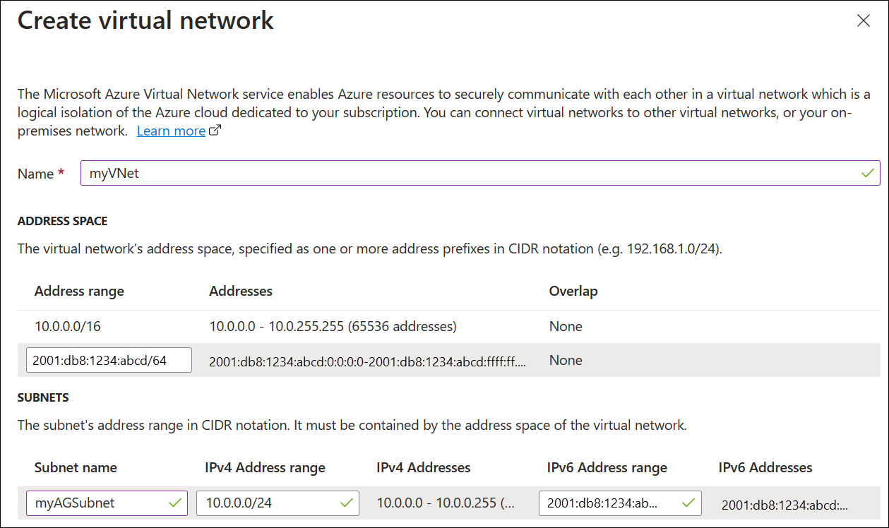
    
    > [!NOTE] 
    > The application gateway subnet can contain only application gateways. No other resources are allowed. 

    Select **OK** to close the **Create virtual network** window and save the new virtual network and subnet settings.

3. Select **Next: Frontends**.

### Frontends tab

1. On the **Frontends** tab, verify **Frontend IP address type** is set to **Public**.

   > [!IMPORTANT]
   > For the Application Gateway v2 SKU, there must be a **Public** frontend IP configuration. A private IPv6 frontend IP configuration (Only ILB mode) is currently not supported for the IPv6 Application Gateway preview. 

2. Select **Add new** for the **Public IP address**, enter a name for the public IP address, and select **OK**. For example, **myAGPublicIPAddress**. 

     

    > [!NOTE]
    > IPv6 Application Gateway (preview) supports up to 4 frontend IP addresses: two IPv4 addresses (Public and Private) and two IPv6 addresses (Public and Private)


3. Select **Next: Backends**.

### Backends tab

The backend pool is used to route requests to the backend servers that serve the request. Backend pools can be composed of NICs, Virtual Machine Scale Sets, public IP addresses, internal IP addresses, fully qualified domain names (FQDN), and multi-tenant backends like Azure App Service. In this example, you create an empty backend pool with your application gateway and then add backend targets to the backend pool.

1. On the **Backends** tab, select **Add a backend pool**.

2. In the **Add a backend pool** pane, enter the following values to create an empty backend pool:

    - **Name**: Enter a name for the backend pool. For example, **myBackendPool**.
    - **Add backend pool without targets**: Select **Yes** to create a backend pool with no targets. Backend targets are added after creating the application gateway.

3. Select **Add** to save the backend pool configuration and return to the **Backends** tab.

     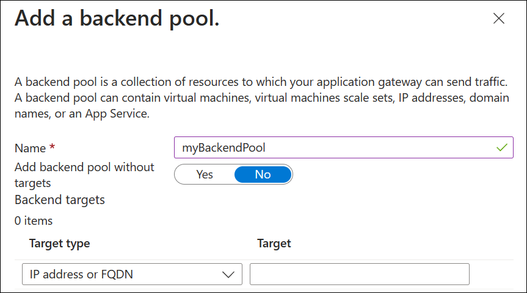

4. On the **Backends** tab, select **Next: Configuration**.

### Configuration tab

On the **Configuration** tab, the frontend and backend pool are connected with a routing rule.

1. Under **Routing rules**, select **Add a routing rule**.

2. In the **Add a routing rule** pane, enter the following values:

    - **Rule name**: Enter a name for the rule. For example, **myRoutingRule**.
    - **Priority**: Enter a value between 1 and 20000, where 1 represents highest priority and 20000 represents lowest. For example, enter a priority of **100**.

3. A routing rule requires a listener. On the **Listener** tab, enter the following values:

    - **Listener name**: Enter a name for the listener. For example, **myListener**.
    - **Frontend IP**: Select **Public IPv6**.
  
      Accept the default values for the other settings on the **Listener** tab and then select the **Backend targets** tab.

   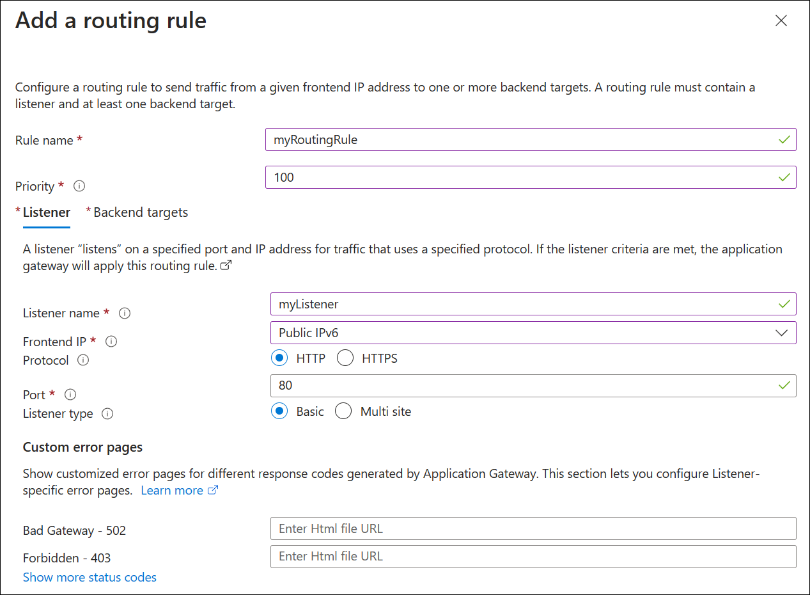

4. On the **Backend targets** tab, select your backend pool for the **Backend target**. For example, **myBackendPool**.

5. For the **Backend setting**, select **Add new**. The Backend setting determines the behavior of the routing rule. In the **Add Backend setting** pane, enter a Backend settings name. For example, **myBackendSetting**. 

6. Accept the default values for other settings and then select **Add**. 

     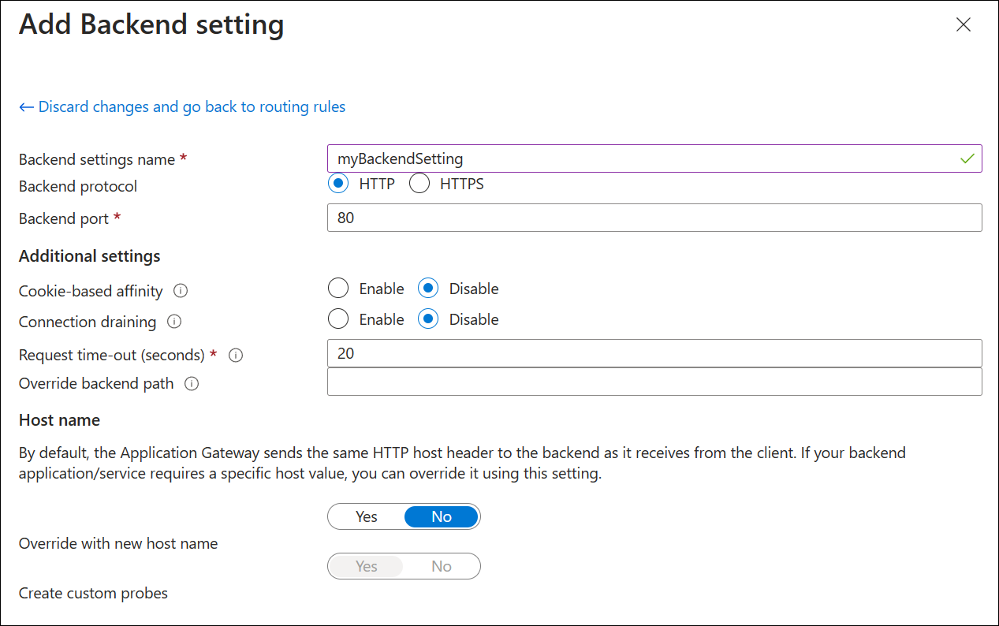

7. In the **Add a routing rule** pane, select **Add** to save the routing rule and return to the **Configuration** tab.

     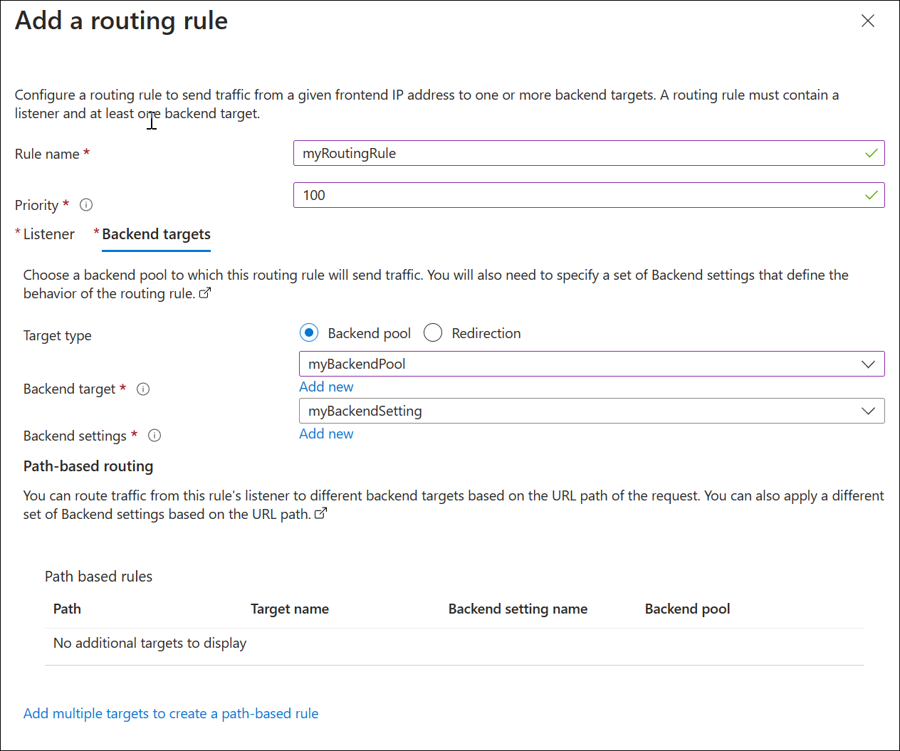

8. Select **Next: Tags**, select **Next: Review + create**, and then select **Create**. Deployment of the application gateway takes a few minutes.

## Assign a DNS name to the frontend IPv6 address

A DNS name makes testing easier for the IPv6 application gateway. You can assign a public DNS name using your own domain and registrar, or you can create a name in azure.com. To assign a name in azure.com:

1. From the Azure portal Home page, search for **Public IP addresses**.
2. Select **MyAGPublicIPv6Address**.
3. Under **Settings**, select **Configuration**.
4. Under **DNS name label (optional)**, enter a name. For example, **myipv6appgw**.
5. Select **Save**.
6. Copy the FQDN to a text editor for access later. In the following example, the FQDN is **myipv6appgw.westcentralus.cloudapp.azure.com**.

     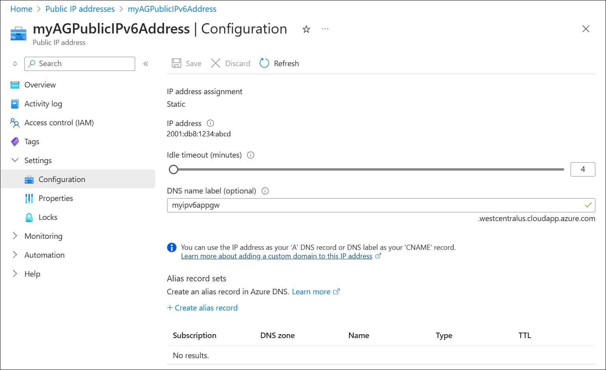

## Add a backend subnet

A backend IPv4 subnet is required for the backend targets. The backend subnet is IPv4-only.

1. On the portal Home page, search for Virtual Networks and select the **MyVNet** virtual network.
2. Next to **Address space**, select **10.0.0.0/16**.
3. Under **Settings**, select **Subnets**.
4. Select **+ Subnet** to add a new subnet.
5. Under **Name**, enter **MyBackendSubnet**.
6. The default address space is **10.0.1.0/24**. Select **Save** to accept this and all other default settings.

     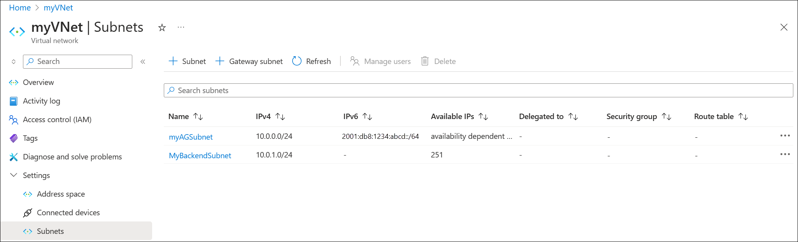

## Add backend targets

Next, a backend target is added to test the application gateway:

1. One [VM is created](#create-a-virtual-machine): **myVM** and used as a backend target. You can also use existing virtual machines if they're available.
2. [IIS is installed](#install-iis-for-testing) on the virtual machine to verify that the application gateway was created successfully.
3. The backend server (VM) is [added to the backend pool](#add-backend-servers-to-backend-pool).

> [!NOTE]
> Only one virtual machine is deployed here as backend target because we are only testing connectivity. You can add multiple virtual machines if you also wish to test load balancing.

### Create a virtual machine

Application Gateway can route traffic to any type of virtual machine used in the backend pool. A Windows Server 2019 Datacenter virtual machine is used in this example.

1. On the Azure portal menu or from the **Home** page, select **Create a resource**.
2. Select **Windows Server 2019 Datacenter** in the **Popular** list. The **Create a virtual machine** page appears.
3. Enter the following values on the **Basics** tab:
    - **Resource group**: Select **myResourceGroupAG**.
    - **Virtual machine name**: Enter **myVM**.
    - **Region**: Select the same region where you created the application gateway.
    - **Username**: Enter a name for the administrator user name.
    - **Password**: Enter a password.
    - **Public inbound ports**: **None**.
4. Accept the other defaults and then select **Next: Disks**.  
5. Accept the **Disks** tab defaults and then select **Next: Networking**.
6. Next to **Virtual network**, verify that **myVNet** is selected. 
7. Next to **Subnet**, verify that **myBackendSubnet** is selected.
8. Next to **Public IP**, select **None**.
8. Select **Next: Management**, **Next: Monitoring**, and then next to **Boot diagnostics** select **Disable**.
7. Select **Review + create**.
8. On the **Review + create** tab, review the settings, correct any validation errors, and then select **Create**.
9. Wait for the virtual machine creation to complete before continuing.

### Install IIS for testing

In this example, you install IIS on the virtual machines to verify Azure created the application gateway successfully.

1. Open Azure PowerShell.

   Select **Cloud Shell** from the top navigation bar of the Azure portal and then select **PowerShell** from the drop-down list. 

2. Run the following command to install IIS on the virtual machine. Change the *Location* parameter if necessary: 

    ```azurepowershell
    Set-AzVMExtension `
      -ResourceGroupName myResourceGroupAG `
      -ExtensionName IIS `
      -VMName myVM `
      -Publisher Microsoft.Compute `
      -ExtensionType CustomScriptExtension `
      -TypeHandlerVersion 1.4 `
      -SettingString '{"commandToExecute":"powershell Add-WindowsFeature Web-Server; powershell Add-Content -Path \"C:\\inetpub\\wwwroot\\Default.htm\" -Value $($env:computername)"}' `
      -Location WestCentralUS
    ```

    See the following example:

    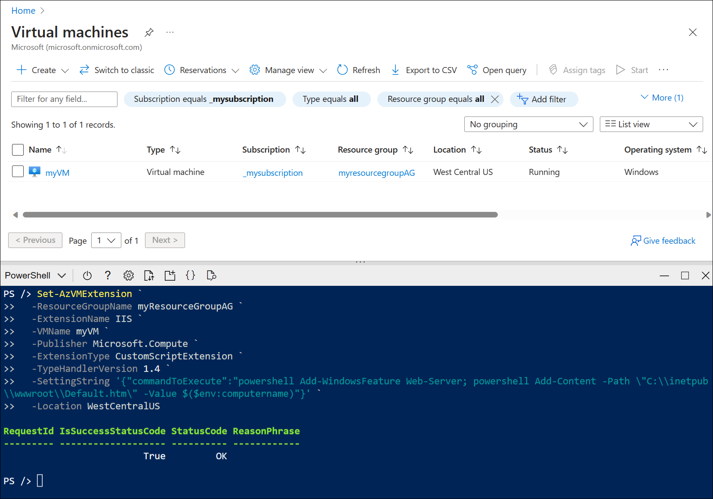

### Add backend servers to backend pool

1. On the Azure portal menu, select **Application gateways** or search for and select **Application gateways*. Then select **myAppGateway**.
2. Under **Settings**, select **Backend pools** and then select **myBackendPool**.
4. Under **Backend targets**, **Target type**, select **Virtual machine** from the drop-down list.
5. Under **Target**, select the **myVM** network interface from the drop-down list.

    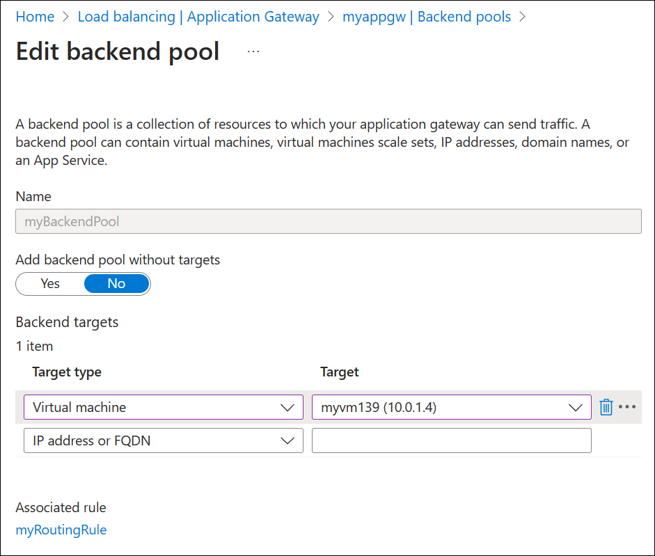

6. Select **Save**.
7. Wait for the deployment to complete before proceeding to the next step. Deployment takes a few minutes.

## Test the application gateway

IIS isn't required to create the application gateway. It's installed here to verify that you're able to successfully connect to the IPv6 interface of the application gateway. 

Previously, we assigned the DNS name **myipv6appgw.westcentralus.cloudapp.azure.com** to the public IPv6 address of the application gateway. To test this connection:

1. Paste the DNS name into the address bar of your browser to connect to it.
2. Check the response. A valid response of **myVM** verifies that the application gateway was successfully created and can successfully connect with the backend.

   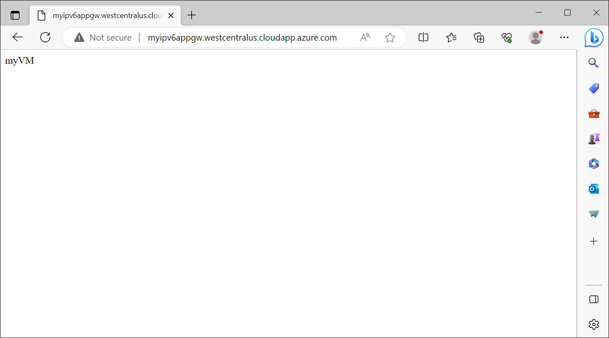

    > [!IMPORTANT]
    > If the connection to the DNS name or IPv6 address fails, it might be because you can't browse IPv6 addresses from your device. To check if this is your problem, also test the IPv4 address of the application gateway. If the IPv4 address connects successfully, then it's likely you don't have a public IPv6 address assigned to your device. If this is the case, you can try testing the connection with a [dual-stack VM](../virtual-network/ip-services/create-vm-dual-stack-ipv6-portal.md).

## Clean up resources

When you no longer need the resources that you created with the application gateway, delete the resource group. When you delete the resource group, you also remove the application gateway and all the related resources.

To delete the resource group:

1. On the Azure portal menu, select **Resource groups** or search for and select **Resource groups**.
2. On the **Resource groups** page, search for **myResourceGroupAG** in the list, then select it.
3. On the **Resource group page**, select **Delete resource group**.
4. Enter **myResourceGroupAG** under **TYPE THE RESOURCE GROUP NAME** and then select **Delete**

## Unregister from the preview

To opt out of the public preview for the enhanced Application Gateway network controls via Portal, use the following steps:

1. Sign in to the [Azure portal](https://portal.azure.com/).
2. In the search box, enter _subscriptions_ and select **Subscriptions**.

    :::image type="content" source="../azure-resource-manager/management/media/preview-features/search.png" alt-text="A screenshot of Azure portal search.":::

3. Select the link for your subscription's name.

    :::image type="content" source="../azure-resource-manager/management/media/preview-features/subscriptions.png" alt-text="A screenshot of selecting the Azure subscription.":::

4. From the left menu, under **Settings** select **Preview features**.

    :::image type="content" source="../azure-resource-manager/management/media/preview-features/preview-features-menu.png" alt-text="A screenshot of the Azure preview features menu.":::

5. A list of available preview features with your current registration status is displayed.

    :::image type="content" source="../azure-resource-manager/management/media/preview-features/preview-features-list.png" alt-text="A screenshot of the Azure portal list of preview features.":::

6. From **Preview features** type **AllowApplicationGatewayIPv6** into the filter box, select the feature, and select **Unregister**.

    :::image type="content" source="../azure-resource-manager/management/media/preview-features/filter.png" alt-text="A screenshot of Azure portal filter preview features.":::

## Next steps

- [What is Azure Application Gateway v2?](overview-v2.md)