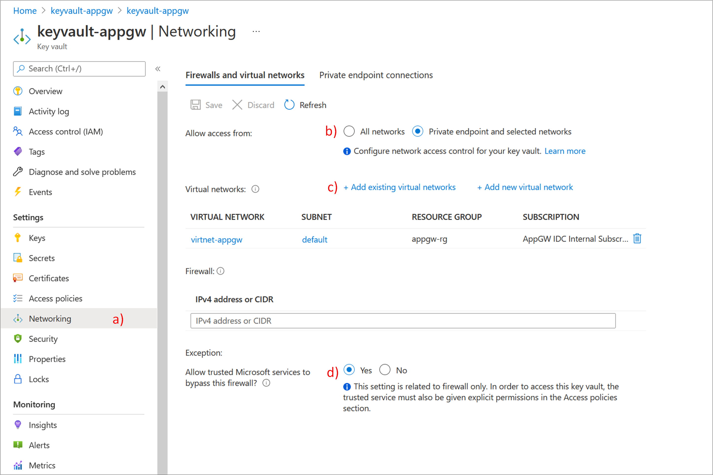

# TLS termination with Key Vault certificates

[Azure Key Vault](../key-vault/general/overview.md) is a platform-managed secret store that you can use to safeguard secrets, keys, and TLS/SSL certificates. Azure Application Gateway supports integration with Key Vault for server certificates that are attached to HTTPS-enabled listeners. This support is limited to the v2 SKU of Application Gateway.

Application Gateway offers two models for TLS termination:

- Provide TLS/SSL certificates attached to the listener. This model is the traditional way to pass TLS/SSL certificates to Application Gateway for TLS termination.
- Provide a reference to an existing Key Vault certificate or secret when you create a HTTPS-enabled listener.

Application Gateway integration with Key Vault offers many benefits, including:

- Stronger security, because TLS/SSL certificates aren't directly handled by the application development team. Integration allows a separate security team to:
  * Set up application gateways.
  * Control application gateway lifecycles.
  * Grant permissions to selected application gateways to access certificates that are stored in your key vault.
- Support for importing existing certificates into your key vault. Or use Key Vault APIs to create and manage new certificates with any of the trusted Key Vault partners.
- Support for automatic renewal of certificates that are stored in your key vault.

## Supported certificates

Application Gateway currently supports software-validated certificates only. Hardware security module (HSM)-validated certificates are not supported. 

After Application Gateway is configured to use Key Vault certificates, its instances retrieve the certificate from Key Vault and install them locally for TLS termination. The instances poll Key Vault at four-hour intervals to retrieve a renewed version of the certificate, if it exists. If an updated certificate is found, the TLS/SSL certificate that's currently associated with the HTTPS listener is automatically rotated.

> [!TIP]
> Any change to Application Gateway will force a check against Key Vault to see if any new versions of certificates are available. This includes, but not limited to, changes to Frontend IP Configurations, Listeners, Rules, Backend Pools, Resource Tags, and more. If an updated certificate is found, the new certificate will immediately be presented.

Application Gateway uses a secret identifier in Key Vault to reference the certificates. For Azure PowerShell, the Azure CLI, or Azure Resource Manager, we strongly recommend that you use a secret identifier that doesn't specify a version. This way, Application Gateway will automatically rotate the certificate if a newer version is available in your key vault. An example of a secret URI without a version is `https://myvault.vault.azure.net/secrets/mysecret/`.

The Azure portal supports only Key Vault certificates, not secrets. Application Gateway still supports referencing secrets from Key Vault, but only through non-portal resources like PowerShell, the Azure CLI, APIs, and Azure Resource Manager templates (ARM templates).

> [!WARNING]
> Azure Application Gateway currently supports only Key Vault accounts in the same subscription as the Application Gateway resource. Choosing a key vault under a different subscription than your Application Gateway will result in a failure.

## Certificate settings in Key Vault

For TLS termination, Application Gateway only supports certificates in Personal Information Exchange (PFX) format. You can either import an existing certificate or create a new one in your key vault. To avoid any failures, ensure that the certificate's status is set to **Enabled** in Key Vault.

## How integration works

Application Gateway integration with Key Vault is a three-step configuration process:


> [!Note]
> Azure Application Gateway integration with Key Vault supports both Vault access policy and Azure role-based access control permission models.

### Obtain a user-assigned managed identity

Application Gateway uses a managed identity to retrieve certificates from Key Vault on your behalf. 

You can either create a new user-assigned managed identity or reuse an existing with the integration. To create a new user-assigned managed identity, see [Create a user-assigned managed identity using the Azure portal](../active-directory/managed-identities-azure-resources/how-manage-user-assigned-managed-identities.md#create-a-user-assigned-managed-identity). 

### Delegate user-assigned managed identity to Key Vault

Define access policies to use the user-assigned managed identity with your key vault:

1. In the Azure portal, go to **Key Vault**.
1. Select the key vault that contains your certificate.
1. If you're using the permission model **Vault access policy**: Select **Access Policies**, select **+ Add Access Policy**, select **Get** for **Secret permissions**, and choose your user-assigned managed identity for **Select principal**. Then select **Save**.
   
   If you're using the permission model **Azure role-based access control**: Select **Access control (IAM)** and [Add a role assignment](../active-directory/managed-identities-azure-resources/how-manage-user-assigned-managed-identities.md#assign-a-role-to-a-user-assigned-managed-identity) for the user-assigned managed identity to the Azure key vault for the role **Key Vault Secrets User**.

### Verify Firewall Permissions to Key Vault

As of March 15, 2021, Key Vault recognizes Application Gateway as a trusted service by leveraging User Managed Identities for authentication to Azure Key Vault.  With the use of service endpoints and enabling the trusted services option for key vault's firewall, you can build a secure network boundary in Azure. You can deny access to traffic from all networks (including internet traffic) to Key Vault but still make Key Vault accessible for an Application Gateway resource under your subscription.

When you're using a restricted key vault, use the following steps to configure Application Gateway to use firewalls and virtual networks: 

1. In the Azure portal, in your key vault, select **Networking**.
1. On the **Firewalls and virtual networks** tab, select **Private endpoint and selected networks**.
1. For **Virtual networks**, select **+ Add existing virtual networks**, and then add the virtual network and subnet for your Application Gateway instance. During the process, also configure the `Microsoft.KeyVault` service endpoint by selecting its checkbox.
1. Select **Yes** to allow trusted services to bypass the key vault's firewall.
  


> [!Note]
> If you deploy the Application Gateway instance via an ARM template by using either the Azure CLI or PowerShell, or via an Azure application deployed from the Azure portal, the SSL certificate is stored in the key vault as a Base64-encoded PFX file. You must complete the steps in [Use Azure Key Vault to pass secure parameter value during deployment](../azure-resource-manager/templates/key-vault-parameter.md). 
>
> It's particularly important to set `enabledForTemplateDeployment` to `true`. The certificate might or might not have a password. In the case of a certificate with a password, the following example shows a possible configuration for the `sslCertificates` entry in `properties` for the ARM template configuration for Application Gateway. 
>
> ```
> "sslCertificates": [
>      {
>          "name": "appGwSslCertificate",
>          "properties": {
>              "data": "[parameters('appGatewaySSLCertificateData')]",
>             "password": "[parameters('appGatewaySSLCertificatePassword')]"
>         }
>     }
> ]
> ```
>
> The values of `appGatewaySSLCertificateData` and `appGatewaySSLCertificatePassword` are looked up from the key vault, as described in [Reference secrets with dynamic ID](../azure-resource-manager/templates/key-vault-parameter.md#reference-secrets-with-dynamic-id). Follow the references backward from `parameters('secretName')` to see how the lookup happens. If the certificate is passwordless, omit the `password` entry.

### Configure Application Gateway Listener

#### Key Vault permission Vault access policy model
Navigate to your Application Gateway in the Azure portal and select the **Listeners** tab.  Select **Add Listener** (or select an existing listener) and specify **HTTPS** for the protocol.

Under **Choose a certificate**, select **Create new** and then select **Choose a certificate from Key Vault** under **Https settings**.

For Cert name, type a friendly name for the certificate to be referenced in Key Vault.  Choose your Managed identity, Key vault, and Certificate.

Once selected, select  **Add** (if creating) or **Save** (if editing) to apply the referenced Key Vault certificate to the listener.

#### Key Vault Azure role-based access control permission model
Application Gateway supports certificates referenced in Key Vault via the Role-based access control permission model. The first few steps to reference the key vault must be completed via ARM, Bicep, CLI, or  PowerShell.

> [!Note]
> Specifying Azure Key Vault certificates that are subject to the role-based access control permission model is not supported via the portal.

In this example, we will use PowerShell to reference a new Key Vault certificate.
```
# Get the Application Gateway we want to modify
$appgw = Get-AzApplicationGateway -Name MyApplicationGateway -ResourceGroupName MyResourceGroup
# Specify the resource id to the user assigned managed identity - This can be found by going to the properties of the managed identity
Set-AzApplicationGatewayIdentity -ApplicationGateway $appgw -UserAssignedIdentityId "/subscriptions/xxxxxxxx-xxxx-xxxx-xxxx-xxxxxxxxxxxx/resourceGroups/MyResourceGroup/providers/Microsoft.ManagedIdentity/userAssignedIdentities/MyManagedIdentity"
# Get the secret ID from key vault
$secret = Get-AzKeyVaultSecret -VaultName "MyKeyVault" -Name "CertificateName"
$secretId = $secret.Id # https://<keyvaultname>.vault.azure.net/secrets/<hash>
# Specify the secret ID from key vault 
Add-AzApplicationGatewaySslCertificate -KeyVaultSecretId $secretId -ApplicationGateway $appgw -Name $secret.Name
# Commit the changes to the Application Gateway
Set-AzApplicationGateway -ApplicationGateway $appgw
```

Once the commands have been executed, you can navigate to your Application Gateway in the Azure portal and select the Listeners tab.  Click Add Listener (or select an existing) and specify the Protocol to HTTPS.

Under *Choose a certificate* select the certificate named in the previous steps.  Once selected, select  *Add* (if creating) or *Save* (if editing) to apply the referenced Key Vault certificate to the listener.

## Investigating and resolving Key Vault errors

Azure Application Gateway doesn't just poll for the renewed certificate version on Key Vault at every four-hour interval. It also logs any error and is integrated with Azure Advisor to surface any misconfiguration as a recommendation. The recommendation contains details about the problem and the associated Key Vault resource. You can use this information along with the [troubleshooting guide](../application-gateway/application-gateway-key-vault-common-errors.md) to quickly resolve such a configuration error. 

We strongly recommend that you [configure Advisor alerts](../advisor/advisor-alerts-portal.md) to stay updated when a problem is detected. To set an alert for this specific case, use **Resolve Azure Key Vault issue for your Application Gateway** as the recommendation type. 

## Next steps

[Configure TLS termination with Key Vault certificates by using Azure PowerShell](configure-keyvault-ps.md)
