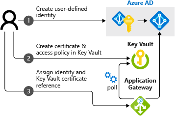

# SSL termination with Key Vault certificates

[Azure Key Vault](../key-vault/key-vault-whatis.md) is a platform-managed secret store that you can use to safeguard secrets, keys, and SSL certificates. Azure Application Gateway supports integration with Key Vault (in public preview) for server certificates that are attached to HTTPS-enabled listeners. This support is limited to the v2 SKU of Application Gateway.

> [!IMPORTANT]
> Integration of Application Gateway with Key Vault is currently in public preview. This preview is provided without a service-level agreement (SLA) and isn't recommended for production workloads. Certain features might not be supported or might have constrained capabilities. For more information, see [Supplemental Terms of Use for Microsoft Azure Previews](https://azure.microsoft.com/support/legal/preview-supplemental-terms/).

This public preview offers two models for SSL termination:

- You can explicitly provide SSL certificates attached to the listener. This model is the traditional way to pass SSL certificates to Application Gateway for SSL termination.
- You can optionally provide a reference to an existing Key Vault certificate or secret when you create an HTTPS-enabled listener.

Application Gateway integration with Key Vault offers many benefits, including:

- Stronger security, because SSL certificates aren't directly handled by the application development team. Integration allows a separate security team to:
  * Set up application gateways.
  * Control application gateway lifecycles.
  * Grant permissions to selected application gateways to access certificates that are stored in your key vault.
- Support for importing existing certificates into your key vault. Or use Key Vault APIs to create and manage new certificates with any of the trusted Key Vault partners.
- Support for automatic renewal of certificates that are stored in your key vault.

Application Gateway currently supports software-validated certificates only. Hardware security module (HSM)-validated certificates are not supported. After Application Gateway is configured to use Key Vault certificates, its instances retrieve the certificate from Key Vault and install them locally for SSL termination. The instances also poll Key Vault at 24-hour intervals to retrieve a renewed version of the certificate, if it exists. If an updated certificate is found, the SSL certificate currently associated with the HTTPS listener is automatically rotated.

## How integration works

Application Gateway integration with Key Vault requires a three-step configuration process:

1. **Create a user-assigned managed identity**

   You create or reuse an existing user-assigned managed identity, which Application Gateway uses to retrieve certificates from Key Vault on your behalf. For more information, see [What is managed identities for Azure resources?](../active-directory/managed-identities-azure-resources/overview.md). This step creates a new identity in the Azure Active Directory tenant. The identity is trusted by the subscription that's used to create the identity.

1. **Configure your key vault**

   You then either import an existing certificate or create a new one in your key vault. The certificate will be used by applications that run through the application gateway. In this step, you can also use a key vault secret that's stored as a password-less, base 64-encoded PFX file. We recommend using a certificate type because of the autorenewal capability that's available with certificate type objects in the key vault. After you've created a certificate or a secret, you define access policies in the key vault to allow the identity to be granted *get* access to the secret.

1. **Configure the application gateway**

   After you complete the two preceding steps, you can set up or modify an existing application gateway to use the user-assigned managed identity. You can also configure the HTTP listener’s SSL certificate to point to the complete URI of the Key Vault certificate or secret ID.

   

## Next steps

[Configure SSL termination with Key Vault certificates by using Azure PowerShell](configure-keyvault-ps.md)
