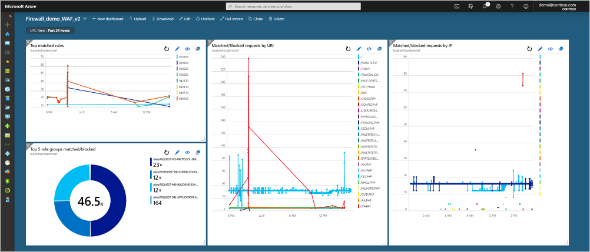

# Use Log Analytics to examine Application Gateway Web Application Firewall Logs

Once your Application Gateway WAF is operational, you can enable logs to inspect what is happening with each request. Firewall logs give insight to what the WAF is evaluating, matching, and blocking. With Log Analytics, you can examine the data inside the firewall logs to give even more insights. For more information about creating a Log Analytics workspace, see [Create a Log Analytics workspace in the Azure portal](../azure-monitor/learn/quick-create-workspace.md). For more information about log queries, see [Overview of log queries in Azure Monitor](../azure-monitor/log-query/log-query-overview.md).

## Import WAF logs

To import your firewall logs into Log Analytics, see [Back-end health, diagnostic logs, and metrics for Application Gateway](application-gateway-diagnostics.md#diagnostic-logging). When you have the firewall logs in your Log Analytics workspace, you can view data, write queries, create visualizations, and add them to your portal dashboard.

## Explore data with examples

To view the raw data in the firewall log, you can run the following query:

```
AzureDiagnostics 
| where ResourceProvider == "MICROSOFT.NETWORK" and Category == "ApplicationGatewayFirewallLog"
```

This will look similar to the following query:


You can drill down into the data, and plot graphs or create visualizations from here. See the following queries as a starting point:

### Matched/Blocked requests by IP

```
AzureDiagnostics
| where ResourceProvider == "MICROSOFT.NETWORK" and Category == "ApplicationGatewayFirewallLog"
| summarize count() by clientIp_s, bin(TimeGenerated, 1m)
| render timechart
```

### Matched/Blocked requests by URI

```
AzureDiagnostics
| where ResourceProvider == "MICROSOFT.NETWORK" and Category == "ApplicationGatewayFirewallLog"
| summarize count() by requestUri_s, bin(TimeGenerated, 1m)
| render timechart
```

### Top matched rules

```
AzureDiagnostics
| where ResourceProvider == "MICROSOFT.NETWORK" and Category == "ApplicationGatewayFirewallLog"
| summarize count() by ruleId_s, bin(TimeGenerated, 1m)
| where count_ > 10
| render timechart
```

### Top five matched rule groups

```
AzureDiagnostics
| where ResourceProvider == "MICROSOFT.NETWORK" and Category == "ApplicationGatewayFirewallLog"
| summarize Count=count() by details_file_s, action_s
| top 5 by Count desc
| render piechart
```

## Add to your dashboard

Once you create a query, you can add it to your dashboard.  Select the **Pin to dashboard** in the top right of the log analytics workspace. With the previous four queries pinned to an example dashboard, this is the data you can see at a glance:



## Next steps

[Back-end health, diagnostic logs, and metrics for Application Gateway](application-gateway-diagnostics.md)
