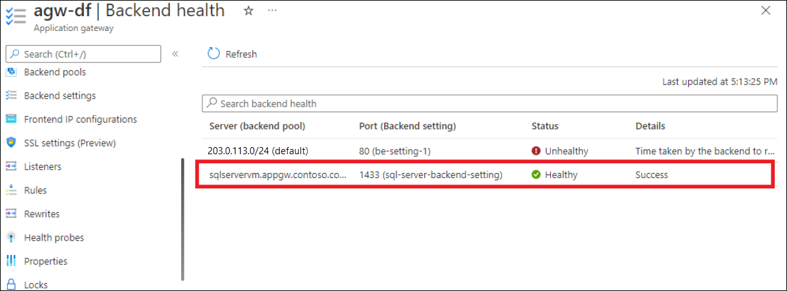

<!-- 
IMPORTANT 

According to the Content Pattern guidelines all comments must be removed before publication!!!

To make this template easier to use, first:
1. Search and replace [TODO-replace-with-service-name] with the official name of your service.
2. Search and replace [TODO-replace-with-service-filename] with the service name to use in GitHub filenames.-->

<!-- VERSION 3.0 2024_01_01
For background about this template, see https://review.learn.microsoft.com/en-us/help/contribute/contribute-monitoring?branch=main -->

<!-- All sections are required unless otherwise noted. Add service-specific information after the includes.

Your service should have the following two articles:

1. The primary monitoring article (based on the template monitor-service-template.md)
   - Title: "Monitor [TODO-replace-with-service-name]"
   - TOC title: "Monitor"
   - Filename: "monitor-[TODO-replace-with-service-filename].md"

2. A reference article that lists all the metrics and logs for your service (based on this template).
   - Title: "[TODO-replace-with-service-name] monitoring data reference"
   - TOC title: "Monitoring data reference"
   - Filename: "monitor-[TODO-replace-with-service-filename]-reference.md".
-->

# Azure Application Gateway monitoring data reference

[!INCLUDE [horz-monitor-ref-intro](~/reusable-content/ce-skilling/azure/includes/azure-monitor/horizontals/horz-monitor-ref-intro.md)]

See [Monitor Azure Application Gateway](monitor-application-gateway.md) for details on the data you can collect for Application Gateway and how to use it.

[!INCLUDE [horz-monitor-ref-metrics-intro](~/reusable-content/ce-skilling/azure/includes/azure-monitor/horizontals/horz-monitor-ref-metrics-intro.md)]

### Supported metrics for Microsoft.Network/applicationGateways

The following table lists the metrics available for the Microsoft.Network/applicationGateways resource type.

[!INCLUDE [horz-monitor-ref-metrics-tableheader](~/reusable-content/ce-skilling/azure/includes/azure-monitor/horizontals/horz-monitor-ref-metrics-tableheader.md)]

[!INCLUDE[Microsoft.Network/applicationgateways](~/azure-reference-other-repo/azure-monitor-ref/supported-metrics/includes/microsoft-network-applicationgateways-metrics-include.md)]

<!-- Metrics material from original reference article starts here. -->

### Timing metrics
Application Gateway provides several built‑in timing metrics related to the request and response, which are all measured in milliseconds.

> [!NOTE]
>
> If the Application Gateway has more than one listener, then always filter by the *Listener* dimension while comparing different latency metrics to get more meaningful inference.

| Metric | Unit | Description|
|:-------|:-----|:------------|
|**Backend connect time**|Milliseconds|Time spent establishing a connection with the backend application.  This includes the network latency and the time taken by the backend server’s TCP stack to establish new connections. For TLS, it also includes the time spent on handshake.|
|**Backend first byte response time**|Milliseconds|Time interval between start of establishing a connection to backend server and receiving the first byte of the response header.  This approximates the sum of Backend connect time, time taken by the request to reach the backend from Application Gateway, time taken by backend application to respond (the time the server took to generate content, potentially fetch database queries), and the time taken by first byte of the response to reach the Application Gateway from the backend.|
|**Backend last byte response time**|Milliseconds|Time interval between start of establishing a connection to backend server and receiving the last byte of the response body.  This approximates the sum of backend first byte response time and data transfer time. This number may vary greatly depending on the size of objects requested and the latency of the server network.|
|**Application gateway total time**|Milliseconds|Average time that it takes for a request to be received, processed and its response to be sent.  This is the interval from the time when Application Gateway receives the first byte of the HTTP request to the time when the last response byte has been sent to the client. This includes the processing time taken by Application Gateway, the Backend last byte response time, the time taken by Application Gateway to send all the response, and the Client RTT.|
|**Client RTT**|Milliseconds|Average round-trip time between clients and Application Gateway.|

These metrics can be used to determine whether the observed slowdown is due to the client network, Application Gateway performance, the backend network and backend server TCP stack saturation, backend application performance, or large file size.

For example, if there’s a spike in *Backend first byte response time* trend but the *Backend connect time* trend is stable, then it can be inferred that the Application gateway to backend latency and the time taken to establish the connection is stable, and the spike is caused due to an increase in the response time of backend application. On the other hand, if the spike in *Backend first byte response time* is associated with a corresponding spike in *Backend connect time*, then it can be deduced that either the network between Application Gateway and backend server or the backend server TCP stack has saturated. 

If you notice a spike in *Backend last byte response time* but the *Backend first byte response time* is stable, then it can be deduced that the spike is because of a larger file being requested.

Similarly, if the *Application gateway total time* has a spike but the *Backend last byte response time* is stable, then it can either be a sign of performance bottleneck at the Application Gateway or a bottleneck in the network between client and Application Gateway. Additionally, if the *client RTT* also has a corresponding spike, then it indicates that the degradation is because of the network between client and Application Gateway.

### Application Gateway metrics

| Metric | Unit | Description|
|:-------|:-----|:------------|
|**Bytes received**|Bytes|Count of bytes received by the Application Gateway from the clients. (This metric accounts for only the Request content size observed by the Application Gateway. It doesn't include data transfers such as TLS header negotiations, TCP/IP packet headers, or retransmissions.)|
|**Bytes sent**|Bytes|Count of bytes sent by the Application Gateway to the clients. (This metric accounts for only the Response Content size served by the Application Gateway. It doesn't include data transfers such as TCP/IP packet headers or retransmissions.)|
|**Client TLS protocol**|Count|Count of TLS and non-TLS requests initiated by the client that established connection with the Application Gateway. To view TLS protocol distribution, filter by the TLS Protocol dimension.|
|**Current capacity units**|Count|Count of capacity units consumed to load balance the traffic. There are three determinants to capacity unit - compute unit, persistent connections, and throughput. Each capacity unit is composed of at most: one compute unit, or 2500 persistent connections, or 2.22-Mbps throughput.|
|**Current compute units**|Count|Count of processor capacity consumed. Factors affecting compute unit are TLS connections/sec, URL Rewrite computations, and WAF rule processing.|
|**Current connections**|Count|The total number of concurrent connections active from clients to the Application Gateway.|
|**Estimated Billed Capacity units**|Count|With the v2 SKU, the pricing model is driven by consumption. Capacity units measure consumption-based cost that is charged in addition to the fixed cost. *Estimated Billed Capacity units indicate the number of capacity units using which the billing is estimated. This is calculated as the greater value between *Current capacity units* (capacity units required to load balance the traffic) and *Fixed billable capacity units* (minimum capacity units kept provisioned).|
|**Failed Requests**|Count|Number of requests that Application Gateway has served with 5xx server error codes. This includes the 5xx codes that are generated from the Application Gateway and the 5xx codes that are generated from the backend. The request count can be further filtered to show count per each/specific backend pool-http setting combination.|
|**Fixed Billable Capacity Units**|Count|The minimum number of capacity units kept provisioned as per the *Minimum scale units* setting (one instance translates to 10 capacity units) in the Application Gateway configuration.|
|**New connections per second**|Count|The average number of new TCP connections per second established from clients to the Application Gateway and from the Application Gateway to the backend members.|
|**Response Status**|Status code|HTTP response status returned by Application Gateway. The response status code distribution can be further categorized to show responses in 2xx, 3xx, 4xx, and 5xx categories.|
|**Throughput**|Bytes/sec|Number of bytes per second the Application Gateway has served. (This metric accounts for only the Content size served by the Application Gateway. It doesn't include data transfers such as TLS header negotiations, TCP/IP packet headers, or retransmissions.)|
|**Total Requests**|Count|Count of successful requests that Application Gateway has served. The request count can be further filtered to show count per each/specific backend pool-http setting combination.|

### Backend metrics

| Metric | Unit | Description|
|:-------|:-----|:------------|
|**Backend response status**|Count|Count of HTTP response status codes returned by the backends. This doesn't include any response codes generated by the Application Gateway. The response status code distribution can be further categorized to show responses in 2xx, 3xx, 4xx, and 5xx categories.|
|**Healthy host count**|Count|The number of backends that are determined healthy by the health probe. You can filter on a per backend pool basis to show the number of healthy hosts in a specific backend pool.|
|**Unhealthy host count**|Count|The number of backends that are determined unhealthy by the health probe. You can filter on a per backend pool basis to show the number of unhealthy hosts in a specific backend pool.|
|**Requests per minute per Healthy Host**|Count|The average number of requests received by each healthy member in a backend pool in a minute. Specify the backend pool using the *BackendPool HttpSettings* dimension.|

### Backend health API

See [Application Gateways - Backend Health](/rest/api/application-gateway/application-gateways/backend-health?tabs=HTTP) for details of the API call to retrieve the backend health of an application gateway.

Sample Request:
``output
POST
https://management.azure.com/subscriptions/subid/resourceGroups/rg/providers/Microsoft.Network/
applicationGateways/appgw/backendhealth?api-version=2021-08-01
After
``

After sending this POST request, you should see an HTTP 202 Accepted response. In the response headers, find the Location header and send a new GET request using that URL.

``output
GET
https://management.azure.com/subscriptions/subid/providers/Microsoft.Network/locations/region-name/operationResults/GUID?api-version=2021-08-01
``

### Application Gateway TLS/TCP proxy monitoring 

#### TLS/TCP proxy metrics

With layer 4 proxy feature now available with Application Gateway, there are some Common metrics (apply to both layer 7 as well as layer 4), and some layer 4 specific metrics. The following table describes all the metrics are the applicable for layer 4 usage.

| Metric              | Description                                                                                                                            | Type   | Dimension |
|:--------------------|:---------------------------------------------------------------------------------------------------------------------------------------|:-------|:----------|
| Current Connections | The number of active connections: reading, writing, or waiting. The count of current connections established with Application Gateway. | Common metric | None      |
| New Connections per second | The average number of connections handled per second during that minute. | Common metric | None      |
| Throughput | The rate of data flow (inBytes+ outBytes) during that minute. | Common metric | None      |
| Healthy host count | The number of healthy backend hosts. | Common metric | BackendSettingsPool  |
| Unhealthy host | The number of unhealthy backend hosts. | Common metric | BackendSettingsPool  |
| ClientRTT | Average round trip time between clients and Application Gateway. | Common metric | Listener  |
| Backend Connect Time | Time spent establishing a connection with a backend server. | Common metric | Listener, BackendServer, BackendPool, BackendSetting |
| Backend First Byte Response Time | Time interval between start of establishing a connection to backend server and receiving the first byte of data (approximating processing time of backend server). | Common metric | Listener, BackendServer, BackendPool, BackendHttpSetting`*`  |
| Backend Session Duration | The total time of a backend connection. The average time duration from the start of a new connection to its termination. | L4-specific | Listener, BackendServer, BackendPool, BackendHttpSetting`*` |
| Connection Lifetime | The total time of a client connection to application gateway. The average time duration from the start of a new connection to its termination in milliseconds. | L4-specific | Listener |

`*` BackendHttpSetting dimension includes both layer 7 and layer 4 backend settings.

#### TLS/TCP proxy logs

Application Gateway’s Layer 4 proxy provides log data through access logs. These logs are only generated and published if they are configured in the diagnostic settings of your gateway.
- Also see: [Supported categories for Azure Monitor resource logs](/azure/azure-monitor/essentials/resource-logs-categories#microsoftnetworkapplicationgateways).

| Category | Resource log category | 
|:--------------|:----------------------------------------------------------------------|
| ResourceGroup | The resource group to which the application gateway resource belongs. |
| SubscriptionId |The subscription ID of the application gateway resource. |
| ResourceProvider |This will be MICROSOFT.NETWORK for application gateway. |
| Resource |The name of the application gateway resource. |
| ResourceType |This will be APPLICATIONGATEWAYS. |
| ruleName |The name of the routing rule that served the connection request. |
| instanceId |Application Gateway instance that served the request. |
| clientIP |Originating IP for the request. |
| receivedBytes |Data received from client to gateway, in bytes. |
| sentBytes |Data sent from gateway to client, in bytes. |
| listenerName |The name of the listener that established the frontend connection with client. |
| backendSettingName |The name of the backend setting used for the backend connection. |
| backendPoolName |The name of the backend pool from which a target server was selected to establish the backend connection. |
| protocol |TCP (Irrespective of it being TCP or TLS, the protocol value will always be TCP). |
| sessionTime |session duration, in seconds (this is for the client->appgw session) |
| upstreamSentBytes |Data sent to backend server, in bytes. |
| upstreamReceivedBytes |Data received from backend server, in bytes. |
| upstreamSessionTime |session duration, in seconds (this is for the appgw->backend session) |
| sslCipher |Cipher suite being used for TLS communication (for TLS protocol listeners). |
| sslProtocol |SSL/TLS protocol being used (for TLS protocol listeners). |
| serverRouted |The backend server IP and port number to which the traffic was routed. |
| serverStatus |200 - session completed successfully. 400 - client data could not be parsed. 500 - internal server error. 502 - bad gateway. For example, when an upstream server could not be reached. 503 - service unavailable. For example, if access is limited by the number of connections. |
| ResourceId |Application Gateway resource URI |

### TLS/TCP proxy backend health

Application Gateway’s layer 4 proxy provides the capability to monitor the health of individual members of the backend pools through the portal and REST API.

 

## Application Gateway v1 metrics

### Application Gateway metrics

| Metric | Unit | Description|
|:-------|:-----|:------------|
|**CPU Utilization**|Percent|Displays the CPU usage allocated to the Application Gateway. Under normal conditions, CPU usage should not regularly exceed 90%, as this may cause latency in the websites hosted behind the Application Gateway and disrupt the client experience. You can indirectly control or improve CPU usage by modifying the configuration of the Application Gateway by increasing the instance count or by moving to a larger SKU size, or doing both.|
|**Current connections**|Count|Count of current connections established with Application Gateway.|
|**Failed Requests**|Count|Number of requests that failed because of connection issues. This count includes requests that failed due to exceeding the *Request time-out* HTTP setting and requests that failed due to connection issues between Application Gateway and the backend. This count doesn't include failures due to no healthy backend being available. 4xx and 5xx responses from the backend are also not considered as part of this metric.|
|**Response Status**|Status code|HTTP response status returned by Application Gateway. The response status code distribution can be further categorized to show responses in 2xx, 3xx, 4xx, and 5xx categories.|
|**Throughput**|Bytes/sec|Number of bytes per second the Application Gateway has served.|
|**Total Requests**|Count|Count of successful requests that Application Gateway has served. The request count can be further filtered to show count per each/specific backend pool-http setting combination.|
|**Web Application Firewall Blocked Requests Count**|Count|Number of requests blocked by WAF.|
|**Web Application Firewall Blocked Requests Distribution**|Count|Number of requests blocked by WAF filtered to show count per each/specific WAF rule group or WAF rule ID combination.|
|**Web Application Firewall Total Rule Distribution**|Count|Number of requests received per each specific WAF rule group or WAF rule ID combination.|

<!-- Keep this text as-is -->
For more information, see a list of [all platform metrics supported in Azure Monitor](../azure-monitor/essentials/metrics-supported.md).

<!-- Metrics material from original reference article ends here. -->

[!INCLUDE [horz-monitor-ref-metrics-dimensions-intro](~/reusable-content/ce-skilling/azure/includes/azure-monitor/horizontals/horz-monitor-ref-metrics-dimensions-intro.md)]

[!INCLUDE [horz-monitor-ref-metrics-dimensions](~/reusable-content/ce-skilling/azure/includes/azure-monitor/horizontals/horz-monitor-ref-metrics-dimensions.md)]

- Action
- BackendHttpSetting
- BackendPool
- BackendServer
- BackendSettingsPool
- Category
- CountryCode
- CustomRuleID
- HttpStatusGroup
- Listener
- Method
- Mode
- PolicyName
- PolicyScope
- RuleGroup
- RuleGroupID
- RuleId
- RuleSetName
- TlsProtocol

[!INCLUDE [horz-monitor-ref-resource-logs](~/reusable-content/ce-skilling/azure/includes/azure-monitor/horizontals/horz-monitor-ref-resource-logs.md)]

### Supported resource logs for Microsoft.Network/applicationGateways

[!INCLUDE [Microsoft.Network/applicationgateways](~/azure-reference-other-repo/azure-monitor-ref/supported-logs/includes/microsoft-network-applicationgateways-logs-include.md)]

<!-- begin content added from reference -->

> [!NOTE]
> The Performance log is available only for the v1 SKU. For the v2 SKU, use [Application Gateway v2 metrics](#application-gateway-v2-metrics) for performance data.

Resource Provider and Type: [Microsoft.Network/applicationGateways](../azure-monitor/essentials/resource-logs-categories.md#microsoftnetworkapplicationgateways)

| Category | Display Name | Information|
|:---------|:-------------|------------------|
| **Activitylog**   | Activity log | Activity log entries are collected by default. You can use [Azure activity logs](../azure-monitor/essentials/activity-log.md) (formerly known as operational logs and audit logs) to view all operations that are submitted to your Azure subscription, and their status. |
|**ApplicationGatewayAccessLog**|Access log| You can use this log to view Application Gateway access patterns and analyze important information. This includes the caller's IP address, requested URL, response latency, return code, and bytes in and out. An access log is collected every 60 seconds. This log contains one record per instance of Application Gateway. The Application Gateway instance is identified by the instanceId property.|
| **ApplicationGatewayPerformanceLog**|Performance log|You can use this log to view how Application Gateway instances are performing. This log captures performance information for each instance, including total requests served, throughput in bytes, total requests served, failed request count, and healthy and unhealthy backend instance count. A performance log is collected every 60 seconds. The Performance log is available only for the v1 SKU. For the v2 SKU, use [Application Gateway v2 metrics](#application-gateway-v2-metrics) for performance data.|
|**ApplicationGatewayFirewallLog**|Firewall log|You can use this log to view the requests that are logged through either detection or prevention mode of an application gateway that is configured with the web application firewall. Firewall logs are collected every 60 seconds.|

### Diagnostics tables
<!-- REQUIRED. Please keep heading in this order -->
<!-- If your service uses the AzureDiagnostics table in Azure Monitor Logs / Log Analytics, list what fields you use and what they are for. Azure Diagnostics is over 500 columns wide with all services using the fields that are consistent across Azure Monitor and then adding extra ones just for themselves.  If it uses service specific diagnostic table, refers to that table. If it uses both, put both types of information in. Most services in the future have their own specific table. If you have questions, contact azmondocs@microsoft.com -->

Azure Application Gateway uses the [Azure Diagnostics](/azure/azure-monitor/reference/tables/azurediagnostics) table to store resource log information. The following columns are relevant.

**Azure Diagnostics**

| Property | Description |
|:--- |:---|
| requestUri_s | The URI of the client request.|
| Message | Informational messages such as "SQL Injection Attack"|
| userAgent_s | User agent details of the client request|
| ruleName_s | Request routing rule that is used to serve this request|
| httpMethod_s | HTTP method of the client request|
| instanceId_s | The Appgw instance to which the client request is routed to for evaluation|
| httpVersion_s | HTTP version of the client request|
| clientIP_s | IP from which is request is made|
| host_s | Host header of the client request|
| requestQuery_s | Query string as part of the client request|
| sslEnabled_s | Does the client request have SSL enabled|

<!-- end content added from reference -->

[!INCLUDE [horz-monitor-ref-logs-tables](~/reusable-content/ce-skilling/azure/includes/azure-monitor/horizontals/horz-monitor-ref-logs-tables.md)]

### Application Gateway Microsoft.Network/applicationGateways

- [AzureActivity](/azure/azure-monitor/reference/tables/azureactivity#columns)
- [AzureMetrics](/azure/azure-monitor/reference/tables/azuremetrics#columns)
- [AGWAccessLogs](/azure/azure-monitor/reference/tables/agwaccesslogs#columns)
- [AGWPerformanceLogs](/azure/azure-monitor/reference/tables/agwperformancelogs#columns)
- [AGWFirewallLogs](/azure/azure-monitor/reference/tables/agwfirewalllogs#columns)
- [AzureDiagnostics](/azure/azure-monitor/reference/tables/azurediagnostics#columns)

[!INCLUDE [horz-monitor-ref-activity-log](~/reusable-content/ce-skilling/azure/includes/azure-monitor/horizontals/horz-monitor-ref-activity-log.md)]

- [applicationGateways resource provider operations](/azure/role-based-access-control/resource-provider-operations#networking)

## Related content

- See [Monitor Azure Application Gateway](monitor-application-gateway.md) for a description of monitoring Application Gateway.
- See [Monitor Azure resources with Azure Monitor](/azure/azure-monitor/essentials/monitor-azure-resource) for details on monitoring Azure resources.
