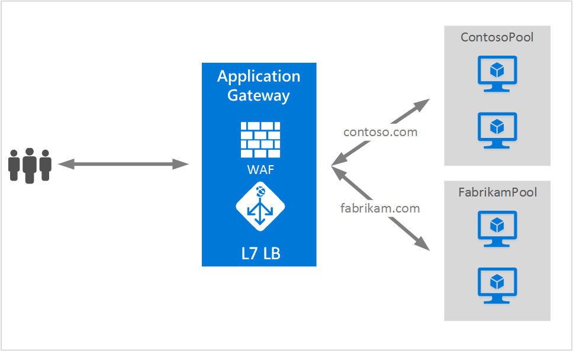

# Application Gateway multiple site hosting

Multiple site hosting enables you to configure more than one web application on the same port of an application gateway. This feature allows you to configure a more efficient topology for your deployments by adding up to 100 websites to one application gateway. Each website can be directed to its own backend pool. In the following example, application gateway serves traffic for `contoso.com` and `fabrikam.com` from two back-end server pools called ContosoServerPool and FabrikamServerPool.



> [!IMPORTANT]
> Rules are processed in the order they are listed in the portal for the v1 SKU. For the v2 SKU, exact matches have higher precedence. It is highly recommended to configure multi-site listeners first prior to configuring a basic listener.  This will ensure that traffic gets routed to the right back end. If a basic listener is listed first and matches an incoming request, it gets processed by that listener.

Requests for `http://contoso.com` are routed to ContosoServerPool, and `http://fabrikam.com` are routed to FabrikamServerPool.

Similarly, you can host multiple subdomains of the same parent domain on the same application gateway deployment. For example, you can  host `http://blog.contoso.com` and `http://app.contoso.com` on a single application gateway deployment.

## Host headers and Server Name Indication (SNI)

There are three common mechanisms for enabling multiple site hosting on the same infrastructure.

1. Host multiple web applications each on a unique IP address.
2. Use host name to host multiple web applications on the same IP address.
3. Use different ports to host multiple web applications on the same IP address.

Currently Application Gateway supports a single public IP address where it listens for traffic. So multiple applications, each with its own IP address is currently not supported. 

Application Gateway supports multiple applications each listening on different ports, but this scenario requires the applications to accept traffic on non-standard ports. This is often not a configuration that you want.

Application Gateway relies on HTTP 1.1 host headers to host more than one website on the same public IP address and port. The sites hosted on application gateway can also support TLS offload with Server Name Indication (SNI) TLS extension. This scenario means that the client browser and backend web farm must support HTTP/1.1 and TLS extension as defined in RFC 6066.

## Listener configuration element

Existing HTTPListener configuration elements are enhanced to support host name and server name indication elements. It's used by Application Gateway to route traffic to the appropriate backend pool. 

The following code example is the snippet of an HttpListeners element from a template file:

```json
"httpListeners": [
    {
        "name": "appGatewayHttpsListener1",
        "properties": {
            "FrontendIPConfiguration": {
                "Id": "/subscriptions/<subid>/resourceGroups/<rgName>/providers/Microsoft.Network/applicationGateways/applicationGateway1/frontendIPConfigurations/DefaultFrontendPublicIP"
            },
            "FrontendPort": {
                "Id": "/subscriptions/<subid>/resourceGroups/<rgName>/providers/Microsoft.Network/applicationGateways/applicationGateway1/frontendPorts/appGatewayFrontendPort443'"
            },
            "Protocol": "Https",
            "SslCertificate": {
                "Id": "/subscriptions/<subid>/resourceGroups/<rgName>/providers/Microsoft.Network/applicationGateways/applicationGateway1/sslCertificates/appGatewaySslCert1'"
            },
            "HostName": "contoso.com",
            "RequireServerNameIndication": "true"
        }
    },
    {
        "name": "appGatewayHttpListener2",
        "properties": {
            "FrontendIPConfiguration": {
                "Id": "/subscriptions/<subid>/resourceGroups/<rgName>/providers/Microsoft.Network/applicationGateways/applicationGateway1/frontendIPConfigurations/appGatewayFrontendIP'"
            },
            "FrontendPort": {
                "Id": "/subscriptions/<subid>/resourceGroups/<rgName>/providers/Microsoft.Network/applicationGateways/applicationGateway1/frontendPorts/appGatewayFrontendPort80'"
            },
            "Protocol": "Http",
            "HostName": "fabrikam.com",
            "RequireServerNameIndication": "false"
        }
    }
],
```

You can visit [Resource Manager template using multiple site hosting](https://github.com/Azure/azure-quickstart-templates/blob/master/201-application-gateway-multihosting) for an end to end template-based deployment.

## Routing rule

There's no change required in the routing rule. The routing rule 'Basic' should continue to be chosen to tie the appropriate site listener to the corresponding backend address pool.

```json
"requestRoutingRules": [
{
    "name": "<ruleName1>",
    "properties": {
        "RuleType": "Basic",
        "httpListener": {
            "id": "/subscriptions/<subid>/resourceGroups/<rgName>/providers/Microsoft.Network/applicationGateways/applicationGateway1/httpListeners/appGatewayHttpsListener1')]"
        },
        "backendAddressPool": {
            "id": "/subscriptions/<subid>/resourceGroups/<rgName>/providers/Microsoft.Network/applicationGateways/applicationGateway1/backendAddressPools/ContosoServerPool')]"
        },
        "backendHttpSettings": {
            "id": "/subscriptions/<subid>/resourceGroups/<rgName>/providers/Microsoft.Network/applicationGateways/applicationGateway1/backendHttpSettingsCollection/appGatewayBackendHttpSettings')]"
        }
    }

},
{
    "name": "<ruleName2>",
    "properties": {
        "RuleType": "Basic",
        "httpListener": {
            "id": "/subscriptions/<subid>/resourceGroups/<rgName>/providers/Microsoft.Network/applicationGateways/applicationGateway1/httpListeners/appGatewayHttpListener2')]"
        },
        "backendAddressPool": {
            "id": "/subscriptions/<subid>/resourceGroups/<rgName>/providers/Microsoft.Network/applicationGateways/applicationGateway1/backendAddressPools/FabrikamServerPool')]"
        },
        "backendHttpSettings": {
            "id": "/subscriptions/<subid>/resourceGroups/<rgName>/providers/Microsoft.Network/applicationGateways/applicationGateway1/backendHttpSettingsCollection/appGatewayBackendHttpSettings')]"
        }
    }

}
]
```

## Next steps

After learning about multiple site hosting, go to [create an application gateway using multiple site hosting](tutorial-multiple-sites-powershell.md) to create an application gateway with ability to support more than one web application.

