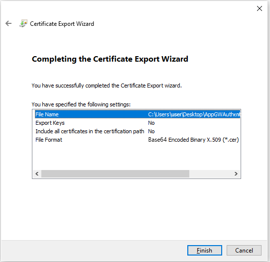
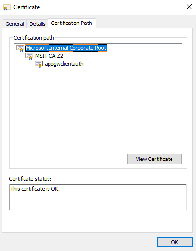
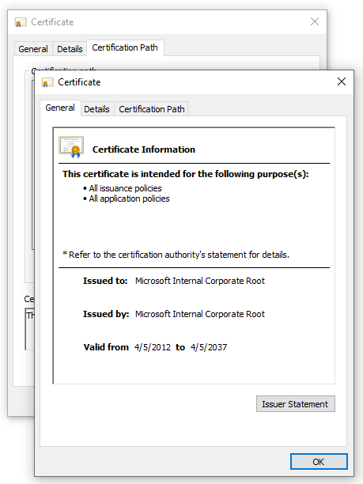
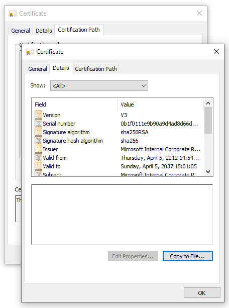
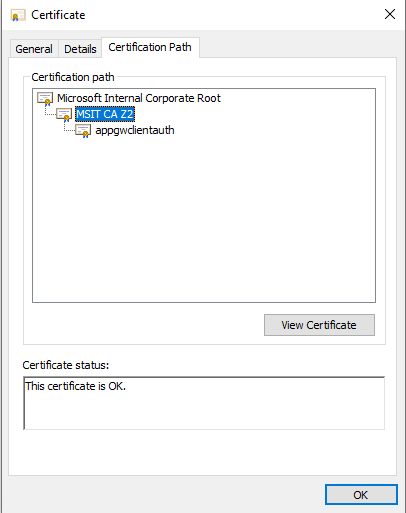
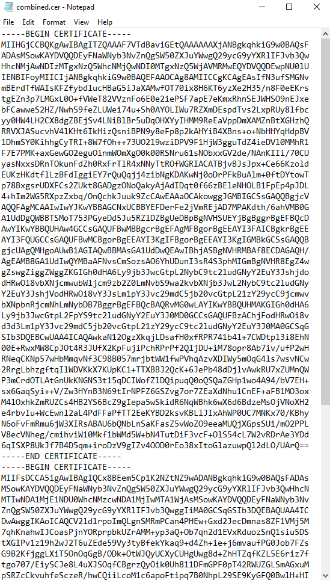

# Export a trusted client CA certificate chain to use with client authentication
In order to configure mutual authentication with the client, or client authentication, Application Gateway requires a trusted client CA certificate chain to be uploaded to the gateway. If you have multiple certificate chains, you'll need to create the chains separately and upload them as different files on the Application Gateway. In this article, you'll learn how to export a trusted client CA certificate chain that you can use in your client authentication configuration on your gateway.  

## Prerequisites

An existing client certificate is required to generate the trusted client CA certificate chain. 

## Export trusted client CA certificate

Trusted client CA certificate is required to allow client authentication on Application Gateway. In this example, we will use a TLS/SSL certificate for the client certificate, export its public key and then export the CA certificates from the public key to get the trusted client CA certificates. We'll then concatenate all the client CA certificates into one trusted client CA certificate chain. 

The following steps help you export the .pem or .cer file for your certificate:

### Export public certificate 

1. To obtain a .cer file from the certificate, open **Manage user certificates**. Locate the certificate, typically in 'Certificates - Current User\Personal\Certificates', and right-click. Click **All Tasks**, and then click **Export**. This opens the **Certificate Export Wizard**. If you can't find the certificate under Current User\Personal\Certificates, you may have accidentally opened "Certificates - Local Computer", rather than "Certificates - Current User"). If you want to open Certificate Manager in current user scope using PowerShell, you type *certmgr* in the console window.

    > [!div class="mx-imgBorder"]
    > 

2. In the Wizard, click **Next**.
    > [!div class="mx-imgBorder"]
    > 

3. Select **No, do not export the private key**, and then click **Next**.
    > [!div class="mx-imgBorder"]
    > 

4. On the **Export File Format** page, select **Base-64 encoded X.509 (.CER).**, and then click **Next**.
    > [!div class="mx-imgBorder"]
    > 

5. For **File to Export**, **Browse** to the location to which you want to export the certificate. For **File name**, name the certificate file. Then, click **Next**.

    > [!div class="mx-imgBorder"]
   > 

6. Click **Finish** to export the certificate.

    > [!div class="mx-imgBorder"]
    > 

7. Your certificate is successfully exported.

    > [!div class="mx-imgBorder"]
    > 

   The exported certificate looks similar to this:

    > [!div class="mx-imgBorder"]
    > 

### Export CA certificate(s) from the public certificate

Now that you've exported your public certificate, you will now export the CA certificate(s) from your public certificate. If you only have a root CA, you'll only need to export that certificate. However, if you have 1+ intermediate CAs, you'll need to export each of those as well. 

1. Once the public key has been exported, open the file.

    > [!div class="mx-imgBorder"]
    > 

    > [!div class="mx-imgBorder"]
    > 

1. Select the Certification Path tab to view the certification authority.

    > [!div class="mx-imgBorder"]
    >  

1. Select the root certificate and click on **View Certificate**.

    > [!div class="mx-imgBorder"]
    >  

   You should see the root certificate details.

    > [!div class="mx-imgBorder"]
    > 

1. Select the **Details** tab and click **Copy to File...**

    > [!div class="mx-imgBorder"]
    > 

1. At this point, you've extracted the details of the root CA certificate from the public certificate. You'll see the **Certificate Export Wizard**. Follow steps 2-7 from the previous section ([Export public certificate](./mutual-authentication-certificate-management.md#export-public-certificate)) to complete the Certificate Export Wizard. 

1. Now repeat steps 2-6 from this current section ([Export CA certificate(s) from the public certificate](./mutual-authentication-certificate-management.md#export-ca-certificates-from-the-public-certificate)) for all intermediate CAs to export all intermediate CA certificates in the Base-64 encoded X.509(.CER) format.

    > [!div class="mx-imgBorder"]
    > 

    For example, you would repeat steps 2-6 from this section on the *MSIT CAZ2* intermediate CA to extract it as its own certificate. 

### Concatenate all your CA certificates into one file

1. Run the following command with all the CA certificates you extracted earlier. 

    Windows:
    ```console
    type intermediateCA.cer rootCA.cer > combined.cer
    ```
    
    Linux:
    ```console
    cat intermediateCA.cer rootCA.cer >> combined.cer
    ```

    Your resulting combined certificate should look something like the following:
    
    > [!div class="mx-imgBorder"]
    > 

## Next steps

Now you have the trusted client CA certificate chain. You can add this to your client authentication configuration on the Application Gateway to allow mutual authentication with your gateway. See [configure mutual authentication using Application Gateway with Portal](./mutual-authentication-portal.md) or [configure mutual authentication using Application Gateway with PowerShell](./mutual-authentication-powershell.md).

