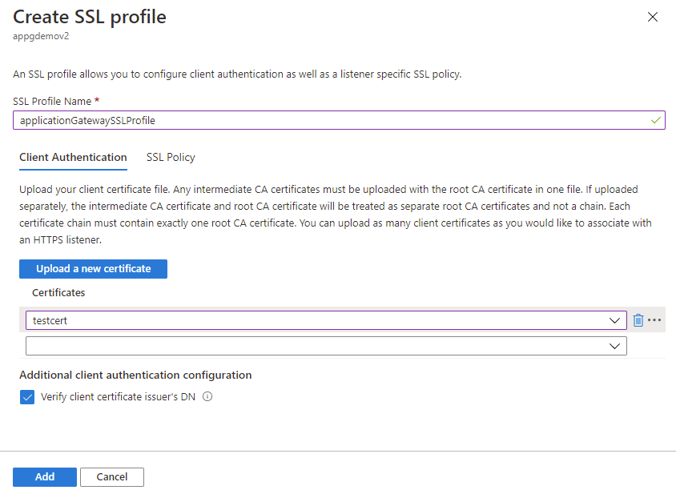
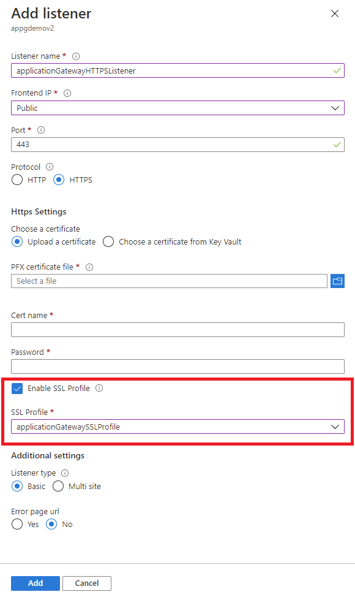

# Configure mutual authentication with Application Gateway through portal 

This article describes how to use the Azure portal to configure mutual authentication on your Application Gateway. Mutual authentication means Application Gateway authenticates the client sending the request using the client certificate you upload onto the Application Gateway. 

If you don't have an Azure subscription, create a [free account](https://azure.microsoft.com/free/?WT.mc_id=A261C142F) before you begin.

## Before you begin

To configure mutual authentication with an Application Gateway, you need a client certificate to upload to the gateway. The client certificate will be used to validate the certificate the client will present to Application Gateway. For testing purposes, you can use a self-signed certificate. However, this is not advised for production workloads, because they're harder to manage and aren't completely secure. 

To learn more, especially about what kind of client certificates you can upload, see [Overview of mutual authentication with Application Gateway](./mutual-authentication-overview.md#certificates-supported-for-mutual-authentication).

## Create a new Application Gateway

First create a new Application Gateway as you would usually through the portal - there are no additional steps needed in the creation to enable mutual authentication. For more information on how to create an Application Gateway in portal, check out our [portal quickstart tutorial](./quick-create-portal.md).

## Configure mutual authentication 

To configure an existing Application Gateway with mutual authentication, you'll need to first go to the **SSL settings** tab in the Portal and create a new SSL profile. When you create an SSL profile, you'll see two tabs: **Client Authentication** and **SSL Policy**. The **Client Authentication** tab is where you'll upload your client certificate(s). The **SSL Policy** tab is to configure a listener specific SSL policy - for more information, check out [Configuring a listener specific SSL policy](./application-gateway-configure-listener-specific-ssl-policy.md).

> [!IMPORTANT]
> Please ensure that you upload the entire client CA certificate chain in one file, and only one chain per file.

1. Search for **Application Gateway** in portal, select **Application gateways**, and click on your existing Application Gateway.

2. Select **SSL settings** from the left-side menu.

3. Click on the plus sign next to **SSL Profiles** at the top to create a new SSL profile.

4. Enter a name under **SSL Profile Name**. In this example, we call our SSL profile *applicationGatewaySSLProfile*. 

5. Stay in the **Client Authentication** tab. Upload the PEM certificate you intend to use for mutual authentication between the client and the Application Gateway using the **Upload a new certificate** button. 

    For more information on how to extract trusted client CA certificate chains to upload here, see [how to extract trusted client CA certificate chains](./mutual-authentication-certificate-management.md).

   > [!NOTE]
   > If this isn't your first SSL profile and you've uploaded other client certificates onto your Application Gateway, you can choose to reuse an existing certificate on your gateway through the dropdown menu. 

6. Check the **Verify client certificate issuer's DN** box only if you want Application Gateway to verify the client certificate's immediate issuer Distinguished Name. 

7. Consider adding a listener specific policy. See instructions at [setting up listener specific SSL policies](./application-gateway-configure-listener-specific-ssl-policy.md).

8. Select **Add** to save.
    > [!div class="mx-imgBorder"]
    > 

## Associate the SSL profile with a listener

Now that we've created an SSL profile with mutual authentication configured, we need to associate the SSL profile to the listener to complete the set up of mutual authentication. 

1. Navigate to your existing Application Gateway. If you just completed the steps above, you don't need to do anything here. 

2. Select **Listeners** from the left-side menu. 

3. Click on **Add listener** if you don't already have an HTTPS listener set up. If you already have an HTTPS listener, click on it from the list. 

4. Fill out the **Listener name**, **Frontend IP**, **Port**, **Protocol**, and other **HTTPS Settings** to fit your requirements.

5. Check the **Enable SSL Profile** checkbox so that you can select which SSL Profile to associate with the listener. 

6. Select the SSL profile you just created from the dropdown list. In this example, we choose the SSL profile we created from the earlier steps: *applicationGatewaySSLProfile*. 

7. Continue configuring the remainder of the listener to fit your requirements. 

8. Click **Add** to save your new listener with the SSL profile associated to it. 

    > [!div class="mx-imgBorder"]
    > 

## Renew expired client CA certificates

In the case that your client CA certificate has expired, you can update the certificate on your gateway through the following steps: 

1. Navigate to your Application Gateway and go to the **SSL settings** tab in the left-hand menu. 
 
1. Select the existing SSL profile(s) with the expired client certificate. 
 
1. Select **Upload a new certificate** in the **Client Authentication** tab and upload your new client certificate. 
 
1. Select the trash can icon next to the expired certificate. This will remove the association of that certificate from the SSL profile. 

1. Repeat steps 2-4 above with any other SSL profile that was using the same expired client certificate. You will be able to choose the new certificate you uploaded in step 3 from the dropdown menu in other SSL profiles.

## Next steps

- [Manage web traffic with an application gateway using the Azure CLI](./tutorial-manage-web-traffic-cli.md)
