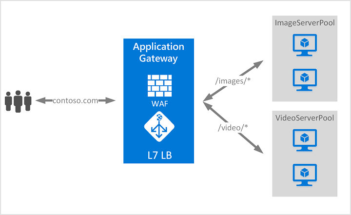

# What is Azure Application Gateway?

Azure Application Gateway is a web traffic load balancer that enables you to manage traffic to your web applications. Traditional load balancers operate at the transport layer (OSI layer 4 - TCP and UDP) and route traffic based on source IP address and port, to a destination IP address and port.

Application Gateway can make routing decisions based on additional attributes of an HTTP request, for example URI path or host headers. For example, you can route traffic based on the incoming URL. So if `/images` is in the incoming URL, you can route traffic to a specific set of servers (known as a pool) configured for images. If `/video` is in the URL, that traffic is routed to another pool that's optimized for videos.

This type of routing is known as application layer (OSI layer 7) load balancing. Azure Application Gateway can do URL-based routing and more.

>[!NOTE]
> Azure provides a suite of fully managed load-balancing solutions for your scenarios. If you need high-performance, low-latency, Layer-4 load balancing, see [What is Azure Load Balancer?](../load-balancer/load-balancer-overview.md) If you're looking for global DNS load balancing, see [What is Traffic Manager?](../traffic-manager/traffic-manager-overview.md) Your end-to-end scenarios may benefit from combining these solutions.
>
> For an Azure load-balancing options comparison, see [Overview of load-balancing options in Azure](https://docs.microsoft.com/azure/architecture/guide/technology-choices/load-balancing-overview).

## Features

To learn about Application Gateway features, see [Azure Application Gateway features](features.md).

## Pricing and SLA

For Application Gateway pricing information, see [Application Gateway pricing](https://azure.microsoft.com/pricing/details/application-gateway/).

For Application Gateway SLA information, see [Application Gateway SLA](https://azure.microsoft.com/support/legal/sla/application-gateway/v1_2/).

## Next steps

Depending on your requirements and environment, you can create a test Application Gateway using either the Azure portal, Azure PowerShell, or Azure CLI.

- [Quickstart: Direct web traffic with Azure Application Gateway - Azure portal](quick-create-portal.md)
- [Quickstart: Direct web traffic with Azure Application Gateway - Azure PowerShell](quick-create-powershell.md)
- [Quickstart: Direct web traffic with Azure Application Gateway - Azure CLI](quick-create-cli.md)
