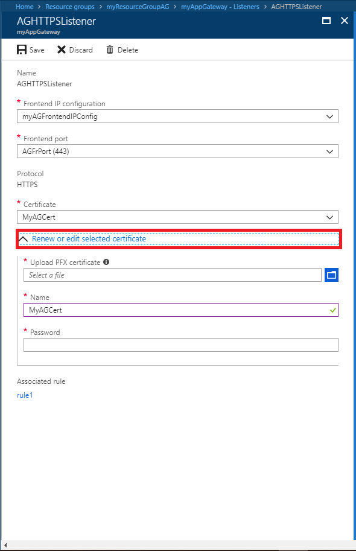

# Renew Application Gateway certificates

At some point, you'll need to renew your certificates if you configured your application gateway for TLS/SSL encryption.

You can renew a certificate associated with a listener using either the Azure portal, Azure PowerShell, or Azure CLI:

## Azure portal

To renew a listener certificate from the portal, navigate to your application gateway listeners. Click the listener that has a certificate that needs to be renewed, and then click **Renew or edit selected certificate**.



Upload your new PFX certificate, give it a name, type the password, and then click **Save**.

## Azure PowerShell

[!INCLUDE [updated-for-az](../../includes/updated-for-az.md)]

To renew your certificate using Azure PowerShell, use the following script:

```azurepowershell-interactive
$appgw = Get-AzApplicationGateway `
  -ResourceGroupName <ResourceGroup> `
  -Name <AppGatewayName>

$password = ConvertTo-SecureString `
  -String "<password>" `
  -Force `
  -AsPlainText

set-AzApplicationGatewaySSLCertificate -Name <oldcertname> `
-ApplicationGateway $appgw -CertificateFile <newcertPath> -Password $password

Set-AzApplicationGateway -ApplicationGateway $appgw
```
## Azure CLI

```azurecli-interactive
az network application-gateway ssl-cert update \
  -n "<CertName>" \
  --gateway-name "<AppGatewayName>" \
  -g "ResourceGroupName>" \
  --cert-file <PathToCerFile> \
  --cert-password "<password>"
```

## Next steps

To learn how to configure TLS Offloading with Azure Application Gateway, see [Configure TLS Offload](application-gateway-ssl-portal.md)
