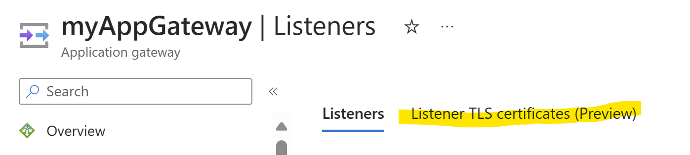
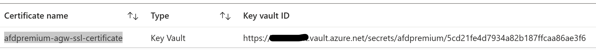

# Renew Application Gateway certificates

At some point, you'll need to renew your certificates if you configured your application gateway for TLS/SSL encryption.

There are two locations where certificates may exist: certificates stored in Azure Key Vault, or certificates uploaded to an application gateway.

## Certificates on Azure Key Vault

When Application Gateway is configured to use Key Vault certificates, its instances retrieve the certificate from Key Vault and install them locally for TLS termination. The instances poll Key Vault at four-hour intervals to retrieve a renewed version of the certificate if it exists. If an updated certificate is found, the TLS/SSL certificate that's currently associated with the HTTPS listener is automatically rotated.

> [!TIP]
> Any change to Application Gateway will force a check against Key Vault to see if any new versions of certificates are available. This includes, but is not limited to, changes to Frontend IP Configurations, Listeners, Rules, Backend Pools, Resource Tags, and more. If an updated certificate is found, the new certificate will immediately be presented.

Application Gateway uses a secret identifier in Key Vault to reference the certificates. For Azure PowerShell, the Azure CLI, or Azure Resource Manager, we strongly recommend that you use a secret identifier that doesn't specify a version. This way, Application Gateway will automatically rotate the certificate if a newer version is available in your key vault. An example of a secret URI without a version is `https://myvault.vault.azure.net/secrets/mysecret/`.

## Certificates on an application gateway

Application Gateway supports certificate upload without the need to configure Azure Key Vault. To renew the uploaded certificates, use the following steps for the Azure portal, Azure PowerShell, or Azure CLI. 

### Azure portal

To renew a listener certificate from the portal, navigate to your application gateway listeners. 
Select the listener that has a certificate that needs to be renewed, and then select **Renew or edit selected certificate**.

:::image type="content" source="media/renew-certificate/ssl-cert.png" alt-text="Renew certificate":::

Upload your new PFX certificate, give it a name, type the password, and then select **Save**.

### Azure PowerShell

[!INCLUDE [updated-for-az](../../includes/updated-for-az.md)]

To renew your certificate using Azure PowerShell, use the following script:

```azurepowershell-interactive
$appgw = Get-AzApplicationGateway `
  -ResourceGroupName <ResourceGroup> `
  -Name <AppGatewayName>

$password = ConvertTo-SecureString `
  -String "<password>" `
  -Force `
  -AsPlainText

set-AzApplicationGatewaySSLCertificate -Name <oldcertname> `
-ApplicationGateway $appgw -CertificateFile <newcertPath> -Password $password

Set-AzApplicationGateway -ApplicationGateway $appgw
```
### Azure CLI

```azurecli-interactive
az network application-gateway ssl-cert update \
  -n "<CertName>" \
  --gateway-name "<AppGatewayName>" \
  -g "ResourceGroupName>" \
  --cert-file <PathToCerFile> \
  --cert-password "<password>"
```

### Terraform

If you're using Terraform to manage the application gateway, the Azure Terraform Key Vault data source retrieves the complete key vault URI, which includes the version of the secrets. To enable automatic rotation of the certificate to a new version, the secret needs to be without a specific version. In the following Terraform code, the data source **azurerm_key_vault_secret** fetches the Key Vault secret ID and includes the version of the secret in the complete Keyvault URL.

```Terraform
data "azurerm_key_vault_secret" "vault" {    
   name = "byte-cloud"          
   key_vault_id = "<resource-id-key-vault>"
}
```

Definitions:

| Entry | Description |
| --- | --- |
| **data** | Indicates that you are retrieving information from an existing resource rather than creating a new one.  |
| **azurerm_key_vault_secret** | Specifies the type or kind of data source, in this case, it's fetching information about a secret from an Azure Key Vault. |
| **vault** | The name of this particular instance of the azurerm_key_vault_secret data source. Refer to this name when using the output from this data source in your Terraform configuration.  |
| **name**  | The name of the certificate stored in Keyvault. |

The data source **azurerm_key_vault_secret** is used within the `**ssl_certificate**` block under the application gateway section.

The following Terraform code adds an SSL certificate pointed to the secret version of the certificate:

```Terraform
data "azurerm_key_vault_secret" "vault" {    
   name         = "<certificate-name>"          
   key_vault_id = "<resource-id-key-vault>"
}
resource "azurerm_application_gateway" "main" {
  name                = "myAppGateway"
  resource_group_name = data.azurerm_resource_group.rg.name
  location            = data.azurerm_resource_group.rg.location
  sku {
    name     = "Standard_v2"
    tier     = "Standard_v2"
    capacity = 1
  }
}
  identity {
    type                     = "UserAssigned"
    identity_ids             = [data.azurerm_user_assigned_identity.appgw_identity.id]
  }
  
  ssl_certificate {
      name = "<desired-ssl-certificate-name>"                       
      // Reference the Key Vault secret ID
      `#096DA`key_vault_secret_id = data.azurerm_key_vault_secret.vault.id`#096DA`
    }
```

**key_vault_secret_id** is the certificate object stored in Azure KeyVault.

Next, navigate to Application gateway listener settings and and select the **Listener TLS Certificates Preview** tab.




> [!NOTE]
> * The certificate added to the application gateway is tied to a **secret version**.
> * Renewing the certificate in **KeyVault** doesn't automatically make the application gateway listener select the updated certificate. To reflect the changes, the certificate in the application gateway must be manually updated.

To add versionless keyvault certificates, you can use the Terraform "**replace**" function. By using this function, you can replace the entire KeyVault URL, which includes the secret version, with just the secret name, excluding the version.

- Modify the existing "**ssl_certificate**" block under the application gateway block of the Terraform to use the replace function.

```Terraform
resource "azurerm_application_gateway" "main" {
  name                = "myAppGateway"
  resource_group_name = data.azurerm_resource_group.rg.name
  location            = data.azurerm_resource_group.rg.location
  sku {
    name     = "Standard_v2"
    tier     = "Standard_v2"
    capacity = 1
  }
}
  identity {
    type                     = "UserAssigned"
    identity_ids             = [data.azurerm_user_assigned_identity.appgw_identity.id]
  }
  
  ssl_certificate {
      name = "afdpremium-agw-ssl-certificate"                       
      // Reference the Key Vault secret ID
      <span style="background-color: yellow; color: black">key_vault_secret_id = replace(data.azurerm_key_vault_secret.vault.id, "/secrets/(.*)/[^/]+/", "secrets/$1")</span>
    }
```

- The same data source "**data.azurerm_key_vault_secret.vault.id**" is used here, but the data source is used with the replace function. 
- You can compare the value in the data source “**data.azurerm_key_vault_secret.vault.id**” with regex “/secrets/(.*)/[^/]+/",” and then use /secrets/group1.

The Terraform replace function takes three arguments: 
- replace(string, substring, replacement).

In this case, **string** is the full URL stored in the data source **data.azurerm_key_vault_secret.vault.id** , substring is **/secrets/(.*)/[^/]+/**, and replacement is **/secrets/$1**.

**For-example**:

- **secret_value_old** = https://dummy.vault.azure.net/secrets/afdpremium/5cd21fe4d7934a82b187ffcaa86ae3f6 [before replace function]

- **secret_value_new**: https://dummy.vault.azure.net/afdpremium [after replace function]

Add a forward slash “**/**” in Terraform regex, or it will not work. This is because Terraform uses forward slashes as separators in certain syntax constructs to organize resources and data sources hierarchically.

## Next steps

To learn how to configure TLS Offloading with Azure Application Gateway, see [Configure TLS Offload](./create-ssl-portal.md).
