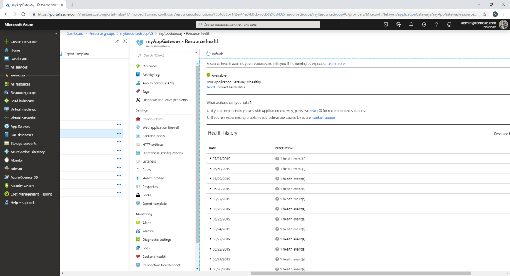
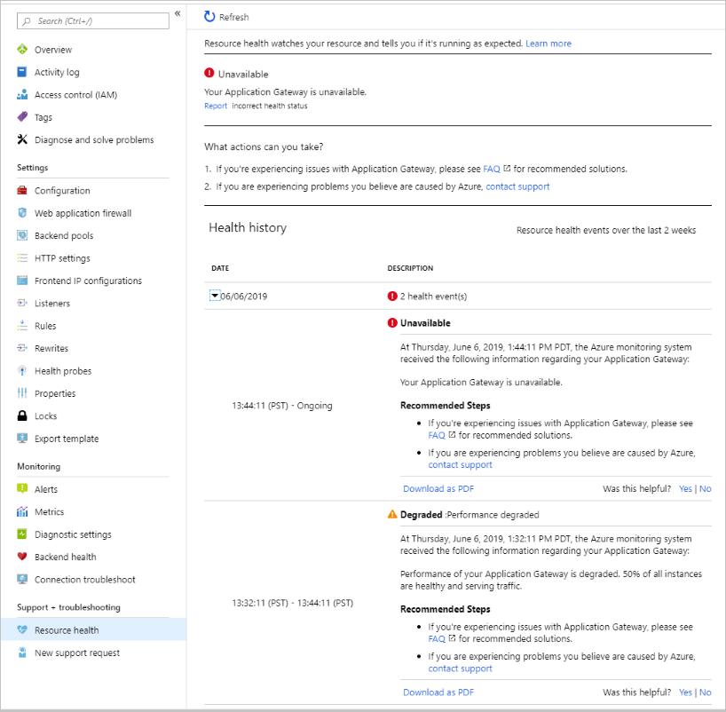
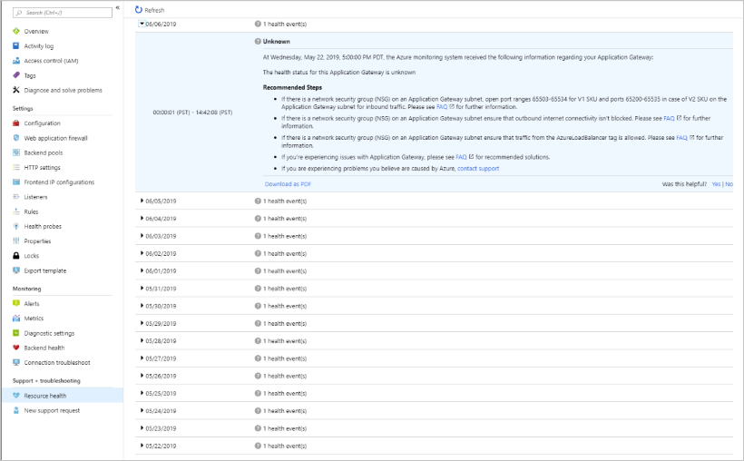
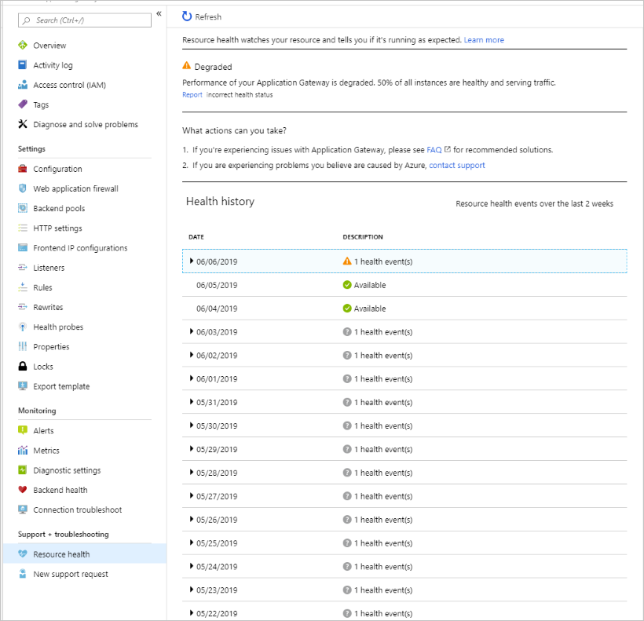

# Azure Application Gateway Resource Health overview

[Azure Resource Health](../service-health/resource-health-overview.md) helps you diagnose and get support when an Azure service problem affects your resources. It informs you about the current and past health of your resources. And it provides technical support to help you mitigate problems.

For Application Gateway, Resource Health relies on signals emitted by the gateway to assess whether it's healthy or not. If the gateway is unhealthy, Resource Health analyzes additional information to determine the source of the problem. It also identifies actions that Microsoft is taking or what you can do to fix the problem.

For additional details on how health is assessed, review the full list of resource types and health checks in [Azure Resource Health](../service-health/resource-health-checks-resource-types.md#microsoftnetworkapplicationgateways).

The health status for Application Gateway is displayed as one of the following statuses:

## Available

An **Available** status means the service hasn't detected any events that affect the health of the resource. You'll see the **Recently resolved** notification in cases where the gateway has recovered from unplanned downtime during the last 24 hours.

## Unavailable

An **Unavailable** status means the service has detected an ongoing platform or non-platform event that affects the health of the gateway.

### Platform events

Platform events are triggered by multiple components of the Azure infrastructure. They include both scheduled actions (for example, planned maintenance) and unexpected incidents (for example, an unplanned host reboot).

Resource Health provides additional details on the event and the recovery process. It also enables you to contact support even if you don't have an active Microsoft support agreement.

## Unknown

The **Unknown** health status indicates Resource Health hasn't received information about the gateway for more than 10 minutes. This status isn't a definitive indication of the state of the gateway. But it's an important data point in the troubleshooting process.

If the gateway is running as expected, the status changes to **Available** after a few minutes.

If you're experiencing problems,  the **Unknown** health status might suggest that an event in the platform is affecting the gateway.

## Degraded

The **Degraded** health status indicates your gateway has detected a loss in performance, although it's still available for usage.

## Next steps

To learn about troubleshooting Application Gateway Web Application Firewall (WAF), see [Troubleshoot Web Application Firewall (WAF) for Azure Application Gateway](web-application-firewall-troubleshoot.md).