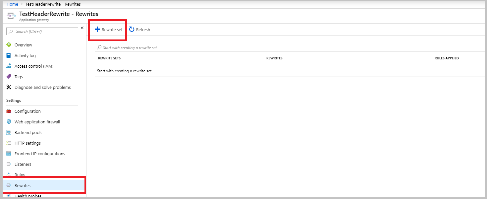
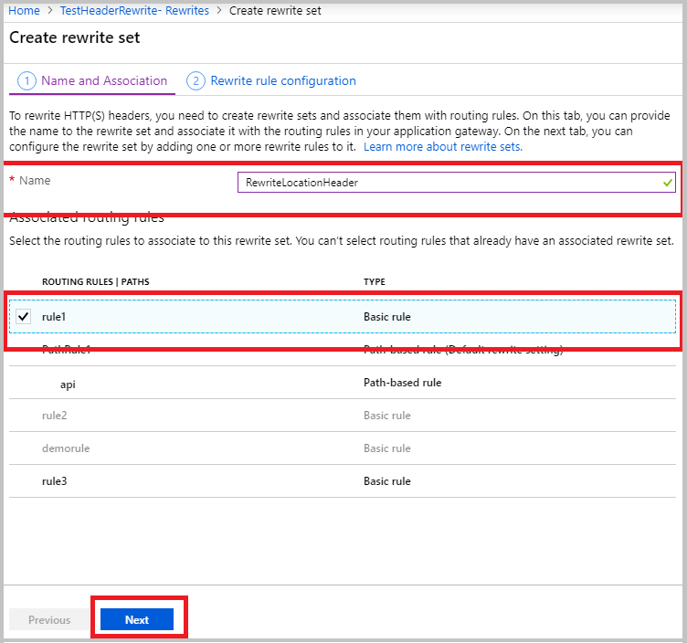
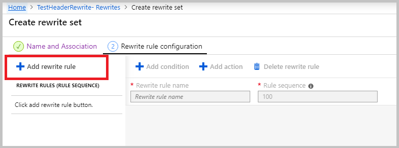
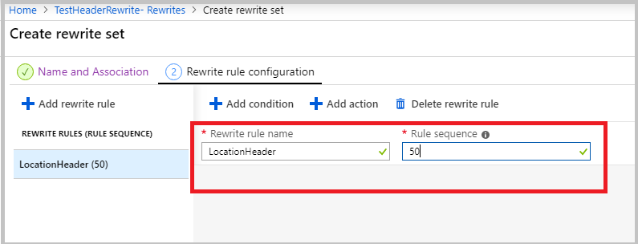
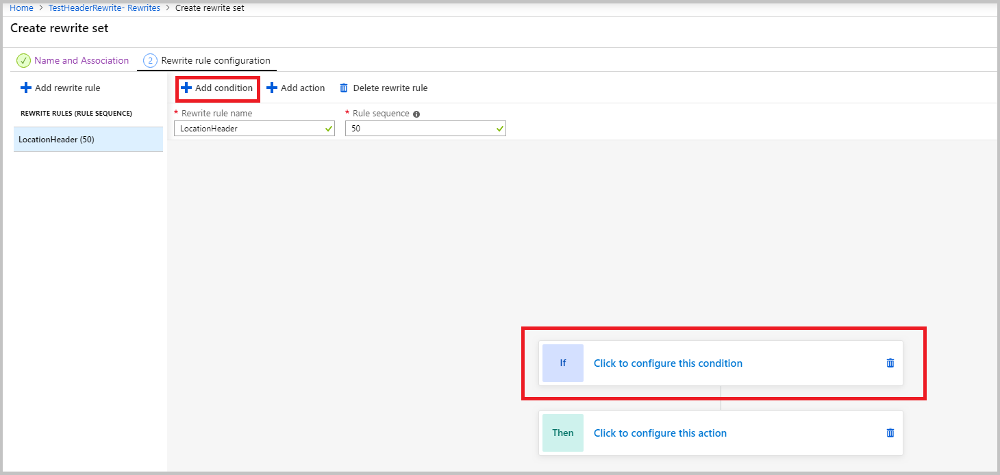
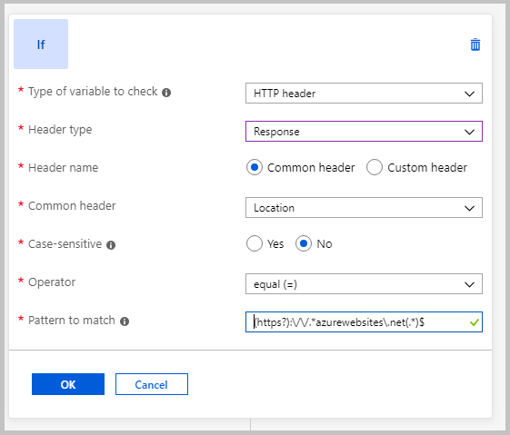
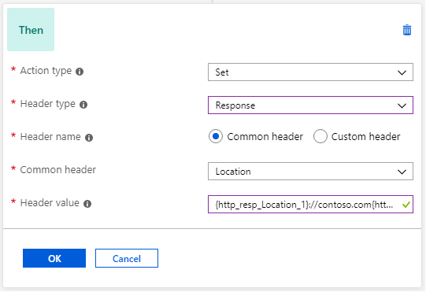
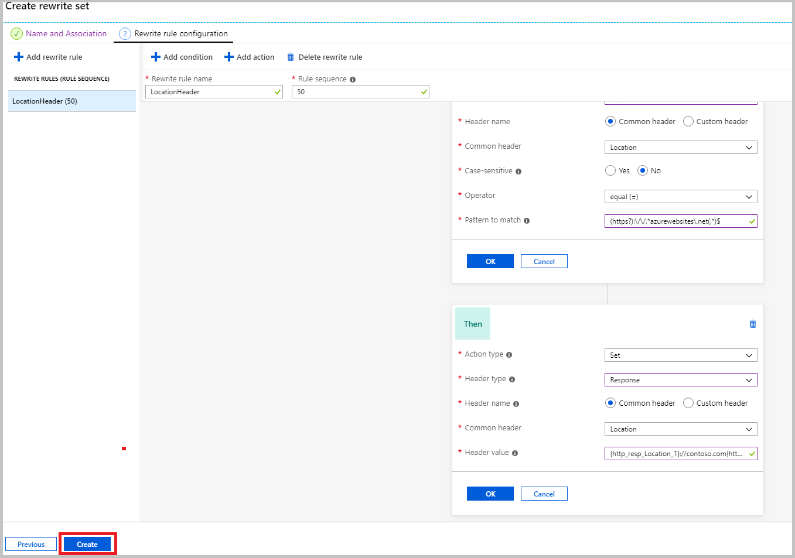
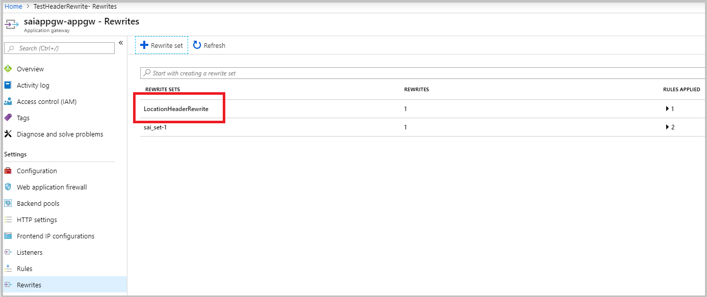

# Rewrite HTTP request and response headers with Azure Application Gateway - Azure portal

This article describes how to use the Azure portal to configure an [Application Gateway v2 SKU](./application-gateway-autoscaling-zone-redundant.md) instance to rewrite the HTTP headers in requests and responses.

If you don't have an Azure subscription, create a [free account](https://azure.microsoft.com/free/?WT.mc_id=A261C142F) before you begin.

## Before you begin

You need to have an Application Gateway v2 SKU instance to complete the steps in this article. Rewriting headers isn't supported in the v1 SKU. If you don't have the v2 SKU, create an [Application Gateway v2 SKU](./tutorial-autoscale-ps.md) instance before you begin.

## Create required objects

To configure HTTP header rewrite, you need to complete these steps.

1. Create the objects that are required for HTTP header rewrite:

   - **Rewrite action**: Used to specify the request and request header fields that you intend to rewrite and the new value for the headers. You can associate one or more rewrite conditions with a rewrite action.

   - **Rewrite condition**: An optional configuration. Rewrite conditions evaluate the content of HTTP(S) requests and responses. The rewrite action will occur if the HTTP(S) request or response matches the rewrite condition.

     If you associate more than one condition with an action, the action occurs only when all the conditions are met. In other words, the operation is a logical AND operation.

   - **Rewrite rule**: Contains multiple rewrite action / rewrite condition combinations.

   - **Rule sequence**: Helps determine the order in which the rewrite rules execute. This configuration is helpful when you have multiple rewrite rules in a rewrite set. A rewrite rule that has a lower rule sequence value runs first. If you assign the same rule sequence value to two rewrite rules, the order of execution is non-deterministic.

   - **Rewrite set**: Contains multiple rewrite rules that will be associated with a request routing rule.

2. Attach the rewrite set to a routing rule. The rewrite configuration is attached to the source listener via the routing rule. When you use a basic routing rule, the header rewrite configuration is associated with a source listener and is a global header rewrite. When you use a path-based routing rule, the header rewrite configuration is defined on the URL path map. In that case, it applies only to the specific path area of a site.

You can create multiple HTTP header rewrite sets and apply each rewrite set to multiple listeners. But you can apply only one rewrite set to a specific listener.

## Sign in to Azure

Sign in to the [Azure portal](https://portal.azure.com/) with your Azure account.

## Configure header rewrite

In this example, we'll modify a redirection URL by rewriting the location header in the HTTP response sent by a backend application.

1. Select **All resources**, and then select your application gateway.

2. Select **Rewrites** in the left pane.

3. Select **Rewrite set**:

   

4. Provide a name for the rewrite set and associate it with a routing rule:

   - Enter the name for the rewrite set in the **Name** box.
   - Select one or more of the rules listed in the **Associated routing rules** list. You can select only rules that haven't been associated with other rewrite sets. The rules that have already been associated with other rewrite sets are dimmed.
   - Select **Next**.
   
     

5. Create a rewrite rule:

   - Select **Add rewrite rule**.

     

   - Enter a name for the rewrite rule in the **Rewrite rule name** box. Enter a number in the **Rule sequence** box.

     

6. In this example, we'll rewrite the location header only when it contains a reference to azurewebsites.net. To do this, add a condition to evaluate whether the location header in the response contains azurewebsites.net:

   - Select **Add condition** and then select the box containing the **If** instructions to expand it.

     

   - In the **Type of variable to check** list, select **HTTP header**.

   - In the **Header type** list, select **Response**.

   - Because in this example we're evaluating the location header, which is a common header, select  **Common header** under **Header name**.

   - In the **Common header** list, select **Location**.

   - Under **Case-sensitive**, select **No**.

   - In the **Operator** list, select **equal (=)**.

   - Enter a regular expression pattern. In this example, we'll use the pattern `(https?):\/\/.*azurewebsites.net(.*)$`.

   - Select **OK**.

     

7. Add an action to rewrite the location header:

   - In the **Action type** list, select **Set**.

   - In the **Header type** list, select **Response**.

   - Under **Header name**, select **Common header**.

   - In the **Common header** list, select **Location**.

   - Enter the header value. In this example, we'll use `{http_resp_Location_1}://contoso.com{http_resp_Location_2}` as the header value. This value will replace *azurewebsites.net* with *contoso.com* in the location header.

   - Select **OK**.

     

8. Select **Create** to create the rewrite set:

   

9. The Rewrite set view will open. Verify that the rewrite set you created is in the list of rewrite sets:

   

## Next steps

To learn more about how to set up some common use cases, see [common header rewrite scenarios](./rewrite-http-headers-url.md).